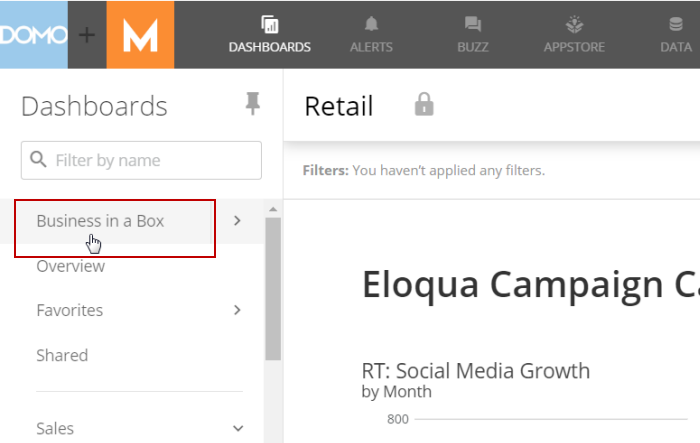
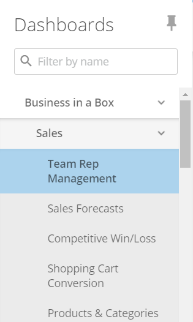
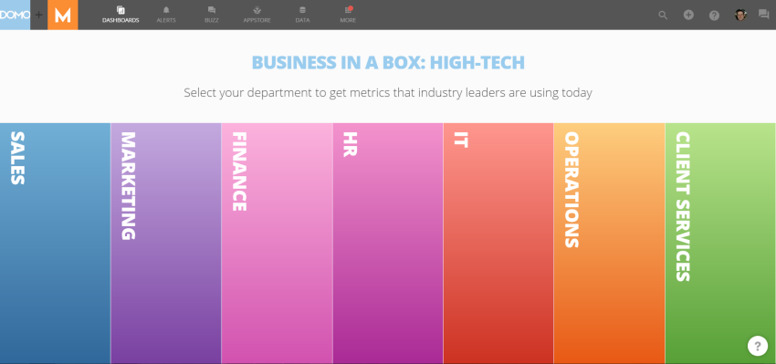
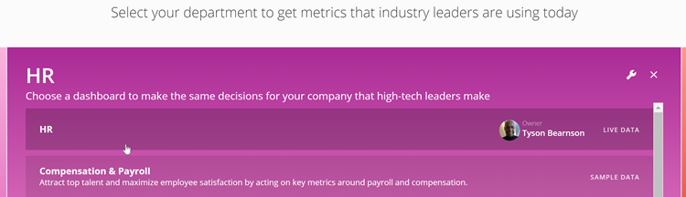

---
    title: Accessing Business-in-a-Box Dashboards
    url: https://domo-support.domo.com/s/article/360042935094
    linked_kbs:  ['[https://domo-support.domo.com/s/knowledge-base/](https://domo-support.domo.com/s/knowledge-base/)', '[https://domo-support.domo.com/s/](https://domo-support.domo.com/s/)', '[https://domo-support.domo.com/s/topic/0TO5w000000ZamsGAC](https://domo-support.domo.com/s/topic/0TO5w000000ZamsGAC)', '[https://domo-support.domo.com/s/topic/0TO5w000000ZanBGAS](https://domo-support.domo.com/s/topic/0TO5w000000ZanBGAS)', '[https://domo-support.domo.com/s/article/360042932994](https://domo-support.domo.com/s/article/360042932994)', '[https://domo-support.domo.com/s/article/360042935094](https://domo-support.domo.com/s/article/360042935094)', '[https://domo-support.domo.com/s/topic/0TO5w000000ZanBGAS/business-in-a-box](https://domo-support.domo.com/s/topic/0TO5w000000ZanBGAS/business-in-a-box)', '[https://domo-support.domo.com/s/article/360043429933](https://domo-support.domo.com/s/article/360043429933)', '[https://domo-support.domo.com/s/article/360043429953](https://domo-support.domo.com/s/article/360043429953)', '[https://domo-support.domo.com/s/article/360042925494](https://domo-support.domo.com/s/article/360042925494)', '[https://domo-support.domo.com/s/article/360043429913](https://domo-support.domo.com/s/article/360043429913)', '[https://domo-support.domo.com/s/article/4408174643607](https://domo-support.domo.com/s/article/4408174643607)', '[https://domo-support.domo.com/s/login/](https://domo-support.domo.com/s/login/)']
    article_id: 000004310
    views: 2,225
    created_date: 2022-10-24 21:36:00
    last updated: 2022-10-24 22:39:00
    ---

You can access live Business-in-a-Box Dashboards in your company Domo instance by doing the following:

1. (Conditional) Click **Dashboards** in the toolbar at the top of the screen (if it is not already open).
2. Select **Business-in-a-Box** in the **Dashboards** pane on the left side of the screen to open a page in which you can access all of the Business-in-a-Box Dashboards.  
   
  
   
   
 Alternatively, you can click the arrow to the right of "Business-in-a-Box" in the **Dashboards** pane to see all of the Business-in-a-Box Dashboards. If you want, you can click any of these to open them directly.   
   

3. Select the desired department Dashboard.  
   

4. Select a "Live Data" Dashboard page from the department tab that appears.  
 "Live Data" indicates that the Page is already powered by live data (as opposed to those that haven't yet been powered up by live data, indicated by the name "Sample Data").  
   

If you do not have any Dashboards in your instance powered up with live data, you can do any of the following:

* Click on any of the pre-installed Business-in-a-Box Dashboards in the department tab being powered by sample data (such as the "Compensation & Payroll" Dashboard in the above screenshot) then follow these instructions to power it with your own data.
* Scroll down to the bottom of the department tab then click **Add Dashboard**. (This option appears *only* if you have an "Admin" default security role or a custom role with "Manage All Cards and Pages" enabled.) Then choose one of these options:

	+ **Reference Existing**. This allows you to link any existing page in Domo to this department tab.
	+ **Appstore**. This allows you to select a dashboard with sample data from the Appstore then power it with your own data as described here.

Page Restrictions
-----------------

Business-in-a-Box Dashboards are initially shared with your default user group, meaning all of the users in the instance have instant access. However, users with an "Admin" default security role or a custom role with "Manage All Cards and Pages" enabled can adjust individual Dashboards to allow or restrict certain users and/or groups. Unlike other Dashboards in Domo, users without access can still see the names of Business-in-a-Box Dashboards in their navigation. However, just as with any other Dashboard in Domo, if a user attempts to navigate to a Dashboard that he/she is not permitted to access, a **Request Access** button appears instead. For more information about sharing access to a Dashboard, see [Sharing Access to Cards and Pages](/s/article/360042932994 "Sharing and Removing Access to Content").   
    
 Admin users cannot remove Business-in-a-Box Dashboards or the Cards within them from Domo.

