Intro
-----

In Goals, you can see the overall status and progress of goals and metrics. With DomoStats, you can build reports and dashboards to analyze goal-related data. 

Viewing Goal Status and Progress
--------------------------------

In the **Personal**, **Teams**, or **Company** tabs, you can view the status and progress of each goal.

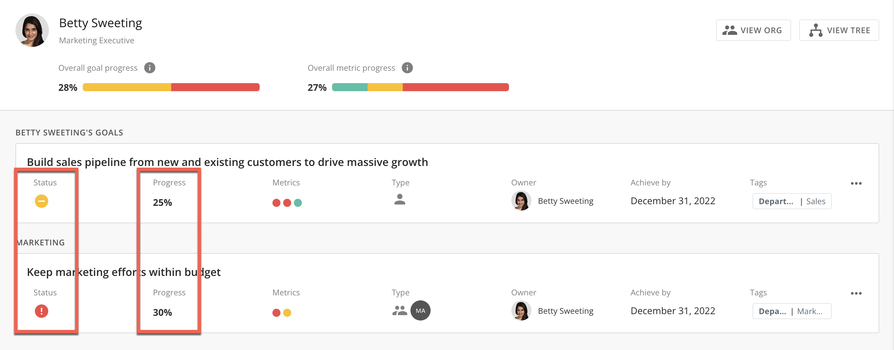

 

The summary banner displays your overall progress.

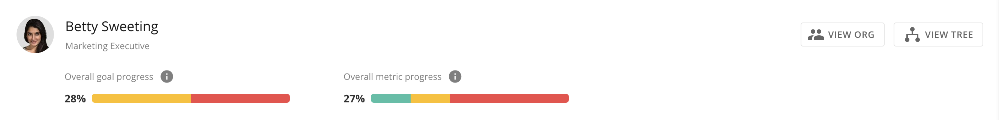

 

The **Overall Goal Progress** calculates the average progress of all of your goals in the current period. It also shows the distribution based on your goals' statuses. 

**Note:** The Overall Goal Progress does not account for goals with a "Not Started" status.  

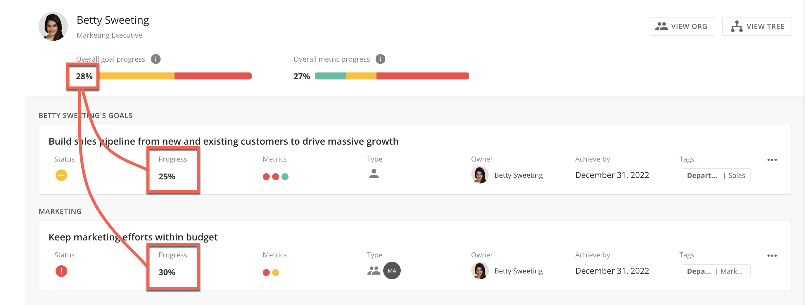

 

The **Average Metric Progress** calculates the average progress of all of your metrics in the current period. It also shows the distribution based on your metrics based on your organization's specified percentage ranges. 

**Note:** Admins can choose percentage ranges for On Track, Needs Attention, and At Risk in **Admin**. For more information, see [Configuring Goals Settings](/s/article/4577172785559).

 

**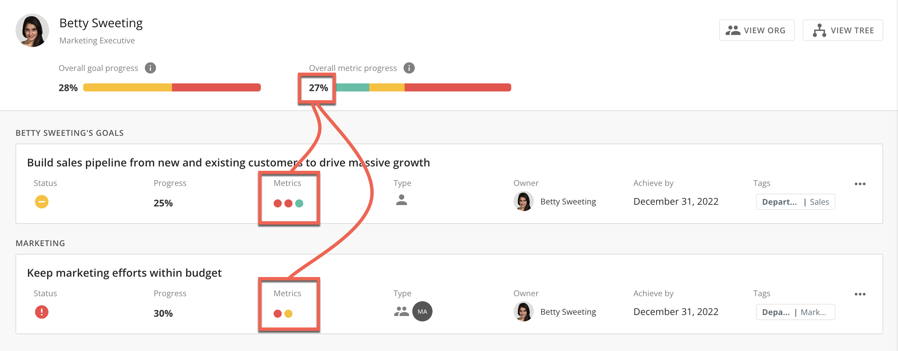**

 

You can also view metric progress summaries by hovering over any colored dot. In this view, you can see the **Progress**, **Owner**, when the metric was **Last updated**, and the projected **Achieve by** date. To see more details, select the metric. 

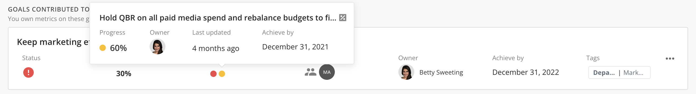

 

Colored icons will indicate how individual goals and metrics are performing. 

 

**Goal Status Key:**

**Note:** If a goal's status is "Not Started," the progress is automatically set to 0% regardless of the underlying metric progress. 

|  |  |
| --- | --- |
| **Icon** | **Status** |
| Screen_Shot_2022-06-02_at_12.32.27_PM.png | On Track |
| Screen_Shot_2022-06-02_at_12.32.35_PM.png | Needs Attention |
| Screen_Shot_2022-06-02_at_12.32.19_PM.png | At Risk |
|  
Screen_Shot_2022-09-14_at_5.04.55_PM.png
  | Not Started |

 

**Metric Progress Key:**

|  |  |
| --- | --- |
| **Icon** | **Status** |
| Screen_Shot_2022-06-02_at_3.25.50_PM.png | Between 70% and 100% complete |
| Screen_Shot_2022-06-02_at_3.27.04_PM.png | Between 40% and 69% complete |
| Screen_Shot_2022-06-02_at_3.27.25_PM.png | Between 0% and 39% complete |
| Screen_Shot_2022-09-14_at_5.06.59_PM.png | Metric has a future Start Date |

 

Connecting with DomoStats
-------------------------

DomoStats is a connector that gives you a comprehensive view of your Domo instances, including Goals data. You can use DomoStats DataSets to view raw data about your organization's goals. With this raw data, you can create DataFlows with Magic ETL and create visualizations in Analyzer. This section describes how to connect to your Goals data in DomoStats. For more information, see the OKR Key Results DataSet or OKR Objectives DataSet sections of [DomoStats Connector.](/s/article/360043433813)

 

1. In the navigation header, select **Data**.  

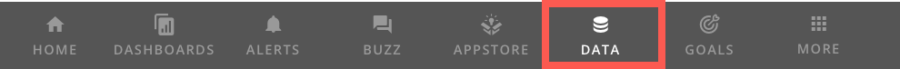

 

2. From the **Connect Data** options, select **Connectors**.  

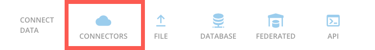

 

3. Enter DomoStats in the search field. Select **DomoStats**. 

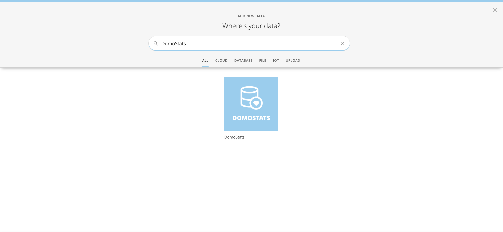

 

4. From the Report menu, choose either **OKR Objectives** or **OKR Key Results.** Select **Next.**

Each option will generate a report based on your selection. OKR Objectives will display data for Goals, and OKR Key Results will display data for Metrics.  

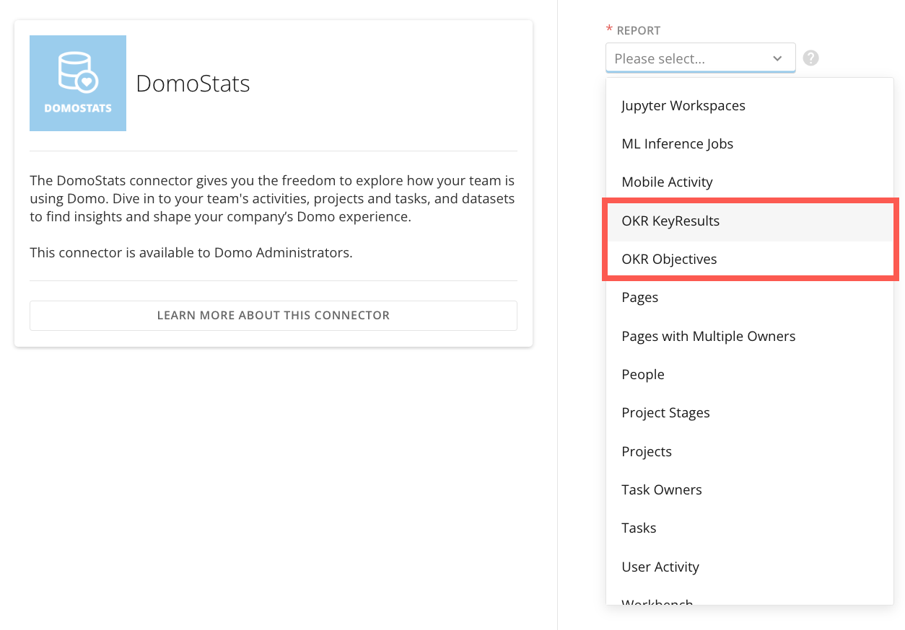

6. Determine a schedule for when the DataSet will update and select **Next**.

7. Choose a name and optional description for your DataSet. Select **Save and Run.**

The **Overview** page displays. 

8. Select **Data** from the tab bar. 

After the connector finishes running, the raw data will be viewable in the **Data** tab. You can search for a goal or key result by filtering on the **Name** column.

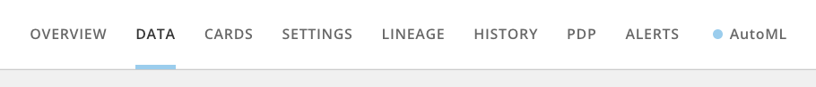

 

All of the data related to Domo Goals is stored in the DomoStats DataSets. This data can be made into visualizations as well as transformed using MagicETL DataFlow. The image below shows an example dashboard created to display a summary of the company's goals:

 

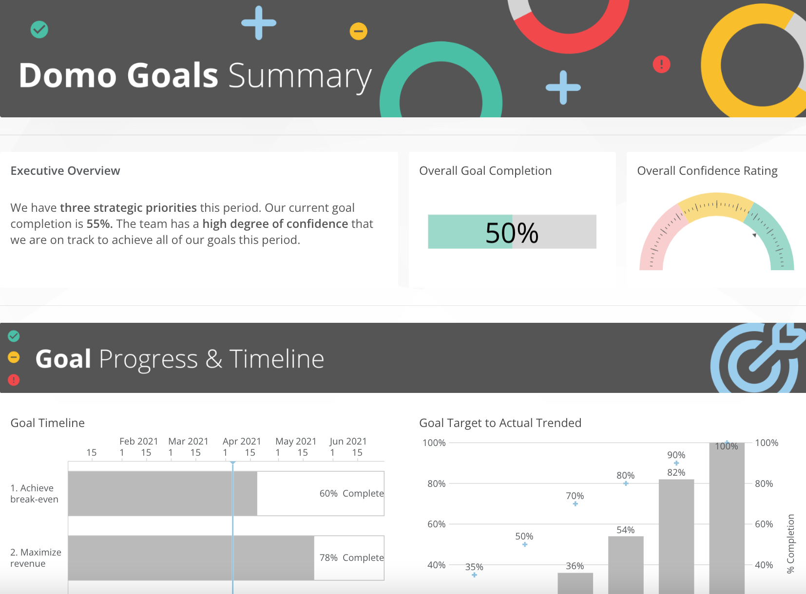

