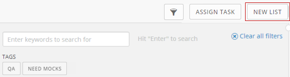

---
    title: Adding a Task List to a Project
    url: https://domo-support.domo.com/s/article/360042925854
    linked_kbs:  ['[https://domo-support.domo.com/s/knowledge-base/](https://domo-support.domo.com/s/knowledge-base/)', '[https://domo-support.domo.com/s/](https://domo-support.domo.com/s/)', '[https://domo-support.domo.com/s/topic/0TO5w000000ZamsGAC](https://domo-support.domo.com/s/topic/0TO5w000000ZamsGAC)', '[https://domo-support.domo.com/s/topic/0TO5w000000Zao5GAC](https://domo-support.domo.com/s/topic/0TO5w000000Zao5GAC)', '[https://domo-support.domo.com/s/article/360042925914](https://domo-support.domo.com/s/article/360042925914)', '[https://domo-support.domo.com/s/article/360042925854](https://domo-support.domo.com/s/article/360042925854)', '[https://domo-support.domo.com/s/topic/0TO5w000000Zao5GAC/projects-and-tasks](https://domo-support.domo.com/s/topic/0TO5w000000Zao5GAC/projects-and-tasks)', '[https://domo-support.domo.com/s/article/360043429933](https://domo-support.domo.com/s/article/360043429933)', '[https://domo-support.domo.com/s/article/360043429953](https://domo-support.domo.com/s/article/360043429953)', '[https://domo-support.domo.com/s/article/360042925494](https://domo-support.domo.com/s/article/360042925494)', '[https://domo-support.domo.com/s/article/360043429913](https://domo-support.domo.com/s/article/360043429913)', '[https://domo-support.domo.com/s/article/4408174643607](https://domo-support.domo.com/s/article/4408174643607)', '[https://domo-support.domo.com/s/login/](https://domo-support.domo.com/s/login/)']
    article_id: 000004366
    views: 2,175
    created_date: 2022-10-24 21:45:00
    last updated: 2022-10-24 22:40:00
    ---

All projects in Domo, including your "Personal Tasks" project, start out with these basic task lists—"To Do," "Working On," and "Completed." These lists are all part of a general chronological workflow. Generally speaking, tasks that work hasn't yet started on would be placed in the "To Do" list. You would then move them into the next column, "Working On," when work actually began on them. Finally, you would move them into "Completed" when the work was finished. For more information about moving tasks, see [Moving Tasks Through a Project Workflow](/s/article/360042925914 "Moving Tasks Through a Project Workflow").

However, you may want additional lists in your workflow. The basic workflow stages that appear by default in Domo may not be specific enough for your project. For example, you may want to add stages such as "Ideas," "Customer requests," "Won't fix," etc. Domo lets you add as many new workflow lists as you want. All new lists must conform to one of three basic types—"To-Do," "In Progress," and "Completed."

You can add a new list using the **New List** button, which is located in the top right corner of a project page.

**To add new task lists to a project,**

1. Open the **Projects & Tasks** page by selecting **Projects and Tasks** in the **More** menu at the top of the screen.
2. Click the name of the project you want to add lists to.
3. Click **New List**.  
 A dialog appears.
4. Enter a name for the new list.
5. Select a list type.
6. Click **Save**.

The new list is added to the workflow. You can move the list to its appropriate position in the workflow.

**To move a list left or right in the workflow,**

1. Mouse over the top of the list.
2. Mouse over the arrow that appears.  
 A list of options pops up.
3. Select **Move Left** or **Move Right**.

You can also edit the name of an existing list.

**To edit a list name,**

1. Mouse over the arrow at the top of the list.
2. Select **Edit List Name**.
3. Type the new list name in the field.
4. Press **Enter**.
