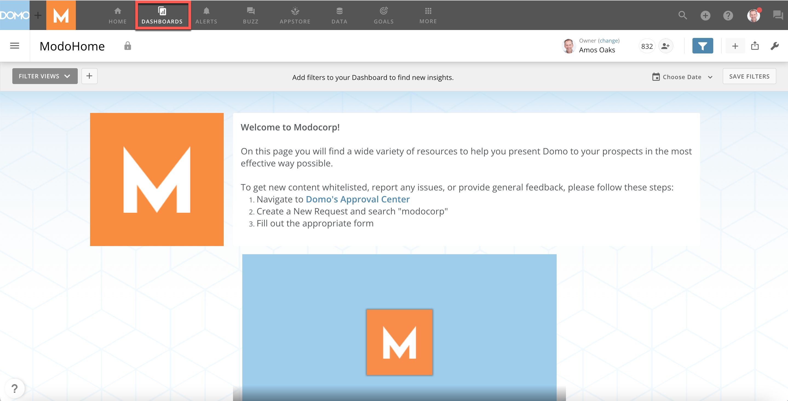
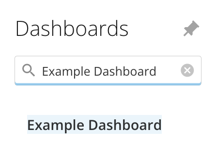
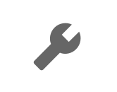
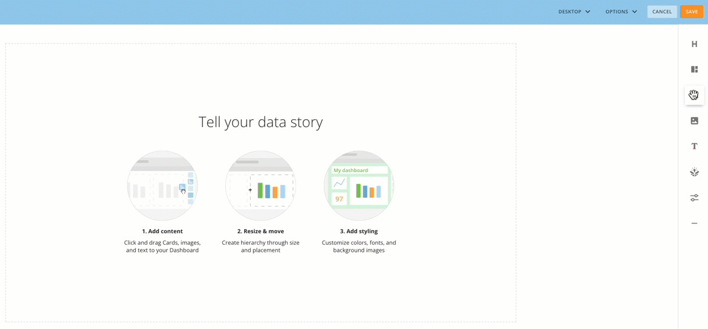
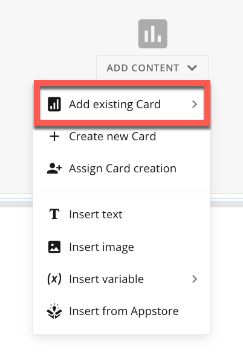
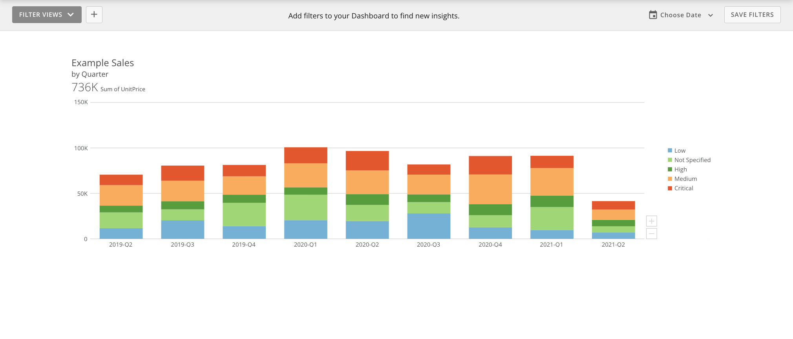

Intro
-----

If a card already exists in your Domo instance, you can add it to a dashboard without having to recreate it. You can add any kind of card, such as a KPI, Sumo, and Doc Card. You must have access to the card you want to add as well as editing capability in the dashboard.

 

Adding an Existing Card to a Dashboard
--------------------------------------

1. Go to **Dashboards** in the navigation header. 

 

2. Hover over the    **Menu** to open the **Dashboards** drawer. 

3. Open a dashboard. You can search for one in the **Filter by name** bar or select one from the list. 

 

4. Select  **Dashboard options** and choose **Edit Dashboard**.

The editing view displays. 

5. Click and drag the **Card** option to the dashboard template. 

The **Add Content** menu displays.  

 

6. From the **Add Content** menu, select **Add existing Card**.

 

 

7. Select a card from the list, or locate the card using the search bar. 

8. Select the card. 

9. Select **Save.**

The existing card has been added to the dashboard. 

 

 

