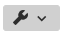
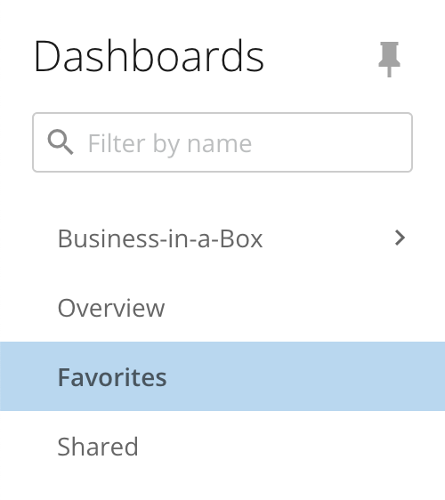
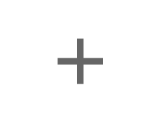

---
    title: Adding Cards as Favorites
    url: https://domo-support.domo.com/s/article/360043428373
    linked_kbs:  ['[https://domo-support.domo.com/s/knowledge-base/](https://domo-support.domo.com/s/knowledge-base/)', '[https://domo-support.domo.com/s/](https://domo-support.domo.com/s/)', '[https://domo-support.domo.com/s/topic/0TO5w000000ZamnGAC](https://domo-support.domo.com/s/topic/0TO5w000000ZamnGAC)', '[https://domo-support.domo.com/s/topic/0TO5w000000ZansGAC](https://domo-support.domo.com/s/topic/0TO5w000000ZansGAC)', '[https://domo-support.domo.com/s/article/360042925814](https://domo-support.domo.com/s/article/360042925814)', '[https://domo-support.domo.com/s/article/360043439413](https://domo-support.domo.com/s/article/360043439413)', '[https://domo-support.domo.com/s/article/360043428753](https://domo-support.domo.com/s/article/360043428753)', '[https://domo-support.domo.com/s/article/360042934754](https://domo-support.domo.com/s/article/360042934754)', '[https://domo-support.domo.com/s/article/360043428373](https://domo-support.domo.com/s/article/360043428373)', '[https://domo-support.domo.com/s/topic/0TO5w000000ZansGAC/interacting-with-cards-and-dashboards](https://domo-support.domo.com/s/topic/0TO5w000000ZansGAC/interacting-with-cards-and-dashboards)', '[https://domo-support.domo.com/s/article/360043429933](https://domo-support.domo.com/s/article/360043429933)', '[https://domo-support.domo.com/s/article/360043429953](https://domo-support.domo.com/s/article/360043429953)', '[https://domo-support.domo.com/s/article/360042925494](https://domo-support.domo.com/s/article/360042925494)', '[https://domo-support.domo.com/s/article/360043429913](https://domo-support.domo.com/s/article/360043429913)', '[https://domo-support.domo.com/s/article/4408174643607](https://domo-support.domo.com/s/article/4408174643607)', '[https://domo-support.domo.com/s/login/](https://domo-support.domo.com/s/login/)']
    article_id: 000004977
    views: 2,337
    created_date: 2022-11-01 23:15:00
    last updated: 2022-11-01 23:23:00
    ---

Intro
-----

When you add cards as Favorites, copies of those cards are added to your Favorites page. To add a card to your Favorites, you must have access to the card. 

You can receive status reports via email and text for favorited cards by configuring the following:

* Daily Alerts are scheduled. For more information about getting Daily Alerts for your Favorites, see [Customizing Notification and Alert Settings](/s/article/360042925814 "Customizing Notification and Alert Settings").
* A valid email address and telephone number in your profile. For more information, see [Specifying Your Personal Profile Information.](/s/article/360043439413 "Specifying Your Personal Profile Information")
* A summary number on each card. For more information, see [Configuring Your Chart Summary Number.](/s/article/360043428753)

Adding Cards to Favorites
-------------------------

You can add cards as Favorites from a dashboard or Details view.

If you're viewing the card in a dashboard, follow the steps below:

1. Hover over the card you want to add as a Favorite.

2. Depending on where you're viewing the card, select  **Card options** from a dashboard OR **Card options** from Details.

3. Choose **Add To Favorites**.  
The card is added to your Favorites page.

Locating Your Favorite Cards
----------------------------

1. In the navigation header, select **Dashboards.** 

2. Expand the   **Dashboards** menu and select **Favorites.**

****

All cards that are set as Favorites display.

**Note:** The Favorites page cannot be converted to a dashboard, but you can create Collections by selecting**Add** > **New Collection** in the Favorites view. This can be useful when organizing your Favorite cards into categories. 

Removing Cards from Favorites
-----------------------------

You can also remove cards from your Favorites. You can do this from the following places:

* The dashboard where the card appears
* The Details view for the card
* From your Favorites page

 

**Note:**Domo removes a card from your Favorites if your access to the card is removed.

 

1. Hover over the card you want to remove as a Favorite. 

2. Depending on where you're viewing the card, select  **Card options** from the Favorites page and dashboard OR  **Card options** in Details.

3. Choose **Remove From Favorites**. 

The card is no longer set as a Favorite and is removed from the Favorites page. 

Viewing Cards a User Has Set as Favorites
-----------------------------------------

You can see which cards a user has set as Favorites on their Profile page. For more information, see [Viewing a User's Favorite Cards](/s/article/360042934754 "Viewing a User&#39;s Favorite Cards").

**Video - Adding Cards to Favorites**

