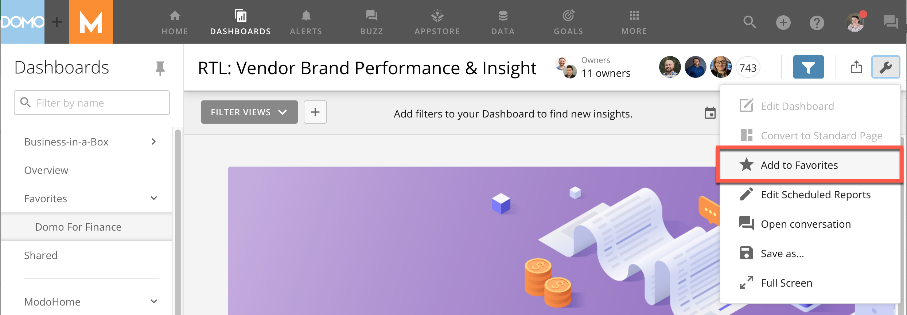
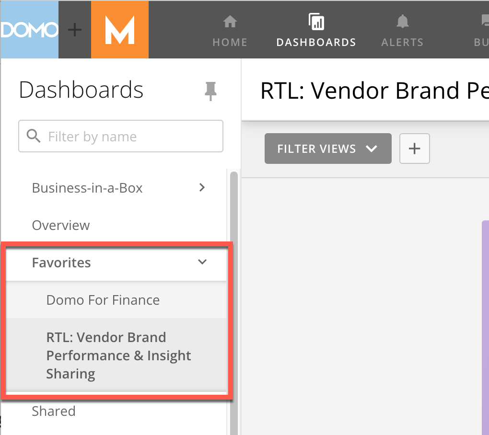

---
    title: Adding Dashboards as Favorites
    url: https://domo-support.domo.com/s/article/360043428413
    linked_kbs:  ['[https://domo-support.domo.com/s/knowledge-base/](https://domo-support.domo.com/s/knowledge-base/)', '[https://domo-support.domo.com/s/](https://domo-support.domo.com/s/)', '[https://domo-support.domo.com/s/topic/0TO5w000000ZamnGAC](https://domo-support.domo.com/s/topic/0TO5w000000ZamnGAC)', '[https://domo-support.domo.com/s/topic/0TO5w000000ZansGAC](https://domo-support.domo.com/s/topic/0TO5w000000ZansGAC)', '[https://domo-support.domo.com/s/article/360043428413](https://domo-support.domo.com/s/article/360043428413)', '[https://domo-support.domo.com/s/topic/0TO5w000000ZansGAC/interacting-with-cards-and-dashboards](https://domo-support.domo.com/s/topic/0TO5w000000ZansGAC/interacting-with-cards-and-dashboards)', '[https://domo-support.domo.com/s/article/360043429933](https://domo-support.domo.com/s/article/360043429933)', '[https://domo-support.domo.com/s/article/360043429953](https://domo-support.domo.com/s/article/360043429953)', '[https://domo-support.domo.com/s/article/360042925494](https://domo-support.domo.com/s/article/360042925494)', '[https://domo-support.domo.com/s/article/360043429913](https://domo-support.domo.com/s/article/360043429913)', '[https://domo-support.domo.com/s/article/4408174643607](https://domo-support.domo.com/s/article/4408174643607)', '[https://domo-support.domo.com/s/login/](https://domo-support.domo.com/s/login/)']
    article_id: 000004057
    views: 2,220
    created_date: 2022-10-24 21:19:00
    last updated: 2022-10-24 22:39:00
    ---

  

**Note:** **Dashboard** is the term for the section of the Domo interface where you can organize and view your cards. It replaces the term **Page**.

Intro
-----

When you add dashboards as favorites, you can access them by going to the **Favorites** menu in the left side rail.

Adding a Dashboard as a Favorite
--------------------------------

1.  Open the dashboard you want to add as a favorite.

2. Select  **Dashboard Options**.   
The dashboard options menu displays.

3. Select  **Add to Favorites**. 

Your dashboard now displays in the **Favorites**menu in the left side rail.

  
To remove a dashboard from your **Favorites**, open the **Dashboard Options** menu and select **Remove from favorites**.

