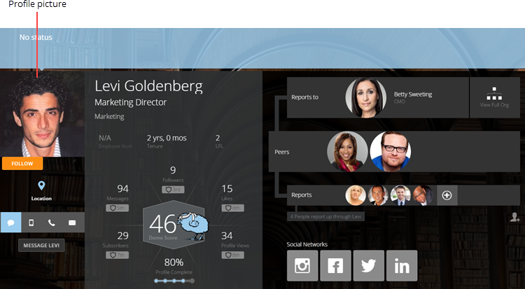

---
    title: Adding or Changing Your Profile Picture
    url: https://domo-support.domo.com/s/article/360043439393
    linked_kbs:  ['[https://domo-support.domo.com/s/knowledge-base/](https://domo-support.domo.com/s/knowledge-base/)', '[https://domo-support.domo.com/s/](https://domo-support.domo.com/s/)', '[https://domo-support.domo.com/s/topic/0TO5w000000ZamsGAC](https://domo-support.domo.com/s/topic/0TO5w000000ZamsGAC)', '[https://domo-support.domo.com/s/topic/0TO5w000000ZaoLGAS](https://domo-support.domo.com/s/topic/0TO5w000000ZaoLGAS)', '[https://domo-support.domo.com/s/article/360043439433](https://domo-support.domo.com/s/article/360043439433)', '[https://domo-support.domo.com/s/article/360043438973](https://domo-support.domo.com/s/article/360043438973)', '[https://domo-support.domo.com/s/article/360043439393](https://domo-support.domo.com/s/article/360043439393)', '[https://domo-support.domo.com/s/topic/0TO5w000000ZaoLGAS/user-profile](https://domo-support.domo.com/s/topic/0TO5w000000ZaoLGAS/user-profile)', '[https://domo-support.domo.com/s/article/360043429933](https://domo-support.domo.com/s/article/360043429933)', '[https://domo-support.domo.com/s/article/360043429953](https://domo-support.domo.com/s/article/360043429953)', '[https://domo-support.domo.com/s/article/360042925494](https://domo-support.domo.com/s/article/360042925494)', '[https://domo-support.domo.com/s/article/360043429913](https://domo-support.domo.com/s/article/360043429913)', '[https://domo-support.domo.com/s/article/4408174643607](https://domo-support.domo.com/s/article/4408174643607)', '[https://domo-support.domo.com/s/login/](https://domo-support.domo.com/s/login/)']
    article_id: 000004396
    views: 2,138
    created_date: 2022-10-24 21:46:00
    last updated: 2022-10-24 22:41:00
    ---

In the Profile page, you can add or change your profile picture. You can upload as many profile pictures to Domo as you want. Domo stores all of your profile pictures, and you can choose a new stored picture (or upload a new picture to your store of pictures) whenever you want. When you select a picture for uploading, Domo gives you options to crop and rotate it before you upload it. You can also delete any profile picture you've uploaded.

 

**Note:**

* Profile pictures are different from *personal photos*, which are photos you upload to Domo that appear only in your Profile page. These photos do not represent you throughout Domo like a profile picture does. Profile pictures are also different from *background images*, which appear in the background of your Profile page. For more information about personal photos, see [Changing Your Profile Background Image](/s/article/360043439433 "Managing Your Personal Photos").
* You can only change someone else's profile picture if you have an "Admin" default security role or a custom role with "Edit Users" enabled. For more information about default security roles, see [Managing Custom Roles](/s/article/360043438973 "Security Role Reference").

  
  

**To upload a new profile picture to your picture store,**

1. Open your Profile page by clicking your profile picture in the top right corner of the screen. (If you have not yet selected a profile picture, a  icon appears instead.)
2. Click your profile picture in the profile header at the top of the page (or the gray square containing your initials if you have not yet selected a profile picture.)  
 A dialog appears in which you can view all pictures you have uploaded.
3. Click **Choose File**.
4. Select the picture file you want to upload and click **Open**.  
 A new dialog appears with options for cropping and rotating the picture.
5. (Optional) To crop the image, click and drag the rectangle to the portion of the image you want to preserve. You can also click and drag any of the square handles to resize the crop area.
6. (Optional) To rotate the image left or right, click  or , respectively.
7. When you are satisfied with how your picture looks, click **Done Cropping**.  
 The image is added to your store of profile images, and you can select it as your profile picture whenever you want.

**To select an uploaded profile image as your profile picture,**

1. Open your Profile page by clicking your profile picture in the top right corner of the screen. (If you have not yet selected a profile picture, a  icon appears instead.)
2. Click your profile picture in the profile header at the top of the page (or the gray square containing your initials if you have not yet selected a profile picture.)  
 A dialog appears in which you can view all pictures you have uploaded. (If no pictures appear here, you need to upload at least one. Refer to the steps for uploading a new picture.)
3. Click **Done**.  
 The image you selected becomes your profile picture that is used throughout Domo.

**To delete a photo from your profile image store,**

1. Open your Profile page by clicking your profile picture in the top right corner of the screen. (If you have not yet selected a profile picture, a  icon appears instead.)
2. Click your profile picture in the profile header at the top of the page (or the gray square containing your initials if you have not yet selected a profile picture.)
3. Mouse over the picture you want to delete.
4. Click the trash can icon that appears in the top right corner of the picture.
