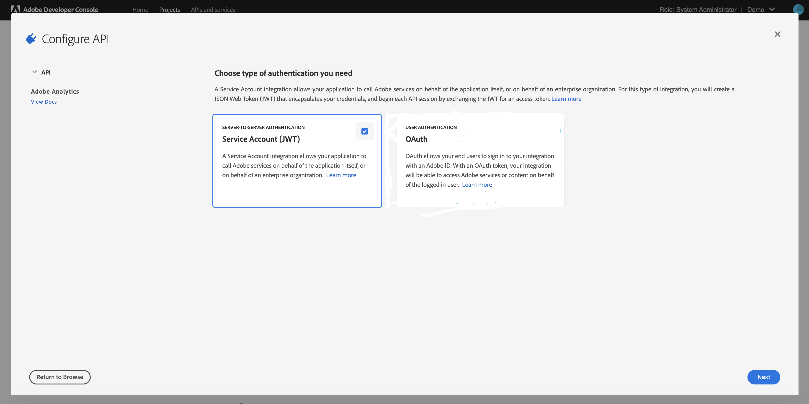
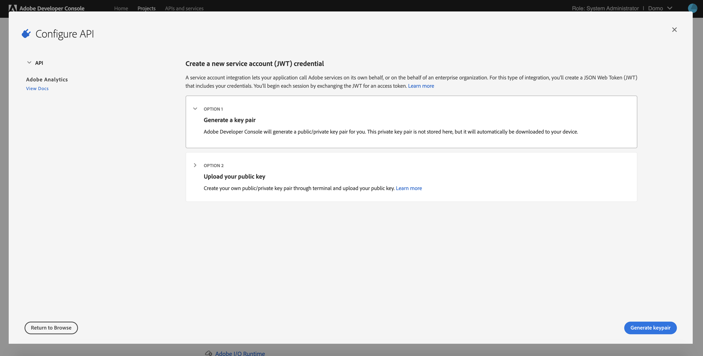
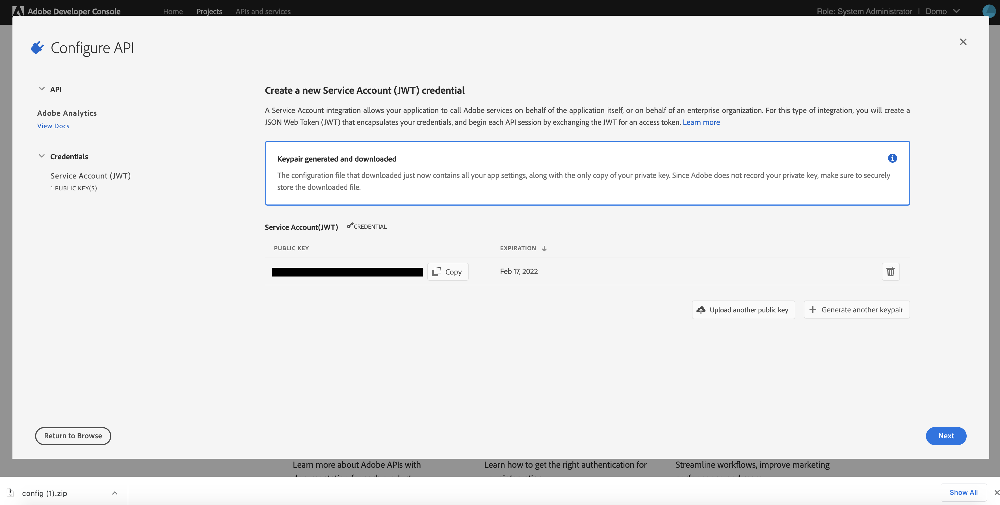
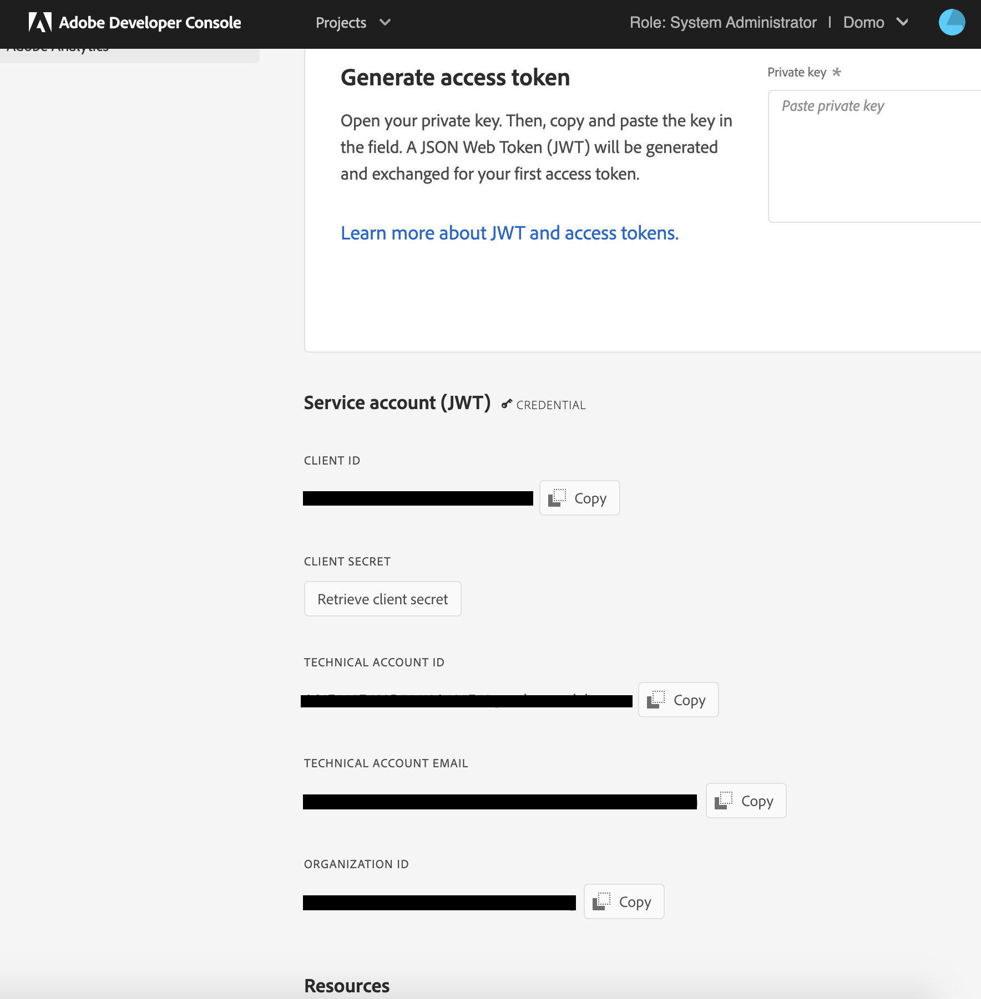

---
    title: Adobe Analytics 1.4 JWT Connector
    url: https://domo-support.domo.com/s/article/1500003392422
    linked_kbs:  ['[https://domo-support.domo.com/s/knowledge-base/](https://domo-support.domo.com/s/knowledge-base/)', '[https://domo-support.domo.com/s/](https://domo-support.domo.com/s/)', '[https://domo-support.domo.com/s/topic/0TO5w000000ZammGAC](https://domo-support.domo.com/s/topic/0TO5w000000ZammGAC)', '[https://domo-support.domo.com/s/topic/0TO5w000000ZanLGAS](https://domo-support.domo.com/s/topic/0TO5w000000ZanLGAS)', '[https://domo-support.domo.com/s/topic/0TO5w000000ZaoQGAS](https://domo-support.domo.com/s/topic/0TO5w000000ZaoQGAS)', '[https://domo-support.domo.com/s/article/360042926274](https://domo-support.domo.com/s/article/360042926274)', '[https://domo-support.domo.com/s/article/360042926054](https://domo-support.domo.com/s/article/360042926054)', '[https://domo-support.domo.com/s/article/1500003392422](https://domo-support.domo.com/s/article/1500003392422)', '[https://domo-support.domo.com/s/topic/0TO5w000000ZaoQGAS/api-connectors](https://domo-support.domo.com/s/topic/0TO5w000000ZaoQGAS/api-connectors)', '[https://domo-support.domo.com/s/article/360043429933](https://domo-support.domo.com/s/article/360043429933)', '[https://domo-support.domo.com/s/article/360043429953](https://domo-support.domo.com/s/article/360043429953)', '[https://domo-support.domo.com/s/article/360042925494](https://domo-support.domo.com/s/article/360042925494)', '[https://domo-support.domo.com/s/article/360043429913](https://domo-support.domo.com/s/article/360043429913)', '[https://domo-support.domo.com/s/article/4408174643607](https://domo-support.domo.com/s/article/4408174643607)', '[https://domo-support.domo.com/s/login/](https://domo-support.domo.com/s/login/)']
    article_id: 000003239
    views: 2,208
    created_date: 2022-10-24 21:11:00
    last updated: 2022-10-24 22:39:00
    ---

Intro
-----

Adobe Analytics helps you create a holistic view of your business by turning customer interactions into actionable insights. With the Domo Adobe Analytics 1.4 JWT connector , you can retrieve data about customers, various metrics, dimensions, and segments to see the big web engagement picture. Adobe Analytics delivers virtually anything you need to understand and measure your visitors’ online behavior. With Domo, you can easily access Adobe's web analytics metrics and combine them with data from CRM, POS, finance, and any other system to make faster, better-informed decisions. With your data in Domo, you can snapshot how your web presence develops over time and get instant notifications when Adobe Analytics metrics hit thresholds that you determine. This connector supports partitioning and uses custom reports. To learn more about the Adobe Analytics API, visit their website ( <https://marketing.adobe.com/developer/en_US/get-started/introduction/c-introduction> ).

You connect to the Adobe Analytics API in the Data Center.

This topic discusses the fields and menus that are specific to the Adobe Analytics 1.4 JWT connector user interface. General information for adding DataSets, setting update schedules, and editing DataSet information is discussed in [Adding a DataSet Using a Data Connector](/s/article/360042926274).

|  |  |
| --- | --- |
| **Primary Use Cases** | Marketing and web analytics |
| **Primary Metrics** | Visits, page views, unique visitors, etc. |
| **Primary Company Roles** | Analysts and executives |
| **Ease of Use (on a 1-to-10 scale with 1 being easiest)** | 8 |

API Limitations
---------------

* Only 1 Report Suite can be selected for a given report.
* Adobe only allows 4 elements per request.
* Up to 30 metrics can be selected.
* Segments are mutually exclusive.
* The API returns only the top ten results for an element by default, based on the first selected metric selected.

Prerequisites
-------------

To connect to Adobe Analytics v2 and create a dataset, you must create an Adobe Analytics Service Account (JWT) project in the Adobe Developer Console and provide the following:

* Client ID (API Key)
* Client Secret
* Technical Account ID
* Organization ID
* Private Key for your Adobe integration in PEM format

### Creating a new project in Adobe Developer Console with JWT authentication

To create a new project in Adobe Developer Console, do the following:

1. Log into [https://console.adobe.io/projects](https://console.adobe.io/projects "Follow link").
2. Click **Create new project** button.

3. Click on **Add API** to start using the Adobe services.

4. The APIs available to you will be listed in the **Add an API** window. Select **Adobe Analytics**. 

5. Now, you need to select the authentication type. Select **Service Account (JWT)**here.

6. Select **Generate a key pair** and click **Generate Keypair**.

7. A new key pair will be generated and downloaded to your system. The public key will be uploaded to your JWT project. The private key will be downloaded.

8. Unzip the file "config.zip", open the directory "config", and open the file "private.key" with a basic text editor. This is the **Private Key** you will paste into Domo, in Credentials section.

9. Now, click **Next**.

10. Select the desired product profiles, then click **Save Configured API**.

11. This takes you to the **Project APIs and Services** page. If you scroll down, you will see the **Client ID, Client Secret, Technical Account ID** and **Organization ID** that you will use to create the Adobe Analytics JWT account in Domo.

  
12. (Optional) Rename the project to something you will recognize later. Navigate to the **Project Overview** page, then click **Edit Project**.

Connecting to Your Adobe Analytics JWT Account
----------------------------------------------

This section enumerates the options in the **Credentials** and **Details** panes in the Adobe Analytics 1.4 JWT Connector page. The components of the other panes in this page, **Scheduling** and **Name & Describe Your DataSet**, are universal across most connector types and are discussed in greater length in [Adding a DataSet Using a Data Connector](/s/article/360042926274).

### Credentials Pane

This pane contains fields for entering credentials to connect to your Adobe Analytics v2 JWT account. The following table describes what is needed for each field:

| Field | Description |
| --- | --- |
| Client ID (API Key) | Enter your client ID. |
| Client Secret | Enter your client secret. |
| Technical Account ID | Enter your technical account ID. |
| Organization ID | Enter your organization ID. |
| Private Key | Paste the private key for your Adobe integration here, in PEM format. |

Once you have entered valid Adobe Analytics v2 JWT credentials, you can use the same account any time you go to create a new Adobe Analytics 1.4 JWT DataSet. You can manage Connector accounts in the **Accounts** tab in the Data Center. For more information about this tab, see [Managing User Accounts for Connectors](/s/article/360042926054).

### Details Pane

This pane contains two primary menus, **Report Suite** and **Report Type**, along with various other menus which may or may not appear depending on the report type you select.

#### Primary Menus

| Menu | Description |
| --- | --- |
| Company | Enter your company's name as featured on Adobe Analytics, which is used as a parameter for the Company.GetEndpoint method (see [https://github.com/AdobeDocs/analyti...GetEndpoint.md](https://github.com/AdobeDocs/analytics-1.4-apis/blob/master/docs/admin-api/methods/company/r_GetEndpoint.md "https://github.com/AdobeDocs/analytics-1.4-apis/blob/master/docs/admin-api/methods/company/r_GetEndpoint.md")) |
| Report Suite | Select the Adobe Analytics Report Suite you want to pull data from. |
| Report Type | Select a report type. The report type determines the set of inputs needed to configure the DataSet.
Report types are as follows:

|  |  |
| --- | --- |
| Easy - Predefined | Lets you select from a number of predefined Adobe Analytics reports. |
| Intermediate - Custom | Lets you specify the elements, metrics, segments, and date-time information for your report. |
| Advanced - Query | Lets you pull data using an Adobe Analytics Web Service API Explorer Query. For more information about queries, see [https://marketing.adobe.com/develope...r#Report.Queue](https://marketing.adobe.com/developer/api-explorer#Report.Queue "https://marketing.adobe.com/developer/api-explorer#Report.Queue"). |
| Queue | Lists the reports that are currently being processed by Adobe. |
| Segments | Lists the segments. |

 |
| Access Level | Select 'All' if you are using an Admin account. Otherwise, select 'Shared.' |

#### "Easy - Predefined" Report Type Options

| Option | Description |
| --- | --- |
| Predefined Report | Select the report you want to run. For a list of report types, see the next section. |
| Backfill | Select the number of days back that should backfill the first time the report is run. |
| Report | Select a predefined report. These reports are available *only* when you select **Easy - Predefined**as your **Report Type**.

|  |  |
| --- | --- |
| Base Metrics | Returns data about page views; average time spent on website; unique visitors by month, week, and day; new visitors; etc. |
| Commerce Metrics | Returns data about number of visits, orders, checkouts, revenue, new and returning customers, etc. |
| Existing Customer Campaigns | Returns data about visits, orders, and revenue, broken down by existing customer campaign. |
| Existing Customer Products | Returns data about existing customer visits, orders, checkouts, and revenue, broken down by product. |
| Mobile Device Types | Returns data about mobile views, visits, and daily unique visitors, broken down by device type. |
| Mobile Metrics | Returns metrics about mobile device usage, such as device type, OS, views, visits, and daily unique visitors. |
| Natural Search Conversion | Returns data about number of visits, orders, and revenue, broken down by natural search keyword. |
| Natural Search Visits | Returns data about number of visits, page views, and daily unique visitors, broken down by natural search keyword. |
| New Visitor Best Campaigns | Returns data about visits, orders, revenue, and units, broken down by new visitor campaign. |
| New Visitor Geo | Returns data about visits, orders, revenue, and units, broken down by region. |
| New Visitor Geo Country | Returns data about visits, orders, revenue, and units, broken down by country. |
| New Visitor Keywords | Returns data about visits, orders, revenue, and units, broken down by paid search keyword. |
| New Visitor Products | Returns data about new customer visits, orders, checkouts, revenue, units, etc., broken down by product. |
| New Visitor Traffic Source | Returns data about visits, orders, revenue, and units, broken down by referrer type. |
| Page Effectiveness | Returns data about page visits, entries and exists, bounces, and bounce rate, broken down by page.  |
| Page Metrics | Returns data about page views, visits, daily unique visitors, and exists, broken down by page. |
| Paid Search Conversion | Returns data about visits, orders, and revenue, broken down by paid search keyword. |
| Paid Search Visits | Returns data about page views, daily unique visitors, and visits, broken down by paid search keyword. |
| Products and Categories | Returns data about visits, orders, and revenue, broken down by product and category.  |

 |

#### "Intermediate - Custom" Report Type Options

| Option | Description |
| --- | --- |
| Elements | Select up to four element names.
An *element* is a structure that breaks down a report's metrics data. For example, you can generate a report that breaks down page views (metric) by the browsers used to access the page (element). The resulting report lists page views by browser type.
By default the Adobe Analytics API only returns the top 10 elements. If you want to view more, you can do so by entering information for the additional elements in the **Additional Element Information**field.
For more information about elements, see [https://marketing.adobe.com/develope...g-1-4/elements](https://marketing.adobe.com/developer/documentation/analytics-reporting-1-4/elements "https://marketing.adobe.com/developer/documentation/analytics-reporting-1-4/elements"). |
| Additional Element Information | Enter any additional element information using the JSON format defined in the API Explorer ([https://marketing.adobe.com/develope...r#Report.Queue](https://marketing.adobe.com/developer/api-explorer#Report.Queue "https://marketing.adobe.com/developer/api-explorer#Report.Queue")).
For example:
`{"top":50, "selected":[], "classifications":[], "id":"page", "name":"Page"}`
This parameter is described in detail later in this topic. |
| Segments | Select the segments you want to use to filter the custom report.

 

**Note:**Although you have the ability to select as many segments as you would like, be cautious about what those segments are doing to the overall picture of your data. Selecting segments will change the grouping of your data and can lead to unexpected results. 

 |
| Inline Segments | Enter additional inline segment information. Use the JSON format defined in the [API Explorer](https://marketing.adobe.com/developer/en_US/get-started/api-explorer#Report.Queue "https://marketing.adobe.com/developer/en_US/get-started/api-explorer#Report.Queue") for inline segments.
Example: {"name":"segment"} |
| Query Segments Individually | Select 'Yes' if you would like to query each segment individually. |
| Metrics | Select up to 30 metrics for your report. For more information about Adobe Analytics metrics, see [https://github.com/AdobeDocs/analytics-1.4-apis/blob/master/docs/reporting-api/metrics.md](https://marketing.adobe.com/developer/documentation/analytics-reporting-1-4/metrics "https://marketing.adobe.com/developer/documentation/analytics-reporting-1-4/metrics").
Some combinations of metrics will lead to errors. Adobe has provided a list of metrics that are blacklisted from being used together.  [https://github.com/AdobeDocs/analyti...ombinations.md](https://github.com/AdobeDocs/analytics-1.4-apis/blob/master/docs/reporting-api/combinations.md "https://github.com/AdobeDocs/analytics-1.4-apis/blob/master/docs/reporting-api/combinations.md") |
| Sort By | The reportDescriptionMetric ID to sort by. This can be used when declaring multiple metrics for Ranked and Trended reports. By default, the first metric will be used to sort. Use this option to sort by any of the metrics requested. |
| Date Granularity | Select a date grain for the report. This determines whether the data is broken down by day, by week, etc. |
| Add Date Granularity | Choose whether you would like to aggregate the data by the data granularity specified above or aggregate all the data. |
| Duration | Specify whether the data in this report is for a single date or a range of dates. |
| Report Date | Select whether the data in the report is for a specific date or for a relative date based on the selected **Date Granularity**. For example, if you selected **Date Granularity > Day**, you could select **Today** as your report date. Then, each time the data updated, it would show date for the current date. |
| Date Offset | Enter the number of periods back that will be used to offset your relative date. The period is based on your selected Date Granularity.
For example, if you selected **Date Granularity > Day** and **Report Date > Yesterday**, then entered 2 for **Date Offset**, the report would pull data for three days in the past (yesterday minus two days). |
| Select Specific Date | Select the date you want to retrieve data for. |
| Date From | Specify whether the first date in your date range is a specific or relative date. You select the last date in your range in **Date To**. Options in these menus are determined by the selected **Date Granularity**.
For example, if you selected **Date Granularity > Week**, you could then select **Date From > Last Week** and **Date To > This Week**. Each time your report updated, it would then show data for this week as well as last week. |
| Date To | Specify whether the last date in your date range is a specific or relative date. You select the first date in your range in **Date From**. Options in these menus are determined by the selected **Date Granularity**.
For example, if you selected **Date Granularity > Week**, you could then select **Date From > Last Week** and **Date To > This Week**. Each time your report updated, it would then show data for this week as well as last week. |
| Date From Offset | Enter the number of periods back that will be used to offset the first date in your date range. The period is based on your selected **Date Granularity**.
For example, if you selected **Date Granularity > Week** and **Date From > Last Week**, then entered 2 for **Date From Offset**, the first date in the date range would be set to three weeks in the past (last week minus two weeks). |
| Date To Offset | Enter the number of periods back that will be used to offset the last date in your date range. The period is based on your selected **Date Granularity**.
For example, if you selected **Date Granularity > Week** and **Date To > This Week**, then entered 2 for **Date To Offset**, the last date in your date range would be set to two weeks in the past (this week minus two weeks). |
| Select Specific Date From | Select the first date in your date range. |
| Select Specific Date To | Select the last date in your date range. |
| Time Zone | Select the timezone associated with the data. Because the processing takes place in the UTC timezone, processing data with today's date (or 'today' as the date) requires knowing the correct timezone. |
| Include All Time Zones | By default, the Time Zone field only displays the most commonly used time zones. Select 'True' to display all time zone options. |
| Backfill | Enter the number of periods back (based on the selected **Date Granularity**) that should backfill the first time the report is run. |
| Reset Update | Select 'Yes' to reset the update flag. Resetting the flag will cause the data source to retrieve all available data, rather than the just the new data from the last update. |

#### "Advanced - Query" Report Type Options

| Option | Description |
| --- | --- |
| Query | Enter an Adobe Analytics Web Service API Explorer Query to pull data for your report. For more information about queries, see [https://marketing.adobe.com/develope...r#Report.Queue](https://marketing.adobe.com/developer/api-explorer#Report.Queue "https://marketing.adobe.com/developer/api-explorer#Report.Queue").
For example:
`{"reportDescription":{ "reportSuiteID":"thankyoudev", "dateFrom":"2014-09-07", "dateTo":"2014-09-07", "dateGranularity":"Day", "elements":[ {"top":50, "selected":[], "classifications":[], "id":"page", "name":"Page"}], "metrics":[ {"decimals":0, "id":"pageviews", "name":"Page Views"}, {"decimals":0, "id":"visits", "name":"Visits"}], "segments":[], "locale":"en_US"}}` |

### Other Panes

For information about the remaining sections of the Connector interface, including how to configure scheduling, retry, and update options, see [Adding a DataSet Using a Data Connector](/s/article/360042926274).

Understanding The "Additional Elements" Field
---------------------------------------------

The following JSON snippet contains all of the code needed to utilize the **Additional Elements** parameter of the connector. You just need to replace *string* & *int* with the values you choose. You can also delete the sections of this JSON that you will not be using. Examples on how to use this will be discussed in the sections that follow.

  
`{  
"id":"*string*",  
"classification":"*string*",  
"top":"*int*",  
"startingWith":"*int*",  
"search":{  
"type":"*string*",  
"keywords":[  
"*string*"  
],  
}  
}`

### Using Additional Elements to Increase Your Top Results

By default, the Adobe Analytics API only return the top 10 results for the selected element. You can increase the number of top results using **Additional Elements**. For example, to increase the limit to 100 you would add the following to the **Additional Elements**field:

`{“top”:100,  
“id”:”page”}`

*"*id" is the ID of the element you want. There is no upper limit to the “Top” number but the less you pull back in using the query, the more efficient it will be. You can do this for multiple elements by separating them with a comma.

`{“top”:100,  
“id”:”page”},  
{“top”:100,  
“id”:”region”}` 

### Using Additional Elements to Search for Keywords in Elements

You can use **Additional Elements**to search for keywords in elements by inputting properly formatted JSON. You can search using AND, OR, and NOT operators. Below is a table that describes these operators.

| Value | Description |
| --- | --- |
| AND | Combines multiple search terms to return results that have all of the search keywords. |
| OR | Combines multiple search terms to return results that match any of the search keywords. |
| NOT | Excludes the selected keywords from the search results. |

The following example searches for the top three pages that have “help” OR “faq” in the page name/URL. You can also do an AND search by replacing the “OR” with “AND”. 

`{  
"id": "page",  
"top": 3,  
"search": {  
"type": "OR",  
"keywords": ["help","faq"]  
}  
}`

You can also use special characters like the following to increase the power of your search:

| Special Character | Description |
| --- | --- |
| \* | Wild Card. Add to the beginning or end of keywords (e.g. page\*.html). |
| ^ | Starts With. Add to the beginning of your keyword/string to find results that start with this keyword/string (e.g. ^http://). |
| $ | Ends With. Add to the end of your keyword/string to find results that end with this keyword/string (e.g. .html$) |

Here is an example of a search that uses these characters:

`{  
"id": "page",  
"top": 3,  
"search": {  
"type": "OR",  
"keywords": [“help*","^faq"]  
}  
}`

Exact keyword matches can be obtained by placing the "starts with" and "ends with" special characters at the beginning and ending of the keyword:

`{  
"id": "page",  
"top": 3,  
"search": {  
"type": "OR",  
"keywords": ["^faq$"]  
}  
}`

### Adding Classifications to the JSON Syntax

If you wish to do any of the above advanced functions with a SAINT Classification then you need to add the classification to the JSON syntax, as shown in the following example:  
  
`{  
"id": “page",  
“classification”:”region”,  
"top": 3  
}`

Troubleshooting
---------------

### Unique Metrics

One of the most frequently encountered issues with the Adobe Analytics connector involves unique metrics, such as Unique Visitors, Unique Pageviews, etc. Unique metrics are non-additive and need to be pulled from the connector at the same level of granularity they will be viewed at. This is because if you pull these metrics in a different granularity when the numbers are rolled up, they will no longer be accurate. For example, say we have a visitor to our site, Visitor 1. This individual visits the site once a day for a week. When we go to report how many people visited the site in a week, if we pull the data using a day granularity, Visitor 1 is counted 7 times. However, if we pull the data using a week granularity, Visitor 1 is only counted once, giving us an accurate count of how many individuals visited the page in a week but NOT how many times the site was visited.

### API Explorer

Adobe Analytics has an API Explorer that you can use to run your report and check the results. It is available at [https://marketing.adobe.com/developer/api-explorer](https://marketing.adobe.com/developer/api-explorer "https://marketing.adobe.com/developer/api-explorer").

Tips and Tricks
---------------

* Make sure to leverage the Additional Element Information field, as explained above.
* Classifications are identified by an “->” in the Element list.
* The fewer elements per data source, the better.
* Try and stay below 10 metrics per data source.
* Stagger the runtimes of your data sources.
* Learn how to use the Adobe Analytics API explorer.
* Reference the Adobe API documentation (URL is provided under Helpful Links below).
* Segments will lengthen runtimes.
* Although you have the ability to select as many segments as you would like, be cautious about what those segments are doing to the overall picture of your data. Selecting segments will change the grouping of your data and can lead to unexpected results.
* sProps and eVars cannot be pulled together.

FAQs
----

#### When should I use this connector?

Connect your customer insight data to Domo using V2 of Adobe's API and authenticating using OAuth. 

#### What's the difference between the Adobe Analytics OAuth and Adobe Analytics 1.4 JWT connectors?

The Adobe Analytics OAuth connector uses the OAuth authentication whereas the Adobe Analytics 1.4 JWT connector uses the JWT authentication. Adobe recommends that you use JWT authentication, as you will have to refresh the OAuth account every two weeks because the OAuth refresh token expires.

#### What version of the Adobe Analytics API does this connector use?

This connector uses the version 1.4 of the Adobe Analytics API ([https://analytics.adobe.io/api/1.4](https://analytics.adobe.io/api/1.4 "https://analytics.adobe.io/api/1.4")).

#### What kind of credentials do I need to power up this connector?

You need the Client ID (API Key), Client Secret, Technical Account ID, Organization ID, and Private Key associated with your Adobe Analytics 1.4 JWT project.

#### Do I need a certain kind of account with the data service to set up the connector?

It is best if your account has Admin access. You at least need access to the report suites you want, as well as access to retrieve elements, metrics, and segments from the API.

#### My report takes a long time. How do I speed up my report?

In case of the Intermediate-Custom report the number of elements selected and the parameters in the Additional Element Information text box can make a big difference in your report performance. Select the minimum number of elements needed.  
It is also possible to have a number of reports queued up in Adobe Analytics that is preventing your report from being finished. You can use the Queue report to see what reports are currently being processed by Adobe.  
If you have a large number datasets try to stagger their execution times so that the datasets will not clog up Adobe's queue all at once.

#### Is there a way to see what data is being returned from the Adobe Analytics API?

Adobe Analytics has an API Explorer that you can use to run your report and check the results. It is available at [Reports and Analytics API 1.4](https://adobedocs.github.io/analytics-1.4-apis/swagger-docs.html "https://adobedocs.github.io/analytics-1.4-apis/swagger-docs.html").

#### Are there any API limits that I need to know?

Adobe's API has a 4 element limit and only 50000 rows per element can be retrieved.  

#### Which Adobe Analytics connector should I use?

Adobe recommends that you use Adobe Analytics JWT authentication. Adobe OAuth refresh tokens expire after two weeks, which requires you to refresh your account.

#### Does this connector support Backfilling?

Backfilling is supported in this connector for the first attempt only. 

#### What is the workflow for pulling data from Adobe?

The process used by Domo to pull Adobe data is as follows:

1. **Queue report** -- Domo sends Adobe the parameters of the desired report. [https://github.com/AdobeDocs/analyti...ods/r\_Queue.md](https://github.com/AdobeDocs/analytics-1.4-apis/blob/master/docs/reporting-api/methods/r_Queue.md "https://github.com/AdobeDocs/analytics-1.4-apis/blob/master/docs/reporting-api/methods/r_Queue.md")
2. **Get report ID**-- Domo receives a report ID.
3. **Wait for report to be done** -- Domo watches Adobe's queue and wait for the report to be done. [https://github.com/AdobeDocs/analyti.../r\_GetQueue.md](https://github.com/AdobeDocs/analytics-1.4-apis/blob/master/docs/reporting-api/methods/r_GetQueue.md "https://github.com/AdobeDocs/analytics-1.4-apis/blob/master/docs/reporting-api/methods/r_GetQueue.md")
4. **Pull report** -- When the report no longer appears in the queue, Domo uses the report ID received in step 2 to ask for the data of the report. [https://github.com/AdobeDocs/analyti...thods/r\_Get.md](https://github.com/AdobeDocs/analytics-1.4-apis/blob/master/docs/reporting-api/methods/r_Get.md "https://github.com/AdobeDocs/analytics-1.4-apis/blob/master/docs/reporting-api/methods/r_Get.md")

#### I successfully created an Adobe Analytics JWT account, but later got an alert: "Account Adobe Analytics JWT Account has been Deactivated". Why is this happening and what can I do about it?

Check the expiration date on your public/private key pair uploaded to your Adobe Analytics JWT project in the [Adobe console](https://console.adobe.io/ "https://console.adobe.io/"). You may need to generate a new public/private key pair and upload it to the project, then create a new account in Domo with the new private key.

Helpful Links
-------------

The following links provide access to pages on Adobe's website with helpful information:

API Overview: <https://marketing.adobe.com/developer/get-started/introduction/c-introduction>

Adobe Analytics API Explorer: <https://marketing.adobe.com/developer/api-explorer>

Inline Segmentation: <https://marketing.adobe.com/developer/documentation/sitecatalyst-reporting/c-segments>

High-Level Schema Overview: <https://marketing.adobe.com/developer/blog/high-level-overview-of-the-schema-of-adobe-analytics>

Pathing and Fallout Reports: <https://marketing.adobe.com/developer/documentation/analytics-reporting-1-4/pathing>

Data Warehouse Reports: <https://blogs.adobe.com/digitalmarketing/analytics/omniture-datawarehouse-inside-omniture-sitecatalyst/>

