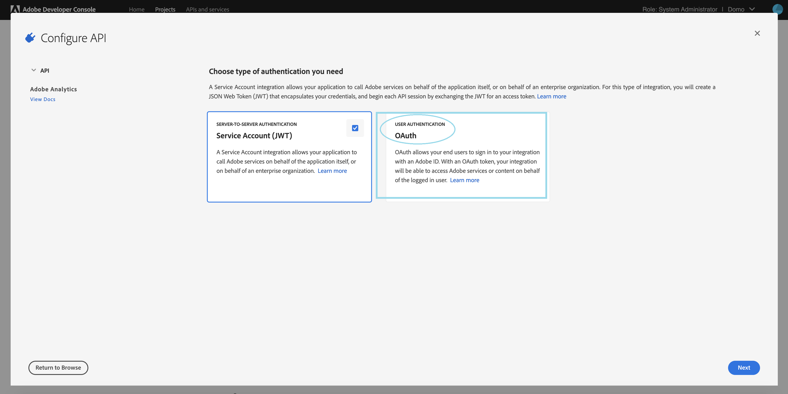

---
    title: Adobe Analytics Connector
    url: https://domo-support.domo.com/s/article/360043433593
    linked_kbs:  ['[https://domo-support.domo.com/s/knowledge-base/](https://domo-support.domo.com/s/knowledge-base/)', '[https://domo-support.domo.com/s/](https://domo-support.domo.com/s/)', '[https://domo-support.domo.com/s/topic/0TO5w000000ZammGAC](https://domo-support.domo.com/s/topic/0TO5w000000ZammGAC)', '[https://domo-support.domo.com/s/topic/0TO5w000000ZanLGAS](https://domo-support.domo.com/s/topic/0TO5w000000ZanLGAS)', '[https://domo-support.domo.com/s/topic/0TO5w000000ZaoQGAS](https://domo-support.domo.com/s/topic/0TO5w000000ZaoQGAS)', '[https://domo-support.domo.com/s/article/360042926274](https://domo-support.domo.com/s/article/360042926274)', '[https://domo-support.domo.com/s/article/360042926054](https://domo-support.domo.com/s/article/360042926054)', '[https://domo-support.domo.com/s/article/360043433593](https://domo-support.domo.com/s/article/360043433593)', '[https://domo-support.domo.com/s/topic/0TO5w000000ZaoQGAS/api-connectors](https://domo-support.domo.com/s/topic/0TO5w000000ZaoQGAS/api-connectors)', '[https://domo-support.domo.com/s/article/360043429933](https://domo-support.domo.com/s/article/360043429933)', '[https://domo-support.domo.com/s/article/360043429953](https://domo-support.domo.com/s/article/360043429953)', '[https://domo-support.domo.com/s/article/360042925494](https://domo-support.domo.com/s/article/360042925494)', '[https://domo-support.domo.com/s/article/360043429913](https://domo-support.domo.com/s/article/360043429913)', '[https://domo-support.domo.com/s/article/4408174643607](https://domo-support.domo.com/s/article/4408174643607)', '[https://domo-support.domo.com/s/login/](https://domo-support.domo.com/s/login/)']
    article_id: 000003548
    views: 5,486
    created_date: 2022-10-24 21:13:00
    last updated: 2022-10-24 22:42:00
    ---

Intro
-----

Adobe Analytics helps you create a holistic view of your business by turning customer interactions into actionable insights. Domo's Adobe Analytics connector allows you to retrieve data through prebuilt reports or customized reports or by submitting a query to the Adobe Analytics API. You can then combine metrics with data from CRM, POS, or any other system to make faster, better-informed business decisions. To learn more about the Adobe Analytics API, visit <https://marketing.adobe.com/developer/en_US/get-started/introduction/c-introduction>.

You connect to the Adobe Analytics API in the Data Center. This topic discusses the fields and menus that are specific to the Adobe Analytics connector user interface. General information for adding DataSets, setting update schedules, and editing DataSet information is discussed in [Adding a DataSet Using a Data Connector](/s/article/360042926274 "Adding a DataSet Using a Data Connector").

Prerequisites
-------------

To connect to the Adobe Analytics and create a DataSet, you must have the Client ID and Client Secret associated with your Adobe Analytics account.

Visit [Adobe Oauth Connection](https://www.adobe.io/authentication/auth-methods.html#!AdobeDocs/adobeio-auth/master/AuthenticationOverview/OAuthIntegration.md "https://www.adobe.io/authentication/auth-methods.html#!AdobeDocs/adobeio-auth/master/AuthenticationOverview/OAuthIntegration.md") documentation to learn more about obtaining your Client ID and Client Secret.

### Creating a new OAuth project in Adobe Developer Console

To create a new OAuth project in Adobe Developer Console, do the following:

1. Log into [https://console.adobe.io/projects](https://console.adobe.io/projects "Follow link").
2. Click **Create new project** button.
3. Click on **Add API** to start using the Adobe services.

4. The APIs available to you will be listed in the **Add an API** window. Select **Adobe Analytics**. 

5. Now, you need to select the authentication type. Select **OAuth** here.

6. Select the **Web**platform to configure the API.

    Enter the **redirect URI** as **<https://oauth.domo.com/api/data/v2/oauth/providers/adobe-analytics-oauth/exchange>**  
    Enter the **Redirect URI pattern** as**<https://oauth//.domo//.com/api/data/v2/oauth/providers/adobe-analytics-oauth/exchange>**

7. Click **Save configured API**.

Connecting to the Adobe Analytics API
-------------------------------------

This section enumerates the options in the **Credentials** and **Details** panes in the Adobe Analytics connector page. The components of the other panes in this page, **Scheduling** and **Name & Describe Your DataSet**, are universal across most connector types and are discussed in greater length in [Adding a DataSet Using a Data Connector](/s/article/360042926274 "Adding a DataSet Using a Data Connector").

### Credentials Pane

This pane contains fields for entering credentials to connect to the Adobe Analytics API. The following table describes what is needed for each field:

| Field  | Description |
| --- | --- |
| Client ID | Enter the client ID associated with your Adobe Analytics account. |
| Client Secret | Enter the client secret associated with your Adobe Analytics account. |

Once you have entered valid credentials, you can use the same account any time you go to create a new Adobe Analytics DataSet. You can manage connector accounts in the **Accounts**tab in the Data Center. For more information about this tab, see [Managing User Accounts for Connectors](/s/article/360042926054 "Managing User Accounts for Connectors").   

### Details Pane

This pane contains two menus, **Report Suite** and **Report Type**, which allow you to select a predefined Adobe Analytics report.

| Menu | Description |
| --- | --- |
| Company | Enter your company's name as featured on Adobe Analytics, which is used as a parameter for the Company.GetEndpoint method (see [https://github.com/AdobeDocs/analyti...GetEndpoint.md](https://github.com/AdobeDocs/analytics-1.4-apis/blob/master/docs/admin-api/methods/company/r_GetEndpoint.md "https://github.com/AdobeDocs/analytics-1.4-apis/blob/master/docs/admin-api/methods/company/r_GetEndpoint.md")) |
| Report Suite | Select the Adobe Analytics Report Suite you want to pull data from. |
| Predefined Report | Select an Adobe Analytics report type. The following table lists all of the available predefined reports:

|  |  |
| --- | --- |
| Base Metrics | Returns data about page views; average time spent on website; unique visitors by month, week, and day; new visitors; etc.  |
| Commerce Metrics | Returns data about number of visits, orders, checkouts, revenue, new and returning customers, etc. |
| Existing Customer Campaigns | Returns data about visits, orders, and revenue, broken down by existing customer campaign. |
| Existing Customer Products | Returns data about existing customer visits, orders, checkouts, and revenue, broken down by product. |
| Mobile Device Types | Returns data about mobile views, visits, and daily unique visitors, broken down by device type. |
| Mobile Metrics | Returns metrics about mobile device usage, such as device type, OS, views, visits, and daily unique visitors. |
| Natural Search Conversion | Returns data about number of visits, orders, and revenue, broken down by natural search keyword.  |
| Natural Search Visits  | Returns data about number of visits, page views, and daily unique visitors, broken down by natural search keyword.  |
| New Visitor Best Campaigns  | Returns data about visits, orders, revenue, and units, broken down by new visitor campaign.  |
| New Visitor Geo  | Returns data about visits, orders, revenue, and units, broken down by region. |
| New Visitor Geo Country  | Returns data about visits, orders, revenue, and units, broken down by country.  |
| New Visitor Keywords  | Returns data about visits, orders, revenue, and units, broken down by paid search keyword.  |
| New Visitor Products  | Returns data about new customer visits, orders, checkouts, revenue, units, etc., broken down by product.   |
| New Visitor Traffic Source  | Returns data about visits, orders, revenue, and units, broken down by referrer type.  |
| Page Effectiveness | Returns data about page visits, entries and exists, bounces, and bounce rate, broken down by page. |
| Page Metrics | Returns data about page views, visits, daily unique visitors, and exists, broken down by page. |
| Paid Search Conversion | Returns data about visits, orders, and revenue, broken down by paid search keyword. |
| Paid Search Visits | Returns data about page views, daily unique visitors, and visits, broken down by paid search keyword. |

 |

### Other Panes

For information about the remaining sections of the connector interface, including how to configure scheduling, retry, and update options, see [Adding a DataSet Using a Data Connector](/s/article/360042926274).

FAQs
----

#### Q: When should I use this connector?

A: This connector has been deprecated and cannot be used to power up any new datasets. 

#### Q: I successfully created an Adobe Analytics OAuth account, but about two weeks later I got an alert: "Account Adobe Analytics OAuth Account has been Deactivated". Why is this happening and what can I do about it?

A: Adobe Analytics OAuth has a refresh token that expires after two weeks (see [Adobe documentation](https://www.adobe.io/authentication/auth-methods.html#!AdobeDocs/adobeio-auth/master/OAuth/OAuth.md#exchanging-refresh-tokens "https://www.adobe.io/authentication/auth-methods.html#!AdobeDocs/adobeio-auth/master/OAuth/OAuth.md#exchanging-refresh-tokens") for details.) This causes Adobe OAuth to no longer authenticate after two weeks. This is an Adobe limitation. Older datasets use WSSE authentication (Username:Company, Password), but Adobe has deprecated WSSE authentication. Please contact Adobe support to request a resolution to this issue.

#### Q: My Adobe Analytics datasets are failing intermittently and displaying unhelpful error messages like "Unable to complete report at this time. Please try again later." What should I do?

A: This error originates on Adobe’s end. Unfortunately, it is nothing we at Domo have direct control over, but we are working with Adobe to improve these types of errors. That said, you can take steps to alleviate the occurrence of these errors, which include reducing the number of connectors, the frequency at which they try to pull data, and the size of their requests. Attempting to schedule requests to run at different times can also help. Another possible solution is to use the “retry” setting in the connector.

