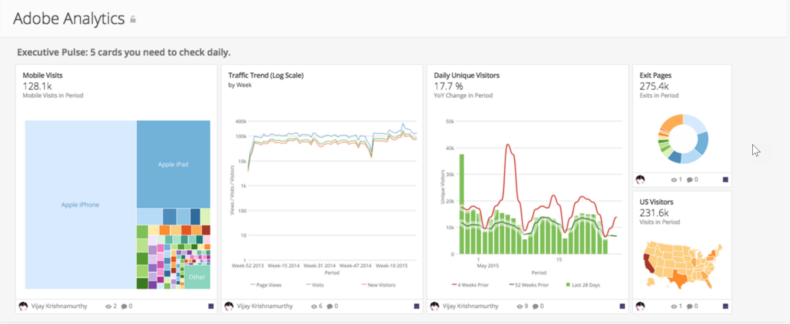

Intro
-----

Adobe Analytics delivers virtually anything you need to measure your visitors' online behavior. The Adobe Analytics Dashboard provides a summary of your website's performance including mobile visits, traffic trends, daily unique visitors, visitors by geography, and more.

Screenshot
----------

Requirements and Notes
----------------------

Web Services username and shared secret for an admin account.

Default data range: last 400 days.

Usage
-----

* Executive Pulse: 5 cards you need to check daily

	+ Mobile Operating Systems
	+ Top 25 Organic Search Terms
	+ Top 25 Paid Search Terms
	+ Daily Unique Visitors
	+ Traffic Trend (Log Scale)
* Traffic Behavior: What is our customers' browsing behavior on our site?

	+ World Visitors
	+ Top 25 Exit Pages
	+ US Visitors
* Traffic Acquisition: Where are our site users coming from?

	+ Mobile Devices
	+ Mobile Metrics
	+ New Visitor Keywords Word Cloud
	+ Paid Search Keywords
	+ Page Views
	+ Daily Unique Visitors
	+ Visits
* eCommerce: How can we improve commercial transactions on our site?

	+ Best Converting Paid Search Terms
	+ Orders
	+ Transaction Conversion Rate

Authentication
--------------

| Credential | Description |
| --- | --- |
| Username:Company | 1. Sign into [https://sc.omniture.com](https://sc.omniture.com "https://sc.omniture.com"). 2. Click on your avatar in the top right corner. 3. Click on the gear icon to go to your account information page. 4. You will find your **User Name** and **Shared Secret** under **Web Service**. Please note that **Web Service User Name** and **Shared Secret** is different from your **Login Username** and **Password**. |
| Secret | 1. Sign into [https://sc.omniture.com](https://sc.omniture.com "https://sc.omniture.com"). 2. Click on your avatar in the top right corner. 3. Click on the gear icon to go to your account information page. 4. You will find your **User Name** and **Shared Secret** under **Web Service**. Please note that **Web Service User Name** and **Shared Secret** is different from your **Login Username** and **Password**. |

Dashboard Reports
-----------------

For descriptions of reports, see Adobe Analytics Connector.

| Report | Schedule Update Setting | Parameters | Selection |
| --- | --- | --- | --- |
| New Visitor Geo Country | Append | Report Suite | Your desired report suite |
| Report Type | Easy - Predefined |
| Predefined Report | New Visitor Geo Country |
| Backfill | 400 |
| Reset Update | No |
| New Visitor Keywords | Append | Report Suite | Your desired report suite |
| Report Type | Easy - Predefined |
| Predefined Report | New Visitor Keywords |
| Backfill | 400 |
| Reset Update | No |
| New Visitor Geo | Append | Report Suite | Your desired report suite |
| Report Type | Easy - Predefined |
| Predefined Report | New Visitor Geo |
| Backfill | 400 |
| Reset Update | No |
| Page Metrics | Append | Report Suite | Your desired report suite |
| Report Type | Easy - Predefined |
| Predefined Report | Page Metrics |
| Backfill | 400 |
| Reset Update | No |
| Natural Search Visits | Append | Report Suite | Your desired report suite |
| Report Type | Easy - Predefined |
| Predefined Report | Natural Search Visits |
| Backfill | 400 |
| Reset Update | No |
| Paid Search Visits | Append | Report Suite | Your desired report suite |
| Report Type | Easy - Predefined |
| Predefined Report | Paid Search Visits |
| Backfill | 400 |
| Reset Update | No |
| Base Metrics | Append | Report Suite | Your desired report suite |
| Report Type | Easy - Predefined |
| Predefined Report | Base Metrics |
| Backfill | 400 |
| Reset Update | No |
| Mobile Metrics | Append | Report Suite | Your desired report suite |
| Report Type | Easy - Predefined |
| Predefined Report | Mobile Metrics |
| Backfill | 400 |
| Reset Update | No |

