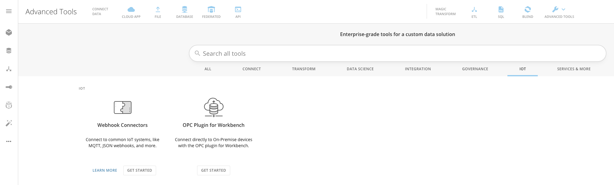
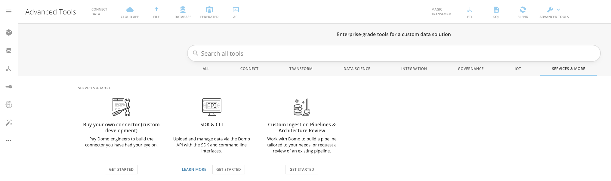

The IoT quick filter shows all of the options you have for connecting to IoT and on-premise devices, such as:

* Webhook Connectors
* OPC Plugin for Workbench

Services & More
---------------

The Services & More quick filter shows all of the options you have for purchasing Domo custom services, such as:

* Buy your own Connector (custom development)
* SDK & CLI
* Custom Ingestion Pipelines & Architecture Review

