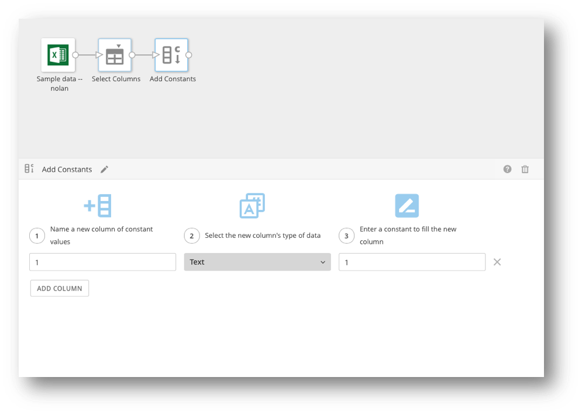
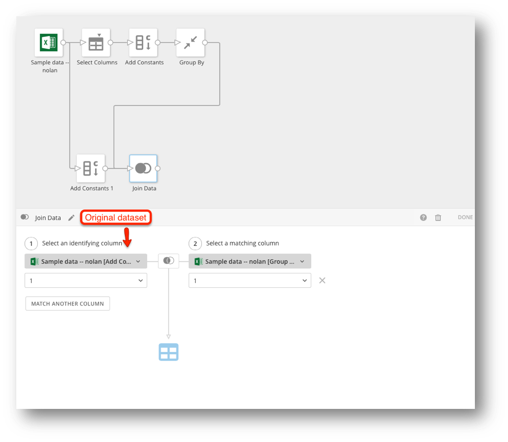
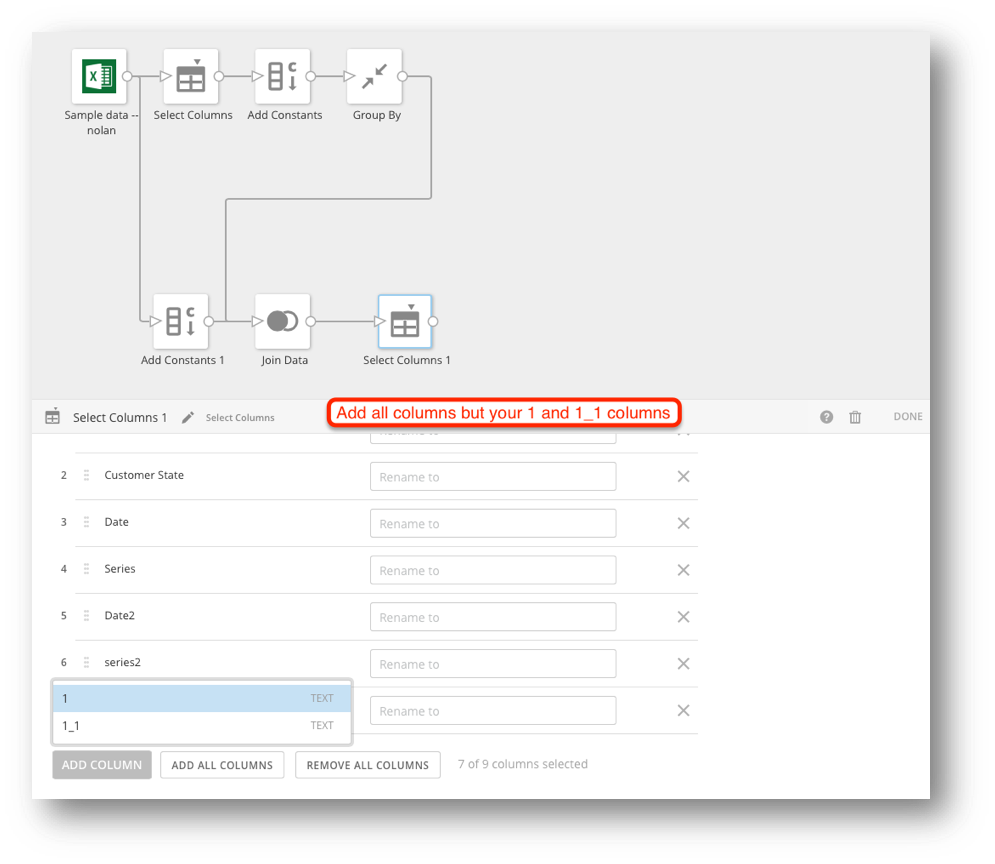
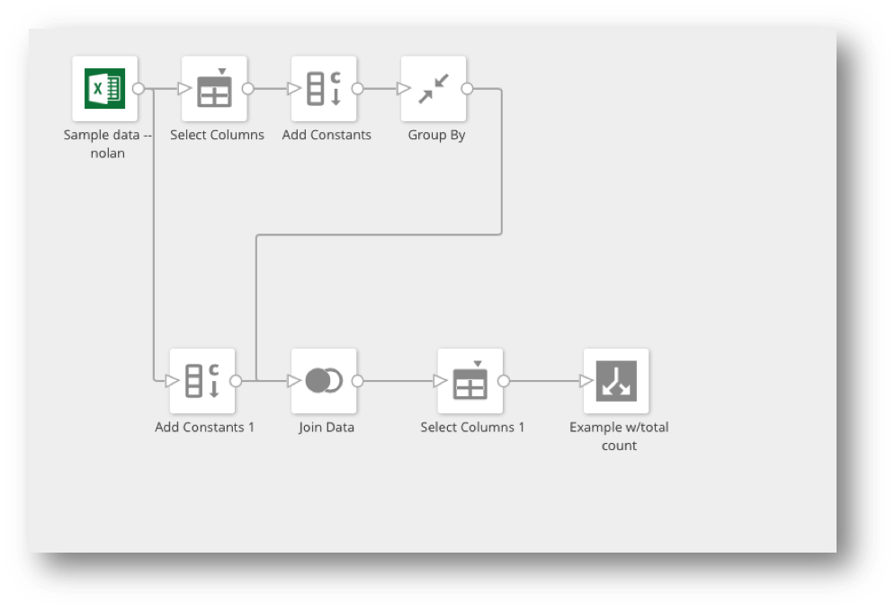

Intro
-----

If you try to use a aggregated value with a non-aggregated value using Beast Mode you may not get the expected results. However, you *can* do this using a DataFlow. 

Solution Details and Steps
--------------------------

**To solve this problem,**

##### MySQL

`SELECT *, (SELECT COUNT(`series`) FROM input_dataset) AS ‘Total Count’ FROM input_dataset`

##### RedShift

`SELECT *,(SELECT COUNT(“series”) FROM input_dataset) AS “Total Count” FROM input_dataset`

##### Magic ETL

1. Create a new Magic ETL.
2. Use the **Select Columns** tile to filter down to one column. (Any filtering needed should be done before this step.)

3. Use **Add Constants** to create a new column with the value of 1.  
 This will be used to group by and join on later.

4. Use a **Group By** tile to group by your column 1 and aggregate your column.

5. From your original input create a new path going to **Add Constants**.
6. Create another column with the constant value of 1.  
 This will be used to join your data.

7. Use a **Join Data** tile to join your two paths.  
 You should join on your two constant columns (1).

8. Use a **Select Columns** tile to remove your two constant values columns (1 & 1\_1).

9. Create output.

In your card you can now use this new column as a comparison:  
   
 `CASE WHEN `series` = ‘text’ THEN `value` END / `Total Count``

