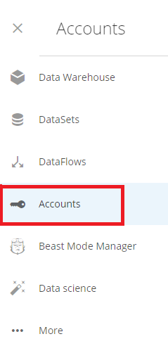
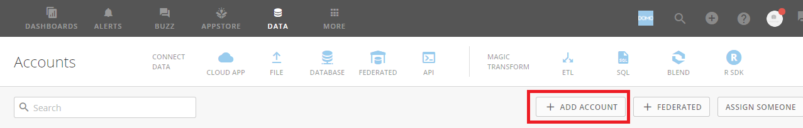
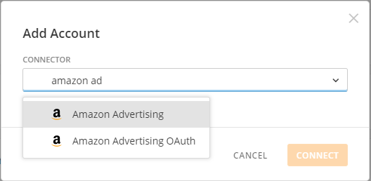
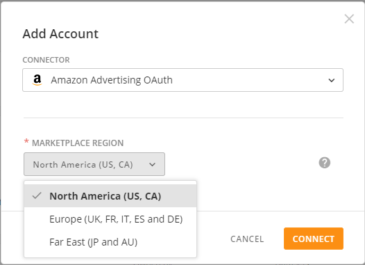
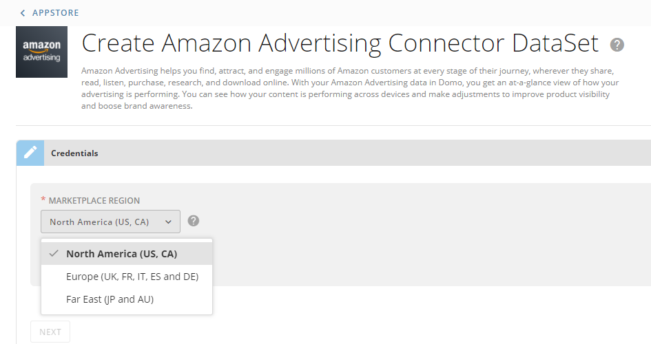
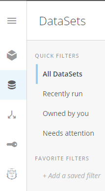

Intro
-----

Amazon Advertising connects your brand to Amazon customers wherever they share, read, listen, purchase, research and download online, across devices. Use Domo's Amazon Advertising connector to retrieve entities reports, performance reports, and portfolio listings. To learn more about the Amazon Advertising API, visit their page (<https://advertising.amazon.com/about-api>).

You connect to your Amazon Advertising account in the Data Center. This topic discusses the fields and menus that are specific to the Amazon Advertising connector user interface. General information for adding DataSets, setting update schedules, and editing DataSet information is discussed in [Adding a DataSet Using a Data Connector](/s/article/360042926274).

Prerequisites
-------------

To connect to your Amazon Advertising account and create a DataSet, you must have your Amazon credentials (email address or phone number and password).

#### How to create a new Amazon Advertising Account?

**To add an Amazon Advertising account to Domo from the Accounts view:**

1. Navigate to the **Accounts** section of the **Data Center** by clicking on the Accounts icon in the left-hand pane in the Data Center.

2. In **Accounts**, click **Add Account**. 

3. Select the desired Amazon Advertising connector and click **Connect**.

4. Select the region of the Amazon marketplace you want to access, and click **Connect**.

5. An Amazon login window will appear. Enter your Amazon credentials and log into your Amazon account.

6. An entry for the new Amazon Advertising account will appear in the **Accounts** view listing.

**To add an Amazon Advertising account to Domo by adding a DataSet and entering new account information:**

1. While creating a new Amazon Advertising account, you need to select the region of the Amazon marketplace you want to access and click **Connect**. 

2. An Amazon login window will appear. Enter your Amazon credentials and log into your Amazon account.

3. As you add the Amazon Advertising account through the connector, an entry for the new account appears automatically in the **Accounts** view. 

#### How to associate my newly created Amazon Advertising account with an existing dataset?

Associating a newly created Amazon Advertising account with the existing DataSet:

1. Visit the **DataSets**page in the Data Center. 

2. Locate your existing DataSet that you want to associate with a new Amazon Advertising account.

3. The DataSet details will appear.

4. Click **Settings** tab. You will be redirected to the Connector's Credentials section.

5. Here, you can select your new Amazon Advertising account if it's already created, or you can create a new account to associate with your selected DataSet. 

6. Click **Save**.

Connecting to Your Amazon Advertising Account
---------------------------------------------

This section enumerates the options in the Credentials and Details panes in the Amazon Advertising Connector page. The components of the other panes in this page, **Scheduling** and **Name & Describe Your DataSet**, are universal across most connector types and are discussed in greater length in [Adding a DataSet Using a Data Connector](/s/article/360042926274).

### Credentials Pane

The Domo Amazon Advertising Connector uses OAuth to connect, so there is no need to enter credentials within Domo. Click **Connect** (or select **Add Account** if you have existing Amazon Advertising accounts in Domo) to open the Amazon OAuth screen where you can enter your Amazon email address and password. Once you have entered valid Amazon credentials, you can use the same account any time you go to create a new Amazon Advertising DataSet. You can manage connector accounts in the **Accounts** tab in the Data Center. For more information about this tab, see [Managing User Accounts for Connectors](/s/article/360042926054).

**Note:** If you are already logged into Amazon when you connect in Domo, you are authenticated automatically when you click **Add account**. If you want to connect to an account that is different from the one you are logged into, you must first log out of the current Amazon account.

### Details Pane

This pane contains a primary **Reports** menu, along with various other menus which may or may not appear depending on the report type you select.

| Menu | Description |
| --- | --- |
| Profile | Select the profile you want to retrieve data for. |
| Report | Select the Amazon Advertising report you want to run. The following reports are available:

|  |  |
| --- | --- |
| Entities Reports | Retrieves a list of various entities like adGroups, campaigns, negative keywords etc, for the given advertising type. |
| Performance Report | Returns details about the performance of adGroups, campaigns, productAds, etc. for the given advertising type. |
| List Portfolios | Retrieves a list of portfolios. |

 |
| Advertising Type | Select whether you want to retrieve data for brands, products, displays, or DSP campaigns. |
| Record Type | Select the record type you want to retrieve.  |
| State filters | Select desired state filters. |
| Tactic for Specified Advertising Filter | Select the advertising tactic you want to filter your data by.  |
| Segment by Search Terms | Select whether you want to break down your report by search term. |
| Segment by Placements | Select whether you want to break down your report by placement. |
| Metrics | Select all the metrics you want to pull data for. |
| Dimensions | Select the dimensions to retrieve data for. |
| DSP Report Type | Select the DSP report type to retrieve data for. |
| DSP Metrics | Select the DSP metrics you want to pull data for. |
| Import Type | Select the import type for your data. Import types are as follows:* **Delta**. This import type updates the data for the last 14 days for each run. Dates selected will be only be used on the first run. Select 'Append' as your update mode. For more information about update modes, see [Adding a DataSet Using a Data Connector](/s/article/360042926274).
* **Rolling**. This import type keeps a rolling window of a specified number of days of data. You can select a specific time period or use relative dates. When using this import type, be sure to select "Replace" as your update mode. For more information about update modes, see [Adding a DataSet Using a Data Connector](/s/article/360042926274).
* **Specific**. This import type retrieves data for specific dates for every run. This import type is not recommended.
 |
| Date Selection | Select the date format for your data. |
| Single Date | Select whether the report data is for a specific date or for a relative number of days back from today. |
| Specific Date | Select the specific date using the date selector. |
| Relative Date | Enter the number of days back that you would like to get data for in the ****Days Back**** field. Specify either today or 0, yesterday or 1, or today-7 or 7 to get data for 7 days into the past. |
| Date Range | Select the specific or relative date range. |
| Start Date - Specific | Select the first date in your date range using the date selector. |
| End Date - Specific | Select the last date in your date range using the date selector. |
| Start Date - Relative | Enter the number of days back that you would like to get data from (start day). Combine with ****************End Date**************** to create a range of represented days.
For example, if you entered 10 for ****************Start Date**************** and 5 for ****************End Date****************, the report would contain data for 10 days ago up until 5 days ago. |
| End Date - Relative | Enter the number of days back that you would like to get data to (end day). Combine with ****************Start Date****************to create a range of represented days.
For example, if you entered 10 for ****************Start Date**************** and 5 for ****************End Date****************, the report would contain data for 10 days ago up until 5 days ago. |
| Time Period | Specify the time period that you would like to receive data for. |

### Other Panes

For information about the remaining sections of the Connector interface, including how to configure scheduling, retry, and update options, see [Adding a DataSet Using a Data Connector](/s/article/360042926274).

Troubleshooting
---------------

#### I received an error "An unknown scope was requested" when authenticating my Amazon account. Or, when I try to create an account it opens an OAuth window, closes it, and fails with the message "There was a problem creating your account. Please try again." What can I try?

Please verify that your app is whitelisted with Amazon. Find your "Get started with the Amazon Advertising API" email and make sure you have accepted the Amazon Advertising API License Agreement.

