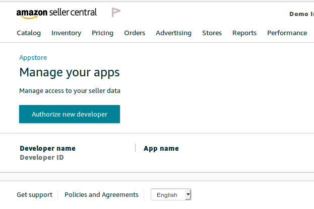
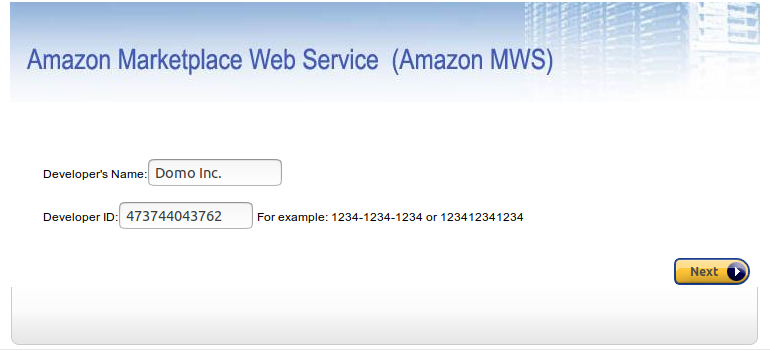
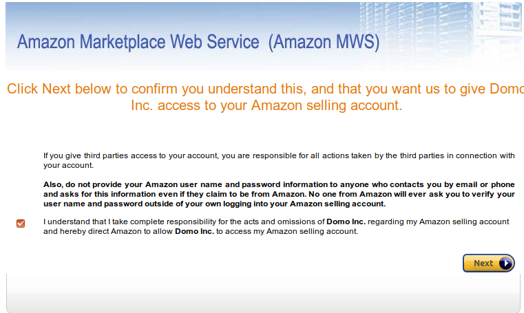
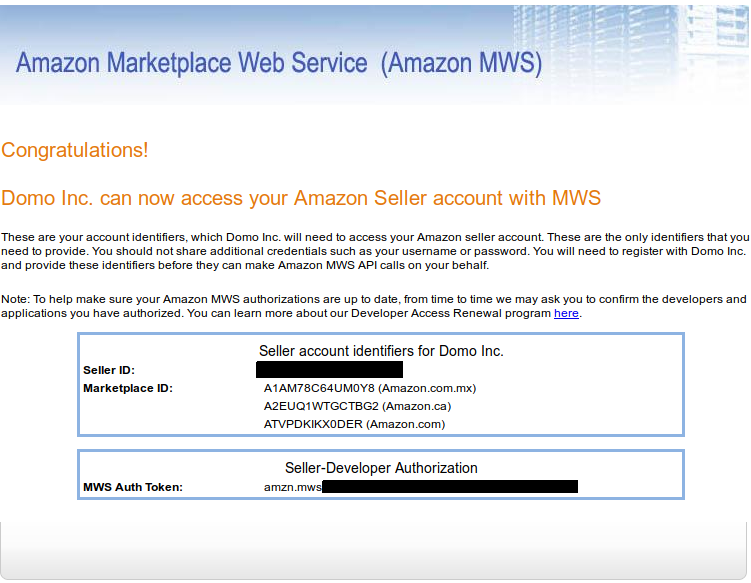

  

**ATTENTION:** This connector is being **deprecated** on September 12, 2022. On that date, MWS will no longer be able to connect to Amazon to obtain data for orders, merchant fulfillment, and reports. If you are currently using the MWS connector, you need to migrate to Domo's Selling Partner (SP) connector on or before September 12, 2022 to continue to get Amazon Marketplace data. For more information on this deprecation and how it affects your organization, as well as the link to the Selling Partner connector, see the [Deprecation Announcement](https://dojo.domo.com/main/discussion/55680/connector-deprecation-announcement-amazon-marketplace-web-service-mws) in the Dojo.

Intro
-----

Amazon Marketplace Web Service (Amazon MWS) is an integrated Web service API that helps Amazon sellers programmatically exchange data on listings, orders, payments, reports, and more. By using the Domo Amazon Marketplace Web Services Connector, sellers can increase selling efficiency, reduce labor requirements, and improve response time to customers. To learn more about the Amazon MWS API, visit their page ([https://developer.amazonservices.com/](https://developer.amazonservices.com/ "https://developer.amazonservices.com/")).

You connect to your Amazon MWS account in the Data Center. This topic discusses the fields and menus that are specific to the Amazon MWS connector user interface. General information for adding DataSets, setting update schedules, and editing DataSet information is discussed in  [a DataSet Using a Data Connector](/s/article/360042926274 "Adding a DataSet Using a Data Connector").

|  |  |
| --- | --- |
| **Primary Use Cases** | Use this connector to pull data about Amazon products sales, inventory, and fulfillment. |
| **Primary Metrics** | * Sales Performance
* Inventory Numbers
* Canceled Orders
 |
| **Primary Company Roles** | * Sales
* Marketing
* C-Suite
* Warehousing
 |
| **Average Implementation Time** | This depends on the report.
For the "Orders - Order Items" report, it could take from 1 day to several months to get all data. However, you can start building KPIs after the first day.
The other reports take at most a few hours. Only run these reports once per day. |
| **Ease of Use (on a 1-to-10 scale with 1 being easiest)** | 9 |

Best Practices
--------------

* For most reports, be conservative on date ranges. Only pull the data you need.
* Know that the "Orders - Order Items" report will take 22 hours to run, every time. Make sure you set this report to "Append," never to "Replace." It will pull 1 day of the current data. Then, if it has time left in the 22-hour window, it will begin to get data, starting with now and going backwards, and will stop when it can't get any more data in 22 hours. The next day it runs to get the one day of the current append, and then starts again to fill in the historical data.
* Amazon has very heavy throttles. The details of each throttle limit are in the API docs.
* For "Orders & Order Items," ONLY make 1 DataSet each for each Marketplace (the **Geo** **Location** parameter in authentication - US, IT, UK, etc.). If you make more than that, the DataSets will fight over the API calls and you won't get data as fast.
* Don't go back in backfill for more than a few years. It will take a long time to get that data, and it probably isn't relevant to get sales on Amazon products from 3 years ago.
* These reports ABSOLUTELY have to be set to "Append." "Replace" does not behave well in this model.

Prerequisites
-------------

To connect to your Amazon MWS account and create a DataSet, you must have the following:

* An MWS Auth Token
* An Amazon Seller ID

To find your Amazon Auth Token and Seller ID, do the following:

1. Navigate to <https://sellercentral.amazon.com/apps/manage> and log in.
2. Click **Authorize New Developer**.  
  

3. Register Domo Inc. with developer ID "181964952887" for JP or developer ID "473744043762" for CA, US, and MX then click **Next**.   
  

4. Check the box and click **Next**.  
  

You are taken to a screen with your Seller ID, the MWS Auth Token, and the Marketplaces you have access to. You will need all of these to authenticate in the **Credentials** pane. 

Connecting to Your Amazon MWS Account
-------------------------------------

This section enumerates the options in the  **Credentials**  and  **Details**  panes in the Amazon MWS Connector page. The components of the other panes in this page, **Scheduling** and **Name & Describe Your DataSet**, are universal across most connector types and are discussed in greater length in [Adding a DataSet Using a Data Connector](/s/article/360042926274 "Adding a DataSet Using a Data Connector").

### Credentials Pane

This pane contains fields for entering credentials to connect to your Amazon MWS account. The following table describes what is needed for each field:  

| Field | Description |
| --- | --- |
| Marketplace | Select the Amazon Marketplace where you sell your products. |
| Seller ID | Enter your Amazon Seller ID. For information about obtaining a Seller ID, see "Prerequisites," above. |
| MWS Auth Token | Enter your MWS Auth Token. For information about obtaining an Auth Token, see "Prerequisites," above. |

Once you have entered valid Amazon MWS credentials, you can use the same account any time you go to create a new Amazon MWS DataSet. You can manage connector accounts in the **Accounts** tab in the Data Center. For more information about this tab, see [Managing User Accounts for Connectors](/s/article/360042926054 "Managing User Accounts for Connectors").

### Details Pane

This pane contains a primary **Reports** menu, along with various other menus which may or may not appear depending on the report type you select.

| Menu | Description |
| --- | --- |
| Report | Select the Amazon MWS report you want to run. The following reports are available:

|  |  |
| --- | --- |
| Fulfillment Inbound Shipment - Inbound Shipment Items | Returns a list of items in a specified inbound shipment, or a list of items that were updated within a specified time frame. |
| Fulfillment Inbound Shipment - List Inbound Shipments | Returns a list of inbound shipments based on criteria that you specify. |
| Fulfillment Inventory - Inventory Supply | Returns a list of inventory supply from a specific date. |
| Fulfillment Outbound Shipment - Fulfillment Orders | Return lists shipments outbound fulfilled by Amazon/Seller. |
| Orders - Order Items | Returns line item level data for orders between the dates you specify. This report can only be run once per day. The update mode will be set to append by the connector. |
| Order - Order Items by inputData - BETA | Returns line item level data for orders based off of the OrderIDs in the input DataSet you specify. The update mode will be set to append by the connector. |
| Orders - Orders | Returns orders created or updated during a time frame that you specify. This report can only be run once per day. The update mode will be set to append by the connector. |
| Orders - Order Items Upsert | Returns line item level data for orders created since the date you specify. The connector will automatically get the latest data up to 15 minutes ago. This report can be run as frequent as every 15 minutes. The update mode will be set to merge by the connector. |
| Orders - Orders Upsert | Returns orders updated since the date you specify. The connector will automatically get the latest data up to 15 minutes ago. This report can be run as frequent as every 15 minutes. The update mode will be set to merge by the connector. |
| Products - Competitive Prices By SKU | Returns the current competitive price of a product, based on SellerSKU. |
| Products - List Matching Products | Returns a list of products and their attributes, based on a search query. |
| Products - My Price for SKU | Returns pricing information for your own offer listings, based on SellerSKU. |
| Products - Product Categories for SKU | Returns the parent product categories that a product belongs to, based on SellerSKU. |
| Recommendations - List Recommendations | Returns your active recommendations for a specific category or for all categories for a specific marketplace. |
| Reports - Get Report | Returns the contents of a report and the Content-MD5 header for the returned report body. |
| Reports - List Reports | Returns a list of reports that were created in the previous 90 days. |
| Reports - Schedule List | Returns a list of order report requests that are scheduled to be submitted to Amazon MWS for processing. |

 |
| Data Selection Mode | Select the method to use to retrieve reports when "Reports - Get Report" is selected in the **Report** dropdown menu. * With the **Easy** method, you select your report type from a dropdown menu. The latest version of the selected type will be retrieved automatically.
* With the **Advanced** method, you enter a report ID into a text field.

Both of these report types require that the report is generated and available in Amazon MWS. |
| Orders Report Dataset ID | Enter your Domo dataset ID(GUID) for your Orders Report. It is located in the dataset URL. 
Example: <https://customer.domo.com/datasources/>**aaaaaaaa-bbbb-cccc-dddd-eeeeeeeeeeee**/details/settings |
| Report Type | Select the desired report type. Reports must already be generated and available in Amazon MWS.  |
| Report Detail Filter (for "Easy" data selection method) | Select the desired report detail filter. |
| Report ID | Enter the generated Report ID for the report you want to import from Amazon MWS. You may also enter the ReportType enumeration value from the Amazon MWS [API documentation](https://developer.amazonservices.com/ "https://developer.amazonservices.com/").  |
| Report Detail Filter (for "Advanced" data selection method) | Enter the column you want to flatten. Any column that returns "List" can be used. Try running the report once without this field, then select the column name from the header you want to flatten in the preview pane. |
| CSV Report Quote Character | Select the quote character for your CSV report in Amazon MWS. Double quotes are the default. If your report data contains double quotes, try selecting the **Null Character** option. |
| Recommendation Category | Select the desired recommendation category for your "List Recommendations" report. |
| Select Statuses | Select the status you want to retrieve data for. You can select up to 10 statuses. |
| SKU Selection Method | Select the method you want to use to enter SKUs. If you select **All**, all available SKUs are returned from your Inventory Supply. If you select **Discovery**, SKUs are shown dynamically based on the query date selected. If you select **Advanced**, you will supply the list of SKUs yourself.    |
| Date Report Type | Select the method to use to receive data for date-based reports. 
**Current** retrieves data for the last 14 days and appends new data after each run. 
**Historical** receives data from the date fields below up to 15 days ago. Each run backfills 14 days at a time starting with the newest data and moving backwards in time. |
| Duration | Select whether you want to pull data for a specific date or a date range.  |
| Report Date  | Select whether the report data is for a specific date or for a relative number of days back from today.  |
| Specific Date  | Select the date for the report.  |
| Days Back | Enter the number of past days that should appear in the report. Specify either today (or 0), yesterday (or 1), or today-7 (or 7) to get data for 7 days into the past.   |
| Start Date | Specify whether the first date in your date range is a specific or relative date. You select the last date in your range in **End Date**.  |
| End Date | Specify whether the second date in your date range is a specific or relative date. You select the first date in your range in **Start Date**.   |
| Specific Start Date | Select the first date in your date range.  |
| Specific End Date | Select the second date in your date range.  |
| Days Back to Start From | Enter the number of the farthest day back that should be represented in the report. Specify either today (or 0), yesterday (or 1), or today-7 (or 7) to get data for 7 days into the past. Combine with **Days Back to End At** to create a range of represented days.
For example, if you entered 10 for **Days Back to Start From** and 5 for **Days Back to End At**, the report would contain data for 10 days ago up until 5 days ago. |
| Days Back to End At | Enter the number of the most recent day back that should be represented in the report. Specify either today (or 0), yesterday (or 1), or today-7 (or 7) to get data for 7 days into the past. Combine with **Days Back to Start From** to create a range of represented days.
For example, if you entered 10 for **Days Back to Start From** and 5 for **Days Back to End At**, the report would contain data for 10 days ago up until 5 days ago. |
| Select Query Start Date | Select the start date for your query. |
| Query Date Type | Select the date type for the query. **Created** returns data based on the creation date. **Last Updated** will return data based on the date of the last update. |
| Select Seller SKUs | Select the seller SKUs you want to retrieve data for. You can select up to 100 SKUs.

**Tip:** If you want to bring in more than 100 SKUs, then you will need to select advanced mode and paste the SKU list, comma separated. SKUs can be obtained from the Inventory Report (`_GET_FLAT_FILE_OPEN_LISTINGS_DATA_`). To choose that report in the Amazon MWS connector, select **Reports** > **Get Reports**. Then, select Inventory Report if using easy mode or paste in the name of the report (`_GET_FLAT_FILE_OPEN_LISTINGS_DATA_`) if using advanced mode. For more information on Amazon report types, see [https://docs.developer.amazonservices.com/en\_US/reports/Reports\_ReportType.html](https://docs.developer.amazonservices.com/en_US/reports/Reports_ReportType.html "https://docs.developer.amazonservices.com/en_US/reports/Reports_ReportType.html")

 |
| Seller SKU List | Enter the list of SKUs you want to retrieve data for, separated by commas.  |
| Continue on Invalid SKU Error? | Select **Skip Invalid SKUs**if you want to continue your DataSet import even if invalid SKUs are discovered. Select **Warn about Invalid SKUs** if you want the import to stop and provide an error message if invalid SKUs are discovered.  |
| Query | Enter a text-based query to pull data for products matching that query. |
| Select Recommendation Categories | Select a Recommendation Category to retrieve data for. If you select no categories, data is retrieved for all categories. |
| Report ID | Enter the Report Type or the generated Report ID you want to get data for. Specific Report IDs can be retrieved using the **List Reports** report.  |

### Other Panes

For information about the remaining sections of the connector interface, including how to configure scheduling, retry, and update options, see [a DataSet Using a Data Connector](/s/article/360042926274 "Adding a DataSet Using a Data Connector").

Troubleshooting
---------------

If you run into problems with the "Get Report" report, make sure the report you are trying to pull has been generated in Amazon MWS.

FAQ
---

##### My Amazon store sells in multiple marketplaces across the world. How do I get all of my orders, inventory and other important Amazon MWS data?

You will need to create an account for each marketplace. We recommend naming the accounts with the marketplace location: for example, 'United States' or 'Italy'. Once you have created the needed accounts, create connector datasets using each account to receive the data that matters to you. If you would like to join the data, use Domo's Magic ETL or Dataflow tools to bring the different marketplaces together.

##### How should I configure the Orders or Order Items report?

Due to API limitations, the connector can only be set up with Append mode. To set up the connector with Append mode:

1. Select the desired start date for your historic backfill, and use a relative end date with a value of 'yesterday' or '1'.
2. Set the connector to only run once per day.

The connector will get the most current day's data, then start getting backfill data from the most recent data to older, one day at a time. The connector will run up to 24 hours, and then will remember where it left off in the historical backfill. The next day, when the connector runs again, it will get the most current day's data appended to it first, then pick up where it left off with the historical backfill. This pattern will continue until the connector has received all data for the historical backfill. Once all the backfill is completed, it will continue to append the most current day's data, one day at a time. If the connector doesn't run or is unsuccessful during a run, it is designed to receive the data it missed in both the current and historical backfill.

##### Can Domo schedule Amazon MWS Reports on my behalf?

No. The connector is not able to schedule Amazon MWS Reports on your behalf in the Amazon MWS API. The connector will deliver all reports in the discovery drop-down for your convenience, but you may receive a "Report not generated" error if the report is not generated. The error message will contain the name of the report in Amazon MWS that needs to be generated before the connector can run successfully. Generate the report and add it to the report scheduler in your Amazon MWS dashboard and try again. The connector report 'Reports - Schedule List' lists all scheduled reports.

