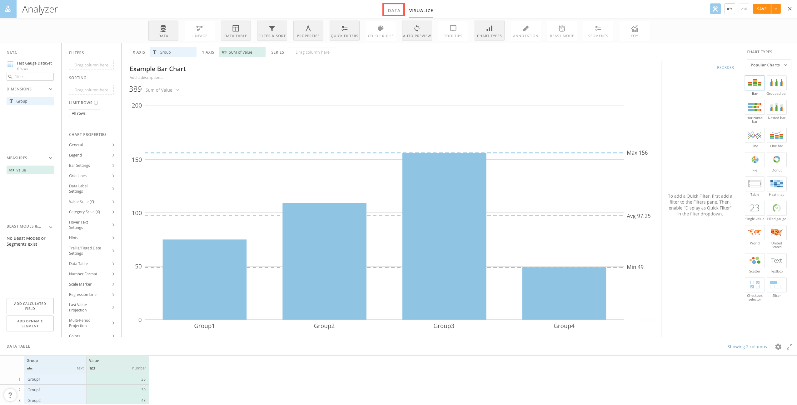
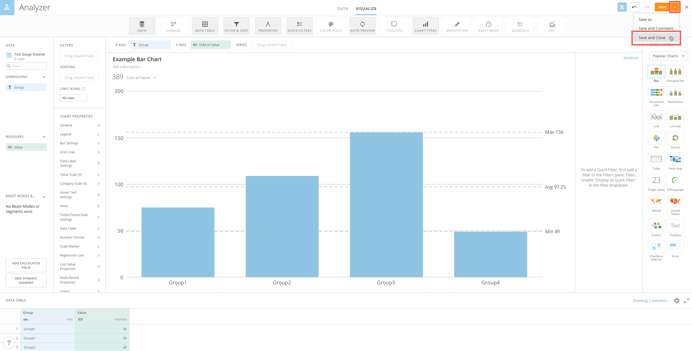
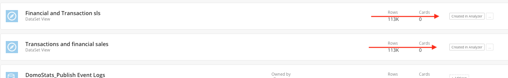

Intro
-----

DataSet Views have been integrated inside of Analyzer, allowing for light-weight ETL data changes while visualizing the data. You can now do the following, all without leaving Analyzer:

* Join another DataSet.
* Clean up the data by renaming columns, removing columns, and changing the data type.
* Create nested Beast Modes.

For more information on Analyzer, see [DataSet Views](/s/article/360046074774).

Using DataSet Views inside of Analyzer
--------------------------------------

1. Edit an existing Card or create a new Card.
2. Open the Analyzer.
3. Click the **Data** tab.  
  

4. Make the desired changes to the DataSet.
5. Click the **Visualize** tab.  
  

6. Design the Card with the updated DataSet.
7. When finished with the Card, select **Save and Close** from the drop-down menu.  
  

Views Custom Grant
------------------

To help Admins and Major Domo’s with Data Governance in their instance we’ve added a new custom grant to give them more control on who can create DataSet Views in Analyzer.

We’ve now added a new grant in the Admin > Roles section, which allows for Admins to enable or disable users' capabilities to create DataSet Views in Analyzer.

When any user in your instance has "Edit Data" they have permissions to create a DataSet View in Analyzer. By deselecting this new grant you will remove users' permission from being able to create new DataSet Views in Analyzer. Users will only be able to view the DataSet in Analyzer and not make any changes to it.

This new grant is tied with "Edit Data", when users have "Edit Data" enabled, the new grant to create DataSet views will also be enabled. You must disable it to remove the permission.

Analyzer DataSet Tags
---------------------

To help with tracking DataSet Views created in Analyzer, we also auto-tag any DataSet View that is now created in Analyzer. You can easily filter to this tag in the Data Center.  
  

FAQs
----

#### How do Custom Roles work with DataSet Views in Analyzer?

User grants apply to DataSet Views the same as other Domo features. A user must have "Can Edit" DataSet to be able to create or make edits to a DataSet View in Analyzer. If they do not have the "Edit Data" grant then the user will have view only permission to the DataSet Data tab in Analyzer. They will not be able to make any edits or changes to the DataSet, only view it.

#### How does PDP work with DataSet Views in Analyzer?

PDP works the same way it does on other DataSets. When row level security is applied users will only be able to see the rows they have access to in the Data tab in Analyzer. When they create a DataSet View from a DataSet that has PDP applied to it then the PDP automatically gets applied to the new DataSet View.

#### Are creation and edits to DataSet Views in Analyzer tracked in the Audit Log?

Yes, when a new DataSet View is created in Analyzer, an Audit Log event is added to the Activity Log. The log indicates the creation of a new DataSet and who created it. When edits are made to the DataSet View an additional audit event is added to the audit log.

