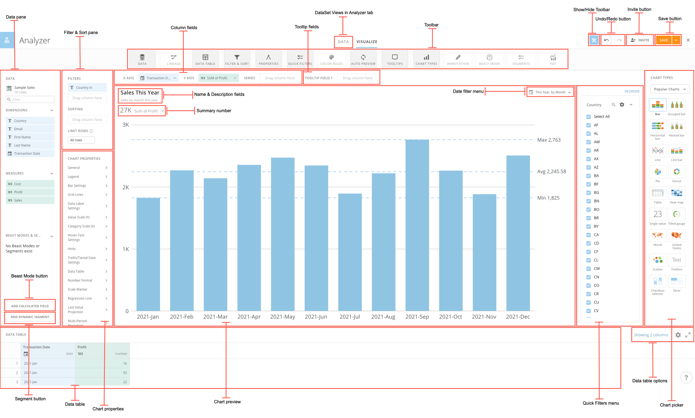

---
    title: Analyzer Layout
    url: https://domo-support.domo.com/s/article/360042924034
    linked_kbs:  ['[https://domo-support.domo.com/s/knowledge-base/](https://domo-support.domo.com/s/knowledge-base/)', '[https://domo-support.domo.com/s/](https://domo-support.domo.com/s/)', '[https://domo-support.domo.com/s/topic/0TO5w000000ZamoGAC](https://domo-support.domo.com/s/topic/0TO5w000000ZamoGAC)', '[https://domo-support.domo.com/s/topic/0TO5w000000ZaoNGAS](https://domo-support.domo.com/s/topic/0TO5w000000ZaoNGAS)', '[https://domo-support.domo.com/s/topic/0TO5w000000ZaoUGAS](https://domo-support.domo.com/s/topic/0TO5w000000ZaoUGAS)', '[https://domo-support.domo.com/s/topic/0TO5w000000ZapBGAS](https://domo-support.domo.com/s/topic/0TO5w000000ZapBGAS)', '[https://domo-support.domo.com/s/article/360043438973](https://domo-support.domo.com/s/article/360043438973)', '[https://domo-support.domo.com/s/article/360043428673](https://domo-support.domo.com/s/article/360043428673)', '[https://domo-support.domo.com/s/article/360043428713](https://domo-support.domo.com/s/article/360043428713)', '[https://domo-support.domo.com/s/article/360042924174](https://domo-support.domo.com/s/article/360042924174)', '[https://domo-support.domo.com/s/article/360043428733](https://domo-support.domo.com/s/article/360043428733)', '[https://domo-support.domo.com/s/article/360043428853](https://domo-support.domo.com/s/article/360043428853)', '[https://domo-support.domo.com/s/article/360042924074](https://domo-support.domo.com/s/article/360042924074)', '[https://domo-support.domo.com/s/article/360043428813](https://domo-support.domo.com/s/article/360043428813)', '[https://domo-support.domo.com/s/topic/0TO5w000000ZanAGAS](https://domo-support.domo.com/s/topic/0TO5w000000ZanAGAS)', '[https://domo-support.domo.com/s/article/4403089503383](https://domo-support.domo.com/s/article/4403089503383)', '[https://domo-support.domo.com/s/article/360042924834](https://domo-support.domo.com/s/article/360042924834)', '[https://domo-support.domo.com/s/article/360043428753](https://domo-support.domo.com/s/article/360043428753)', '[https://domo-support.domo.com/s/article/360043438893](https://domo-support.domo.com/s/article/360043438893)', '[https://domo-support.domo.com/s/article/360042923934](https://domo-support.domo.com/s/article/360042923934)', '[https://domo-support.domo.com/s/article/360043430513](https://domo-support.domo.com/s/article/360043430513)', '[https://domo-support.domo.com/s/article/360043428833](https://domo-support.domo.com/s/article/360043428833)', '[https://domo-support.domo.com/s/topic/0TO5w000000ZaodGAC](https://domo-support.domo.com/s/topic/0TO5w000000ZaodGAC)', '[https://domo-support.domo.com/s/topic/0TO5w000000ZaoeGAC](https://domo-support.domo.com/s/topic/0TO5w000000ZaoeGAC)', '[https://domo-support.domo.com/s/article/360042924034](https://domo-support.domo.com/s/article/360042924034)', '[https://domo-support.domo.com/s/topic/0TO5w000000ZaoUGAS/analyzer](https://domo-support.domo.com/s/topic/0TO5w000000ZaoUGAS/analyzer)', '[https://domo-support.domo.com/s/article/360043429933](https://domo-support.domo.com/s/article/360043429933)', '[https://domo-support.domo.com/s/article/360043429953](https://domo-support.domo.com/s/article/360043429953)', '[https://domo-support.domo.com/s/article/360042925494](https://domo-support.domo.com/s/article/360042925494)', '[https://domo-support.domo.com/s/article/360043429913](https://domo-support.domo.com/s/article/360043429913)', '[https://domo-support.domo.com/s/article/4408174643607](https://domo-support.domo.com/s/article/4408174643607)', '[https://domo-support.domo.com/s/login/](https://domo-support.domo.com/s/login/)']
    article_id: 000004646
    views: 2,659
    created_date: 2022-10-24 22:18:00
    last updated: 2022-10-24 22:40:00
    ---

Intro
-----

In the Analyzer view for a Visualization card (sometimes called the "Card Builder" or "Edit" view), you customize the appearance of your charts and apply DataSet columns to a chart. You can also apply and edit filters, chart properties, sorts, chart name and description, as well as view and manipulate the data table for the chart.

The Analyzer appears as part of the workflow for creating a Visualization card. For more information, see [Visualization Card Building Part 1: Powering Your Card](/s/topic/0TO5w000000ZapBGAS "KPI Card Building Part 1: Powering Your Card"). 

Analyzer is only accessible by users with "Admin," "Privileged," or "Editor" default security roles OR a custom security role with the "Edit Cards" privilege enabled. For more information about default security roles, see [Managing Roles](/s/article/360043438973 "Security Role Reference").

For a high-level overview of the Analyzer, see [Analyzer Overview](/s/article/360043428673 "Analyzer Overview").

**Video - Interface Overview - Analyzer**

 

Analyzer Interface
------------------

The following screenshot shows the Analyzer as it might appear for a typical Stacked Bar chart. For more information, see [Visualization Card Building Part 2: The Analyzer](/s/topic/0TO5w000000ZaoUGAS "KPI Card Building Part 2: The Analyzer").

You can learn more about these components in the following table:

| Name | Description |
| --- | --- |
| Data pane | Provides access to data configuration options for the chart, including the following:* **DataSet picker**. Lets you change the DataSet powering this chart.
* **Column filter**. Lets you quickly locate specific columns (dimensions and measures) in the DataSet to use in this chart. If you have created calculated columns for this chart using Beast Mode, you can use the filter to find those columns also.
* **Available columns**. Shows the columns from this DataSet that you can apply to your chart. These are divided into **Measures** (columns that contain items with a "value" data type) and **Dimensions** (columns that contain items with "string," "date," and "date-time" data types). If you have created calculated columns for this chart using Beast Mode, those columns appear here. You apply columns to your chart by dragging and dropping them from this area into the column fields above the chart preview area.
If the column names are too long to fit, you can expand the pane by clicking and dragging on the border of the right side of the pane.
For more information about data types, see [Applying DataSet Columns to Your Chart](/s/article/360043428713 "Understanding Chart Data").
 |
| Name & Description fields | Lets you change the name/description of the Visualization card that contains this chart (the name of the powering DataSet is used by default). This is the name and description that appears at the top of the Visualization card in the page(s). For more information about naming a Visualization card, see [Editing the Name or Description of a Visualization Card](/s/article/360042924174 "Editing the Name or Description of a KPI Card").  |
| Filter & Sort pane | Lets you apply filters to filter the data in columns in your chart. For more information, see [Sorting the Data in Your Chart](/s/article/360043428733 "Adding Filters to Your Chart"). |
| Toolbar | Provides access to buttons that let you show or hide various tools in the Analyzer interface. You can show or hide the Toolbar itself using the ^ button near the top center of the Analyzer window.
The buttons in the Toolbar include all of the following:

| Button | Description |
| --- | --- |
| Data | Shows/hides the **Data** pane for this chart. For more information about the options available in this pane, see the row for "Data pane" at the top of this table. |
| Lineage | Opens a window showing the lineage of DataSets feeding into the DataSet that powers this chart. For more information, see [Viewing the Lineage of a DataSet in Analyzer](/s/article/360043428853 "Viewing the Lineage of a DataSet in Analyzer"). |
| Data Table | Shows/hides the data table for this chart. This table shows all of the data powering this chart. You can apply filters and aggregations to columns in the data table; these filters are also applied to your chart preview. You can expand the data table pane by clicking and dragging the border at the top of the pane. |
| Filter & Sort | Shows/hides the **Filters & Sorting** panes for this chart. |
| Properties | Shows/hides Chart Properties available for this chart. |
| Quick Filters | Enables you to add Quick Filters to your chart. When you enable a Quick Filter, a pane appears for that filter in this card. Users viewing the card Details view can then quickly enable or disable filters for the card just by toggling the desired filters in the pane. For more information, see [Adding Filters to Your Chart - Applying Quick Filters](/s/article/360042924074 "Adding Filters to Your Chart"). |
| Color Rules | Shows/hides the Color Rules dialog for the chart. In this dialog you can set colors on specific columns on a chart. For more information, see [Setting Color Rules for a Chart](/s/article/360043428813 "Setting Color Rules for a Chart"). |
| Auto Preview | Lets you turn off automatic updating of the chart preview when changes are made, which could provide a faster editing experience, especially for very large cards. |
| Tooltips | Shows/hides the Tooltip Fields for the chart. |
| Chart Types | Shows/hides the chart type picker for this chart. You can expand the chart picker by clicking and dragging the border on the left side. |
| Annotation | Allows you to annotate on an item in the x-axis. |
| Beast Mode | Shows/hides the Beast Mode window for this chart. For more information, see [Beast Mode](/s/topic/0TO5w000000ZanAGAS "Transforming Data Using Beast Mode"). |
| Segments | Shows/hides the Segments window for this chart. For more information, see [Creating Segments in Analyzer](/s/article/4403089503383). |
| YOY | Shows/hides period-over-period options for this chart. For more information, see [Period-over-Period Charts](/s/article/360042924834). |

 |
| Column fields | Provide the means for applying DataSet columns to your chart. To apply columns, you drag them from the available columns region on the left side of the Analyzer into the appropriate fields in this area. These fields differ between chart types. For example, for a standard vertical Bar chart, **X Axis** and **Y Axis** fields would appear. You would drag a value column into the **Y Axis** field and a category column into the **X Axis** field. Your chart preview would then update to show how the chart would look with these columns applied. For more information, see [Applying DataSet Columns to Your Chart](/s/article/360043428713 "Applying DataSet Columns to Your Chart"). |
| Show/Hide Toolbar | Allows you to show or hide the Toolbar menu. |
| Undo/redo buttons | Allow you to undo a previous sequence of actions or redo actions you have undone. All actions in Analyzer are available for Undo and Redo, including applying Filters and Chart Properties, making date changes, changing chart types, etc. Keyboard shortcuts for Undo and Redo on Mac and Windows are also available (Command + Z/Command + Shift +Z , respectively, on Mac, and Ctrl + Z/Ctrl + Y on Windows).    |
| Summary number | Summarizes the data in the chart. Click the dropdown arrow to open an options menu for configuring the summary number. For more information, see [Configuring Your Chart Summary Number](/s/article/360043428753 "Configuring Your Chart Summary Number"). |
| Invite button | Lets you share this card with specified team members and invite them to join Domo, all in a single action. If you do not have share access for this card, the button only allows you to invite users, not share the card. For more information, see [Inviting Others to Join Domo](/s/article/360043438893 "Inviting Others to Join Domo"). |
| Date filter menu | Lets you choose a date range and grain for the data in this chart. If you have selected a Period-over-Period chart type, you can find options for configuring your chart here. For more information, see [Period-over-Period Charts](/s/article/360042924834 "Adding Filters to Your Chart"). |
| Save button | Lets you save changes you have made to this Visualization card.
Clicking **Save** simply saves changes made to the card. If you click the dropdown arrow to the right of the **Save** button, a few more options are available, as follows:* **Save As**. Lets you save your changes as a new card. When you choose this option you are prompted to enter a title and description as well as select the page where the new card should reside.
* **Save And Comment**. Lets you enter a comment about your changes when you save. Your comment is viewable with the revision in the [History view of the Details view](/s/article/360042923934 "Card Details View Layout") for this Visualization card.
* **Save and Close**. Saves your changes and closes the Analyzer, returning you to the Details view for the card.

If you choose **Save As** or **Save and Comment** for a card that does not have an alert set on the summary number, you are prompted to set an alert on it now. For more information about setting alerts, see [Creating a Custom Alert for a Visualization Card](/s/article/360043430513 "Creating a Custom Alert for a KPI Card"). |
| Beast Mode button | Lets you transform the data in your chart by creating new columns based on existing columns. For more information, see [Beast Mode](/s/topic/0TO5w000000ZanAGAS "Transforming Data Using Beast Mode"). |
| Segment button | Lets you create a dynamic segment to compare your segment against another group. For more information, see [Creating Segments in Analyzer](/s/article/4403089503383). |
| Data table | Shows you the table of all of the data being used in this chart. This table provides various options for manipulating the data; for example, you can filter rows, apply filters, change aggregations, etc. Any changes you make to the data in the data table are reflected in the chart preview. For more information, see [Understanding the Data Table in Analyzer](/s/article/360043428833 "Understanding the Data Table in Analyzer"). |
| Chart Properties | Displays Chart Properties available for this chart. You can edit various properties of the chart, such as number and date formatting, the number of value scale divisions, scale labels, and so on. For more information about setting chart properties, see [Chart Properties](/s/topic/0TO5w000000ZaodGAC "Chart Properties"). |
| Chart preview | Shows a preview of your chart. Appears only when all required columns have been applied. You can expand the chart preview pane by clicking and dragging any of the borders on the left, right, or bottom. For more information, see [Applying DataSet Columns to Your Chart](/s/article/360043428713 "Applying DataSet Columns to Your Chart"). |
| Data table options | Provides additional options for working with the data table, including showing and hiding columns, showing totals, showing raw data or data as it appears in the chart, and opening a full-screen mode. For more information, see [Understanding the Data Table in Analyzer](/s/article/360043428833 "Understanding the Data Table in Analyzer"). |
| Chart picker | Lets you specify or change the chart type. Chart types are divided into categories. For information about available chart types, see [Chart Types](/s/topic/0TO5w000000ZaoeGAC "Available Chart Types"). |

