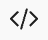
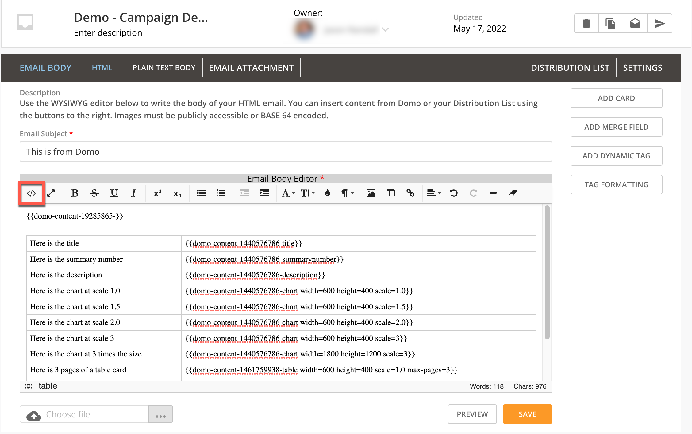
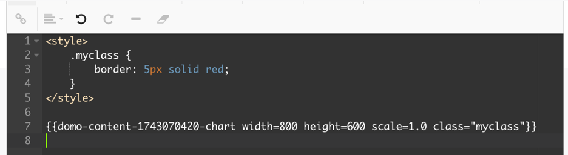

Intro
-----

You can apply CSS styling to cards embedded in the email body of your campaigns. This article describes the process.

To learn more about creating a campaign, see our article on the [Domo Campaigns App](http://domo-support.domo.com/s/article/360042933494).

### Known Limitations

The following are known limitations of this feature.

* Supported components include:  
 · cards
* You can only add one CSS class per component
* Adding the class tag to the following card fields makes no change to the card's styling:  
 · Title  
 · Summary Number  
 · Description  
 · Alert  
 · Comment  
 · Unsubscribe
* Adding the CSS tag to the fields listed above does not generate an error, but the tag is not added in the HTML node.

Adding CSS to a Card
--------------------

1. In the Campaigns app, select a campaign to open it.
2. In the **Email Body** tab, locate the **Email Body Editor**.
3. Switch to HTML mode by selecting   **Change mode**in the toolbar.
 
4. Add an HTML style tag at the top of the editor: 
6. Select **Add Card** to add a card to the email.
7. Edit the card tag and add a class tag followed by the name of your custom class. 
 
8. Select **Save** to save your changes.

When the card is rendered, the CSS class is applied to the component. 

 