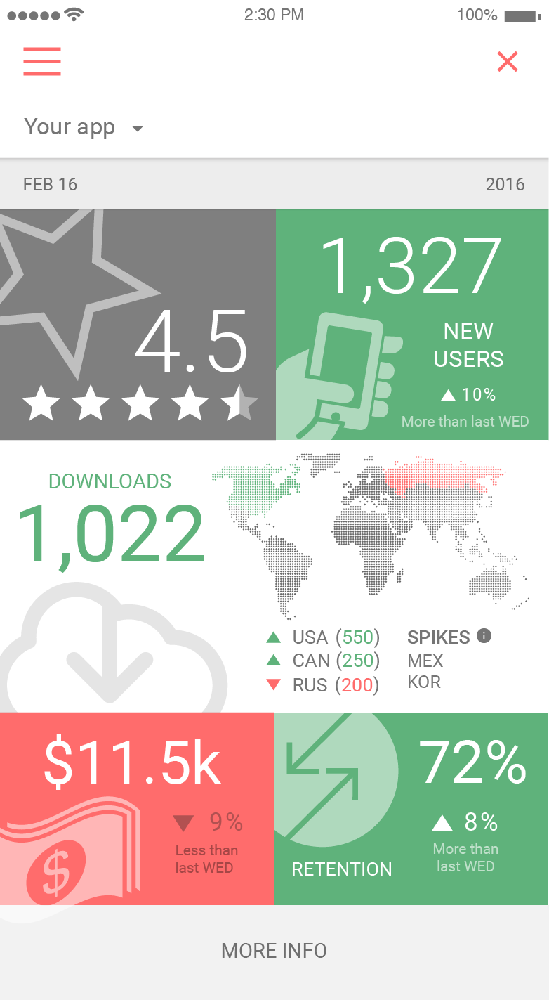

#### Description

Instead of having to collect data from Flurry, iTunes, Google, and more, all your mobile app stats are now in one place.  AppStats aggregates data across app stores, lets you pick date ranges and gives you insightful visualizations into how your app is performing.  AppStats currently provides Revenue, Downloads, New Users, Retention, Engagement, Star Rating, and Crashes.

#### Publisher

SolutionStream

#### Screenshot

