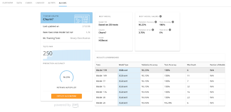
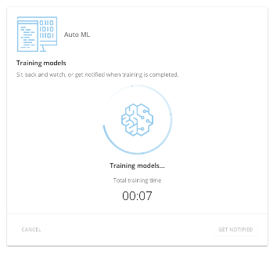
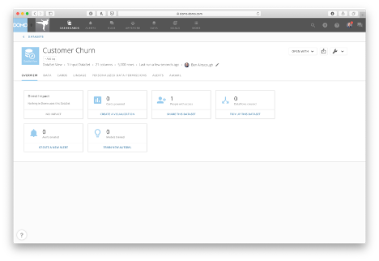
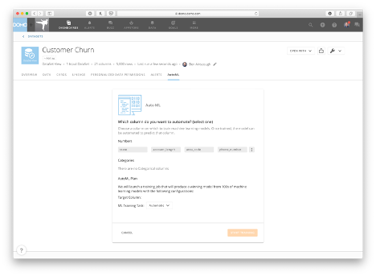
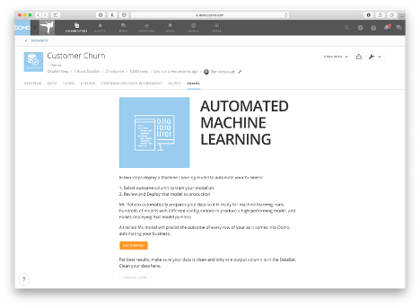
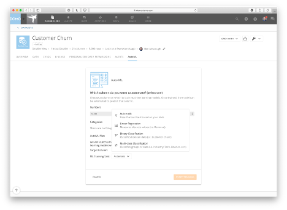
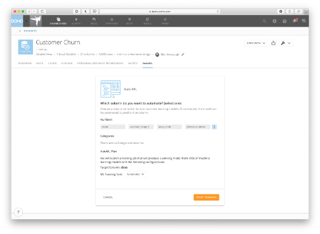
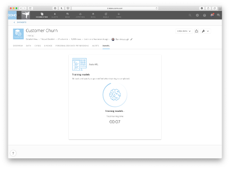
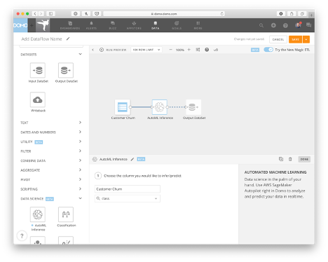

Intro
-----

Domo leads the way in making machine learning accessible to everyone.

You depend on Domo to access your data from a wide variety of sources and make it usable in record time. Machine learning (ML) is the next step to provide insight to complex business problems, improve decision-making, and automate business processes. However, many organizations don’t have the data science expertise to create a machine learning model for their data. Additionally, organizations who have data science teams are often drowning in opportunities and spend months exploring different business problems without ever getting their machine learning solutions into production. AutoML provides a solution in these situations.

### Domo and AWS: A partnership for success

We’re thrilled to announce that machine learning is now within everyone’s grasp with our new automated machine learning (AutoML). In partnership with Amazon SageMaker Autopilot, we’ve created AutoML capabilities that allow you to augment your analytics with machine learning, whether you’re a data scientist or a data science novice, then share those insights with anyone. Amazon SageMaker Autopilot is an Amazon Web Services (AWS) solution that automatically trains and tunes ML models based on data provided by a customer. Companies can now use their data in Domo as input into Amazon SageMaker Autopilot, automatically create the highest performing model and deploy a prediction pipeline that adapts to new, incoming data. The combination of Domo and Amazon SageMaker Autopilot helps make ML accessible to more employees and propels ML-driven insights for business.

 

**Note:**  This feature is available *on demand and paid*.

 

To request this feature be enabled,

* Reach out to your Domo Customer Success Manager, Technical Consultant, or Account Executive.
* If you do not have contact information for your CSM, TC, or AE, contact Technical Support. For information on how to contact Support, please see: [Getting Help](/s/article/360042922874)

Depending on the feature, you may be required to complete training before you can use the feature.

How AutoML works
----------------

Domo leverages Amazon SageMaker Autopilot to make it easy to automatically train and tune ML models needed to predict outcomes. With just a few clicks, AutoML will transform your data to be ready for machine learning and launch hundreds of training jobs on any DataSet in Domo to find the model that achieves the best performance for your task. You can then easily deploy the model on your Domo DataSets with the new **AutoML Interface** tile in Magic ETL. All that is required to get success in machine learning with AutoML is a well-defined problem and a clean DataSet—Domo will take care of the rest.

Check out [this video](https://www.domo.com/learn/automatic-insights-with-automl "https://www.domo.com/learn/automatic-insights-with-automl") to see it in action.

Steps to use AutoML
-------------------

1. Align your data toward your business objective and prepare it for machine learning.
2. Launch an AutoML training job.
3. Evaluate model performance on the Model Leaderboard Page.
4. If the model performs adequately for your business objective, deploy the **AutoML Inference** tile in Magic ETL.
5. Set up model monitoring Dashboards.
6. Create an app or Story on predictions for stakeholders.

Prepare data for AutoML
-----------------------

Take some time to align with your business stakeholders so you have a thorough understanding of your business problems, which tasks would be worthwhile to automate, what model performance would be acceptable for your business problem, and what data is available. Spend some time gathering your data together into one DataSet that has one column with the output variable (the variable you want to predict that AutoML will train on) and many columns that enumerate the inputs that you expect to have an effect/influence on your output column. Be sure to only include one output column for your DataSet. Additionally, each row should encapsulate one record in your business problem. For example, if you would like to predict which sales opportunity will close, each row should enumerate one distinct sales opportunity, from start to finish, with the output column listing the result of the sales opportunity (ie won or lost).

There are many wonderful blog posts, courses, books and videos on data cleaning for machine learning that you can find online or Domo’s professional services team are always a resource at your disposal to enhance your data cleaning skillset.

How to Launch an AutoML Training Job
------------------------------------

Below are instructions on how you can use AutoML along with a sample DataSet for you to try. This is a DataSet outlining customer churn at a phone company, originally obtained from the UCI machine learning repository.

Click on this [link](https://domosoftware.sharepoint.com/:x:/s/CS-Edu-PublicFiles/EYsFcCdV10tLsAN_fjxjhyIBKgqxNniCy19EBcK5KauwXQ?e=j8IA96 "churn.csv") to download the test DataSet and then upload it to your instance as a new DataSet.

1. Once your DataSet is uploaded to Domo, you should be automatically directed to the DataSet Details page for your new Churn DataSet. Click on the **AutoML** tab or select the **Train New Algorithm** option and then click **Get started**.  

2. AutoML will ask you which column you want to automate. You want to predict customer churn, which is based on the “class” column in the DataSet. So, under the **Numbers** section, find and select **class** (you might have to click on the ellipsis button to find it).  
  

3. Once your Target Column (“class”) has been selected, determine what training task you would like AutoML to run. For our scenario, you can choose **Automatic**, but you’re welcome to specify your task explicitly if you know which you would like run.  

4. Click **Start Training** and then sit back and watch as Mr Roboto does all the work for you!  
  

How to evaluate model performance
---------------------------------

On the Model Overview Page, the top performing model will automatically be highlighted for you. On this Page you can compare the many different trials that AutoML ran on your behalf. You can view model performance against the training and validation sets and look at what hyperparameters produced the best performing model. If performance is acceptable to your business problem you can deploy the model in production via a Magic ETL DataFlow. This will allow you to make predictions against your data every time the data updates.

How to make predictions on new data via the AutoML Interface tile in MagicETL
-----------------------------------------------------------------------------

Connect a DataSet with a matching schema to your training DataSet and the **AutoML Inference** tile will use that machine learning model trained by AutoML to make predictions on all the rows of your DataSet.

