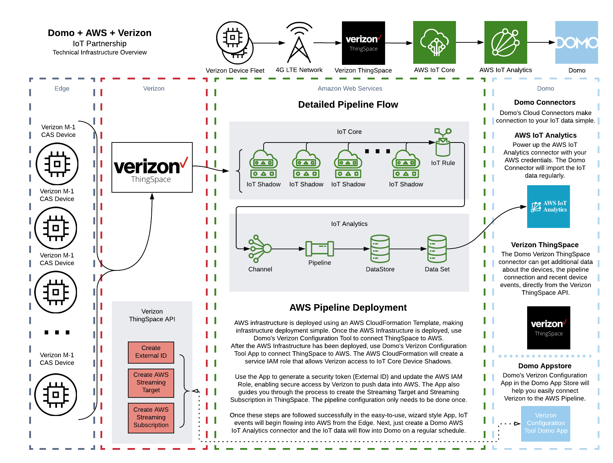
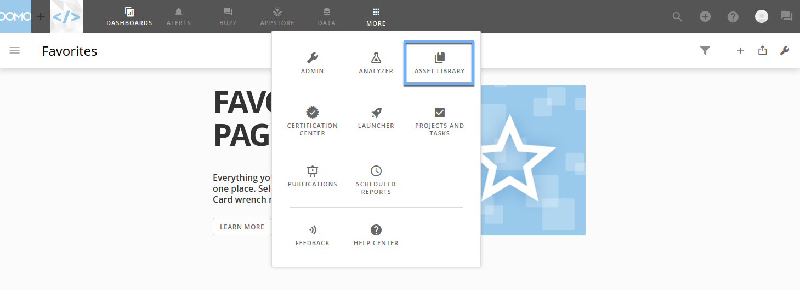
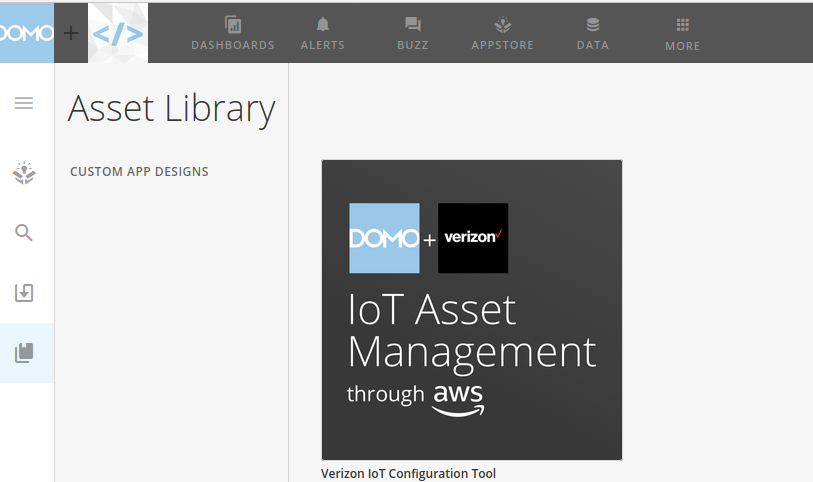
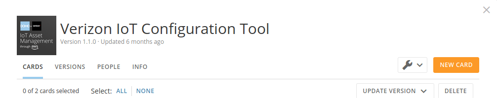
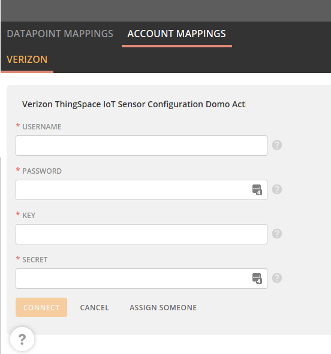
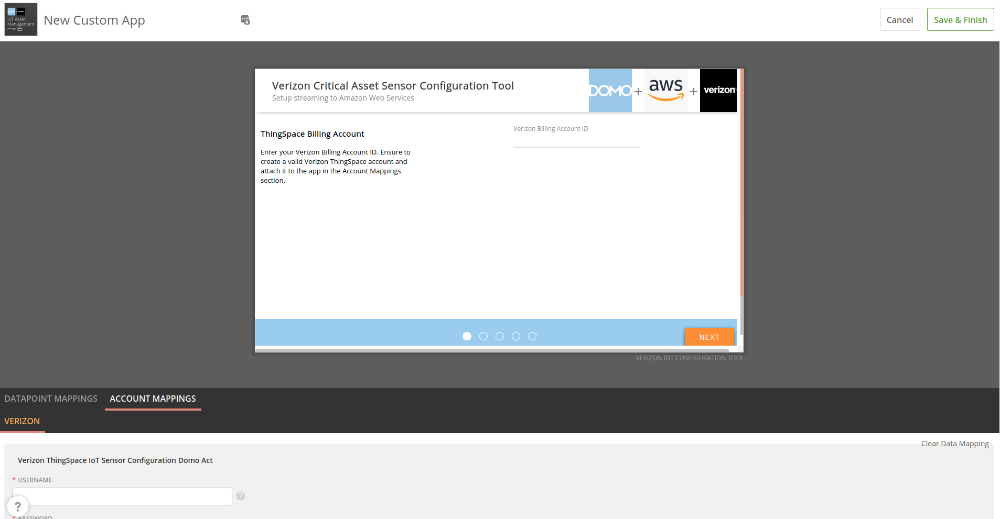

---
    title: AWS Domo Verizon IoT Pipeline
    url: https://domo-support.domo.com/s/article/360048925554
    linked_kbs:  ['[https://domo-support.domo.com/s/knowledge-base/](https://domo-support.domo.com/s/knowledge-base/)', '[https://domo-support.domo.com/s/](https://domo-support.domo.com/s/)', '[https://domo-support.domo.com/s/topic/0TO5w000000ZammGAC](https://domo-support.domo.com/s/topic/0TO5w000000ZammGAC)', '[https://domo-support.domo.com/s/topic/0TO5w000000ZanzGAC](https://domo-support.domo.com/s/topic/0TO5w000000ZanzGAC)', '[https://domo-support.domo.com/s/article/360048925554](https://domo-support.domo.com/s/article/360048925554)', '[https://domo-support.domo.com/s/topic/0TO5w000000ZanzGAC/other-connection-methods](https://domo-support.domo.com/s/topic/0TO5w000000ZanzGAC/other-connection-methods)', '[https://domo-support.domo.com/s/article/360043429933](https://domo-support.domo.com/s/article/360043429933)', '[https://domo-support.domo.com/s/article/360043429953](https://domo-support.domo.com/s/article/360043429953)', '[https://domo-support.domo.com/s/article/360042925494](https://domo-support.domo.com/s/article/360042925494)', '[https://domo-support.domo.com/s/article/360043429913](https://domo-support.domo.com/s/article/360043429913)', '[https://domo-support.domo.com/s/article/4408174643607](https://domo-support.domo.com/s/article/4408174643607)', '[https://domo-support.domo.com/s/login/](https://domo-support.domo.com/s/login/)']
    article_id: 000003150
    views: 1,102
    created_date: 2022-10-24 21:10:00
    last updated: 2022-10-24 22:40:00
    ---

Creating the IoT Pipeline
-------------------------

### Preparation

1. Register an account with Verizon ThingSpace. You will be provided a username, password, and billing account ID. You will also need a client ID and secret key from Verizon’s developer page.
	* Reference: ThingSpace Critical Asset Sensor Pilot - Streaming Quick Start Guide - v1.3
2. In addition to the Verizon ThingSpace account and developer credentials, you will need an AWS account with admin permissions to install AWS CloudFormation templates. If you do not have these permissions, you can pass these instructions to your DevOps or IT Administration team to create the AWS CloudFormation templates, or to grant permissions to your AWS user.

### AWS CloudFormation

Domo has developed an AWS CloudFormation template to make deploying a complex IoT pipeline as simple as possible. This diagram describes the architecture in further detail:

On the Edge, Critical Asset Sensors publish data on regular intervals into Verizon ThingSpace, which updates an AWS Thing Device Shadow document. The IoT Device Shadow Document data is selected with an IoT Rule. One rule will select from all device shadows, that have the name format ts\_123456789012345, which is ts\_ plus the IMEI of the device on the Edge. ThingSpace creates these device shadow documents, so no special naming is required. In addition, the pipeline will automatically scale to select any new devices in your fleet. Once they are added to your Verizon billing account and the devices are charged and turned on, Verizon will create shadows for the new devices and begin pushing data to AWS. The rule was designed to automatically select data from the new devices and ingest their data without any action from the administrator. After the data is selected by the IoT Rule, it is forwarded to an IoT Analytics Channel. This channel collects all the events from the Rule and funnels them into the data pipeline. The IoT Analytics Pipeline selects all the data attributes and normalizes the data for ingestion into the data lake. The data then passes into the IoT Analytics DataStore, where it is stored for DataSet creation. A dataset is created on a regular chron schedule of 15 minutes to ingest the IoT data in the DataStore.

In Domo, an AWS IoT Analytics connector is created to ingest the normalized data into Domo. On a regular interval, data will be ingested into Domo. You can use Domo’s powerful ETL tools to join the data with other data sources. You can create cards and visualizations that can give more insight into your IoT data. Using these cards and dashboards, you can then create alerts to get notification when values stray out of acceptable tolerances. Using Domo Buzz, your people can connect with each other and data to have meaningful conversations about the data.

Deploying the AWS CloudFormation Template
-----------------------------------------

1. Sign into the AWS Console. Assume a role if required by your organization’s policies. Currently the pipeline only supports regions that support AWS IoT Analytics:
	* US East (Ohio)
	* US East (N. Virginia)
	* US West (Oregon)
	* Asia Pacific (Tokyo)
	* EU (Frankfurt)
	* EU (Ireland)
2. Click **Services**, then search for CloudFormation. Click on the auto-complete entry for CloudFormation.
3. Click **Create Stack**. Select **Template is ready**. Under **Specify Template**, select **Upload a template file**.
4. Click **Choose file** and navigate to the JSON template that was provided in the POC.
5. Follow the steps to deploy the CloudFormation Template.

Domo Configuration App
----------------------

Domo has developed a Domo App to assist in creating the pipeline connections between Verizon and AWS. The **Verizon Critical Asset Sensor Configuration Tool** is deployed to your Domo instance. 

1. To create a new instance of the App, do the following:
	1. Log in to your Domo instance.
	2. Click the **More** icon at the top center of the menu bar.
	3. Click **Asset Library**.  
	   
	 
	4. Click on the **Verizon IoT Configuration Tool** icon.  
	   
	 
	5. Click **New Card**.  
	   
	 
	6. With your mouse in the charcoal gray area, scroll to the bottom of the page.
	7. Click **Account Mappings**, then click **Verizon**.  
	   
	 
	8. Click **Select Account…** then **Add Account…**. If no previous accounts were added, the display may not show **Select Account…**.
	9. Scroll to fit all the fields in your view and enter your credentials, then click **Connect**. After the account is mapped, scroll back up to the top and click **Save and Finish**. No **Datapoint Mappings** are required for this app.
2. Saving the app should take you to your instance of the App Card. If it doesn’t, it should appear on your **Overview** page. This is found in the left navigation pane, which can be pinned and unpinned. If it is unpinned, mouse over to the left side and it will appear. Using the pushpin icon will pin the left navigation menu.
3. Open the app card, by finding it on your **Overview** page and clicking the **Wrench** icon then clicking **Details**.
4. The first page of the app looks like this:  
   
 
5. Enter your Verizon Billing Account ID and click **Next**. The App will display a spinner for a moment and then will show some information:
	1. Verizon’s AWS account ID This is Verizon’s account ID in AWS. You will need this to enable a service IAM role that Verizon will be able to assume to push IoT data into the pipeline.
	2. External ID The service IAM role is secured using this security string, and only allows Verizon to assume the role when this External ID matches the ID in AWS. We’ll enable this permission in AWS now.
6. Sign in to AWS. Browse to IAM (Identity and Access Management). From the IAM Dashboard, click Roles in the left column. Find the IAM Service Role created by CloudFormation. The name of this role will contain "ThingSpaceIoTServiceRole" in its name.
7. Click the **Trust Relationships** tab. You can see the Trusted Entity has been populated with Verizon's AWS Account ID on the right. Under **Conditions**, a ExternalId field is entered but has no value.
8. Click **Edit Trust Relationship**. This displays the IAM Policy document. Paste the External ID generated in the app as the value for the field "sts:ExternalId". Click **Update Trust Policy** to save the values.
9. Copy the IAM Role ARN.
10. Go back to the Domo App. Click **Next**. Now we will create an AWS Streaming Target in Verizon ThingSpace. Select the region from the dropdown. Enter the ARN you copied in the previous step. Give the target a name and optional description. Click **Next**.
11. Now we will create an AWS Streaming Subscription. Enter your email address for error events from ThingSpace and give the subscription a name. Click **Finish**.
12. The last page of the App displays all the information for the resources that were created. Copy the information and save for your records. All the panels in the app are scrollable, so you can see more information if it does not fit in the view finder.
13. The app is only needed to be used once to spin up the pipeline.

Data should begin flowing into AWS IoT Core once you have charged and turned on the devices. To turn on the device for the first time, press and hold the touch sensitive button in the center of the device. The device does not turn off. When on battery power, the device does not flash the LED lights during beaconing to save battery.

**Note:** Any Subsequent users will need to create their own app and follow the same process.

