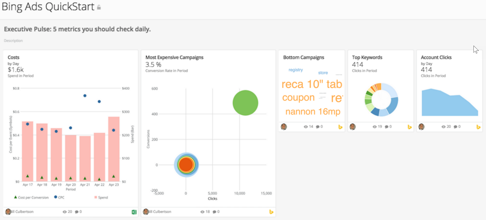

---
    title: Bing Ads Analytics App
    url: https://domo-support.domo.com/s/article/360042933374
    linked_kbs:  ['[https://domo-support.domo.com/s/knowledge-base/](https://domo-support.domo.com/s/knowledge-base/)', '[https://domo-support.domo.com/s/](https://domo-support.domo.com/s/)', '[https://domo-support.domo.com/s/topic/0TO5w000000ZampGAC](https://domo-support.domo.com/s/topic/0TO5w000000ZampGAC)', '[https://domo-support.domo.com/s/topic/0TO5w000000Zan9GAC](https://domo-support.domo.com/s/topic/0TO5w000000Zan9GAC)', '[https://domo-support.domo.com/s/article/360042933374](https://domo-support.domo.com/s/article/360042933374)', '[https://domo-support.domo.com/s/topic/0TO5w000000Zan9GAC/available-apps](https://domo-support.domo.com/s/topic/0TO5w000000Zan9GAC/available-apps)', '[https://domo-support.domo.com/s/article/360043429933](https://domo-support.domo.com/s/article/360043429933)', '[https://domo-support.domo.com/s/article/360043429953](https://domo-support.domo.com/s/article/360043429953)', '[https://domo-support.domo.com/s/article/360042925494](https://domo-support.domo.com/s/article/360042925494)', '[https://domo-support.domo.com/s/article/360043429913](https://domo-support.domo.com/s/article/360043429913)', '[https://domo-support.domo.com/s/article/4408174643607](https://domo-support.domo.com/s/article/4408174643607)', '[https://domo-support.domo.com/s/login/](https://domo-support.domo.com/s/login/)']
    article_id: 000004995
    views: 1.100
    created_date: 2022-11-02 20:16:00
    last updated: 2022-11-02 20:37:00
    ---

Intro
-----

Marketers need to track and review their PPC results, and Bing Ads provides those insights. The Bing Ads Analytics App provides summary views of customer interactions through clicks and impressions, as well as purchases and form fills.

Screenshot
----------

Requirements and Notes
----------------------

API access and key from your Bing Ads profile are required.

Usage
-----

* Ad Conversion: Are your ads driving sales or generating costs?

	+ Conversion Rate and Conversions
	+ Most Converted Keywords
	+ Campaign Conversion
	+ Conversion Rate by Campaign
	+ Ad Group Conversion
* Ad Engagement: What level of ad performance are you hitting?

	+ Low Quality Clicks
	+ Impressions Lost to Budget
	+ Click-Through Rate
	+ Impressions Lost to Keyword Relevance
	+ Ad Position Trend
	+ Keywords Clicked
	+ Campaign Impression Share
	+ Quality Score Trend
* Costs: Are you leveraging your budget to capture the highest possible ROI?

	+ Campaign Budget Spend
	+ CPA Trend
	+ CPC Trend
	+ Cost per Conversion by Campaign
	+ Projected Spend
* Executive Pulse: 5 metrics you should check daily

	+ Bottom Campaigns
	+ Costs
	+ Most Expensive Campaigns
	+ Account Clicks
	+ Top Keywords

Authentication
--------------

| Credential | Description |
| --- | --- |
| Developer Token | 1. Sign into BingAds.com.
2. Navigate to the **Account & Billing** tab.
3. Switch to the older version (option available in the top right).
4. Go to **User** tab and click on the super user to see the option **Get API access key** on the right side pane.
5. Click **Get API access key** to see your Developer Token.
6. Copy the Developer Token and paste it in the **Developer Token** field in the **Credentials** pane for the connector. |

Dashboard Reports
-----------------

For descriptions of these reports, see Bing Ads Connector. 

| Report | Schedule Update Setting | Parameters | Selection |
| --- | --- | --- | --- |
| Conversion Performance | Replace | Report | Conversion Performance Report |
| Aggregate By | Daily |
| Duration | Date Range |
| Start Date | Relative | 31 |
| End Date | Relative |  1 |
| Backfill |   |
| Account Performance | Replace | Report | Account Performance Report |
| Aggregate By | Daily |
| Duration | Date Range |
| Start Date | Relative | 366 |
| End Date | Relative | 1 |
| Backfill |   |
| Keyword Performance | Replace | Report | Keyword Performance Report |
| Aggregate By | Daily |
| Duration | Date Range |
| Start Date | Relative | 31 |
| End Date | Relative | 1 |
| Backfill |   |
| Budget | Replace | Report | Budget Summary  Report |
| Duration | Date Range |
| Start Date | Relative | 31 |
| End Date | Relative | 1 |
| Backfill |   |

