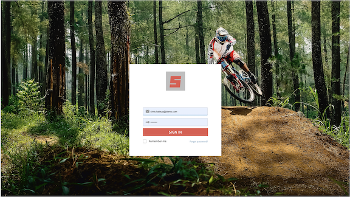
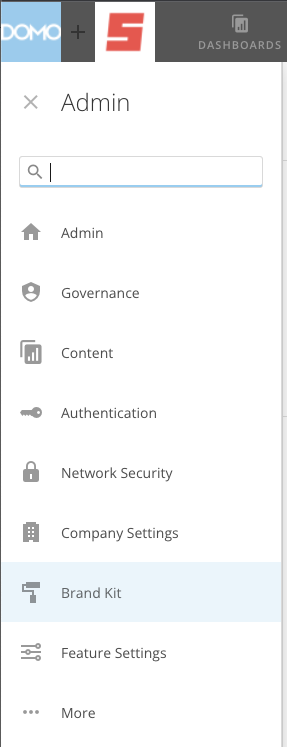
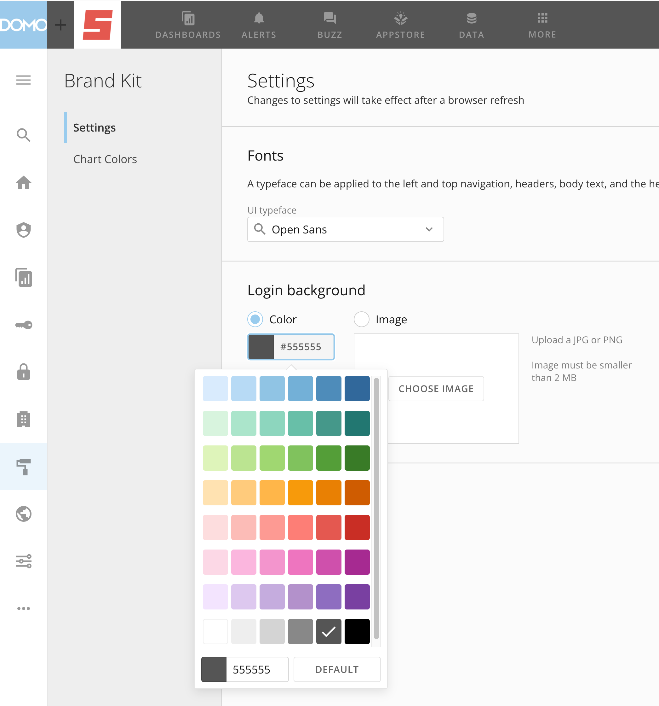
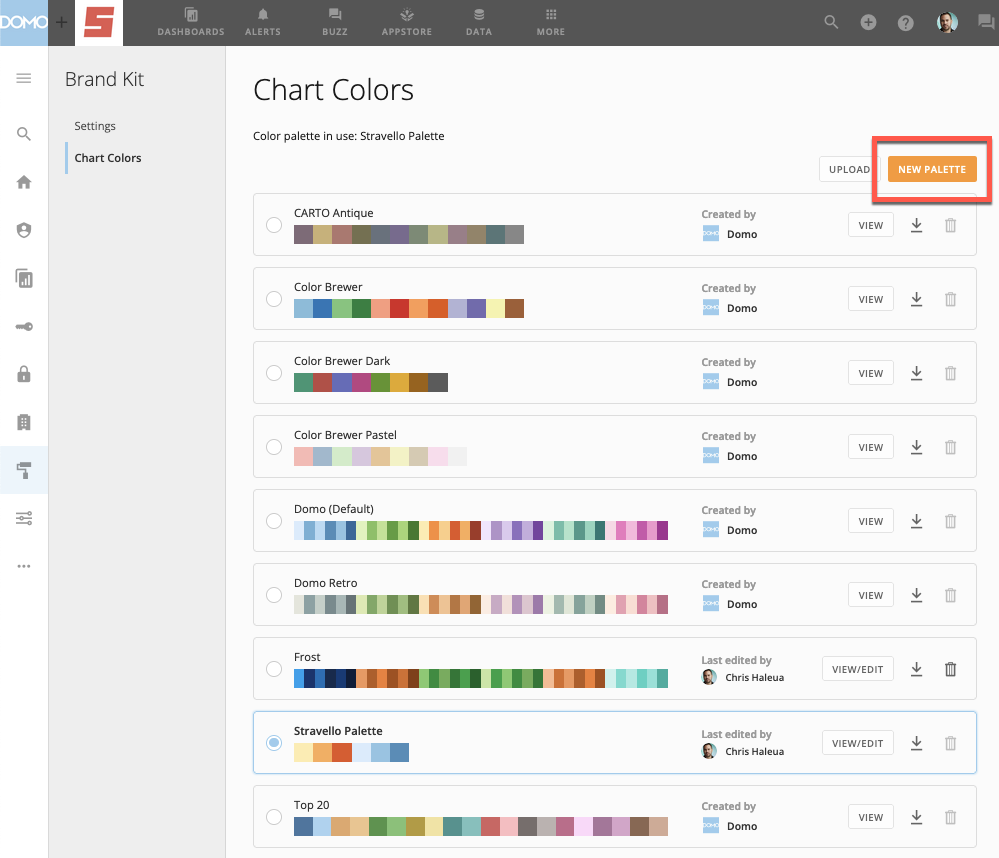
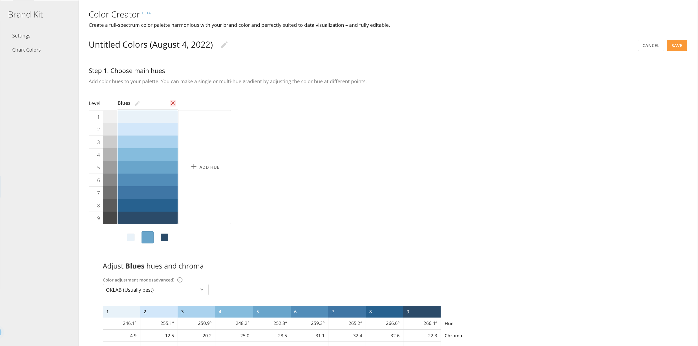
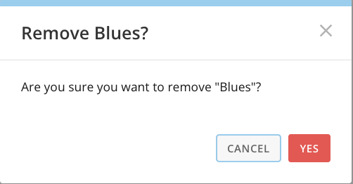
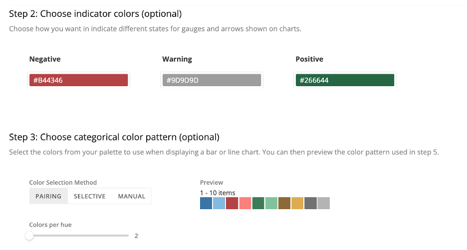
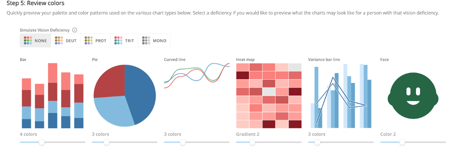
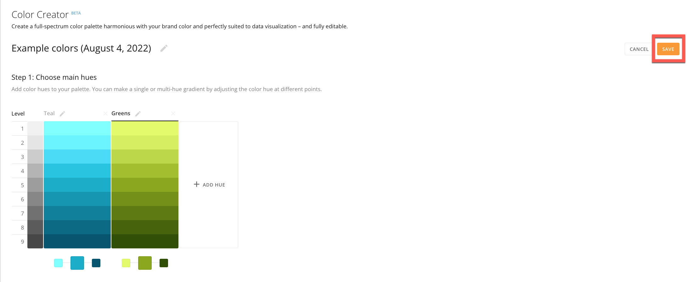

Intro
-----

Domo Brand Kit is a collection of tools and features that help you craft a Domo experience for your users that is consistent with your internal and external branding.

You can do the following with Brand Kit:

* Style your interface to match brand guidelines​.
* Customize experiences for your target audience.
* Domo Everywhere users can match published content to the surrounding colors on the host page for more cohesive external experiences​.

This article provides information on Brand Kit in the following topics:

* [Prerequisites](#pre-reqs)
* [Login backgrounds](#login)
* [Chart color palettes](#chart_colors)

Prerequisites
-------------

Brand Kit is a premium Domo feature. You need to have it enabled for your organization before the tool displays in your interface. Contact your Customer Success Manager (CSM) for more information.

Brand Kit Tools
---------------

The Brand Kit tools include login backgrounds, chart color palettes, and other features in development.

### Login Backgrounds

Brand Kit allows you to customize the background image or color shown when logging into your organization within Domo.

Follow these steps to customize your own login experience:

1. From the navigation header, go to **More** > **Admin**.

2. Select  **Brand Kit** in the side rail.

3. In **Settings**, select a radio button to set a solid **Color** or **Image** as the login background.

* If you choose **Color**, select the field displaying a HEX color code and choose a preset color or enter your own HEX code.

 
* If you choose **Image**, select **Choose Image** to browse for an image to upload.
  

 

**Note:** The image must be smaller than 2 MB and in either JPG or PNG format.

You have successfully customized the login background.

### Chart Color Palettes

Brand Kit Chart Colors allows you to set custom color palettes to use with your charts, helping to create a default look that is consistent with your branding.

Follow these steps to customize your color palettes:

1. From the navigation header, go to **More** > **Admin**.

2. In the left rail, select  **Brand Kit**.

3. Select **Chart Colors**.

4. Select **New Palette**.  
The **Color Creator**displays.

 

5. In the **Color Creator**, follow the steps in the UI. You can preview all selections in Step 5: Review colors.

* Step 1: Choose main hue.
 In this step, you select the main hues in your color palette. You can enter a HEX code. Color Creator automatically gives you a gradient of nine evenly spaced steps from your chosen hue.

The default palette includes Blues. You can delete this default hue by selecting  **Remove**. A dialog displays, confirming removal.

 

You can edit the name of the hue by selecting  **Edit.**
* (Optional) Step 2: Choose indicator colors  
 Choose the Negative, Warning and Positive colors indicators to use in your charts.
* (Optional) Step 3: Choose categorical color pattern  
 Select the colors from your palette for use in bar and line charts.  
 
* (Optional) Step 4: Choose 'Period over Period' color pattern  
 Choose which of your colors to use for indicating different time periods.
* Step 5: Review colors  
 Preview the palette and confirm accessibility by dragging the slider to simulate multiple series.  
   
 
 

 

**Note:** The colors in the charts in step 5 are pulled from the preview in step 3, moving from left to right, as you can see in the above screenshots.

6. When you finish creating your palette, select **Save**.

7. Return to **Chart Colors** in the left navigation.

8. Locate and activate your new color palette by selecting its radio button in Chart Colors.

 

**Note:** Activating the color palette applies it to all charts in the instance, but color rules at the card level still take precedence.

  

