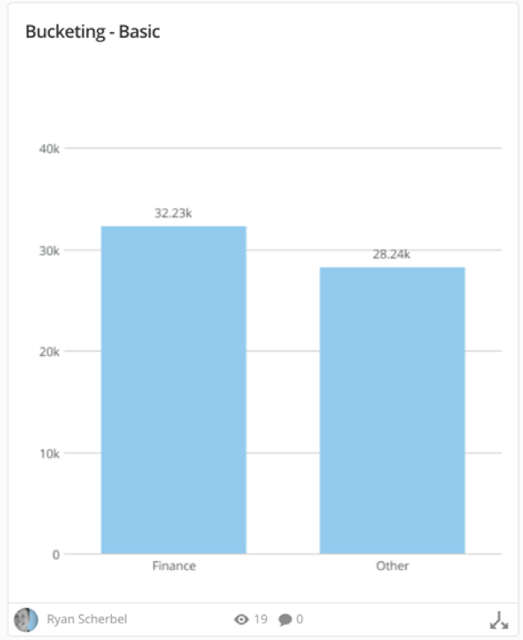
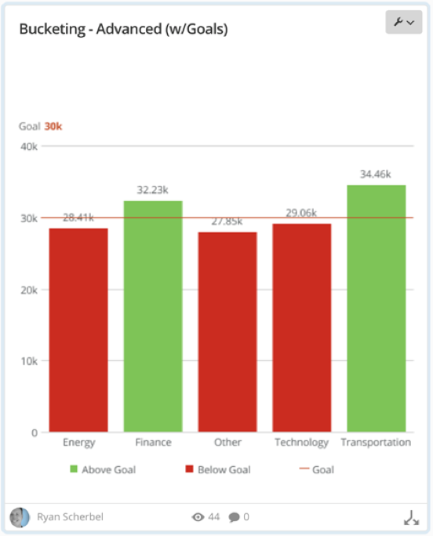

## Bucketing FAQs

##### What is bucketing and what is it used for?

Cards inherently group data, but you’re limited to face value data provided by the data source. You can create buckets using Beast Mode and create an additional column in your data that you can leverage in cards as filters, sorts, series and values where your data falls short. Bucketing is also used to group things for advanced comparative analysis.

##### What fields can be used when creating buckets?

Buckets can be based off of any field available in the data source powering the card, and multiple fields can be leveraged if needed in order to create your bucket/group column.

##### Can buckets be used in summary numbers?

Yes, as long as there is some sort of aggregation on them (for example, Min, Max, Count, Sum, Avg).

##### Is there a limit on how many I can create in a card?

No. Each one is treated as an additional column in your data, and you can create as many as you need.

## Video - Grouping Data into Buckets

## Bucketing Samples

### Use Case #1

I have data on all my departments but want to roll them up so I have only 2 bars showing Finance vs. everything else. The strategy for accomplishing this task is to group everything that isn’t finance into an “Other” bucket and then graph the results. Here is an example of how a chart like this could look:

The Beast Mode calculation to use to create this bucket in the above example would look like this:

`CASE WHEN `Account_Industry` = 'Finance' THEN 'Finance' ELSE 'Other' END`

### Use Case #2

All my sales departments have the same target, but I want to be able to clearly see which departments have met the target. The strategy is to split the existing series out into two separate series, which can then be graphed together but colored separately. Here is an example of how a chart like this could look:

The Beast Mode calculations to use to create these buckets in the above example would look like this:

(Above Goal)

`CASE  WHEN avg(`Amount`) >= 30000 THEN avg(`Amount`) END`

(Below Goal)

`CASE WHEN avg(`Amount`) < 30000 THEN avg(`Amount`) END`

The last step in this example is accomplished by going into the Chart Properties and changing the colors to Green and Red so these match the new series.
