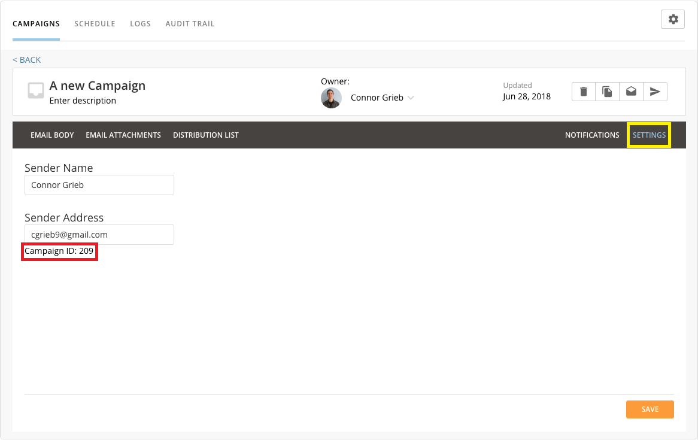
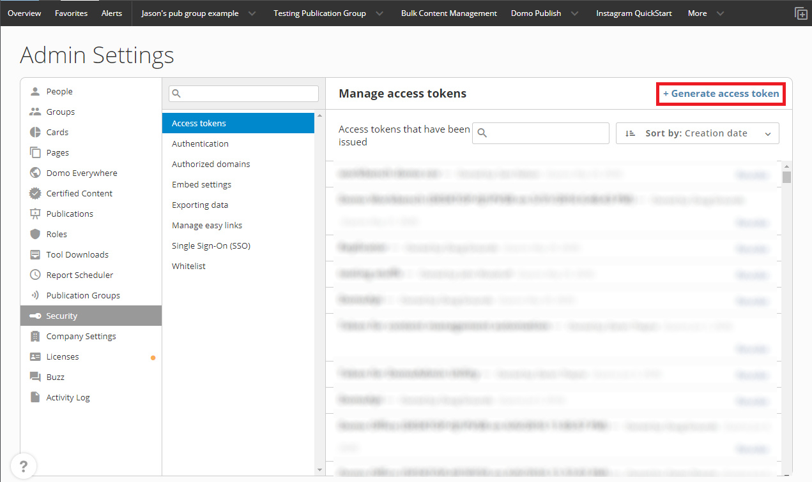

---
    title: Campaigns API
    url: https://domo-support.domo.com/s/article/360043441853
    linked_kbs:  ['[https://domo-support.domo.com/s/knowledge-base/](https://domo-support.domo.com/s/knowledge-base/)', '[https://domo-support.domo.com/s/](https://domo-support.domo.com/s/)', '[https://domo-support.domo.com/s/topic/0TO5w000000ZampGAC](https://domo-support.domo.com/s/topic/0TO5w000000ZampGAC)', '[https://domo-support.domo.com/s/topic/0TO5w000000Zan9GAC](https://domo-support.domo.com/s/topic/0TO5w000000Zan9GAC)', '[https://domo-support.domo.com/s/article/360043441853](https://domo-support.domo.com/s/article/360043441853)', '[https://domo-support.domo.com/s/topic/0TO5w000000Zan9GAC/available-apps](https://domo-support.domo.com/s/topic/0TO5w000000Zan9GAC/available-apps)', '[https://domo-support.domo.com/s/article/360043429933](https://domo-support.domo.com/s/article/360043429933)', '[https://domo-support.domo.com/s/article/360043429953](https://domo-support.domo.com/s/article/360043429953)', '[https://domo-support.domo.com/s/article/360042925494](https://domo-support.domo.com/s/article/360042925494)', '[https://domo-support.domo.com/s/article/360043429913](https://domo-support.domo.com/s/article/360043429913)', '[https://domo-support.domo.com/s/article/4408174643607](https://domo-support.domo.com/s/article/4408174643607)', '[https://domo-support.domo.com/s/login/](https://domo-support.domo.com/s/login/)']
    article_id: 000004156
    views: 1.223
    created_date: 2022-10-24 21:26:00
    last updated: 2022-10-24 22:42:00
    ---


### Intro


Campaigns supports the ability to start a campaign from a call to the API


### Triggering a Campaign


##### Endpoint


The endpoint to call to trigger a campaign is:


[https://campaigns-prod.domolabs.io/api/v1/campaigns/start](https://campaigns-prod.domolabs.io/api/v1/campaigns/start "https://campaigns-prod.domolabs.io/api/v1/campaigns/start")


##### Object


Call a POST event to the endpoint above with the following JSON object:


```
{
  "campaignId": 0,
  "domoAccessToken": "",
  "domoAccessTokenOwnerEmailAddress": "",
  "emailAddresses": [],
  "instance": ""
}
```

###### Campaign Id


The id of the campaign you want to start.  You can get the campaign id by editing the campaign and going to the "SETTINGS" tab:





 


###### Domo Access Token


A Domo access token that has been generated in Domo.  You can generate Domo Access Tokens by logging in,  going to the Admin Settings section, going to "Security", and selecting "Access tokens".  There you can simply generate a new access token to use for calls to the API.





 


###### Domo Access Token Owner Email Address


The email address of the user who owns the **Domo Access Token** specified above.


###### Email Addresses (OPTIONAL)


A list of email addresses the campaign should be delivered to.  If no email addresses are selected, the entire campaign will be started and delivered to all recipients in the distribution list. 


###### Instance


You Domo instance (e.g. [domo.domo.com](http://domo.domo.com)). 


##### Summary


|  |  |
| --- | --- |
| Path | `[https://campaigns-prod.domolabs.io/api/v1/campaigns/start](https://campaigns-prod.domolabs.io/api/v1/campaigns/start "https://campaigns-prod.domolabs.io/api/v1/campaigns/start")` |
| Since version | 1.0 |
| Description | Run a campaign and send an email to a everyone in the distribution list OR to a selected list of people |
| Auth | NONE, Roles: anonymous |
| Produces |
| `application/json` |
| Consumes |
| `application/json` |
| Body object |
| `startcampaign` |
| Response status code |
| `200 - OK` |
| Response object |
| `void` |

