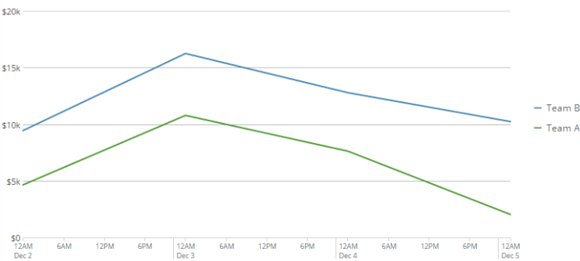
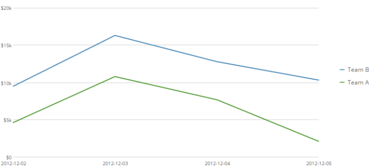

---
    title: Changing the Date Format in Your Chart
    url: https://domo-support.domo.com/s/article/360043429633
    linked_kbs:  ['[https://domo-support.domo.com/s/knowledge-base/](https://domo-support.domo.com/s/knowledge-base/)', '[https://domo-support.domo.com/s/](https://domo-support.domo.com/s/)', '[https://domo-support.domo.com/s/topic/0TO5w000000ZamoGAC](https://domo-support.domo.com/s/topic/0TO5w000000ZamoGAC)', '[https://domo-support.domo.com/s/topic/0TO5w000000ZaoNGAS](https://domo-support.domo.com/s/topic/0TO5w000000ZaoNGAS)', '[https://domo-support.domo.com/s/topic/0TO5w000000ZaodGAC](https://domo-support.domo.com/s/topic/0TO5w000000ZaodGAC)', '[https://domo-support.domo.com/s/article/360043438973](https://domo-support.domo.com/s/article/360043438973)', '[https://domo-support.domo.com/s/article/360043429633](https://domo-support.domo.com/s/article/360043429633)', '[https://domo-support.domo.com/s/topic/0TO5w000000ZaodGAC/chart-properties](https://domo-support.domo.com/s/topic/0TO5w000000ZaodGAC/chart-properties)', '[https://domo-support.domo.com/s/article/360043429933](https://domo-support.domo.com/s/article/360043429933)', '[https://domo-support.domo.com/s/article/360043429953](https://domo-support.domo.com/s/article/360043429953)', '[https://domo-support.domo.com/s/article/360042925494](https://domo-support.domo.com/s/article/360042925494)', '[https://domo-support.domo.com/s/article/360043429913](https://domo-support.domo.com/s/article/360043429913)', '[https://domo-support.domo.com/s/article/4408174643607](https://domo-support.domo.com/s/article/4408174643607)', '[https://domo-support.domo.com/s/login/](https://domo-support.domo.com/s/login/)']
    article_id: 000005038
    views: 2,545
    created_date: 2022-11-02 21:00:00
    last updated: 2022-11-02 21:04:00
    ---

Intro
-----

When you power up a chart in Analyzer using a column with date and/or time information, automatic time scale formatting is applied for most chart types. This means that Domo determines the most appropriate date grain and output format for your data. If there are periods with no data, gaps are shown accordingly in the timeline. All of the following chart types use automatic time scale formatting.

* Vertical bar
* Vertical stacked bar
* Line
* Symbol line
* Curved line
* Curved symbol line
* Multi-line
* Running total bar
* Running total line
* Vertical box plot
* Vertical grouped bar
* Grouped bar with line
* Stacked bar with line
* Grouped bar with symbol
* Stacked bar with symbol
* Running total grouped

For chart types not in this list, date and time information appears as it does in your DataSet. For example, if the dates in your date column use the format Month Day, Year, the dates in the chart also use that format. If there are periods with no data, gaps are not shown for those periods in the timeline. 

The following example shows a chart with automatic time scale formatting:

  

The next example shows the same chart with time scale formatting turned off:

Changing your chart's date format
---------------------------------

You can change the date output format of a chart in the **Chart Properties**. You can change the date format in a chart *only* when automatic time scale formatting is not in use. So, for the charts in the above list, if you want to change the date format, you must first turn off automatic time scale formatting. You do this by checking **Never Use Time Scale** in **Chart Properties > Category Scale.**

**To change the date output format,**

1. In the Analyzer, click **Chart Properties**.
2. Click **Category Scale**.
3. (Conditional) If your chart is one of the types in the above list, turn off automatic time scale formatting by checking **Never Use Time Scale**.
4. In the **Date Output Format** field, specify the date output format you want.  
For example: MM.dd.yy or MM-yyyy
5. Click **Apply**.

### Macros

When specifying a different format, you can use any of the following macros. 

| Macro (old) | Macro (new) | Time Unit | Example |
| --- | --- | --- | --- |
| `%Y` | yyyy | Four-digit year | `2012` |
| `%y` | yy | Two-digit year | `12` |
| `%m` | M | Two-digit month | `09` |
| `%b` | MMM | Month name, abbreviated | `Sep` |
| `%d` | DD | Day of the month | `05` |
| `%H` | HH | Hour (24-hour) | `22` |
| `%M` | mm | Minutes | `17` |
| `%S` | ss | Seconds | `55` |
| `%Q` | N/A (deprecated) | Quarter number (1-4) | `3` |
| `%n` | MM | Month number (01-12) | `07` |
| `%e` | dd | Day of month (01-31) | `04` |
| `%a` | E | Day of week | `Thu` |
| `%I` | h | Hour in 12-hour format (1-12) | `12` |
| `%p` | a | AM/PM designator | `AM` |
| `%T` | N/A (deprecated) | %H:%M:%S (blank if 00:00:00) | `22:17:55` |
| `%L` | N/A (deprecated) | Milliseconds | `000` |

 

 

**Notes:**

* Domo does not recognize time data as such unless it is accompanied by date data. For example, if your DataSet contained a "Time" column with times in the format H:M, Domo would not recognize it as time data. However, if you changed your time format to include dates (for example, MM.dd.yy H:M), Domo would recognize it as time data.
* If you use a macro in the **Date Output Format** field, you must use a macro for all date format specifier characters.
* You can separate time units by adding punctuation or spaces before or after the appropriate macros.  
For example, if you wanted your date format to be Sep 26 2012, 22:14:55, you would enter the following in the **Date Output Format** field: MMM DD yyyy, HH:mm:ss.
* Date output formats for Microsoft Excel spreadsheets are Java-like.

 

**Video - International Date Format**

Changing the week display formatting
------------------------------------

By default, when the date grain for a chart is set to **Week**, weeks are represented in the format "Week X," where X is the week number during the year. For example, the week of January 8th to the 14th would appear as "Week 2." However, in the Admin Settings, in **Company Settings > Company Overview,** you can change this formatting so that weeks are represented by dates instead of week numbers. So, for example, the week of January 8th to the 14th would be represented as "1-8" instead of "Week 2." Only users with an "Admin" default security role or a custom role with the "Manage All Company Settings" grant can do this. Note that this is a global setting that affects all charts in a Domo instance; it cannot be turned on for individual users.

 

**Note:**When weeks are represented by week numbers as explained above, you cannot change the weekly date format. If you want to format dates for weeks, you will need to select the **Week dates** option in **Admin > Company Settings > Overview**.  

if the company setting is to format weeks by week number, you will not be able to format weekly data differently. If they wish to format the date they would need to use the m/d/yyyy format for weeks in their company settings.

For more information about default security roles, see [Managing Custom Roles](/s/article/360043438973 "Security Role Reference").

**To change the week display formatting to show dates,**

1. Click **More**in the toolbar at the top of the screen.
2. Select **Admin** in the menu.  
The Admin Settings page appears.
3. Select **Company Settings > Overview**.
4. In the **Company Overview** pane, select **Week dates** in the **Week Display** menu.
5. Click **Save Changes**.
