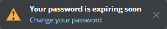
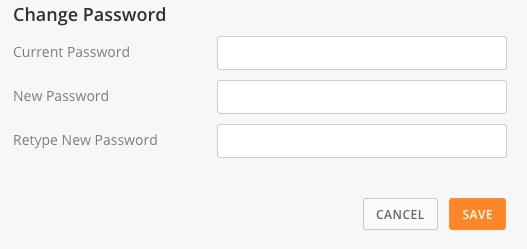
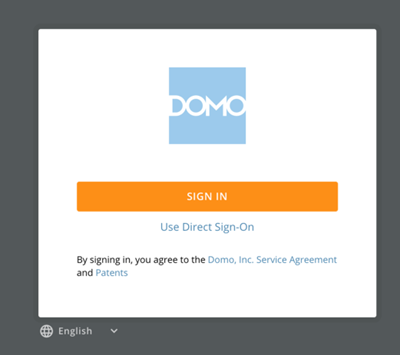

---
    title: Changing Your Password
    url: https://domo-support.domo.com/s/article/360043427513
    linked_kbs:  ['[https://domo-support.domo.com/s/knowledge-base/](https://domo-support.domo.com/s/knowledge-base/)', '[https://domo-support.domo.com/s/](https://domo-support.domo.com/s/)', '[https://domo-support.domo.com/s/topic/0TO5w000000ZamsGAC](https://domo-support.domo.com/s/topic/0TO5w000000ZamsGAC)', '[https://domo-support.domo.com/s/topic/0TO5w000000ZaoIGAS](https://domo-support.domo.com/s/topic/0TO5w000000ZaoIGAS)', '[https://domo-support.domo.com/s/article/360042934474](https://domo-support.domo.com/s/article/360042934474)', '[https://domo-support.domo.com/s/article/360043439413](https://domo-support.domo.com/s/article/360043439413)', '[https://domo-support.domo.com/s/article/360043427513](https://domo-support.domo.com/s/article/360043427513)', '[https://domo-support.domo.com/s/topic/0TO5w000000ZaoIGAS/support-resources](https://domo-support.domo.com/s/topic/0TO5w000000ZaoIGAS/support-resources)', '[https://domo-support.domo.com/s/article/360043429933](https://domo-support.domo.com/s/article/360043429933)', '[https://domo-support.domo.com/s/article/360043429953](https://domo-support.domo.com/s/article/360043429953)', '[https://domo-support.domo.com/s/article/360042925494](https://domo-support.domo.com/s/article/360042925494)', '[https://domo-support.domo.com/s/article/360043429913](https://domo-support.domo.com/s/article/360043429913)', '[https://domo-support.domo.com/s/article/4408174643607](https://domo-support.domo.com/s/article/4408174643607)', '[https://domo-support.domo.com/s/login/](https://domo-support.domo.com/s/login/)']
    article_id: 000004372
    views: 2,525
    created_date: 2022-10-24 21:45:00
    last updated: 2022-10-24 22:42:00
    ---

Intro
-----

You can refer to the instructions in this topic to change your Domo password.

 

**Note:** You cannot change your password using the steps outlined in this section if you authenticate to Domo using SSO. For more information, see [Changing Your Password](#h_ce8391c5-a220-45f5-9048-00863a0a1c4f "Changing Your Password").

Changing Your Password Anytime
------------------------------

You can change your password anytime you want in your **Settings** screen.

1. Click your user profile picture.
2. Click .  
 Your user Settings page opens, with the **General**tab selected by default.
3. Click **Change your password**.
4. Enter your current password in the **Current Password**box.
5. Enter your new password in the **New Password**box.  
 Your password *may* need to meet certain criteria, depending on settings in the **Security > Authentication** tab in the Admin Settings. For more information, see [Setting Password Requirements](/s/article/360042934474 "Setting Password Requirements").
6. Reenter your new password in the **Retype New Password** box.
7. Click **Save**.

Changing a Forgotten or Expired Password
----------------------------------------

If you forget your password to sign in to Domo, or if it expires, you can change your password from the signin dialog, so long as you have the email address you use to sign in.

For information about changing your password in your profile, see [Specifying Your Personal Profile Information](/s/article/360043439413 "Specifying Your Personal Profile Information").

**To change your password from the signin dialog,**

1. In a Web browser, go to your Domo.  
 For example, <https://mycompany.domo.com>.
2. Click the **Forgot password?** link.  
 A dialog appears.
3. Enter your email address, then click **Request Reset Link**.  
 An email is sent to the email address.
4. Log in to your email account and find the email message.  
 The email message has the subject line "Forgotten Password."
5. Open the email message, then click the link in the email.  
 A dialog appears where you can change your password.
6. Enter a new password in the first box.
7. Retype the same password in the second box.
8. Click the button to reset your password.  
 As necessary, specify a password that meets [password requirements](/s/article/360042934474 "Setting Password Requirements").

Your password is changed and you are signed in to Domo.

 

**Note:** If for any reason you are having issues with resetting your password, reach out to an Admin-level user OR a user with a custom role in which the "Edit Users" privilege has been enabled). These users have the ability to change a password for a particular user in the Admin settings within Domo.

Changing Your Password Before It Expires
----------------------------------------

When password expiration is enabled, your password is set to expire in so many days. You can change your password in Domo before it expires.

For information about setting password requirements, see [Setting Password Requirements](/s/article/360042934474 "Setting Password Requirements").

Before your password expires, a prompt appears after you sign in.

**To change your expiring password when prompted,**

1. When prompted, click **Change your password**.  
   

2. Enter your expiring password, then enter and confirm a new password.  

3. Click **Save Changes**.

You can also change your password in your user Settings page (see [Changing Your Password Anytime](#h_8a0b1b7d-ea2c-471f-985e-06f34a41b9a0 "Changing Your Password") above).

Troubleshooting
---------------

If your company uses SSO to authenticate into Domo, you will *not*be able to reset your password using the steps outlined in this section. In this case, you will need to work with your internal IT team to reset your password. 

If your company uses SSO for authentication, the login screen appears as follows:

If you attempt to reset your password and don't receive an email, check the following:

* Your authentication method. If your company uses SSO for authentication, no email will be sent.
* Your Domo instance URL.   
  

 

**Important:** Your Domo instance URL should look like [customername.domo.com](http://customername.domo.com). It is important to note that regardless of what you type in the customer name portion of the URL, a login page will display, however, your credentials will not work. Just because you see a login screen doesn't always mean your URL was typed correctly.
* Your junk folder in your email.

If for any reason you are still having issues with resetting your password, reach out to an Admin-level user in your instance OR a user with a custom role in which the "Edit Users" privilege has been enabled. These users have the ability to change a password for a particular user in the Admin settings within Domo.

 

**Important:** If another user is changing your password, we recommend following the steps outlined [above](#h_8a0b1b7d-ea2c-471f-985e-06f34a41b9a0 "Changing Your Password"), once you gain access, to ensure that your password remains secure.

 

