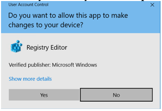
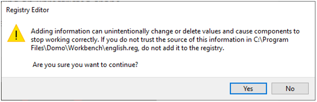
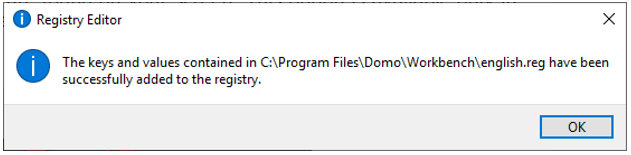

---
    title: Changing Your Workbench Language Back to English
    url: https://domo-support.domo.com/s/article/360048000154
    linked_kbs:  ['[https://domo-support.domo.com/s/knowledge-base/](https://domo-support.domo.com/s/knowledge-base/)', '[https://domo-support.domo.com/s/](https://domo-support.domo.com/s/)', '[https://domo-support.domo.com/s/topic/0TO5w000000ZammGAC](https://domo-support.domo.com/s/topic/0TO5w000000ZammGAC)', '[https://domo-support.domo.com/s/topic/0TO5w000000ZaoPGAS](https://domo-support.domo.com/s/topic/0TO5w000000ZaoPGAS)', '[https://domo-support.domo.com/s/article/360048000154](https://domo-support.domo.com/s/article/360048000154)', '[https://domo-support.domo.com/s/topic/0TO5w000000ZaoPGAS/workbench](https://domo-support.domo.com/s/topic/0TO5w000000ZaoPGAS/workbench)', '[https://domo-support.domo.com/s/article/360043429933](https://domo-support.domo.com/s/article/360043429933)', '[https://domo-support.domo.com/s/article/360043429953](https://domo-support.domo.com/s/article/360043429953)', '[https://domo-support.domo.com/s/article/360042925494](https://domo-support.domo.com/s/article/360042925494)', '[https://domo-support.domo.com/s/article/360043429913](https://domo-support.domo.com/s/article/360043429913)', '[https://domo-support.domo.com/s/article/4408174643607](https://domo-support.domo.com/s/article/4408174643607)', '[https://domo-support.domo.com/s/login/](https://domo-support.domo.com/s/login/)']
    article_id: 000003168
    views: 2,129
    created_date: 2022-10-24 21:11:00
    last updated: 2022-10-24 22:39:00
    ---

In the event that your default Workbench language is changed from English to another language and you want to change it back to English, you have two options:

* Change the preferred language on your Workbench machine to English. This is the recommended option because it doesn't require anything but changing the preferred language back to have Workbench in your language again.
* Override the Workbench language by importing the english.reg file. Use this option if you want to maintain the language on your machine but use Workbench in English.

**To override the Workbench language,**

1. Make sure Workbench is closed.
2. Make sure you are an Admin on your machine.
3. Navigate to **Local Disk (C:) > Program Files > Domo > Workbench**.
4. Open English.reg.
5. Choose **Yes** if you see a prompt like the following:  
   

6. Choose **Yes** when asked if you are sure you want to continue.  
   

7. Click **OK** when you see the following prompt:  
   

When you next open Workbench, the UI will be in English.

