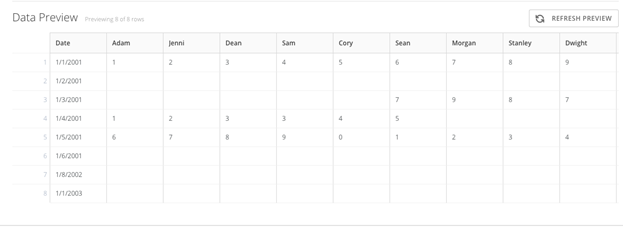
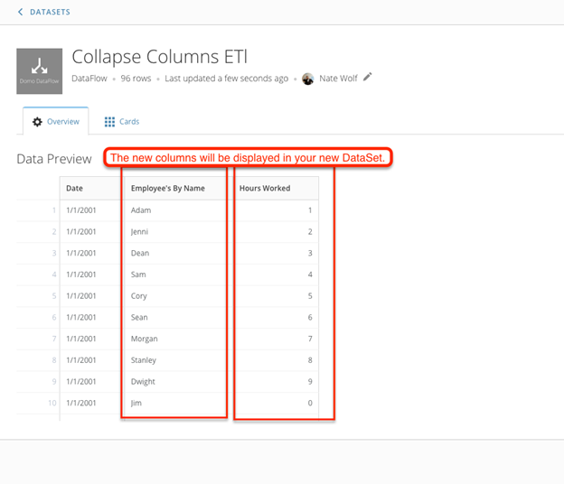

Say you have a DataSet you want to use to build a card. Unfortunately all of the data items are showing up in their own columns, meaning you can't sort them the way you want. You also want all of them to show up on the x-axis, but you can't do this because they're all separate items. Luckily you can get around this problem using a **Collapse Columns** action in Magic ETL. This allows you to pivot a row into a column. For example, you could use this action to convert this DataSet...  
   

into this DataSet:

**To collapse a header row into a column,**

1. In ETL, click and drag an **Input DataSet** tile onto your workspace.
2. Click the **Input DataSet** tile, search for the DataSet you want to use as your input, and click **Done**.
3. Click and drag the **Collapse Columns** tile into your workspace and connect it to your **Input DataSet** tile.
4. Click the **Collapse Columns** tile to open its properties window.
5. In step 1 in the properties window, **Name the column that will hold the column labels**, enter a name for the new category column.  
 In the previous example, the new column is to show the names of the employees, so the user names the column **Employees By Name**.
6. In step 2 in the properties window, **Name the column that will hold the values**, enter a name for the new values column.   
 In the previous example, the new column is to show the hours worked by each employee, so the user names the column **Hours Worked**.
7. In step 3 in the properties window, **Select the columns to collapse**, select the column you want to collapse in the menu, then click **Add Column**. If you want to collapse multiple columns, you can also click **Add All Columns** then click the "x" to the right of each column you don't want to collapse.
8. For each column you add in the previous step, enter a column label in step 4, **Give this column a new label**.
9. Click **Done**.
10. Click and drag an **Output DataSet** tile onto your workspace and connect it to the **Collapse Columns** tile.
11. Click the **Output DataSet** tile and give the output DataSet a name.
12. Give the DataFlow a name by clicking the pencil next to **Add DataFlow Name** in the top left corner of the Magic ETL screen.
13. Save and run the DataFlow.

Your DataFlow will run and generate an output DataSet with the new name you gave it.  

