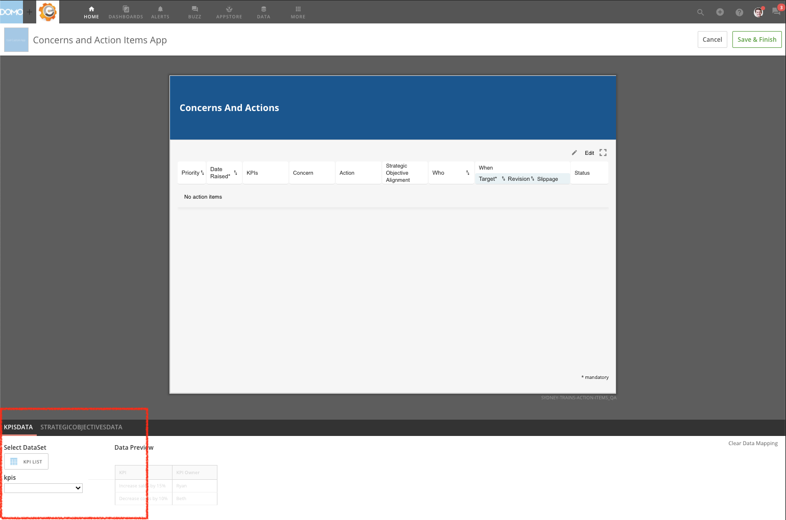

### 1. Check for Data Issues

* Check the DataSet mapping to ensure all the columns required by the app have been mapped to the Domo DataSet(s) powering the app. To check the DataSet mapping,

	1. Select **Edit Card** from the wrench menu.
	2. Scroll down to below the app to see a list of the DataSets powering the app.
	3. Make sure each item has a Domo DataSet selected and fields are mapped to a column in the DataSet.  
	  
	
* Check column types

	+ Apps require columns to be a specific data type such as text, date, or number. Ensure that each column from the DataSet(s) powering the app match the sample DataSet schema.
* Use valid column names

	+ Avoid special characters in column names, especially periods.
* Check data to make sure the values are in the proper ranges.
* Check data to ensure there are no unnecessary null values.
* If a DataFlow output is used to power the app, check to make sure that no DataFlow data type mismatch occurs.
* Check for zero-length characters that could have been passed into the Domo DataSet from the DataSet source such as Excel or ODBC, for example. Zero-length characters can be removed in MySQL DataFlows.

### 2. Check Developer Tools

1. Navigate to the card details view of the app.
2. Using Chrome, open the Developer Tools by right-clicking on the page and selecting Inspect.
3. Navigate to the Network tab.
4. Then, refresh your Chrome page.
5. Look for any failed requests which will be shown in red. Failed requests may help identify columns that aren't mapped correctly or expose other issues in the app.

### 3. Contact Engineering Services

The Engineering Services team can be contacted by emailing [es.maintenance@domo.com](mailto:es.maintenance@domo.com "mailto:es.maintenance@domo.com") for apps built by Domo. Please provide the following information when contacting them.

* App name
* Instance in which it was deployed
* The error that is occurring
* Steps to reproduce the error
* Device and browser information
