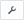

By default, you do not receive notifications when DataFlows fail to update. In the Data Center, you can change this default behavior for individual DataSets so you receive notifications via email when those DataSets do not update. You do *not* need to be the owner of a DataSet to receive notifications for it.

 

**Notes:**

* Default notification settings differ for Magic ETL DataFlows vs SQL DatFlows and DataFlows. 

	+ By default, notifications are set when you create a Magic ETL DataFlows.
	+ By default, notifications are *not* set when you create a SQL DataFlow.  
	
	
		- You must set notifications for each DataFlow you want to subscribe to. (You *cannot* set notifications for other users.)
* DataFlow notifications are sent via email to your primary email address as it is entered in the Admin Settings in Domo. These notifications will *not* be sent to your secondary email.
* DataFlow notifications indicate that a DataFlow fails while running, but do *not* indicate that a DataFlow did not run if an input DataSet failed to update.   
 If you want to receive notifications that an input DataSet failed to update, subscribe to notifications on the input DataSets.

**To turn on email notifications for a DataFlow,**

1. In Domo, click **Data** in the toolbar at the top of the screen.
2. Click  in the left-hand navigation pane.
3. Locate the DataFlow you want to turn on notifications for.  
 You can use the filter options to narrow down the DataFlows that appear in the list. For more information, see [Data Center Layout](/s/article/360043430633 "Data Center Layout").
4. Mouse over the desired DataFlow then click  to display a list of options. (You can also access this menu from the Details view for the DataFlow.)
5. Click **Notifications**.
6. Click the second radio button.

You will now receive email notifications in the event that this DataFlow fails to update.

To turn off notifications for a DataFlow, repeat the previous steps, selecting the first radio button in the last step.

