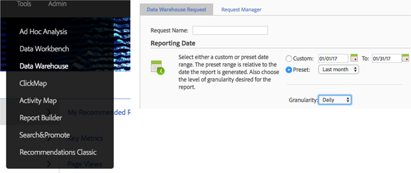
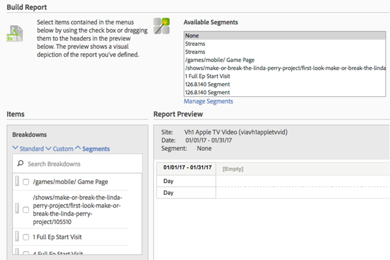
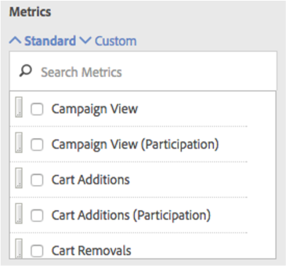
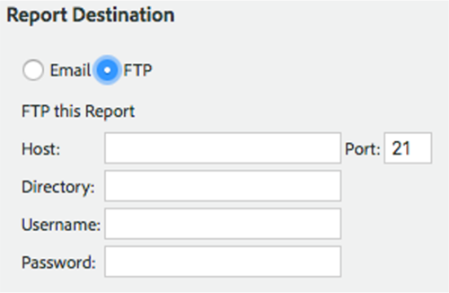
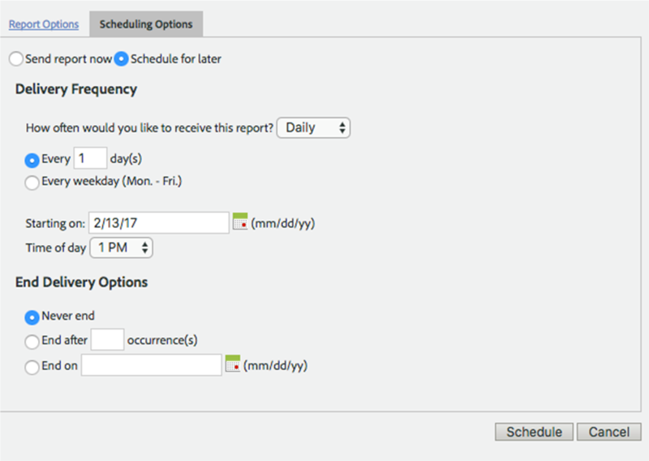
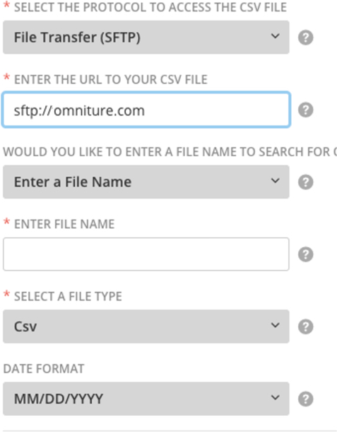

Intro
-----

This topic walks you through the process of pulling data into Domo from Adobe Analytics Data Warehouse. 

This process can be broken down into 3 parts, as follows:

1. Setting up an Adobe-hosted FTP account
2. Setting up reports in Data Warehouse
3. Setting up an SFTP connection using the CSV Advanced connector

Setting up an Adobe-Hosted FTP Account
--------------------------------------

To connect to Adobe Analytics Data Warehouse, you will first need to have your Adobe administrator set up an Adobe-hosted FTP account. Adobe maintains highly available, high-performance FTP clusters that are specifically designed to improve file transfer reliability, while continuing to ensure high performance.

Your Adobe administrator should do the following:

1. Set up your FTP account using host name <ftp.omniture.com>. Your username and password should be provided by an Adobe representative.
2. Once the account is set up, verify it is active by connecting to it through an FTP client like Cyberduck or FileZilla.

Setting up Reports in Data Warehouse
------------------------------------

Your next step in connecting to Data Warehouse data is making sure reports are configured correctly.

1. Log in to Omniture using credentials that have access to the Adobe Analytics Data Warehouse as well as the desired report suites, dimensions, and segments.
2. Select **Data Warehouse** in the **Tools** menu.  
By default you will be taken to the **Requests** tab.
3. Enter a request name as well as the desired date range.
4. Set the granularity to "Daily." (Other date granularities such as "Weekly," "Monthly," etc. return a string that is difficult to use in Domo.)  
  

5. Build out your report by checking boxes of desired segments in the **Breakdown** section or by dragging segments from this section into the **Report Preview** area. Segments in the **Breakdown** list are added to a DataSet column with a 0 or a 1 to denote whether or not the segment applies to that row.  
  
Dimensions can be either standard or custom breakdowns.  
  

6. Select the desired metrics (either standard or custom).  
  

7. Select **Advanced Delivery Options** to schedule the report and send it to the SFTP location.
8. In **Advanced Delivery Options**, create a file name, and decide whether you want to append a date range and whether you want to compress to a zip file.
9. Select **FTP** as the report destination.

	* The **Host** should be ftp.omniture.com.
	* For **Username** and **Password**, use the credentials provided to you by the Adobe administrator who set up your FTP connection.  
	  
	
10. In the **Scheduling Options** tab, select the **Schedule for later** radio button.  
  
You can then set the report to send on whatever cadence you want, such as daily, weekly, monthly, etc.
11. Select the time of day you want the report to send to the FTP site.
12. Click **Schedule** to save all changes.
13. (Optional) In the **Send To** box, specify an email address to which you want to send confirmation emails upon success or failure. Then click **Request this report** to finish creating the scheduled report.  
  

Setting Up the SFTP Connection
------------------------------

In the final step of this process, you will set up an SFTP connection using the [CSV Advanced](/s/article/360043436513 "CSV Advanced Connector") connector. 

1. In Domo, create a new CSV Advanced connection.

	1. In the **Credentials** pane, enter the username and password you will use to authenticate to the Omniture FTP site. Ignore the other input boxes
	2. In the **Details** pane...
	
	
		1. In the first dropdown menu, select **File Transfer (SFTP)**.
		2. In the URL box, enter the [subdomain.omniture.com](http://subdomain.omniture.com) of your Adobe FTP hostname.
		
		
		For example, the Adobe FTP hostname is <ftp4.omniture.com> so you would enter s<ftp://ftp4.omniture.com>. To learn more about the Adobe FTP hostname, visit <https://experienceleague.adobe.com/docs/analytics/export/ftp-and-sftp/set-up-ftp-accounts/ftp-accounts.html?lang=en>.
		3. In the second dropdown menu, select **Enter a File Name**.
		4. In the **Enter a File Name** box, enter the file name you want to connect to.
		5. In the **Select a File Type** menu, select **CSV**.  
		  
		
	3. Finish up with the scheduling, naming, etc.
