---
    title: Connecting to SAP BW in Domo
    url: https://domo-support.domo.com/s/article/360043437653
    linked_kbs:  ['[https://domo-support.domo.com/s/knowledge-base/](https://domo-support.domo.com/s/knowledge-base/)', '[https://domo-support.domo.com/s/](https://domo-support.domo.com/s/)', '[https://domo-support.domo.com/s/topic/0TO5w000000ZammGAC](https://domo-support.domo.com/s/topic/0TO5w000000ZammGAC)', '[https://domo-support.domo.com/s/topic/0TO5w000000ZanzGAC](https://domo-support.domo.com/s/topic/0TO5w000000ZanzGAC)', '[https://domo-support.domo.com/s/article/360043437653](https://domo-support.domo.com/s/article/360043437653)', '[https://domo-support.domo.com/s/topic/0TO5w000000ZanzGAC/other-connection-methods](https://domo-support.domo.com/s/topic/0TO5w000000ZanzGAC/other-connection-methods)', '[https://domo-support.domo.com/s/article/360043429933](https://domo-support.domo.com/s/article/360043429933)', '[https://domo-support.domo.com/s/article/360043429953](https://domo-support.domo.com/s/article/360043429953)', '[https://domo-support.domo.com/s/article/360042925494](https://domo-support.domo.com/s/article/360042925494)', '[https://domo-support.domo.com/s/article/360043429913](https://domo-support.domo.com/s/article/360043429913)', '[https://domo-support.domo.com/s/article/4408174643607](https://domo-support.domo.com/s/article/4408174643607)', '[https://domo-support.domo.com/s/login/](https://domo-support.domo.com/s/login/)']
    article_id: 000003164
    views: 2,180
    created_date: 2022-10-24 21:11:00
    last updated: 2022-10-24 22:42:00
    ---

Overview
--------

To connect to SAP BW data in Domo, you must establish a DOMO-SAP data link. To do this, you will go through all of the following steps:

1. [Establish an RFC connection between DOMO and BW](#h_a2635c0d-ff35-4b30-bf47-ee85a8733104 "SAP BW Connector")
2. [Create a Logical File](#h_dcb3c085-e171-4d5d-b6e2-deed0188d285 "SAP BW Connector")
3. [Find the Data Structure of your BW Object](#h_69801cf8-6231-4453-93f1-4259332b6b5f "SAP BW Connector")
4. [Build your APD](#h_2a5ec744-50f8-4a9b-8bed-0e274093b27f "SAP BW Connector")

Step 1: Establishing an RFC connection between Domo and BW
----------------------------------------------------------

1. In mySAP ERP, run Transaction SM59.  
   
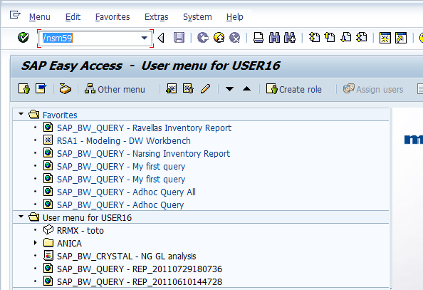
2. Select **HTTP Connections to External Server** and click **Create**.  
   
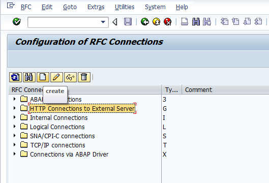
3. Fill in the following fields: 

	* **RFC Destination**
	* **Description 1**
	* **Target Host**
	* **Service No.**
	* **Path Prefix**  
	   
	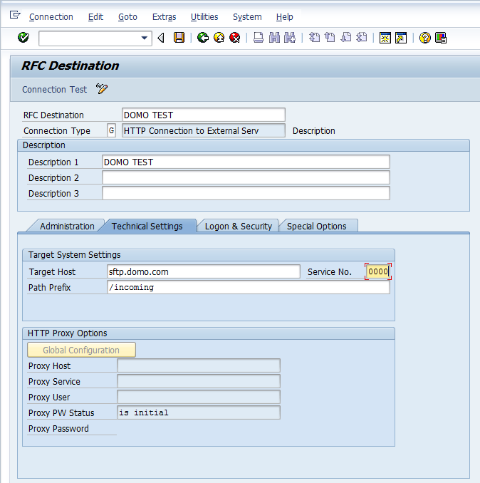
4. Click the **Logon & Security** tab.
5. Select the **Basic Authentication** radio button.  
   
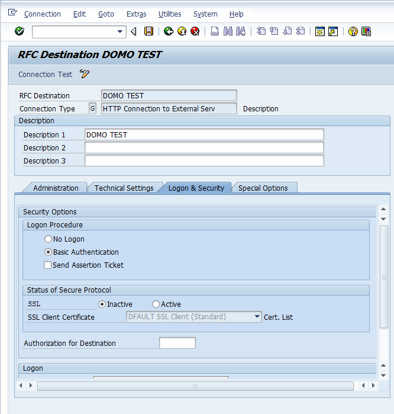
6. Scroll down and enter a username and password.  
   
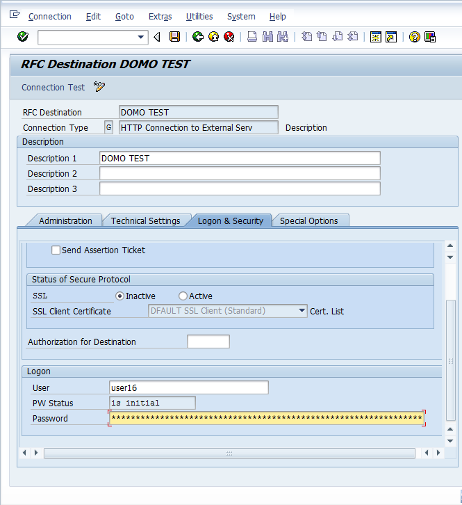
7. Click **Save**.

Your RFC connection is now established.

Step 2: Creating a Logical File
-------------------------------

1. In mySAP ERP, run Transaction FILE.
2. Select **New Entries**.  
   
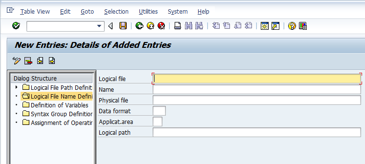
3. Fill in the fields as follows:

|  |  |
| --- | --- |
| Logical file | Z\_DOMO\_DROP\_FILE |
| Name | Domo drop |
| Physical file | DOMO TEST<YEAR><MONTH><DATE>\_<HOUR><MINUTE><SECOND>.csv |
| Data format | ASC |
| Applicat.area | FI |
| Logical path | Z\_DOMO\_DROP |

  
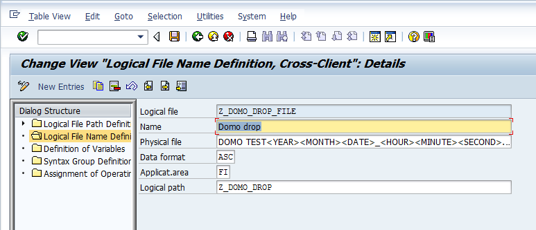
4. Click **Save**.
5. Enter your transport information.

Step 3: Finding the Data Structure of your BW Object
----------------------------------------------------

1. In Data Warehousing Workbench, run transaction RSA1.
2. Select **BI Content**.  
   
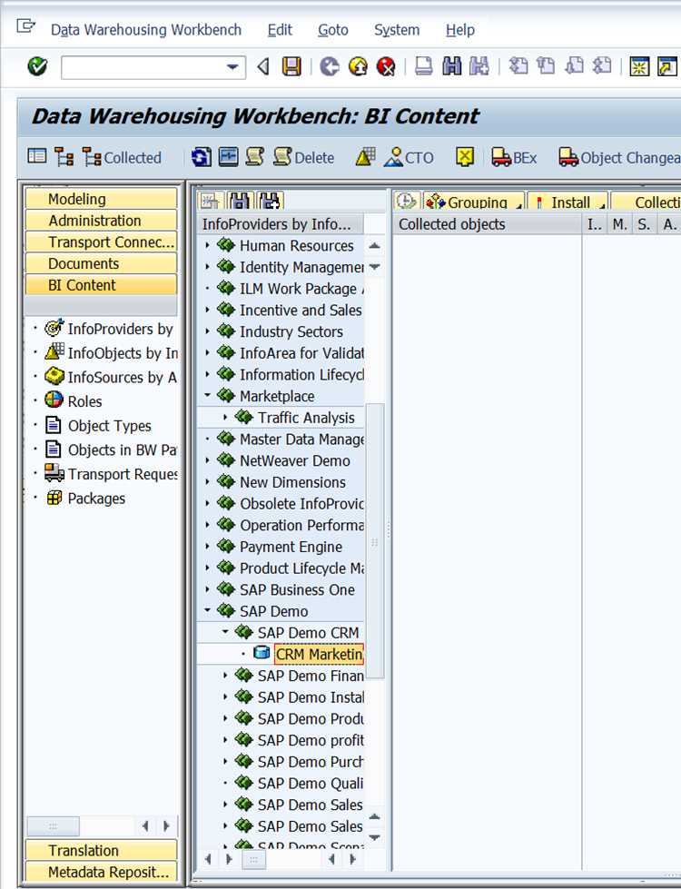
3. Navigate to the desired BW object and double-click it.
4. Click **Key Figures**.  
   
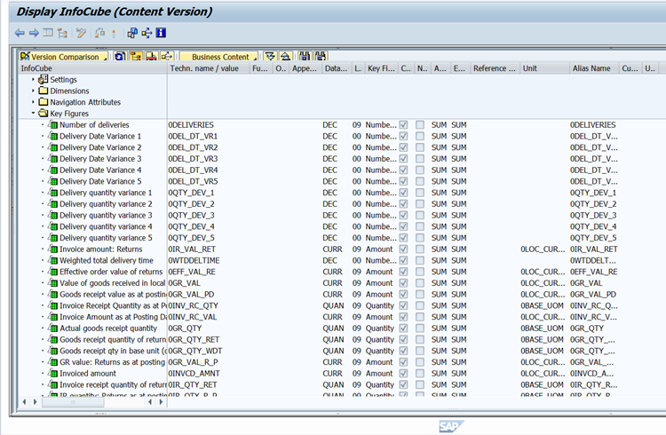

The data structure of the object opens for you to view.

Step 4: Building Your APD
-------------------------

1. In Data Warehousing Workbench, run transaction RSA1.
2. Open the Analysis Process Designer (APD).  
   
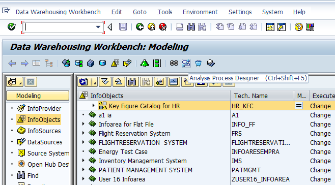
3. Select **General** then click **Create**.  
   
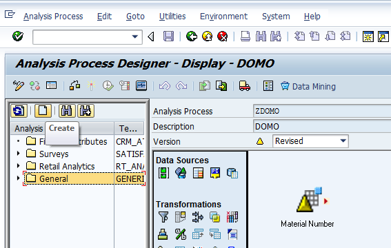
4. Select **General Application**.  
   
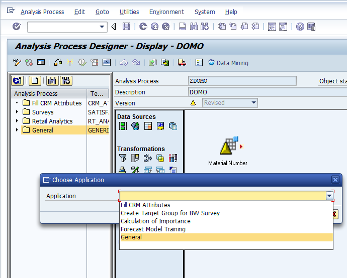
5. Enter a description in the **Description** field.
6. Select your Data Source (in this case an InfoProvider).  
   
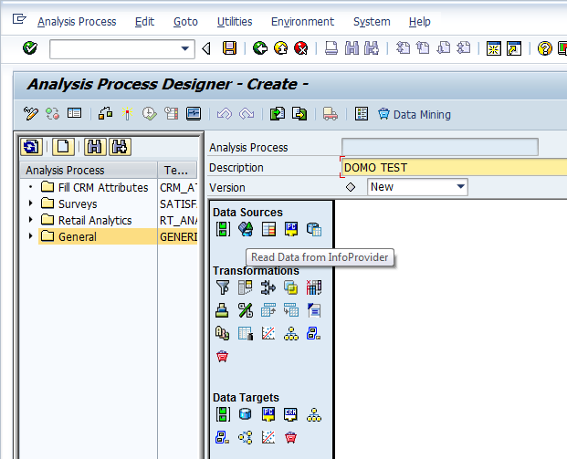
7. Name the Data Source.
8. Select an InfoProvider.  
 You can also limit the fields sent.  
   
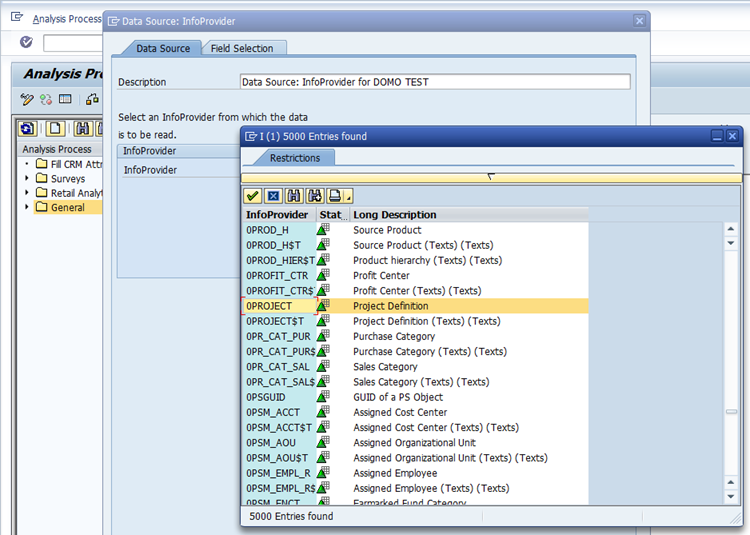  
   
   
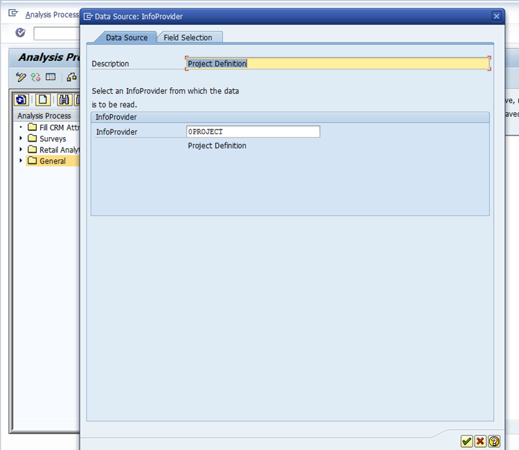  
   
   
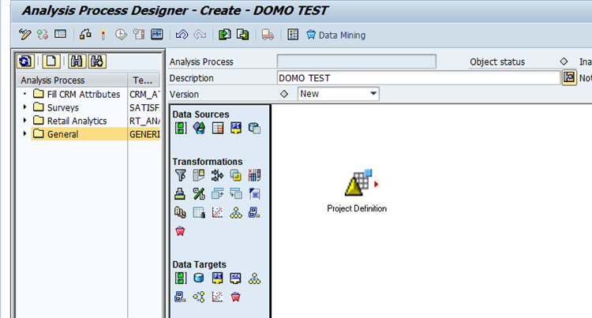
9. Select **Write Data to File**.  
   
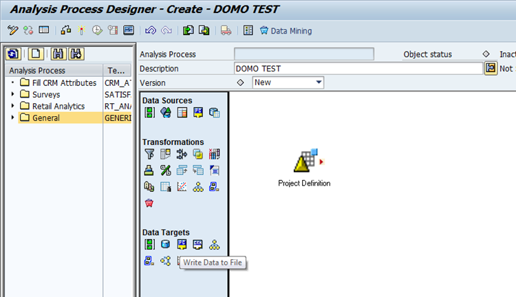  
   
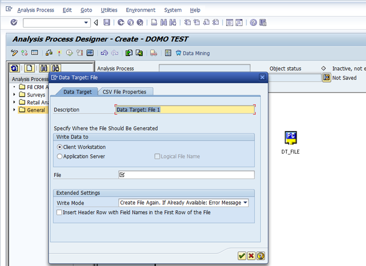
10. In the **Data Target: File** dialog, do the following:

	1. Enter a description for the file in the **Description** field.
	2. Select the **Application Server** radio button.
	3. Check the box for **Logical File Name**.
	4. Enter your new logical file name in the **File** field.
	5. Click the green check box.  
	   
	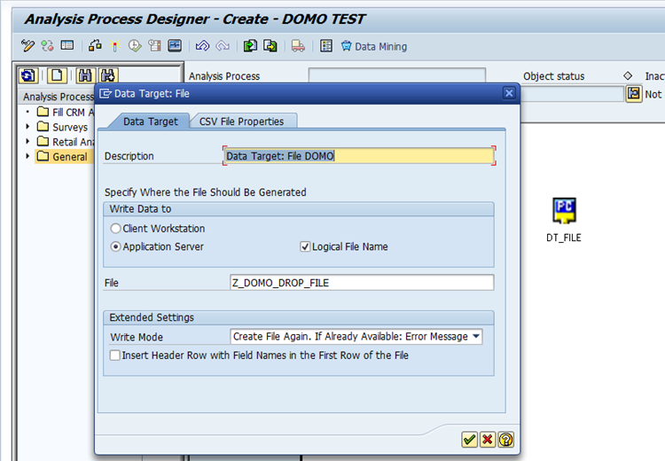
11. Click and drag to connect the nodes.  
   
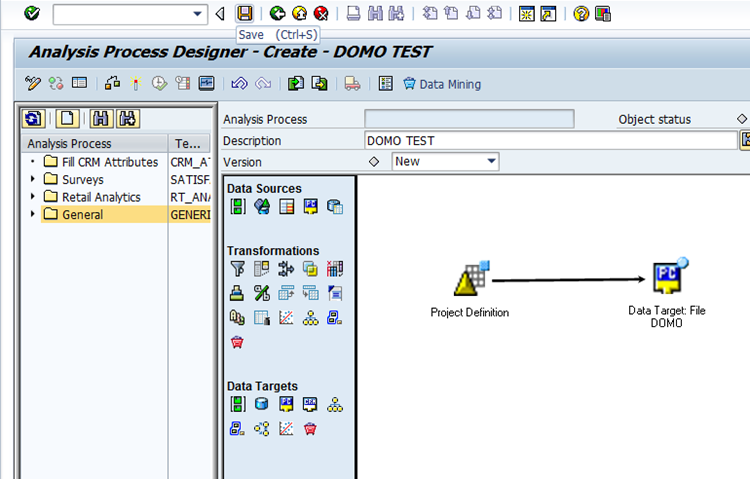
12. Save your changes.
13. Click the **Activate** icon.
