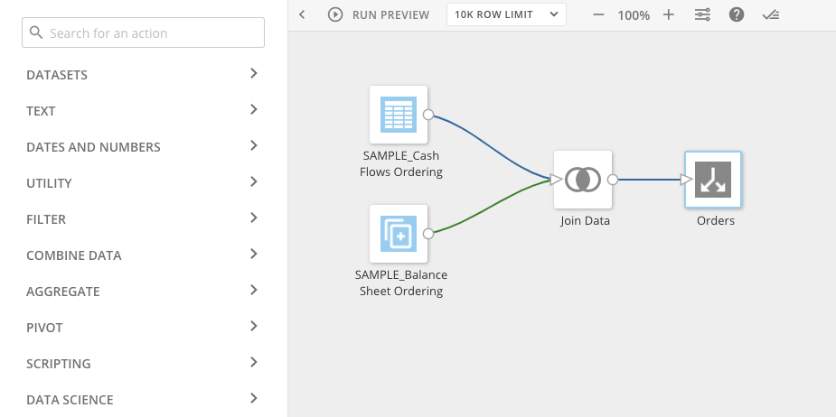
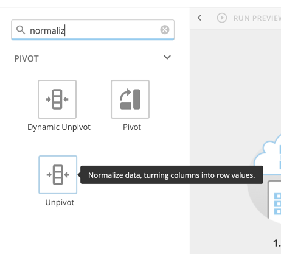

---
    title: Creating a Magic ETL DataFlow
    url: https://domo-support.domo.com/s/article/360055259234
    linked_kbs:  ['[https://domo-support.domo.com/s/knowledge-base/](https://domo-support.domo.com/s/knowledge-base/)', '[https://domo-support.domo.com/s/](https://domo-support.domo.com/s/)', '[https://domo-support.domo.com/s/topic/0TO5w000000ZamzGAC](https://domo-support.domo.com/s/topic/0TO5w000000ZamzGAC)', '[https://domo-support.domo.com/s/topic/0TO5w000000ZanvGAC](https://domo-support.domo.com/s/topic/0TO5w000000ZanvGAC)', '[https://domo-support.domo.com/s/article/360044876094](https://domo-support.domo.com/s/article/360044876094)', '[https://domo-support.domo.com/s/article/360044876194](https://domo-support.domo.com/s/article/360044876194)', '[https://domo-support.domo.com/s/article/360045259294](https://domo-support.domo.com/s/article/360045259294)', '[https://domo-support.domo.com/s/article/360045402273](https://domo-support.domo.com/s/article/360045402273)', '[https://domo-support.domo.com/s/article/360045402313](https://domo-support.domo.com/s/article/360045402313)', '[https://domo-support.domo.com/s/article/360044876614](https://domo-support.domo.com/s/article/360044876614)', '[https://domo-support.domo.com/s/article/360044951294](https://domo-support.domo.com/s/article/360044951294)', '[https://domo-support.domo.com/s/article/360045485833](https://domo-support.domo.com/s/article/360045485833)', '[https://domo-support.domo.com/s/article/360045402873](https://domo-support.domo.com/s/article/360045402873)', '[https://domo-support.domo.com/s/article/360044876874](https://domo-support.domo.com/s/article/360044876874)', '[https://domo-support.domo.com/s/article/360047787514](https://domo-support.domo.com/s/article/360047787514)', '[https://domo-support.domo.com/s/article/360043439333](https://domo-support.domo.com/s/article/360043439333)', '[https://domo-support.domo.com/s/article/360043427673](https://domo-support.domo.com/s/article/360043427673)', '[https://domo-support.domo.com/s/article/360042923074](https://domo-support.domo.com/s/article/360042923074)', '[https://domo-support.domo.com/s/article/360055259234](https://domo-support.domo.com/s/article/360055259234)', '[https://domo-support.domo.com/s/topic/0TO5w000000ZanvGAC/magic-etl](https://domo-support.domo.com/s/topic/0TO5w000000ZanvGAC/magic-etl)', '[https://domo-support.domo.com/s/article/360043429933](https://domo-support.domo.com/s/article/360043429933)', '[https://domo-support.domo.com/s/article/360043429953](https://domo-support.domo.com/s/article/360043429953)', '[https://domo-support.domo.com/s/article/360042925494](https://domo-support.domo.com/s/article/360042925494)', '[https://domo-support.domo.com/s/article/360043429913](https://domo-support.domo.com/s/article/360043429913)', '[https://domo-support.domo.com/s/article/4408174643607](https://domo-support.domo.com/s/article/4408174643607)', '[https://domo-support.domo.com/s/login/](https://domo-support.domo.com/s/login/)']
    article_id: 000004572
    views: 3,581
    created_date: 2022-10-24 22:15:00
    last updated: 2022-10-24 22:41:00
    ---

Intro
-----

You create Magic ETL DataFlows using an intuitive drag-and-drop interface available in the Data Center. You simply drag your DataSets onto a canvas, then add your desired tiles to indicate how the DataSets should be joined and transformed. The curved lines are color-coded according to the DataSet used as an input. The color will persist after a Join tile to show which input DataSet was the main table in the join. A huge list of tiles is available. You can combine columns, filter rows, replace text, and so on. For detailed information about tiles, see the following topics:

* [Magic ETL Tiles: Aggregate](/s/article/360044876094 "Magic ETL v2 Tiles: Aggregate (Beta)")
* [Magic ETL Tiles: Combine Data](/s/article/360044876194 "Magic ETL v2 Tiles: Combine Data (Beta)")
* [Magic ETL Tiles: Data Science](/s/article/360045259294 "Magic ETL v2 Tiles: Data Science (Beta)")
* [Magic ETL Tiles: DataSets](/s/article/360045402273 "Magic ETL v2 Tiles: DataSets (Beta)")
* [Magic ETL Tiles: Dates and Numbers](/s/article/360045402313 "Magic ETL v2 Tiles: Dates and Numbers (Beta)")
* [Magic ETL Tiles: Filter](/s/article/360044876614 "Magic ETL v2 Tiles: Filter (Beta)")
* [Magic ETL Tiles: Pivot](/s/article/360044951294 "Magic ETL v2 Tiles: Pivot (Beta)")
* [Magic ETL Tiles: Scripting](/s/article/360045485833 "Magic ETL v2 Tiles: Scripting (Beta)")
* [Magic ETL Tiles: Text](/s/article/360045402873 "Magic ETL v2 Tiles: Text (Beta)")
* [Magic ETL Tiles: Utility](/s/article/360044876874 "Magic ETL v2 Tiles: Utility (Beta)")

 

**Important:** There are significant behavioral differences in the new Magic ETL. Read the **[Behavior Changes and Feature Updates in Magic ETL](/s/article/360047787514 "Upgrading to the New Magic ETL")** article before converting mission-critical Magic ETL DataFlows. **Failure to do so may risk an unintended change to your DataFlow’s behavior.**

**Video - Magic ETL Overview**

 

**Important:**Input DataSets in a DataFlow cannot be restricted by PDP policies—all available rows *must* pass through the DataFlow. Because of this, you must apply PDP policies to the output DataSets generated by a DataFlow.  
 

When you build a DataFlow using an input DataSet with PDP policies in place, the DataFlow breaks unless at least one of the following criteria applies:

* You have an "Admin" security role or a custom role with "Manage DataFlows" enabled.
* You are the DataSet owner.
* You are part of the "All Rows" policy. This gives you access to all of the rows in the DataSet.

For more information about using PDP with DataFlows, see [PDP and DataFusions/DataFlows](/s/article/360043439333 "http://knowledge.domo.com?cid=pdpdatafusions"). 

Creating Magic ETL DataFlows
----------------------------

Use the steps in this section to help you create Magic ETL DataFlows.

**To create a Magic ETL DataFlow,**

1. In Domo, click **Data** in the toolbar at the top of the screen.
2. Click **ETL** in the **Magic Transform** toolbar at the top of the window.

 

**Tip:** You can also open the Magic ETL editor from anywhere in Domo by selecting  **Add** in the navigation header and selecting **Data >** **ETL**.
3. Add and configure an **Input DataSet** by doing the following:

	1. In the **Tiles** panel, expand **DataSets**, then drag **Input DataSet** to the canvas.
	2. Click the **Input DataSet** tile, then select the DataSet to transform.
4. Add an **Output DataSet** by doing the following:

	1. In the **Tiles** panel, in **DataSets**, drag **Output DataSet** to the canvas.  
	You can configure the **Output DataSet** tile after you connect a tile to it.
5. Drag other tiles from the **Tiles** panel to the canvas to transform (clean, aggregate, join, etc.) the input DataSets.  
For more information, see the following:

	* [Magic ETL Tiles: Aggregate](/s/article/360044876094 "Magic ETL v2 Tiles: Aggregate (Beta)")
	* [Magic ETL Tiles: Combine Data](/s/article/360044876194 "Magic ETL v2 Tiles: Combine Data (Beta)")
	* [Magic ETL Tiles: Data Science](/s/article/360045259294 "Magic ETL v2 Tiles: Data Science (Beta)")
	* [Magic ETL Tiles: DataSets](/s/article/360045402273 "Magic ETL v2 Tiles: DataSets (Beta)")
	* [Magic ETL Tiles: Dates and Numbers](/s/article/360045402313 "Magic ETL v2 Tiles: Dates and Numbers (Beta)")
	* [Magic ETL Tiles: Filter](/s/article/360044876614 "Magic ETL v2 Tiles: Filter (Beta)")
	* [Magic ETL Tiles: Pivot](/s/article/360044951294 "Magic ETL v2 Tiles: Pivot (Beta)")
	* [Magic ETL Tiles: Scripting](/s/article/360045485833 "Magic ETL v2 Tiles: Scripting (Beta)")
	* [Magic ETL Tiles: Text](/s/article/360045402873 "Magic ETL v2 Tiles: Text (Beta)")
	* [Magic ETL Tiles: Utility](/s/article/360044876874 "Magic ETL v2 Tiles: Utility (Beta)")
	
	
	
	
	 
	
	
	**Tip:** You can search for items listed in the tooltip text to help you find the tile that you need.  
	  
	
6. Draw connections between the transform tiles to sequence operations in the transformation flow.
7. Configure each tile, by clicking the tile, then specifying the options. 

 

**Tip:**You can get help on a tile in the canvas by clicking the tile, then clicking . You can also select a number of tiles at once by clicking on the canvas then dragging the mouse pointer over them. Once multiple tiles are selected, you can drag all of the selected tiles as a group to where you want them. You can also delete the selected tiles by clicking **Delete** in the panel on the left side of the screen.
8. Configure the **Output DataSet** tile by doing the following:

	1. Connect a tile to the **Output DataSet** tile.
	2. Click the **Output DataSet** tile, then specify the name of the new DataSet to output.
9. (Optional) Configure settings for when the transformation flow runs.  
By default, the transformation flow runs only when you run it manually. You can schedule the Magic ETL DataFlow to run whenever the specified input DataSets change or at a set time. For detailed instructions on how to do this, see [Scheduling a Magic ETL DataFlow](/s/article/360043427673).
10. Specify the name and description of the Magic ETL DataFlow.
11. Click **Save** to save the Magic ETL DataFlow, enter a version description if desired, then click **Save** to confirm.

When you save a DataFlow, an entry for this version is added to the **Versions** tab in the Details view for the DataFlow. If you entered a description when saving, that description is shown in the entry for the DataFlow. For more information about versions, see [Viewing the Version History for a DataFlow](/s/article/360042923074 "Viewing the Version History for a DataFlow").

 

**Note:** Many users ask why output DataSets for a DataFlow are not marked as "Updated" when the DataFlow runs successfully. This is usually because the data has not actually changed—no update has occurred. Therefore, the DataSets do not show as updated. 

Best Practices for Creating DataFlows
-------------------------------------

Each DataFlow should...

* only include DataSets that are necessary for the output DataSet.
* filter out rows you don't need at the beginning of the DataFlow.
* reduce the number of columns to only those you need.
* include descriptive names for each tile in the DataFlow.
* include a description of the DataFlow that lists:

	+ the input DataSets being merged or manipulated
	+ the DataSet being created
	+ the owner of the DataSets
* be named the same as the output DataSet—Because the outputs of a DataFlow become their own DataSet in the Data Center, this allows for easy identification of which DataSets are produced by which DataFlows.
* be aware that some tiles take longer than others, including:

	+ Group By
	+ Join Data
	+ Remove Duplicates
	+ Pivot
	+ Rank & Window
	+ Scripting
	+ Data Science
