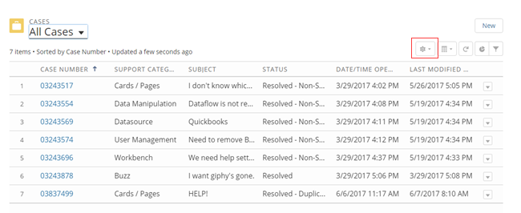
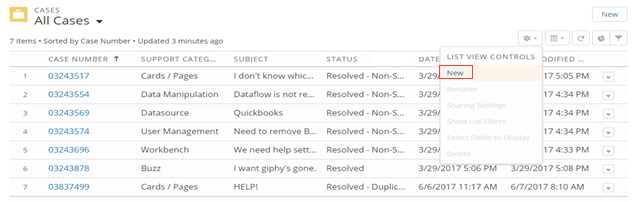
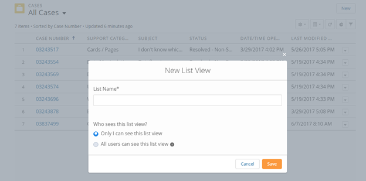
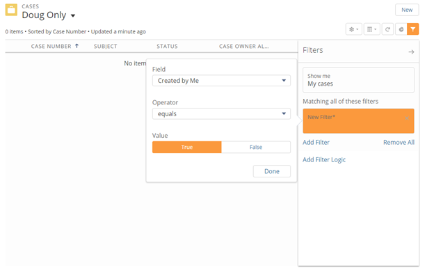
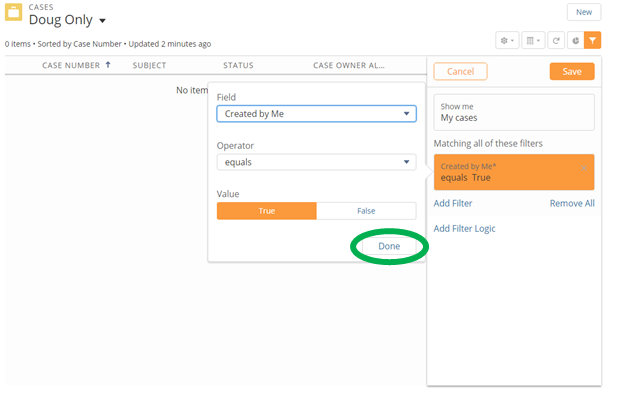
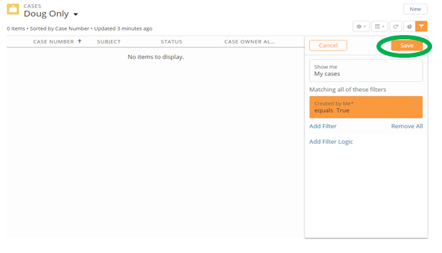

---
    title: Creating a New List in the Customer Portal
    url: https://domo-support.domo.com/s/article/360043427533
    linked_kbs:  ['[https://domo-support.domo.com/s/knowledge-base/](https://domo-support.domo.com/s/knowledge-base/)', '[https://domo-support.domo.com/s/](https://domo-support.domo.com/s/)', '[https://domo-support.domo.com/s/topic/0TO5w000000ZamsGAC](https://domo-support.domo.com/s/topic/0TO5w000000ZamsGAC)', '[https://domo-support.domo.com/s/topic/0TO5w000000ZaoIGAS](https://domo-support.domo.com/s/topic/0TO5w000000ZaoIGAS)', '[https://domo-support.domo.com/s/article/360042922874](https://domo-support.domo.com/s/article/360042922874)', '[https://domo-support.domo.com/s/article/360043427533](https://domo-support.domo.com/s/article/360043427533)', '[https://domo-support.domo.com/s/topic/0TO5w000000ZaoIGAS/support-resources](https://domo-support.domo.com/s/topic/0TO5w000000ZaoIGAS/support-resources)', '[https://domo-support.domo.com/s/article/360043429933](https://domo-support.domo.com/s/article/360043429933)', '[https://domo-support.domo.com/s/article/360043429953](https://domo-support.domo.com/s/article/360043429953)', '[https://domo-support.domo.com/s/article/360042925494](https://domo-support.domo.com/s/article/360042925494)', '[https://domo-support.domo.com/s/article/360043429913](https://domo-support.domo.com/s/article/360043429913)', '[https://domo-support.domo.com/s/article/4408174643607](https://domo-support.domo.com/s/article/4408174643607)', '[https://domo-support.domo.com/s/login/](https://domo-support.domo.com/s/login/)']
    article_id: 000004378
    views: 2,144
    created_date: 2022-10-24 21:45:00
    last updated: 2022-10-24 22:42:00
    ---

In the Domo Customer Portal, you can create lists of cases based on different criteria. This is especially useful for Admin-level users who want to be able to view just their own cases instead of the entire list of cases in their Domo instance. This walkthrough shows you how to do this.

**To create a list in the Customer Portal,**

1. Access the Customer Portal through support.domo.com.
2. In the Portal, click the gear icon in the button bar in the top right corner.  
   
 
3. Select **New** in the gear menu.  
   
 
4. Enter a name for the new list.
5. Leave the default setting of **Only I can see this list view**.
6. Click **Save**.  
   
 
7. Add the desired filters.  
 In this example, an Admin sets a filter allowing them to see only the cases they created as a specific user.  
   
 
8. Click **Done**.  
   
 
9. Click **Save**.    
   
 

Your new list is now created.

For more information about the Support Portal, see [Getting Help](/s/article/360042922874 "Getting Help").

