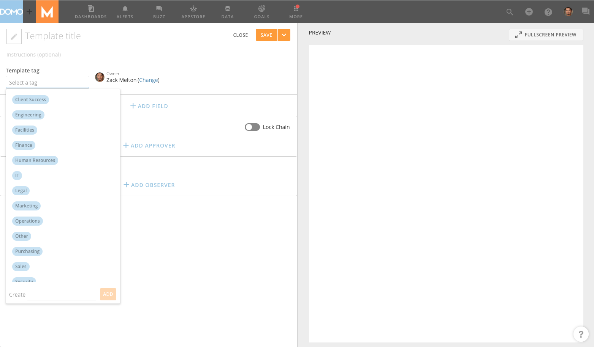
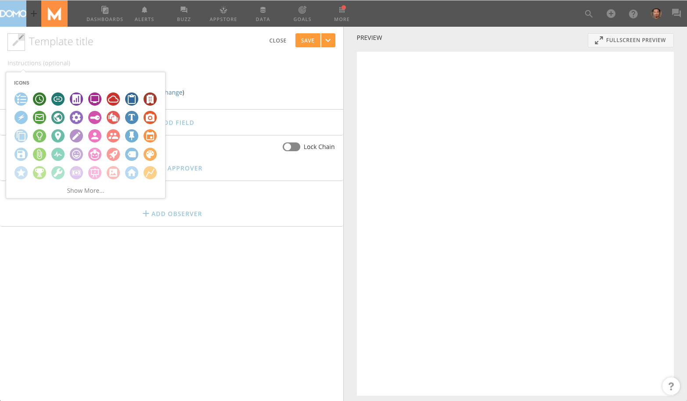
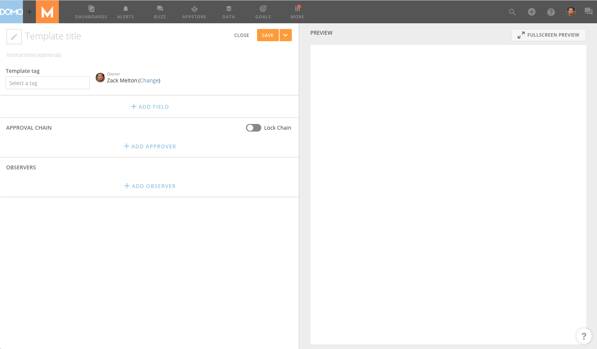
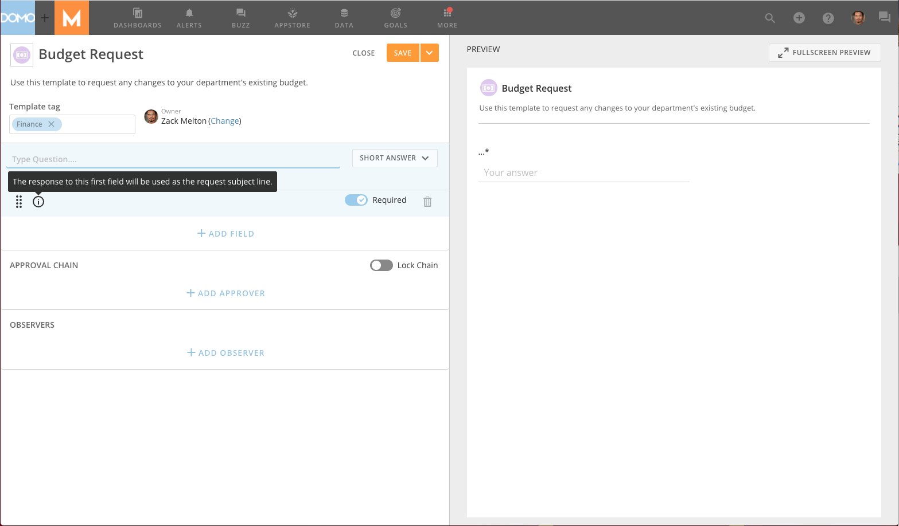

---
    title: Creating a Request Template
    url: https://domo-support.domo.com/s/article/360042926034
    linked_kbs:  ['[https://domo-support.domo.com/s/knowledge-base/](https://domo-support.domo.com/s/knowledge-base/)', '[https://domo-support.domo.com/s/](https://domo-support.domo.com/s/)', '[https://domo-support.domo.com/s/topic/0TO5w000000ZamlGAC](https://domo-support.domo.com/s/topic/0TO5w000000ZamlGAC)', '[https://domo-support.domo.com/s/topic/0TO5w000000Zan5GAC](https://domo-support.domo.com/s/topic/0TO5w000000Zan5GAC)', '[https://domo-support.domo.com/s/article/360043430593](https://domo-support.domo.com/s/article/360043430593)', '[https://domo-support.domo.com/s/article/360042926034](https://domo-support.domo.com/s/article/360042926034)', '[https://domo-support.domo.com/s/topic/0TO5w000000Zan5GAC/approvals](https://domo-support.domo.com/s/topic/0TO5w000000Zan5GAC/approvals)', '[https://domo-support.domo.com/s/article/360043429933](https://domo-support.domo.com/s/article/360043429933)', '[https://domo-support.domo.com/s/article/360043429953](https://domo-support.domo.com/s/article/360043429953)', '[https://domo-support.domo.com/s/article/360042925494](https://domo-support.domo.com/s/article/360042925494)', '[https://domo-support.domo.com/s/article/360043429913](https://domo-support.domo.com/s/article/360043429913)', '[https://domo-support.domo.com/s/article/4408174643607](https://domo-support.domo.com/s/article/4408174643607)', '[https://domo-support.domo.com/s/login/](https://domo-support.domo.com/s/login/)']
    article_id: 000003011
    views: 2.167
    created_date: 2022-10-24 20:59:00
    last updated: 2022-10-24 22:39:00
    ---

In Approvals, you can create request templates that anyone can use to submit requests. Whether it’s a new budget proposal, a time off request, or something in between, Approvals is designed to allow you to incorporate all of your company’s unique approval processes. When creating a template, you determine the information that must be provided before submitting a request, and the individuals or groups will review it.

This topic discusses the specific steps for configuring a request template. For general information about the layout of Approvals, see [Submitting a Request for Approval](/s/article/360043430593 "Approval Center Layout").

**To create a request template,**

1. Select  **> Approvals**.
2. In the left-hand navigation pane, click **Manage templates**.
3. Click **Create New** in the top-right corner of the screen.
4. Enter a unique name for the template in the **Template title**area at the top of the screen, also assign it an icon and a tag.  
   
  
  

5. (Optional) If you want to include specific instructions for users filling out this form, enter those instructions in the**Instructions** field.
6. Click **Add Field** to add fields for users to enter information when submitting requests with this template.

 

**Note:** The information that a user provides to the first field will be used as the title of the request.

7. For each additional field you want to include in this template, do the following:

	1. In the **Type** menu, select the appropriate field type for the desired response.  
	   
	 The following table lists and describes all of the available field types:
	
	
	
	| Field Type | Description | Example |
	| --- | --- | --- |
	| Short Answer | Allows users to enter a single line of text as a response. Also appropriate for times (as we currently do not have a field specific to times). | request_short_answer.png |
	| Paragraph | Allows users to enter a paragraph (multiple lines of text) as a response. Also appropriate for lists.  | request_paragraph.png |
	| Number | Allows users to enter a string of numbers as a response. | request_number.png |
	| Currency | Allows users to enter currency values as a response as well as select from four different currency symbols. Note that users do not need to include currency symbols in their responses, as they are applied automatically. | request_currency.png |
	| Email | Allows users to enter an email address as a response. | request_email.png |
	| Date | Allows users to select a date from a calendar as a response. | request_date.png |
	| Attachment | Allows users to attach a Domo Card, DataSet, or a file as a response. | request_attachment.png |
	2. (Optional) If you want this field to be optional for users, turn off the **Required** toggle switch. (If a field is required, a user cannot submit the request without providing a response in the field.)
	3. (Optional) To move a field up or down in the order of fields in the request template, click  and drag the field to wherever you want.
8. (Optional) If desired, you can remove a field by clicking the trash can icon next to that field.
9. Under **Approval Chain**, select the individuals or groups that need to review the requests submitted using this template. Requests will be sent to users for approval in the order provided here. For example, if the first user in the chain was "Brad Storch" and the second user was "Betty Symington," any requests made using this form would first be sent to Brad for his approval. Once Brad gave his approval, they would then be sent to Betty. If Betty then gave her approval, the submitter would then be notified that the request had been successfully approved at both levels.

	1. (Optional) If the request will need to be approved by more than one user, click **Add Approver Step** and select the new approving user.
	2. (Optional) If you do not want individuals modifying the approval chain when using this template, use the toggle switch next to Lock Chain. When a template has a locked chain, it means that the user submitting a request with this template cannot add/remove approvers or modify the order.
	3. (Optional) If desired, change the approver order by clicking  for a given approver and dragging his/her name up or down in the chain.
10. (Optional) Add observers to this request template. Observers have access to review the request and add comments, but cannot act on the request, such as approving or denying. When adding an observer to a template, the observer will have access to every request submitted with this template.
11. When you are satisfied with the layout of your template, click **Save**.
