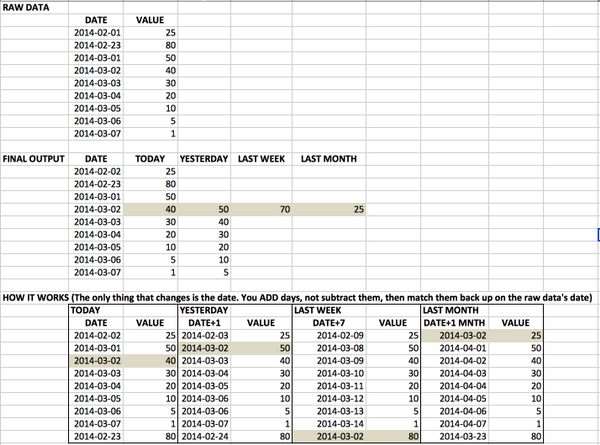

At times you may want to create a card with, for example, a three-month moving average for this year compared to the same period last year, to see if they are trending up or down in comparison to the previous year.

To create the DataFlow for this calculation, create a transform like:

`SELECT  
  `DateField`  
  ,`ValueField`  
  ,(SELECT  
      SUM(`ValueField`) / COUNT(*)    
    FROM  
      TABLE t2  
    WHERE  
      t2.`DateField` > LAST_DAY(DATE_SUB(t1.`DateField`, INTERVAL 3 MONTH))  
      AND t2.`DateField` < LAST_DAY(t1.`DateField`) ) AS `Rolling_Average``

`FROM  
  TABLE t1`

This transform assumes that the "DateField" column contains a date representing the month, e.g. 2015-01-01 for January.

The subquery retrieves the sum of the last 3 months’ worth of values and then divides them by the number of records found in the range, creating the "Rolling\_Average" field.

You need to replace your field names for “DateField" and “ValueField” and add any others you want in the resulting DataSet. Also replace TABLE with the DataSet table you’re using as your input.

It is often beneficial to create a snapshot of values, so that as of any date chosen, you can look at that day’s values compared against other time periods (the day before, week before, month before, etc.). To do this in a DataFlow, the data must be placed side-by-side so the card can read it properly. The following example query does this. Each section should be its own transform. You should also add indexing to the query for MySQL DataFlows.

`Select  
       today.date,  
       today.value,  
       yesterday.value,  
       lastweek.value,  
       lastmonth.value  
from  
       rawdata today   
left join  
       (select date_add(datevalue, INTERVAL 1 DAY) as date, value from rawdata) yesterday  
              on today.date = yesterday.date  
left join  
       (select date_add(datevalue, INTERVAL 7 DAY) as date, value from rawdata) lastweek  
              on today.date = lastweek.date  
left join  
       (select date_add(datevalue, INTERVAL 1 MONTH) as date, value from rawdata) lastmonth  
              on today.date = lastmonth.date`

The following table shows the logic behind this query:

Some additional work may be needed in order to pull in the correct columns and values (such as using a Group By action).

