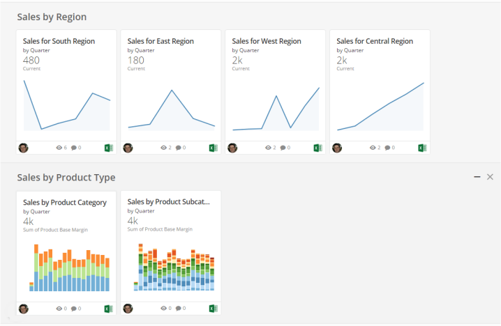
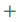
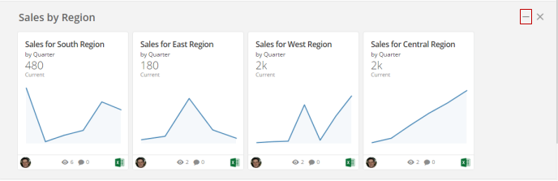
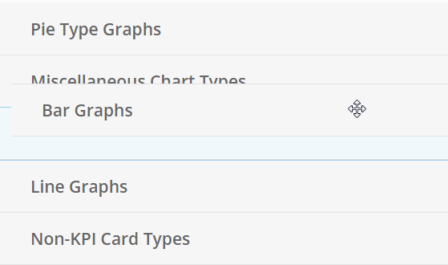
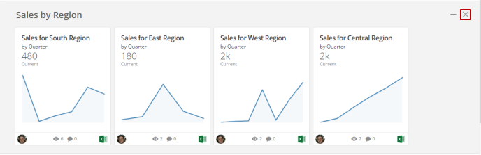
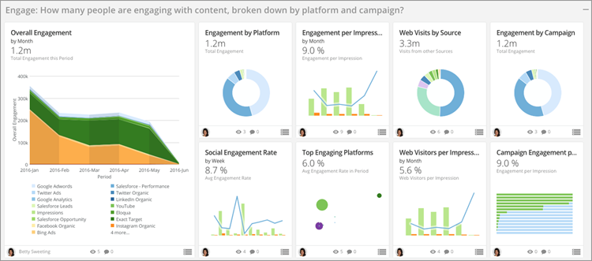

Intro
-----

You can organize Cards on a standard Page into distinct categories called **Collections**. This gives you greater control over the layout of your data and allows you to provide more effective and visually pleasing data stories for your viewers. Collections are given default names and descriptions, but you can change these to better suit your business needs. You can reorder Cards within a Collection, reorder Collections themselves within a Page, or remove Cards from the Collection. You can also minimize Collections so that only the names show, or delete them. When you remove Cards from a Collection or delete the Collection, the Cards are returned to the Page in their default "unorganized" state.

Collections are available *only* in standard Pages. In Domo Stories Pages, groups of Cards are called "Domo Stories" and have different functionality from Collections. For more information, see [Creating Domo Stories](/s/article/360043428433 "Creating Domo Stories").

The layout of Cards in a Collection is preserved per user. For example, if a user collapses the "Sales" collection, leaves the Page, then comes back, the "Sales" collection is still collapsed. Another user coming to the Page for the first time, however, sees all collections expanded. If he or she then make changes, those changes are preserved just for that user.  

You can resize Cards that are in a Collection just as you can any other Card. For more information about resizing Cards, see [Changing the Size of Cards in a Page](/s/article/360042923594 "Changing the Size of Cards in a Page").

 

**Note:**If you have a "Participant" security role, you can only view, minimize, and reorder Cards within Collections. You cannot add or remove Collections, remove Cards from a Collection, move Cards to a different Collection, or change the name or description of a Collection. For more information about security roles, see [Default Security Role Reference](/s/article/360043438953 "Security Role Reference").

The following example shows a Page in which Cards with sales data have been organized into two Collections—"Sales by Region" and "Sales by Category." A user viewing this Page can more easily find the data he needs by going to the desired Collection.  
  

  
  

**Video - Personalizing Pages**

Creating and Managing Collections
---------------------------------

**To create a Card Collection,**

1. Navigate to the Page in which you want to create the Card Collection.
2. Click  in the upper right corner of the screen.
3. Select **New Collection**. (If the Page is a system Page like Overview, Shared, or Favorites, is a Domo Stories Page, or does not contain any Cards, this option is not available.)
4. (Optional) Change the **Title** and **Description** text as desired by clicking in the appropriate field and entering the desired text.
5. Add a Card to the Collection by clicking and dragging.  
As you drag a Card, a blue rectangle appears indicating that you can drop a Card here.
6. (Optional) Repeat the previous step as often as necessary to build up your Collection.
7. (Optional) If you want, reorder Cards within a Collection by clicking and dragging into the desired position.

**To remove a Card from a Collection,**

1. Click the Card you want to remove and drag it out of the Collection.

The Card is returned to the unorganized Cards region of the Page.

**To minimize a Collection,**

1. Mouse over the Collection you want to minimize.
2. Click the "—" button that appears in the upper right corner of the Collection.  
  

The Collection is minimized so that only the title appears.

 

**Note:**Your layout of collapsed and expanded Collections is preserved when you leave the Page or close your browser. This is a personal customization for your own Domo instance and is not applied to other users.

**To reorder Collections in a Page,**

1. Mouse over the empty gray area to the right of the Collection name and description.  
A  appears to indicate that you can click and drag the Collection.
2. Click and begin to drag the Collection.  
All of the Collections in the Page temporarily minimize so you can more easily drop your Collection in the desired location. In the following screenshot, the user is moving the "Bar Graphs" Collection between "Miscellaneous Chart Types" and "Line Graphs."  
  

3. Drop the Collection in the desired location in the Collection order.

**To delete a Collection,**

1. Mouse over the Collection you want to delete.
2. Click the "X" button that appears in the upper right corner of the Collection.  
  

3. Click **Delete** to confirm.

The Collection is deleted and all of the Cards are returned to the unorganized Cards region of the Page.

Best Practices for Using Collections
------------------------------------

Each Page should be organized into Collections that

* are titled and apply to a specific business question
* contain a more detailed description of why the Collection exists
* contain a "Hero Card"—a larger Card that answers the high-level business question

Example:  
  

