Intro
-----

Domo Stories allow you to tell targeted stories by creating custom Pages that translate smoothly across devices and retain the same Card orientation and size. Because each layout has been optimized individually for web, mobile, tablet, print, and Scheduled Reports, Domo Stories tell a consistent story no matter where the story ends up being consumed. With hundreds of layout templates built individually for dozens of use cases, you can create Domo Stories that bridge the gap between understanding the data and taking action. 

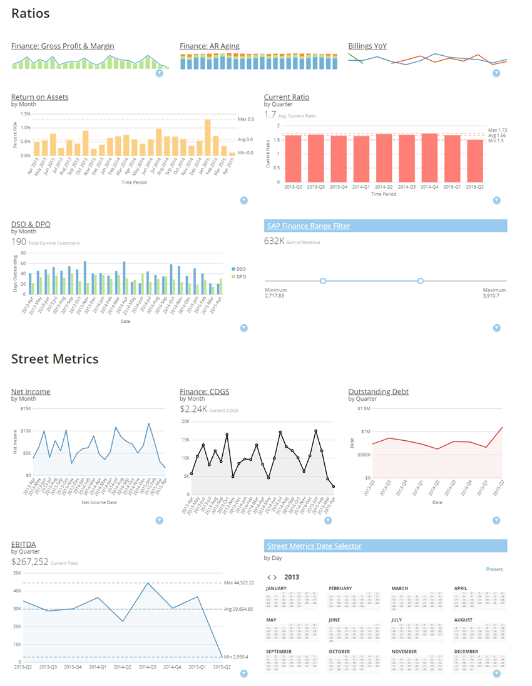

###### Domo Stories differ from [standard Pages](/s/article/360043428553 "Understanding Pages") in the following ways:

* In standard Pages, individual users can move and resize Cards. With Domo Stories, however, only Page owners and "Admin" users can make changes to Card order and size. This provides a single source of truth by ensuring that all users see the same thing in a Page.
* Cards in standard Pages may appear differently across different devices or platforms (i.e. different desktop window sizes, email reports, print, etc.). Cards in a Domo Stories Page, however, appear the same no matter what device or platform you are using.
* In standard Pages, all Cards are the same size and dimensions by default. If you want to change the size or dimensions of a Card, you must do it manually. In a Domo Stories Page, you can choose from hundreds of different templates, each of which contains slots appropriate for different Card sizes and dimensions. You can also resize templates from the Page level, which changes the dimensions of the Cards in the templates.
* Domo Stories cannot be collapsed as Collections in standard Pages can.
* You can export Domo Stories Pages to PDFs. You cannot do this with standard Pages. For more information, see [Exporting Domo Stories Pages to PDF](/s/article/360043437893 "Exporting Domo Stories Pages to PDF").

You can use Card-to-Card Filters in Domo Stories and in standard Pages. These Filters allow you to filter all Cards on a Page by setting a Filter on a single Card. Interaction Filters are automatically enabled in Domo Stories but must be turned on manually in standard Pages. For more information, see [Using Filter Cards to Filter Card Content](/s/article/360042923914 "Applying Page-Level Filters").

Cards in a Domo Stories Page have all of the same options as Cards in a standard Page EXCEPT the sizing options. If you want to resize a Card in a Domo Stories Page, you drop it into a different-sized slot or resize the template from the Page view while editing the Page. There are no height restrictions for Cards in Domo Stories; they can be as tall as you want.  

In Domo Stories, you can change the background color of Pages as well as Cards. This is not possible in standard Pages. 

You cannot have Domo Stories and Card Collections in the same Page. If you have any Collections in your Page when you turn on Domo Stories, all of the Collections are converted into Domo Stories Pages. Likewise, if you convert a Domo Stories Page back into a standard Page, all of the Domo Stories are turned back into Collections. If you convert a Page with Collections into a Domo Stories Page and there are any Cards not in a Collection, these Cards are added to an "Appendix" section at the bottom of the Page. 

Converting a standard Page to a Domo Stories Page
-------------------------------------------------

To convert a standard Page (with or without Collections) to a Domo Stories Page, you must be the Page owner or have an "Admin" default security role. For more information about security roles, see [Default Security Role Reference](/s/article/360043438953 "Default Security Role Reference").

**To convert a standard Page to a Domo Stories Page,**

1. Select **Design Dashboard**in the  menu in the top right corner of the Page.
2. Click **Design Dashboard**.  
  
If the Page contains Collections, all of the Collections become Domo Stories Pages, and any extra Cards not in Collections are added into the "Appendix" section at the bottom of the Page. If the Page does not contain Collections, all of the Cards are added to a single default Domo Stories Page with an "Example Header" heading.
3. (Conditional) If you are already satisfied with the Domo Stories layout on the Page, click **Save** then **Close**. Otherwise, first edit the Domo Stories Page layout following the instructions under Editing Pages, below.

 

**Note:**When you convert a standard Page to a Domo Stories Page, the **Edit Dashboard** and **Convert to Standard Page** options are grayed out while the Pages and Cards load.

Converting a Domo Stories Page back to a standard Page
------------------------------------------------------

To convert a Domo Stories Page (with or without Collections) back to a standard Page, you must be the Page owner or have an "Admin" default security role. For more information about security roles, see [Default Security Role Reference](/s/article/360043438953 "Default Security Role Reference"). 

**To convert a Domo Stories Page back to a standard Page,**

1. Select **Convert to Standard Page** in the  menu in the top right corner of the Page. (If the Domo Stories edit mode is open, you must first close it for this menu to appear.)
2. Click **Convert Page** to confirm.

If the Page contains Domo Stories, all of the Domo Stories are converted into Collections.

Adding Domo Stories and layout components
-----------------------------------------

The Domo Stories edit mode contains various options for editing your Domo Stories. In this mode you can do all of the following:

* Add new Card layouts based on a variety of Domo Stories templates.
* Drag and drop Visualization Cards into the slots in the layouts you have added.
* Resize templates and the Cards within them by dragging their borders
* Swap Cards in a layout by dragging one Card on top of another.
* Add headers to your Domo Stories.
* Drag and drop layouts and headers wherever you want them in the Page.
* Delete layouts or headers as desired.
* Add borders between Domo Stories.
* Add images and notebook Card content inline, without having to first open the [notebook Card editor](/s/article/360043430233 "Adding a Document Card to Domo").
* Change the background color of your Page and/or individual Cards.
* Specify which Card elements appear (for example, you could hide the summary number for a Card).

### Adding a Domo Stories Page

You can add a new Domo Stories Page to your Domo instance by selecting **New Story** in the **Add to Domo** menu.

**To add a Domo Stories Page to your instance,**

1. Click  in the top right corner of the screen.
2. Select **New Story**.
3. Enter a title for the new Stories Page.

A new Domo Stories template Page is added, and the edit mode is opened by default. You can now begin adding and customizing Domo Stories layouts as described in the following sections. 

### Adding a Domo Stories layout

You can add a Domo Stories layout by clicking the  icon that appears on the right side of the Page view when the Domo Stories edit mode is open, then dragging it to the desired location on the Page. You can then select the desired Domo Stories layout template. The template you select will then be added to this location in the Page.

**To add a Domo Stories layout,**

1. On the Page where you want to add a Domo Stories layout, select **Edit Dashboard** in the 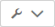 menu in the top right corner of the Page.
2. Click and drag the  icon from the toolbar on the right side of the Page to the location on the Page where you want the new layout.   
  
When you drag the layout icon over a border, it highlights to indicate you can put the layout there. In the example below, the user is dragging the icon over the line directly beneath the "Group 1" layout.  
  
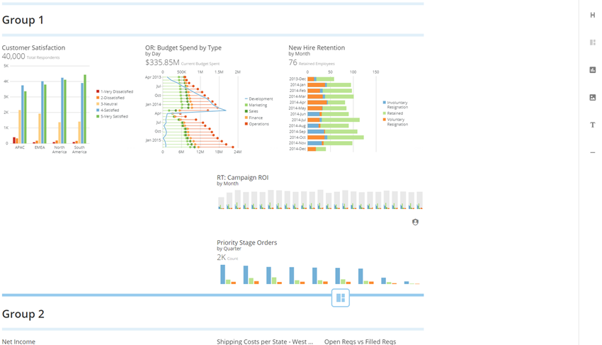  
  
 Once you drop the  icon onto a border, the **Choose a layout** dialog opens.
3. Use the filter options to locate the desired template. 

	* The **Categories** menu lets you filter by template category. Categories are as follows:
	
	
	
	| Template | Description |
	| --- | --- |
	| All | The top templates are shown for all categories. You can show all of the templates for a category by clicking **View All** for that category. |
	| With banner | All of these templates include a long, narrow slot at the top where you can insert a Card to use as a banner. dashboard_layouts_banner.png |
	| Hero | All of these templates include at least one very large slot for Cards that should immediately draw viewers' attention ("hero Cards"). 
	dashboard_layouts_hero.png |
	| Quick summary | All of these templates consist of small slots for Cards that are intended to be glanced at. 
	dashboard_layouts_quick_summary.png |
	| General purpose | All of these templates consist of a mix of small and large Cards.
	dashboard_layouts_general_purpose.png |
	* The **Number of Cards** menu lets you filter by the number of Card slots in the template.
4. Once you locate the desired template, click on it.   
The template for the layout is now added to the designated location in the Page. 

 

**Tip:** You can return to the **Choose a layout**dialog to change your template by mousing over the layout and clicking the pencil icon  that appears on the left. Note that when switching a template, the new template does *not* need to contain the same amount of slots as the current template. If the new template has fewer slots available than the current template, the extra Cards are moved to the "Appendix" section at the bottom of the Page. If the new template has more slots available than the current template, the new slots appear as empty in the template.
5. Do any of the following to add Cards to the layout:

	* Drag Cards from elsewhere in the Page into the appropriate slots in the template.   
	You can drag Cards from other Domo Stories in the Page, from the "Appendix" area, etc. When you drag a Card (represented by a  icon) over a border line in a layout, it highlights to indicate the Card will end up there when you drop it.   
	  
	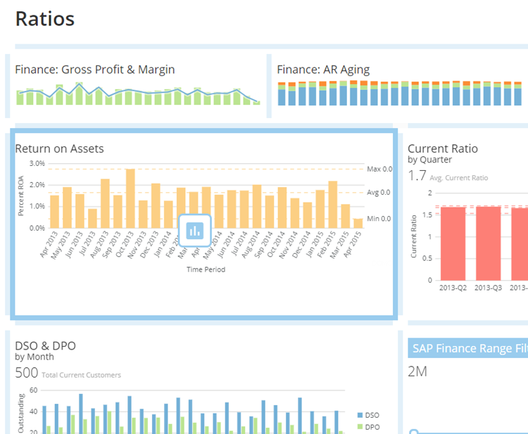  
	  
	Note that when you move a Card into a different-sized slot, the Card automatically resizes itself to fit the slot.  
	  
	If you drag a Card onto another Card, the two Cards switch places. So if you dragged "Finance: AR Aging" from "Group 2" onto ""Finance: COGS" in "Group 1," "Finance: AR Aging" would take over the spot in Group 1, and "Finance: COGS" would appear in the spot formerly containing the other Card in Group 2.
	* Add an existing Visualization Card from your Domo instance into an empty slot by doing the following:
	
	
		1. In the slot where you want to add the Card, click **Add Content**.
		2. Select **Add existing Card**.
		3. Locate the Card you want to add by entering its name in the **Search Cards** field and clicking on it.  
		  
		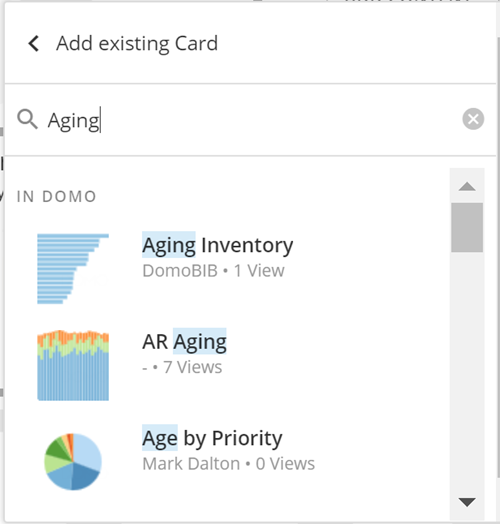
	* Add an existing Visualization Card from your Domo instance to a layout *without* an empty slot by doing the following:
	
	
		1. Click and drag the  icon from the toolbar on the right side of the Page to the spot where you want the Card to appear.   
		  
		When you drag the Card icon over a Page, borders between layout slots highlight to indicate the spots where you can insert the Card. In the example below, the user is dragging the icon over the line between the "Finance: COGS" and "Outstanding Debt" Cards.  
		  
		  
		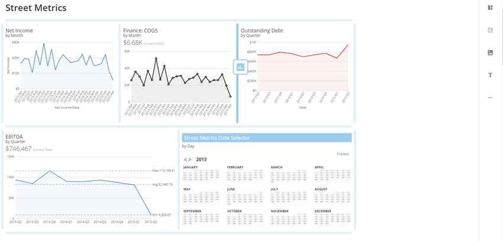  
		  
		When you drop the icon onto a line, a slot appears for the Card with an **Add Content** button.
		2. Click **Add Content**.
		3. Select **Add existing Card**.
		4. Locate the Card you want to add by entering its name in the **Search Cards** field and clicking on it.  
		  
		
	* Add an image Card (essentially a [Document Card](/s/article/360043430173) containing an image) inline to a layout by doing the following:
	
	
		1. Click and drag the  icon from the toolbar on the right side of the Page to the spot where you want the image Card to appear.   
		  
		When you drag the image icon over a Page, borders between layout slots highlight to indicate the spots where you can insert the Card.
		2. Click **Choose Image**.
		3. Select the image you want to upload from your computer or network.
	* Add a notebook Card inline to a layout by doing the following:
	
	
		1. Click and drag the  icon from the toolbar on the right side of the Page to the spot where you want the image Card to appear. Alternatively, if your layout already contains a blank slot, you can select **Add Content > Insert text** to open the editor.
		2. Enter the desired notebook Card content.   
		The interface options are the same as those in the full notebook Card editor. For more information, see [Adding a Notebook Card](/s/article/360043430233 "Adding a Notebook Card").
		3. Click anywhere outside of the Card to save it.

### 
Adding headers

You can insert additional header text in your Domo Stories Pages to divide up content and draw attention to the most important Cards. Headers can be placed before or after layouts as well as other headers.  

**To add a header,**

1. On the Page where you want to add header text, select **Edit Dashboard** in the  menu in the top right corner of the Page.
2. Click and drag the  icon from the toolbar on the right side of the Page to the location on the Page where you want the new header.   
  
When you drag the header icon over a Page, borders highlight to indicate the spots where you can insert the Card.
3. Replace the word "Title" with the desired header name.
4. (Optional) Use the  icon to the left of the header to drag it where you want in the Page.

### Adding borders

You can add horizontal borders to your Domo Stories to better break up the content for your viewers. You can insert borders before or after layouts, headers, or other borders. 

**To add a border,**

1. On the Page where you want to add a border, select **Edit Dashboard** in the  menu in the top right corner of the Page.
2. Click and drag the  icon from the toolbar on the right side of the Page to the location on the Page where you want the new border.   
  
When you drag the border icon over a Page, borders highlight to indicate the spots where you can insert the Card.
3. (Optional) Use the  icon to the left of the border to drag it where you want in the Page.

Editing Domo Stories layouts
----------------------------

A variety of options is available for editing Domo Stories, such as swapping Cards, replacing Cards with other Cards from your Domo instance, moving Cards to the Appendix, deleting entire layouts or individual Cards from a layout, etc.

With all Domo Stories editing options, make sure to click **Save** after you make changes so you don't lose your work.

### Swapping Cards

To swap Cards, just drag one onto the other. 

**To swap two Cards,**

1. On the Page where you want to swap Cards, select **Edit Dashboard** in the  menu in the top right corner of the Page.
2. Drag one Card on top of the other.   
When you drag a Card (indicated by a  icon) over another Card, a heavy line appears around the second Card to indicate the first Card will appear in that slot when you drop it.   
  
  
  
Note that when two Cards swap places, they both automatically resize themselves to fit the new slots.

### Replacing Cards

You can replace a Card in a Domo Story with any existing Card you have access to in your Domo instance. Cards you replace are sent to the "Appendix" section at the bottom of the Page.

**To replace a Card,**

1. On the Page where you want to replace a Card, select **Edit Dashboard** in the  menu in the top right corner of the Page.
2. Mouse over the Card you want to replace.
3. In the **Edit Content** menu that appears, click **Choose different Card**.
4. Locate the Card you want to add by entering its name in the **Search Cards** field and clicking on it.  
  
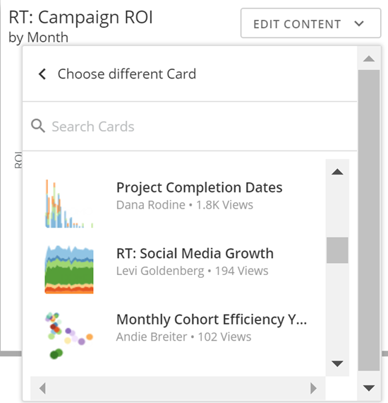

The new Card fills the old Card's slot, and the old Card is sent to the "Appendix" section at the bottom of the Page.

### Moving Cards to the appendix

If you want to move a Card to the Appendix without replacing it with another Card (as explained in the previous steps), you can do so easily.

**To move a Card to the Appendix,**

1. On the Page where you want to move a Card, select **Edit Dashboard** in the  menu in the top right corner of the Page.
2. Mouse over the Card you want to move.
3. In the **Edit Content** menu that appears, select **Move to appendix**.

The Card is moved to the Appendix, and the template slot is now empty.

### Deleting individual Cards

You can remove a Card from a Domo Story, in which case it is no longer found anywhere in that Page. Note that these instructions show how to do this in the Story Editing mode, but you can also do this when the Editing mode is closed by selecting **Remove** in the Card menu (just as you can for any normal Card). 

**To delete a Card,**

1. On the Page where you want to delete a Card, select **Edit Dashboard** in the  menu in the top right corner of the Page.
2. Mouse over the Card you want to delete.
3. In the **Edit Content** menu that appears, select **Remove from Dashboard**.

### Deleting a Domo Story

You can delete a Domo Story from a Page. When you do this, all of the Cards in the Domo Story are moved to the "Appendix" section at the bottom of the Page.

**To delete a Domo Story****,**

1. On the Page where you want to delete a Domo Story, select **Edit Dashboard** in the  menu in the top right corner of the Page.
2. Locate the Domo Story you want to delete.
3. Click the  icon to the left of the Domo Story.
4. Click **Remove Layout** to confirm.

The Domo Story is removed, and all Cards are sent to the "Appendix."

### Editing or deleting a header

To edit a header, you simply click in the header box and replace the name with the name you want. To delete a header, you click the  icon for that header.

**To edit a header,**

1. On the Page where you want to edit or delete a header, select **Edit Dashboard** in the  menu in the top right corner of the Page.
2. Locate the header you want to edit or delete.
3. Do one of the following:

	* To enter a new header, click on the existing header and replace it with the desired header text.
	* To delete the header, click the  icon for the header.

### Deleting a border

To delete a border, you just click the  icon for that border.

**To delete a border,**

1. On the Page where you want to delete a border, select **Edit Dashboard** in the  menu in the top right corner of the Page.
2. Locate the border you want to delete.
3. Click the  icon for the border.

### Changing the background color for a Domo Story

You can change the background color for all Cards in a given Domo Story. This changes is applied to all Cards except for any in which you have already set an individual background color (discussed more in the next section).

**To change the background color for a Domo Story,**

1. On the Page where you want to change a Story background color, select **Edit Dashboard** in the  menu in the top right corner of the Page.
2. Locate and hover over the Domo Story you want to change the background color for.
3. Click the palette icon 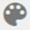 .
4. Click one of the provided colors from the palette.
5. (Optional) To remove a fill from a Card, click **No Fill** in the color palette.

 

**Tip:**When setting the background color of a Card, be sure it doesn't interfere with the colors already set in your chart. Remember that your primary goal is to communicate information to your viewers, not impress them with your flashy color choices!

Customizing individual Cards
----------------------------

In Domo Stories, there are a number of ways to customize Cards that are not available in standard Pages. These include changing Card background colors, showing or hiding Card elements such as titles and summary numbers, and configuring the actions that take place when users click on Cards. 

### Changing the background color for a Card

You can select a different background color for a Card in a Domo Story by selecting **Edit Content > Change background**. This change takes precedence over any background colors you have set for an entire Story (discussed in the previous section). So, for example, let's assume you have a Domo Story called "Street Metrics." Within that Story is a Card called "Net Income." You set the background color for that Card to red to draw attention to it. If you then change the overall color scheme of the "Street Metrics" Story to blue, all of the Cards in the Story take on blue backgrounds *except* for the Card you already set to red.  

**To change the background color for a Card,**

1. On the Page containing the Card you want to change the background color for, select **Edit Dashboard** in the  menu in the top right corner of the Page.
2. Locate the Card in the Page.
3. Select **Edit Content > Change background**.
4. Click one of the provided colors from the palette.
5. (Optional) To remove a fill from a Card, click **No Fill** in the color palette.

 

**Tip:**When setting the background color of a Card, be sure it doesn't interfere with the colors already set in your chart. Remember that your primary goal is to communicate information to your viewers, not impress them with your flashy color choices!

### Showing or hiding Card elements

For any given Card, you can hide Card elements such as titles, timeframes (i.e. date grains, such as "By day"), Summary Numbers, and even charts themselves. For example, you could hide the chart for a Card entirely and show just the Summary Number for the card. You do this by selecting **Edit Content > Display settings** then checking or unchecking the elements you want to show or hide.

**Video - Domo Stories: Summary Metric View**

 

**To show or hide elements for a Card,**

1. On the Page containing the Card you want to show or hide elements for, select **Edit Dashboard** in the  menu in the top right corner of the Page.
2. Locate the Card in the Page.
3. Select **Edit Content > Display settings**.
4. Check or uncheck the elements you want to show or hide.

Setting Card interactions
-------------------------

For Cards in Domo Stories, you can define the actions that take place when a user clicks on a Card. These actions include the following:

* Opening the [Card details view](/s/article/360042923934 "Card Details View Layout") in a new browser tab
* Enabling [interactions Filters](/s/article/360042923894 "Applying Page-Level Filters") for all Cards powered by the same DataSet as this Card, either for all such Cards on the Page or for selected Cards
* Opening other content in Domo, either in the same browser tab or in a different tab
* Opening a specified web Page
* Enabling "Drill in place" for the Card, which allows users to drill down into the card without having to first open the Details view
* Disabling interactions entirely (essentially making the Card a "flattened" version of the Card)

**Video - Domo Stories: Drill in Place**

Card interactions are *only* available for Cards in Domo Stories. They do not work in standard Pages.

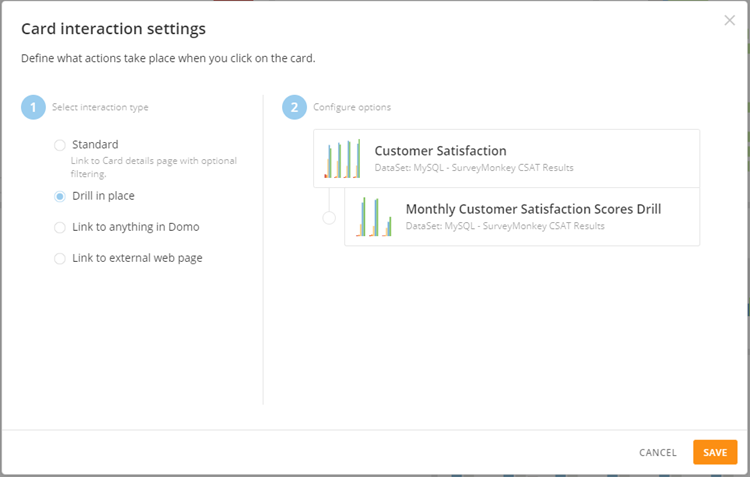

**To configure a Card's Details view to open in another browser tab,**

1. On the Page with the Card you want to open in another browser tab when clicked, select **Edit Dashboard** in the  menu in the top right corner of the Page.
2. Mouse over the Card and click **Edit Content**.
3. Select **Change Interaction**.
4. In Section 2, check the **Open Card details in a new tab** box.
5. Click **Save**.

**To configure interaction Filters for a Card,**

1. On the Page with the Card you want to configure interaction Filters for, select **Edit Dashboard** in the  menu in the top right corner of the Page.
2. Mouse over the Card and click **Edit Content**.
3. Select **Change Interaction**.
4. (Optional) If you want to the Details view for the Card to open in a new tab when a user clicks on the Card, check the **Open Card details in a new tab** box in Section 2.
5. (Conditional) Check the **Enable interaction Filters** box if it is not checked already.
6. Do one of the following:

	* If you want interaction Filters to be applied to *all* Cards on the Page powered by the same DataSet as this Card, select the **Apply to all Cards on Dashboard** radio button.
	* If you want interaction Filters to be applied to *selected* Cards on the Page powered by the same DataSet as this Card, select the **Apply to selected Cards** radio button, click **Change**, select the Cards you want to apply the Filters to, click **Save**, then click **Save** again.

**To enable Drill in Place for the Card,**

1. On the Page with the Card you want to enable Drill in Place on, select **Edit Dashboard** in the  menu in the top right corner of the Page.
2. Mouse over the Card and click **Edit Content**.
3. Select **Change Interaction**.
4. Select the **Drill in place** radio button.
5. Click **Save**.

For more information about creating drilldown on a card, see [Adding Drill Path to Your Chart](/s/article/360042924094 "Adding Drill Path to Your Chart").

**To configure specified Domo content to open when a Card is clicked,**

1. On the Page with the Card you want to link to Domo content, select **Edit Dashboard** in the  menu in the top right corner of the Page.
2. Mouse over the Card and click **Edit Content**.
3. Select **Change Interaction**.
4. In Section 1, select the **Link to anything in Domo** radio button.
5. In Section 2, click the **Select Content** button.
6. Locate the content you want to open when this Card is clicked.
7. Click **Save**.
8. (Optional) If you want the URL to open with a custom name, enter the name in the **Display as** field.
9. (Optional) If you want the new content to open in a new browser tab when the Card is clicked, check the **Open link in a new tab** box.
10. Click **Save**again.

**To configure an external web Page to open when a Card is clicked,**

1. On the Page with the Card you want to link to external content, select **Edit Dashboard** in the  menu in the top right corner of the Page.
2. Mouse over the Card and click **Edit Content**.
3. Select **Change Interaction**.
4. In Section 1, select the **Link to external web Page** radio button.
5. In Section 2, in the **Web Page address** field, enter the URL of the Page you want to open when the Card is clicked.
6. (Optional) If you want the URL to open with a custom name, enter the name in the **Display as** field.
7. (Optional) If you want the new content to open in a new browser tab when the Card is clicked, check the ****Open link in a new tab**** box.
8. Click ****Save****again.

**To disable Card interactions,**

1. On the Page with the Card you want to disable interactions for, select **Edit Dashboard** in the  menu in the top right corner of the Page.
2. Mouse over the Card and click **Edit Content**.
3. Select **Change Interaction**.
4. In Section 1, click the radio button reading **Disable Card interactions**.
5. Click **Save**.

Setting a Page background color or image
----------------------------------------

If you want, you can set either a background color or image on a Domo Stories Page. You cannot set both a background color and image on the same Page. 

### Setting a Page background color

You can choose colors from a palette or specify a custom color by inputting a hexadecimal value.

 

**Note:**When you add a background color, the Card content shrinks slightly to allow for padding between the Card edges and content.  

**Video - Domo Stories Background Colors**

 

**To change the Page background color,**

1. On the Page you want to change the background color of, select **Edit Dashboard** in the  menu in the top right corner of the Page.
2. In the **Options** menu at the top of the screen, select **Change background**.
3. (Conditional) If **Image Fill** is selected in the menu at the top of the dialog, choose **Color Fill**.
4. Choose the color you want from the palette OR specify a custom color by entering a hexadecimal value into the field at the bottom of the dialog.

### Setting a Page background image

You can specify a background image to appear in your Domo Stories Pages. You can also choose a background color to be used while your image is loading. You also have the option to set the text color for headers and cards without a background color. Background images are recommended to have a size with a 2:1 ratio (for example, 1000 x 500). 

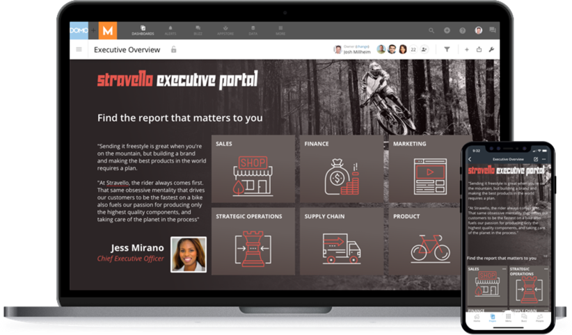

**Video - Adding Background Images to Domo Stories**

 

**To set the background image for a Page,**

1. On the Page you want to change the background color of, select **Edit Dashboard** in the  menu in the top right corner of the Page.
2. In the **Options** menu at the top of the screen, select **Change background**.
3. (Conditional) If **Color Fill** is selected in the menu at the top of the dialog, choose **Image Fill**.
4. Click **Choose Image**.
5. Locate and select your image on your machine.
6. (Optional) To change the default background color (which is only used before the image has loaded on the Page), click **Change** then choose the new color from the palette (or enter a hexadecimal code in the field at the bottom of the palette).
7. (Optional) To change the default text color used on the Page, select the new color in the menu under "Default text color."   
Currently only black and white are available as text colors.

If you want to change your background image, click **Choose New Image** at the bottom of the dialog then locate and select the new image on your machine.

Turning on fullscreen mode
--------------------------

In Domo Stories Pages, a fullscreen mode is available. When this mode is active, all Cards in the Page are visible, while all other interface elements such as navigation components, menus, etc. are hidden. 

**To turn on fullscreen mode,**

1. Select **Full Screen**in the  menu in the top right corner of the Page.
2. To exit fullscreen mode, press Escape.

Turning on mobile preview
-------------------------

In Domo Stories Pages, you can turn on a preview showing how your Stories will appear when viewed on smartphones. This preview will be the same across all major smartphone brands, notwithstanding a few UI elements specific to certain brands. There is no preview for tablets because the tablet layout is nearly the same as the standard web layout.   
  
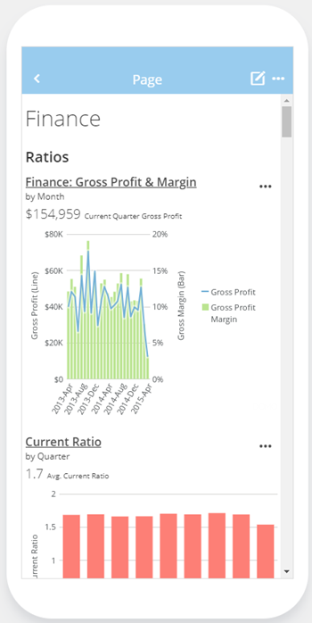

**Video - Using the Mobile Preview in Domo Stories**

 

**To turn on the mobile preview,**

1. On the Page you want to change the view of, select **Edit Dashboard** in the  menu in the top right corner of the Page.
2. Click the **Desktop** menu in the top right area of the screen.
3. Select **Mobile**.  
  
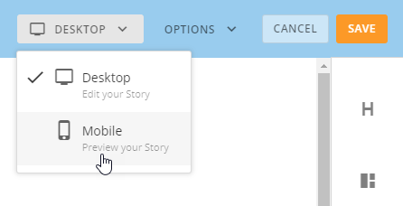

To switch back to **Desktop**, select **Desktop** in the same menu.

Turning on auto width
---------------------

With the Auto-Width Dashboard setting, Dashboard content will expand to fill all the available window space. This will allow for more rows/columns to be visible from the Dashboard view. This is enabled on a per-Dashboard basis to allow you to customize your Stories.

**To turn on auto width,**

1. On the Page you want to enable auto width, select Edit Dashboard in the details\_gear\_icon.png menu in the top right corner of the Page.
2. Click the Options menu in the top right area of the screen.
3. Select Auto width.  
  
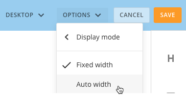
