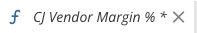
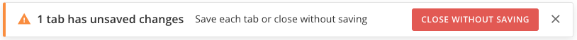
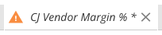
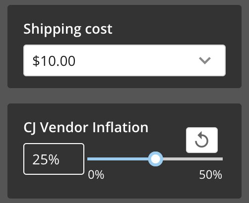
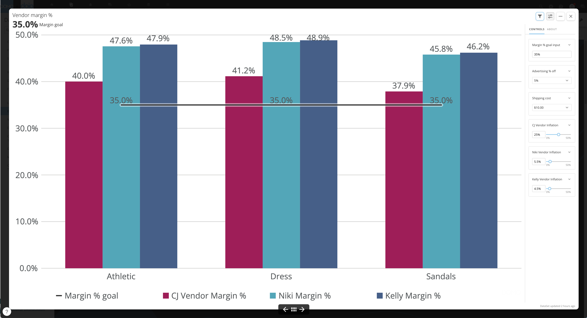
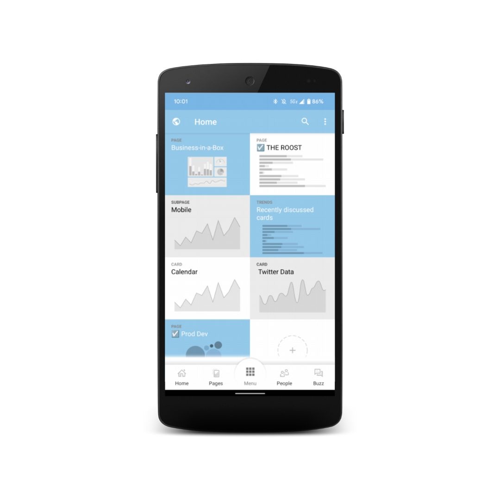
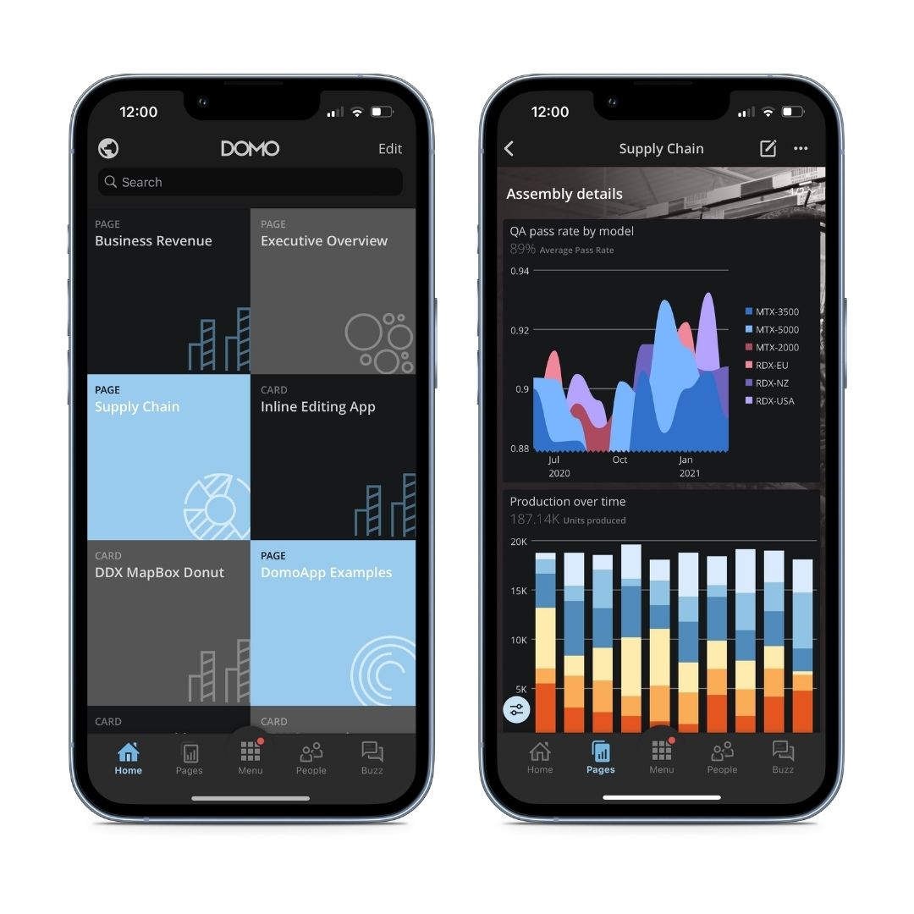
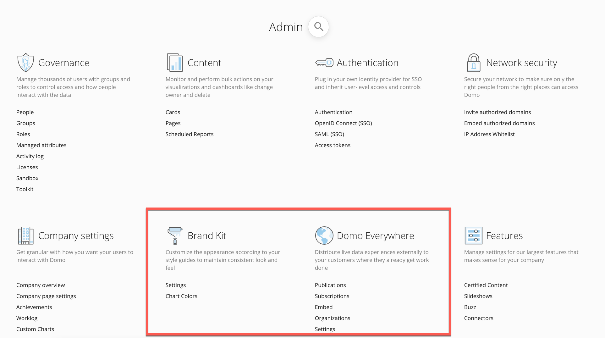
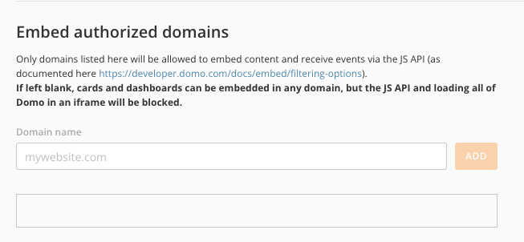
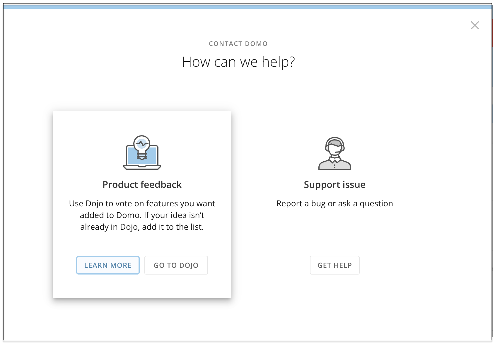

---
    title: Current Release Notes
    url: https://domo-support.domo.com/s/article/360042936114
    linked_kbs:  ['[https://domo-support.domo.com/s/knowledge-base/](https://domo-support.domo.com/s/knowledge-base/)', '[https://domo-support.domo.com/s/](https://domo-support.domo.com/s/)', '[https://domo-support.domo.com/s/topic/0TO5w000000ZamwGAC](https://domo-support.domo.com/s/topic/0TO5w000000ZamwGAC)', '[https://domo-support.domo.com/s/topic/0TO5w000000ZanNGAS](https://domo-support.domo.com/s/topic/0TO5w000000ZanNGAS)', '[https://domo-support.domo.com/s/article/7903767835031](https://domo-support.domo.com/s/article/7903767835031)', '[https://domo-support.domo.com/s/article/9355841270167](https://domo-support.domo.com/s/article/9355841270167)', '[https://domo-support.domo.com/s/article/9337403057943](https://domo-support.domo.com/s/article/9337403057943)', '[https://domo-support.domo.com/s/article/9338871306135](https://domo-support.domo.com/s/article/9338871306135)', '[https://domo-support.domo.com/s/article/360042934474](https://domo-support.domo.com/s/article/360042934474)', '[https://domo-support.domo.com/s/article/9221297758615](https://domo-support.domo.com/s/article/9221297758615)', '[https://domo-support.domo.com/s/article/360045120554](https://domo-support.domo.com/s/article/360045120554)', '[https://domo-support.domo.com/s/article/360043437993](https://domo-support.domo.com/s/article/360043437993)', '[https://domo-support.domo.com/s/article/360042933614](https://domo-support.domo.com/s/article/360042933614)', '[https://domo-support.domo.com/s/article/4403367344023](https://domo-support.domo.com/s/article/4403367344023)', '[https://domo-support.domo.com/s/article/360047400753](https://domo-support.domo.com/s/article/360047400753)', '[https://domo-support.domo.com/s/article/8275510785559](https://domo-support.domo.com/s/article/8275510785559)', '[https://domo-support.domo.com/s/article/9301034807575](https://domo-support.domo.com/s/article/9301034807575)', '[https://domo-support.domo.com/](https://domo-support.domo.com/)', '[https://domo-support.domo.com/s/article/360042922874](https://domo-support.domo.com/s/article/360042922874)', '[https://domo-support.domo.com/s/article/360042936114](https://domo-support.domo.com/s/article/360042936114)', '[https://domo-support.domo.com/s/topic/0TO5w000000ZanNGAS/current-release-notes](https://domo-support.domo.com/s/topic/0TO5w000000ZanNGAS/current-release-notes)', '[https://domo-support.domo.com/s/article/360043429933](https://domo-support.domo.com/s/article/360043429933)', '[https://domo-support.domo.com/s/article/360043429953](https://domo-support.domo.com/s/article/360043429953)', '[https://domo-support.domo.com/s/article/360042925494](https://domo-support.domo.com/s/article/360042925494)', '[https://domo-support.domo.com/s/article/360043429913](https://domo-support.domo.com/s/article/360043429913)', '[https://domo-support.domo.com/s/article/4408174643607](https://domo-support.domo.com/s/article/4408174643607)', '[https://domo-support.domo.com/s/login/](https://domo-support.domo.com/s/login/)']
    article_id: 000004968
    views: 6,273
    created_date: 2022-11-01 22:59:00
    last updated: 2022-11-01 23:23:00
    ---

Enhancements
------------

The following enhancements are part of the October 2022 release.

#### Beast Mode Editor

The updated Beast Mode Editor now contains more help to keep you from exiting without saving your changes.

* Any tab with unsaved changes displays an italicized title with an asterisk (\*).  

* If you attempt to close the editor while you have unsaved changes, a warning displays, advising that there are *x* number of unsaved changes in your tab(s). The tabs with unsaved changes are marked with a  warning symbol along with the italicized title and asterisk so that you can easily identify them. You can also choose to close without saving.  
  
  

New Features
------------

The following features are part of the October 2022 release.

#### Variables

Variables are values that function inside Beast Modes and provide solutions for many use cases, including what-if analysis and time comparisons. Use Variables with cards in Analyzer or turn dashboards into fully functioning data apps. 

The Edit Variables grant allows anyone in your organization with the Edit Cards grant to create, edit, and delete Variables.

With three new DomoStats reports, admins can quickly see what Variables exist in an instance, who is using them, and where they are being used to assist with data governance.

Variables are now available in the enhanced Beast Mode Editor.

To learn more, see [Variables Overview](/s/article/7903767835031).

#### Story Presentation Mode

With Story Presentation Mode, your presentations are smoother, more efficient, and more enjoyable for your audience. You can easily view details about your data in the control rail and move to any card on the dashboard without exiting the presentation. Our new Variables feature works with cards in Story Presentation Mode, too.

For more information, see [Using Story Presentation Mode](/s/article/9355841270167).

#### Mobile Updates

**Improved Mobile Dashboards**

Mobile Dashboards now give you more options to interact with your data.

* Apply and clear filters with a single tap and use Filter Cards without covering up content.
* Drill in Place to explore data on the go.
* Dashboards using Custom Apps, including DDX Bricks, are now interactive on mobile.

**Improved Menu for Android**

Added menu tabs in the Android version of Domo mean that Android and iOS devices now have a consistent navigation experience. Home, Pages, People, and Buzz can be selected from anywhere inside the app. 

**Dark Mode Support on iOS**

The Domo and Goals mobile apps now support dark mode. You can configure this in your device's native settings. 

    

#### Workbench 5.2

The following features are available in the latest version of Workbench, which you can download in the Appstore.

**Multi-Cloud Support**

Workbench users with Multi-Cloud enabled can now specify which cloud warehouse they want their Workbench data to write to.

For more information, see [Multi-Cloud Support in Workbench 5.2.](/s/article/9337403057943)

**Job Duplication**

Job Duplication allows you to duplicate a job and change only the details unique to that job to save configuration time. Jobs must be duplicated one at a time; bulk job duplication is not supported.

For more information, see [Duplicating a Job in Workbench 5.2.](/s/article/9338871306135)

#### Password Blocklist

Admins can now create a list of restricted passwords for their instances. This prevents unauthorized or leaked credential usage and keeps instances more secure. This feature does not impact passwords that are currently used, only future passwords. 

For more information, see [Setting Password Requirements.](/s/article/360042934474)

#### AppDB Admin

AppDB now has an interface. AppDB Admin allows you to create and maintain collections, update documents, add document-level Filters, and manage permissions from your browser without using API calls.

For more information, see [AppDB Admin User Interface](/s/article/9221297758615). 

New Premium Features
--------------------

The following premium features are part of the October 2022 release.

#### Domo Everywhere

**UI**

Domo Everywhere has an improved user interface, which you can access in the Domo Admin Settings. Customize your organization's appearance with Brand Kit, or distribute live data experiences with the new options available in Domo Everywhere.

**Publish Dynamic PDP**

Publish jobs are now more secure. With dynamic personalized data permissions (PDP), you can know that your sensitive data is only going to the customers who should see it. Apply a user or organization-based Filter, and only content that passes the Filter is visible to subscribers.

For more information, see [Publishing Content to a Subscriber Organization.](/s/article/360045120554)

**Embed Authorized Domains**  
With authorized domains, you control the portals, environments, and apps where your embedded data displays. Place any authorized domain on the list in your Domo environment. This tells Domo that you trust the domain and that your content can be shared there. Domains not on the list aren't allowed to host Domo content.

For more information, see [Sharing Content Outside of Domo with Embed](/s/article/360043437993).

**Whole-Page Filtering**

Now you can use Whole-Page Filtering on embedded content in your authorized domains. This gives you both control over the format and layout offered by Embed and the power and functionality of dashboard Filters. Create Filters for your customers' use cases and easily apply them to every embedded card on a page.

For more information, see [Sharing Content Outside of Domo with Embed](/s/article/360043437993).

#### Form Builder

The new Editable Submissions feature in Form Builder allows form creators to configure forms to be view-only or allow responses to be viewed, edited, and deleted. Form viewers can review their Previous Submissions in table format before resubmitting. New styling options offer enhanced design choices for fonts, rounded corners, and more.

For more information, see [Form Viewer App](/s/article/360042933614).

#### Sandbox

**Support for Connectors, Variables, and Segments**

Sandbox now supports Connectors. This allows users to transport Connector configurations from their source instance into target instances. Additionally, Sandbox supports cards and dashboards that contain Variables and Segments.

**Link Mapping**

Sandbox now gives users mappings for items in their repositories during the promotion process. For example, if your page contains a link that isn't in the repository, Sandbox allows users to map the link. 

**Heuristic Content Mapping**

Sandbox now automates the mapping process if your DataSets have similar details, such as names or schema types. This saves time if you use similar naming conventions across your instances. 

**Repository Sharing**

Sandbox now allows you to share repositories with groups created in Domo. 

For more information, see [Domo Sandbox](/s/article/4403367344023).

#### Jupyter

**Workspace Sharing**

Jupyter administrators can now enable workspace sharing, allowing other users to run and edit workspaces without sharing login credentials.

**Support for Domo Credentials**

The new Add Account feature allows you to link third-party accounts to reference in your workspace. Third-party accounts can be added when you create a workspace or later if you choose to edit. 

To learn more, see [Jupyter Workspaces](/s/article/360047400753).

#### Governance Toolkit

**Observability Metrics**

With the new Observability Metrics tool, you can pull DomoStats-style reports from target instances and bring them into your primary instance. 

For more information, see [Governance Toolkit: Observability Metrics](/s/article/8275510785559).

**Triggered Reports**

With Triggered Reports, you can create jobs that send Scheduled reports based off of DataSet updates and alerts. Triggered Reports data is then logged in new or existing DataSets, giving you more insight into your organization's most active data. 

For more information, see [Governance Toolkit: Triggered Reports](/s/article/9301034807575).

 

Need Support?
-------------

You can access the following resources:

* Search for a topic in the [Help Center](https://www.domo.com/help-center).
* Train in [Domo University](https://www.domo.com/university).
* Search for training apps in the [Appstore](https://www.domo.com/appstore/).
* Get answers from the Domo Community in the [Dojo](https://dojo.domo.com).
* Contact Technical Support by entering a help ticket in the [Domo Support Portal.](https://domo-support.domo.com/)
* Reach out to your Domo Customer Success Manager or Technical Consultant.

If you have feedback, please send it from within Domo.

In the navigation header, select **More**> **Feedback**. In the modal that displays, choose **Product feedback**.

For more information about getting help, see [Getting Help](/s/article/360042922874 "Getting Help").

