---
    title: DataSet Views
    url: https://domo-support.domo.com/s/article/360046074774
    linked_kbs:  ['[https://domo-support.domo.com/s/knowledge-base/](https://domo-support.domo.com/s/knowledge-base/)', '[https://domo-support.domo.com/s/](https://domo-support.domo.com/s/)', '[https://domo-support.domo.com/s/topic/0TO5w000000ZamzGAC](https://domo-support.domo.com/s/topic/0TO5w000000ZamzGAC)', '[https://domo-support.domo.com/s/topic/0TO5w000000ZanWGAS](https://domo-support.domo.com/s/topic/0TO5w000000ZanWGAS)', '[https://domo-support.domo.com/s/article/360043438973](https://domo-support.domo.com/s/article/360043438973)', '[https://domo-support.domo.com/s/article/360046074774](https://domo-support.domo.com/s/article/360046074774)', '[https://domo-support.domo.com/s/topic/0TO5w000000ZanWGAS/dataset-views](https://domo-support.domo.com/s/topic/0TO5w000000ZanWGAS/dataset-views)', '[https://domo-support.domo.com/s/article/360043429933](https://domo-support.domo.com/s/article/360043429933)', '[https://domo-support.domo.com/s/article/360043429953](https://domo-support.domo.com/s/article/360043429953)', '[https://domo-support.domo.com/s/article/360042925494](https://domo-support.domo.com/s/article/360042925494)', '[https://domo-support.domo.com/s/article/360043429913](https://domo-support.domo.com/s/article/360043429913)', '[https://domo-support.domo.com/s/article/4408174643607](https://domo-support.domo.com/s/article/4408174643607)', '[https://domo-support.domo.com/s/login/](https://domo-support.domo.com/s/login/)']
    article_id: 000004568
    views: 3,521
    created_date: 2022-10-24 22:15:00
    last updated: 2022-10-24 22:41:00
    ---

Intro
-----

Views Explorer is a business-friendly data exploration tool designed to make it easy to explore, wrangle, and combine your data in an easy to understand spreadsheet interface. This simple, yet powerful, DataSet Views experience allows you to perform data cleansing operations such as filtering, grouping, aggregating, and even combining data through a simple visual interface. Anyone with an Admin user or a Custom Role that has either the "Edit DataSet" or "Manage DataSet" grants enabled can use DataSet Views. For more information on Custom Roles see [Managing Custom Roles](/s/article/360043438973).

**Video - DataSet Views Explorer**

How to find Views Explorer
--------------------------

To get started, choose the **Open With** dropdown and select **Views Explorer**. This will take you to a new window where you will be able to explore your data.

  

How to explore data using Views Explorer
----------------------------------------

Views Explorer has many ways to manipulate and cleanse data, they are:

* [Remove Columns](#h_048374a6-5aa9-429b-87c3-98cf5f750014 "DataSet Views (Beta)")
* [Add Columns](#h_7712f483-b9cd-4dd9-80e9-2bb350e82eb9 "DataSet Views (Beta)")
* [Rename Columns](#h_e5f30495-cb78-4759-ac95-0e493e0270b1 "DataSet Views (Beta)")
* [Move Columns](#h_2aa71e73-e7f5-432d-a368-8a6961cb69d4 "DataSet Views (Beta)")
* [Add Calculated Column](#h_73543c61-fec3-4102-84c6-2a6a28637343 "DataSet Views (Beta)")
* [Perform Joins](#h_2a192095-7feb-4a0b-9e9f-8d521cfd52b1 "DataSet Views (Beta)")
* [Perform Unions](#h_01F89DQC4EXKVWE52B3RYCF8TN)
* [Filter Data](#h_8508215d-9eb3-4316-a7a8-5b316c526474 "DataSet Views (Beta)")
* [Group Data](#h_c9bf57ca-c9e4-43ed-8898-3ff8d6ad7411 "DataSet Views (Beta)")
* [Sort Data](#h_e1dbdcb1-af7a-4e62-91a9-42c6266c41db "DataSet Views (Beta)")
* [Limit Data](#h_71532a70-d9ea-4d91-88e4-cbce0453ea0e "DataSet Views (Beta)")
* [Undo/Revert Changes](#h_48c7766a-8de5-4dc2-ba0b-b3be601a88e4 "DataSet Views (Beta)")
* [Save the DataSet View](#h_c26ba8c0-8eda-4897-b3a7-75cea3539d0d "DataSet Views (Beta)")

### Remove Columns

Removing columns is a common step in cleansing data, and Views Explorer makes it easy to remove columns from your DataSet. Columns can be removed by selecting the triple dot menu on each column and selecting **Delete**. To remove multiple columns, you can also choose the **Select All** option from the columns on the left and the delete icon.

  
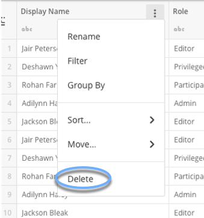       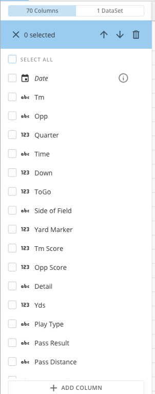

### Add Columns

In certain situations, it makes sense to add a duplicate of a column to your DataSet. To add columns to the DataSet, choose the **Add Column** button at the bottom of the columns on the left.

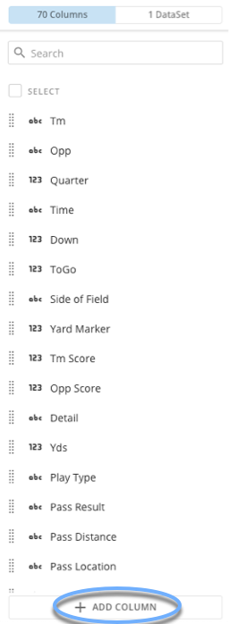

### Rename Columns

Rename a column by selecting the triple dot menu on a column and choosing **Rename**. This can also be done in by using the columns on the left.

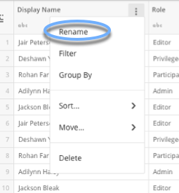

### Move Columns

Reordering columns can be done in two places. To move a column select the **Move** option in the triple dot menu and selecting one of the four options: **Left**, **Right**, **First**, or **Last**. You may also drag and reorder columns by using the columns on the left.

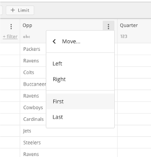   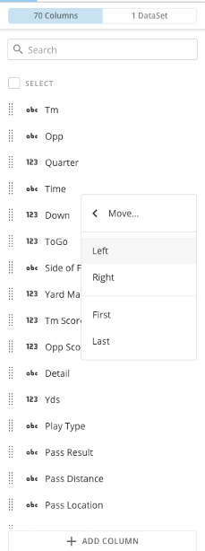

### Add Calculated Column

To add a new calculated column choose the plus sign and select **Add Calculated Column**.

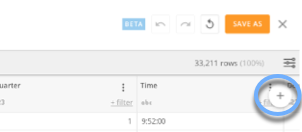   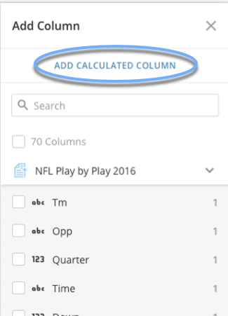

When you have finished writing the calculation, select **Save and Close**. This will automatically add the new calculated column to your DataSet in Views Explorer. For the new calculated column to save to your DataSet, you will need to save your DataSet as a new DataSet View.

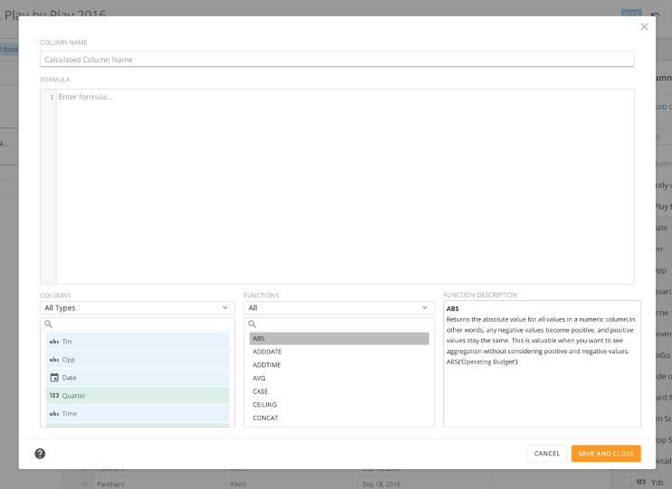

### Perform Joins

To join DataSets using Views Explorer, toggle to the DataSet side of the schema rail. From there, select the **Add Join** button.

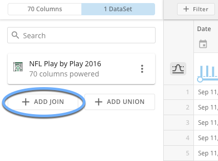

Next, select a DataSet to join and choose the Join Keys from each DataSet. Once you have selected the keys, choose the Join Type you would like to use (we support Left, Right, and Inner Joins.) You will then have to select the columns you would like to include in your DataSet.

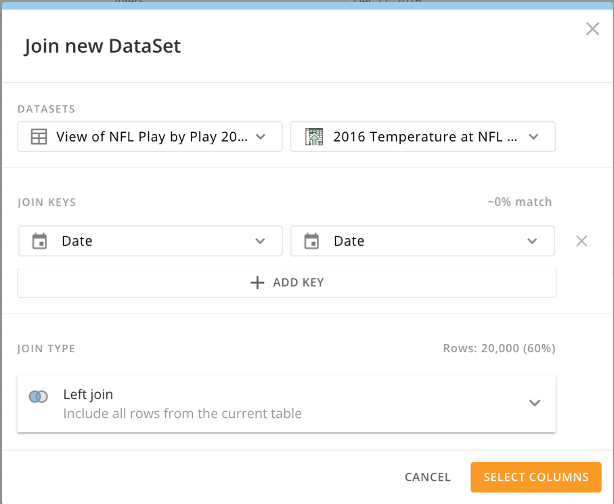

From the Select Columns modal choose which columns you would like to include in your DataSet and select **Save**. The columns you selected will now appear in your DataSet.

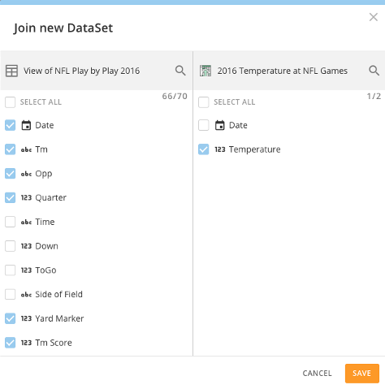

### Perform Unions

To union DataSets using Views Explorer, toggle to the DataSet side of the schema rail. From there, select the **Add Union** button.

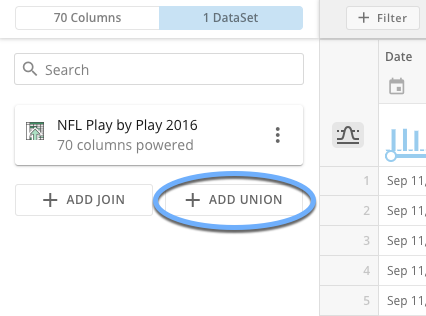

Next, select the DataSet(s) to union and select **Save**. The data from the selected DataSets will now appear in your DataSet.

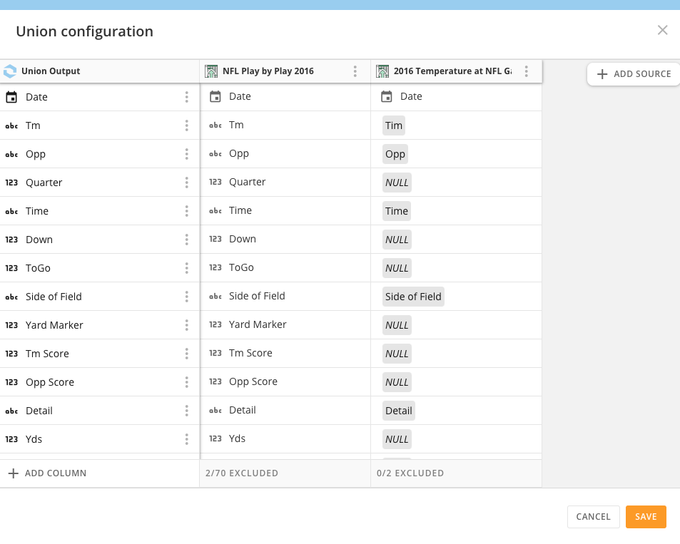

**Note:** In order for unions to work properly, both DataSets must contain the same columns. If your DataSets contain different columns, it is best to join them instead.

 

### Filter Data

Column filtering can be done with the columns on the left, using the **Filter** button at the top of Views Explorer, by choosing the triple dot menu on each column and selecting **Filter**, or by selecting **Filter** on each column.

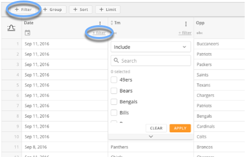   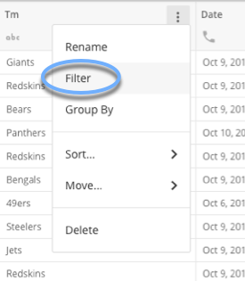

### Group Data

Grouping data helps you to see only columns you are interested in and aggregations to summarize the data from the categories you have selected. To Group data, start by selecting the **Group** button.

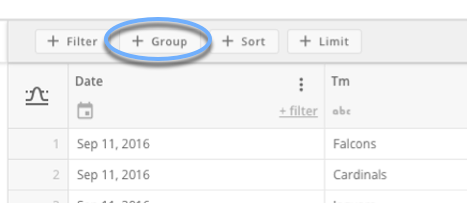

In the Group By modal, drag columns you are interested in into the Categories section.

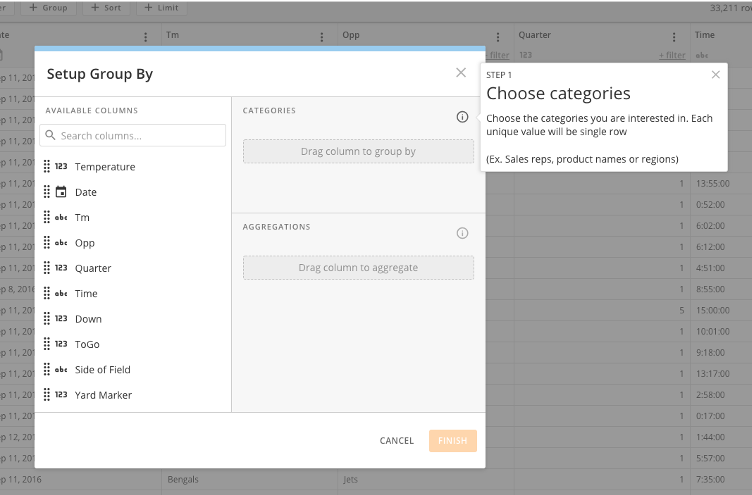

In the Group By modal, drag columns you are interested in aggregating into the Aggregations section.

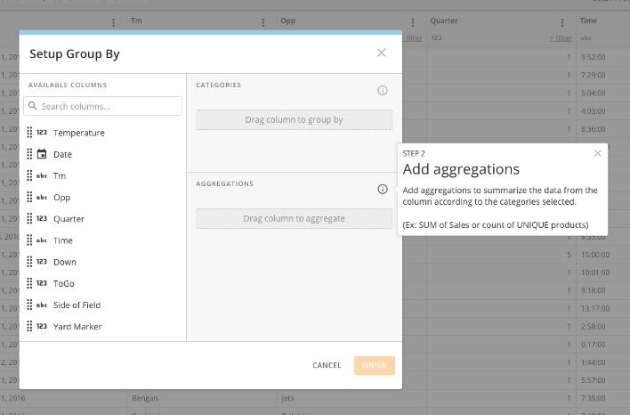

When you are finished, simply select the **Finish** button.

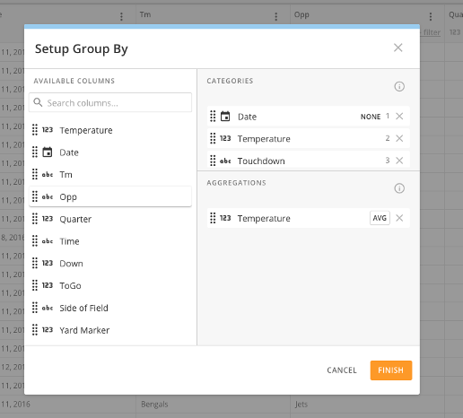

### Sort Data

Sorting data allows you to sort your data alphabetically, by date, Low to High, or High to Low. To sort data, choose the **Sort** button at the top or select the triple dot menu on each column.

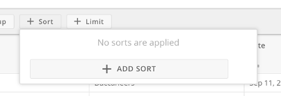   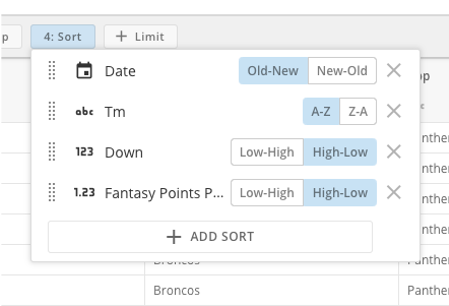

### Limit Data

Limit means the DataSet will only return the number of rows you have chosen, sorted by the sorting rules you select. To limit the number of rows in your data, choose **Limit** and add the number of rows you would like to include in your DataSet.

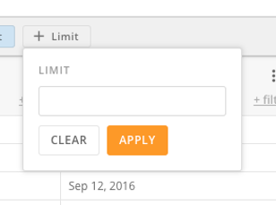   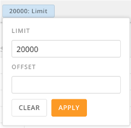

### Undo/Revert Changes

Sometimes you want to undo your last step or just start over. Use the undo and revert buttons to go back a few steps, or start over at the beginning of your data exploration.

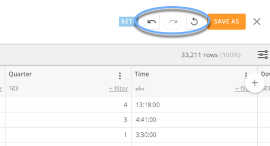

### Save the DataSet View

When you have finished your exploration, you may want to save it as a new DataSet View. To save your Views exploration as a new DataSet View choose the **Save As** Button. Choose a new name for your View and then Select **Save**.

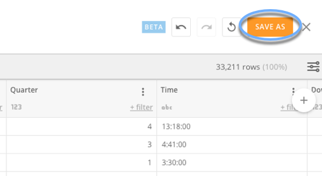   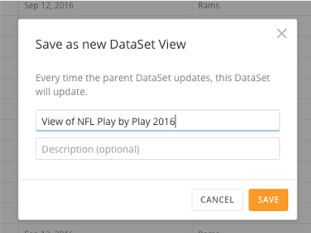

Your DataSet View will appear in Domo as a new DataSet that can be shared with others in Domo. PDP policies from the parent DataSet will still apply and the DataSet View will update when the parent DataSet updates.

FAQ's
-----

#### How do DataSet Views treat NULL values?

Null values are not considered to be equal or not equal to any other value. This means that comparing a column with a null value to another column using either = or != (<>) will always return false for that row.

#### Can I use a View inside of a MySQL DataFlow?

No, at this time Views are not supported inside of MySQL DataFlows. 

