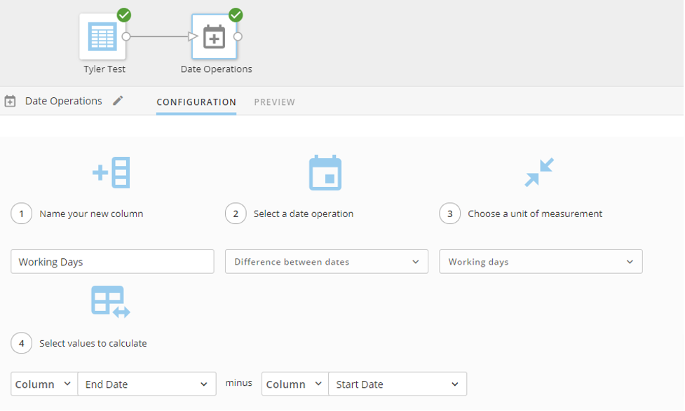
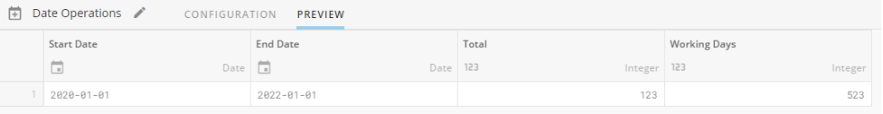

---
    title: Date Difference for Business Days
    url: https://domo-support.domo.com/s/article/360043428153
    linked_kbs:  ['[https://domo-support.domo.com/s/knowledge-base/](https://domo-support.domo.com/s/knowledge-base/)', '[https://domo-support.domo.com/s/](https://domo-support.domo.com/s/)', '[https://domo-support.domo.com/s/topic/0TO5w000000ZamzGAC](https://domo-support.domo.com/s/topic/0TO5w000000ZamzGAC)', '[https://domo-support.domo.com/s/topic/0TO5w000000ZaoJGAS](https://domo-support.domo.com/s/topic/0TO5w000000ZaoJGAS)', '[https://domo-support.domo.com/s/article/360043428153](https://domo-support.domo.com/s/article/360043428153)', '[https://domo-support.domo.com/s/topic/0TO5w000000ZaoJGAS/transformation-tips-and-tricks](https://domo-support.domo.com/s/topic/0TO5w000000ZaoJGAS/transformation-tips-and-tricks)', '[https://domo-support.domo.com/s/article/360043429933](https://domo-support.domo.com/s/article/360043429933)', '[https://domo-support.domo.com/s/article/360043429953](https://domo-support.domo.com/s/article/360043429953)', '[https://domo-support.domo.com/s/article/360042925494](https://domo-support.domo.com/s/article/360042925494)', '[https://domo-support.domo.com/s/article/360043429913](https://domo-support.domo.com/s/article/360043429913)', '[https://domo-support.domo.com/s/article/4408174643607](https://domo-support.domo.com/s/article/4408174643607)', '[https://domo-support.domo.com/s/login/](https://domo-support.domo.com/s/login/)']
    article_id: 000004604
    views: 2,687
    created_date: 2022-10-24 22:15:00
    last updated: 2022-10-24 22:41:00
    ---

Intro
-----

If you need to calculate the date difference between two dates for weekdays/business days, this can be done in Beast Mode or SQL DataFlow using a query.

SQL Query
---------

Copy and paste the following SQL query into your Beast Mode or DataFlow. Replace `Start Date` and `End Date` with the corresponding columns from your data.

`CASE WHEN`

``Start Date` = `End Date` THEN 0`

`ELSE`

`DATEDIFF(  
CASE WHEN DAYOFWEEK(`End Date`) = 7 THEN SUBDATE(`End Date`, INTERVAL 1 DAY)  
WHEN DAYOFWEEK(`End Date`) = 1 THEN SUBDATE(`End Date`, INTERVAL 2 DAY) ELSE `End Date` END  
,  
CASE WHEN DAYOFWEEK(`Start Date`) = 1 THEN ADDDATE(`Start Date`,INTERVAL 1 DAY)  
WHEN DAYOFWEEK(`Start Date`) = 7 THEN ADDDATE(`Start Date`,INTERVAL 2 DAY) ELSE `Start Date` END  
)`

`-`

`((CASE WHEN WEEK(CASE WHEN DAYOFWEEK(`Start Date`) = 1 THEN ADDDATE(`Start Date`,INTERVAL 1 DAY)  
WHEN DAYOFWEEK(`Start Date`) = 7 THEN ADDDATE(`Start Date`,INTERVAL 2 DAY) ELSE `Start Date` END) = WEEK(CASE WHEN DAYOFWEEK(`End Date`) = 7 THEN SUBDATE(`End Date`, INTERVAL 1 DAY)  
WHEN DAYOFWEEK(`End Date`) = 1 THEN SUBDATE(`End Date`, INTERVAL 2 DAY) ELSE `End Date` END) THEN 0 ELSE WEEK(CASE WHEN DAYOFWEEK(`End Date`) = 7 THEN SUBDATE(`End Date`, INTERVAL 1 DAY)  
WHEN DAYOFWEEK(`End Date`) = 1 THEN SUBDATE(`End Date`, INTERVAL 2 DAY) ELSE `End Date` END) END`

  
`-`

`CASE WHEN WEEK(CASE WHEN DAYOFWEEK(`Start Date`) = 1 THEN ADDDATE(`Start Date`,INTERVAL 1 DAY)  
WHEN DAYOFWEEK(`Start Date`) = 7 THEN ADDDATE(`Start Date`,INTERVAL 2 DAY) ELSE `Start Date` END) = WEEK(CASE WHEN DAYOFWEEK(`End Date`) = 7 THEN SUBDATE(`End Date`, INTERVAL 1 DAY)  
WHEN DAYOFWEEK(`End Date`) = 1 THEN SUBDATE(`End Date`, INTERVAL 2 DAY) ELSE `End Date` END) THEN 0 ELSE WEEK(CASE WHEN DAYOFWEEK(`Start Date`) = 1 THEN ADDDATE(`Start Date`,INTERVAL 1 DAY)  
WHEN DAYOFWEEK(`Start Date`) = 7 THEN ADDDATE(`Start Date`,INTERVAL 2 DAY) ELSE `Start Date` END) END) * 2)`

`END`

Solution Details and Steps
--------------------------

1. If the Start Date and End Date are the same, then it will return 0

`CASE WHEN`

``Start Date` = `End Date` THEN 0`

2. If Start Date and End Date aren't the same, then the End Date is moved to Friday and Start Date is moved to Monday when either occurs on a weekend. Then, subtract them to find the date difference. This removes any weekend days from the Start and End Dates.

`ELSE`

`DATEDIFF(  
CASE WHEN DAYOFWEEK(`End Date`) = 7 THEN SUBDATE(`End Date`, INTERVAL 1 DAY)  
WHEN DAYOFWEEK(`End Date`) = 1 THEN SUBDATE(`End Date`, INTERVAL 2 DAY) ELSE `End Date` END  
,  
CASE WHEN DAYOFWEEK(`Start Date`) = 1 THEN ADDDATE(`Start Date`,INTERVAL 1 DAY)  
WHEN DAYOFWEEK(`Start Date`) = 7 THEN ADDDATE(`Start Date`,INTERVAL 2 DAY) ELSE `Start Date` END  
)`

3. If the week number of the Start Date is equal to the week number of the End Date, then return 0. If they are not the same week, then return the week number of the End Date.

`-`

`((CASE WHEN WEEK(CASE WHEN DAYOFWEEK(`Start Date`) = 1 THEN ADDDATE(`Start Date`,INTERVAL 1 DAY)  
WHEN DAYOFWEEK(`Start Date`) = 7 THEN ADDDATE(`Start Date`,INTERVAL 2 DAY) ELSE `Start Date` END) = WEEK(CASE WHEN DAYOFWEEK(`End Date`) = 7 THEN SUBDATE(`End Date`, INTERVAL 1 DAY)  
WHEN DAYOFWEEK(`End Date`) = 1 THEN SUBDATE(`End Date`, INTERVAL 2 DAY) ELSE `End Date` END) THEN 0 ELSE WEEK(CASE WHEN DAYOFWEEK(`End Date`) = 7 THEN SUBDATE(`End Date`, INTERVAL 1 DAY)  
WHEN DAYOFWEEK(`End Date`) = 1 THEN SUBDATE(`End Date`, INTERVAL 2 DAY) ELSE `End Date` END) END`

4. If the week number of the Start Date is equal to the week number of the End Date, then return 0. If they are not the same week, then return the week number of the Start Date. This week number is subtracted from the End Date week number calculated in step 3. Then, we multiply by 2. This outputs the total number of weekend days that occur within the Start and End Date range.

`-`

`CASE WHEN WEEK(CASE WHEN DAYOFWEEK(`Start Date`) = 1 THEN ADDDATE(`Start Date`,INTERVAL 1 DAY)  
WHEN DAYOFWEEK(`Start Date`) = 7 THEN ADDDATE(`Start Date`,INTERVAL 2 DAY) ELSE `Start Date` END) = WEEK(CASE WHEN DAYOFWEEK(`End Date`) = 7 THEN SUBDATE(`End Date`, INTERVAL 1 DAY)  
WHEN DAYOFWEEK(`End Date`) = 1 THEN SUBDATE(`End Date`, INTERVAL 2 DAY) ELSE `End Date` END) THEN 0 ELSE WEEK(CASE WHEN DAYOFWEEK(`Start Date`) = 1 THEN ADDDATE(`Start Date`,INTERVAL 1 DAY)  
WHEN DAYOFWEEK(`Start Date`) = 7 THEN ADDDATE(`Start Date`,INTERVAL 2 DAY) ELSE `Start Date` END) END) * 2)`

`END`

5. Lastly, the total number of weekend days is subtracted from the date difference calculated above in step 2.

**Note:** The SQL Query only works if the dates are within the same year. If you need to compare dates in different years, use the Magic ETL method instead.

Magic ETL
---------

1. Connect your Input DatSet tile to a Date Operations tile.
2. Configure the tile as shown here:  
  

**Note:** In Step 4, you will want to make sure to choose your end date first and then your start date as this function subtracts the dates from each other. If you enter the start date first it will result in a negative number.

The results will look like this:  
  

