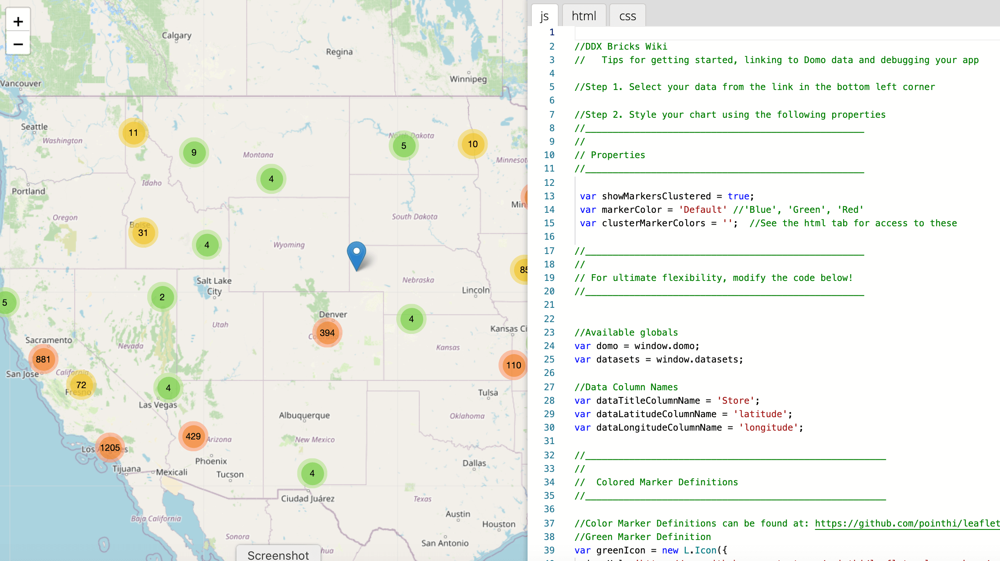

---
    title: DDX Bricks
    url: https://domo-support.domo.com/s/article/4423762260375
    linked_kbs:  ['[https://domo-support.domo.com/s/knowledge-base/](https://domo-support.domo.com/s/knowledge-base/)', '[https://domo-support.domo.com/s/](https://domo-support.domo.com/s/)', '[https://domo-support.domo.com/s/topic/0TO5w000000ZampGAC](https://domo-support.domo.com/s/topic/0TO5w000000ZampGAC)', '[https://domo-support.domo.com/s/topic/0TO5w000000ZanOGAS](https://domo-support.domo.com/s/topic/0TO5w000000ZanOGAS)', '[https://domo-support.domo.com/s/article/4423762260375](https://domo-support.domo.com/s/article/4423762260375)', '[https://domo-support.domo.com/s/topic/0TO5w000000ZanOGAS/custom-apps](https://domo-support.domo.com/s/topic/0TO5w000000ZanOGAS/custom-apps)', '[https://domo-support.domo.com/s/article/360043429933](https://domo-support.domo.com/s/article/360043429933)', '[https://domo-support.domo.com/s/article/360043429953](https://domo-support.domo.com/s/article/360043429953)', '[https://domo-support.domo.com/s/article/360042925494](https://domo-support.domo.com/s/article/360042925494)', '[https://domo-support.domo.com/s/article/360043429913](https://domo-support.domo.com/s/article/360043429913)', '[https://domo-support.domo.com/s/article/4408174643607](https://domo-support.domo.com/s/article/4408174643607)', '[https://domo-support.domo.com/s/login/](https://domo-support.domo.com/s/login/)']
    article_id: 000005012
    views: 1.793
    created_date: 2022-11-02 20:16:00
    last updated: 2022-11-02 20:37:00
    ---

Intro
-----

DDX Bricks are pre-built objects that allow you to create advanced visualizations and apps that can be customized by simply copying and pasting code.

With DDX Bricks, business users, citizen developers, and full-stack developers can quickly iterate, prototype, and compose new apps with beautiful and advanced features. You can choose from Bricks available in the Domo Appstore. You can also use DDX Bricks to render a new library you found online — it’s as easy as copy and paste.

DDX Bricks lets you use HTML, CSS, and JS to completely customize your app. These new custom solutions visuals are immediately rendered and can be easily updated all within your Domo instance.

Now there is a seamless path for business users to progress from out-of-the box app building constraints to scalable, powerful, customized objects that extend Domo to meet any business need.

 

**Video - DDX Pendo Guide**

Getting this feature
--------------------

If you are interested in joining the Beta for this feature, please contact your Customer Success Manager (CSM).

Prerequisites
-------------

To start using DDX Bricks you will need:

* A Domo account.
* Permission to create an app from the Appstore.
* Understanding of how to work with Domo DataSets (for example how to build a Card from a DataSet.)
* A basic understanding of HTML, CSS, and JS is useful to fully customize DDX Bricks.

For more information on utilizing DDX Bricks, see <https://developer.domo.com/docs/ddx-bricks/ddx-bricks-overview>.

