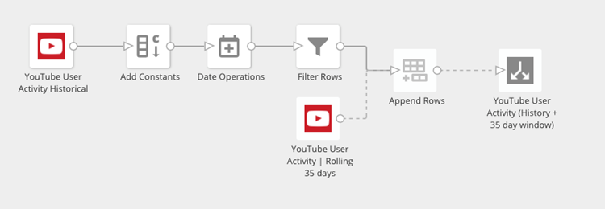
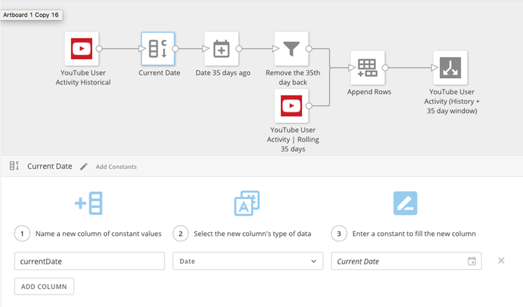
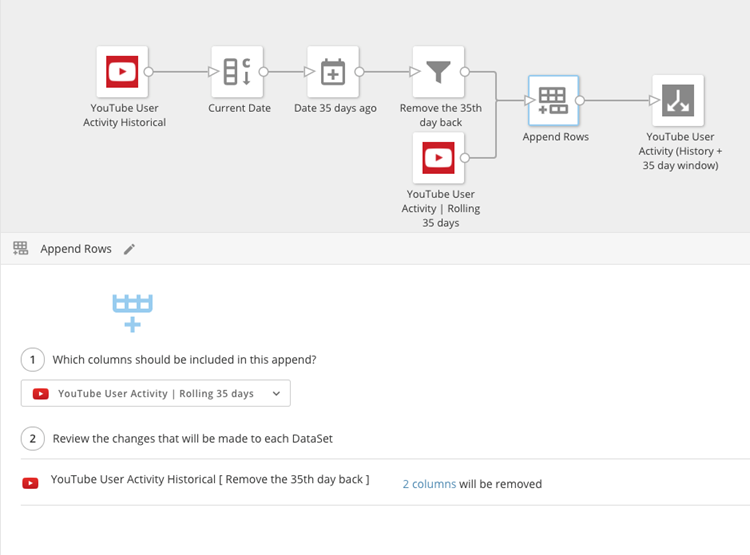
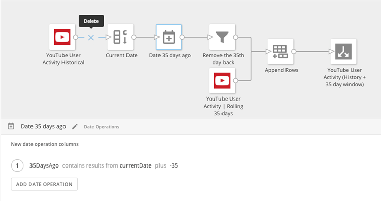
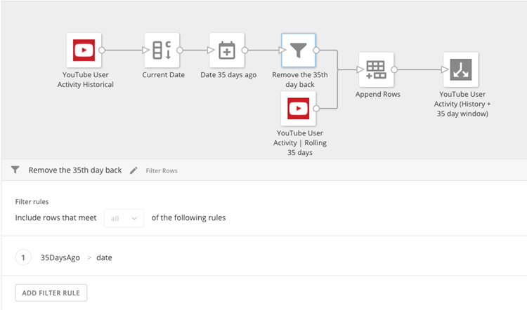

"Attribution windows" are essentially periods in which some companies (such as Facebook and YouTube) reserve the right to restate their metrics over a period of days. For example, Youtube has a 35-day attribution window, meaning they can restate their numbers anytime within this window. Likewise, Facebook has a 28-day window.

You can deal with such attribution windows by setting up a rolling file and a historical file. The rolling file should be set to replace and should cover the attribution window. The historical file should be set to contain the growing history and should execute once a day to capture just a single day’s data in an append.

There are multiple ways to combine these files and some of it depends on API timing. If both of these calls (the rolling and append daily) happen quickly and early, the fastest and simplest approach is to use DataFusion. The files will contain the same schema because they are the same call, covering different date ranges. If both calls are made early and run quickly, you will only have minimal minutes each day where the calls are executing, and you could possibly have a gap between the rolling file and the historical file completing with a single day missing.

If the DataSets are small and you need to account for the slight chance of a missing day during the run, you’ll want to set up an ETL like the following:

In the above screenshot you have a top branch (historical) that contains the history including day 35 as an append each day. In the bottom branch you have a daily replace file of the last 35 days. So there is overlap of day 35 in both files. Because of this, you need to do a filter on one of the branches removing the 35th day so it is not counted twice. As long as one of these DataSets is running quickly and reliably, you will have this data overlapped then filtered to ensure reliable, contiguous reporting. 

Here are the parameters for each transform:

 

  
  
  

 

 

 

