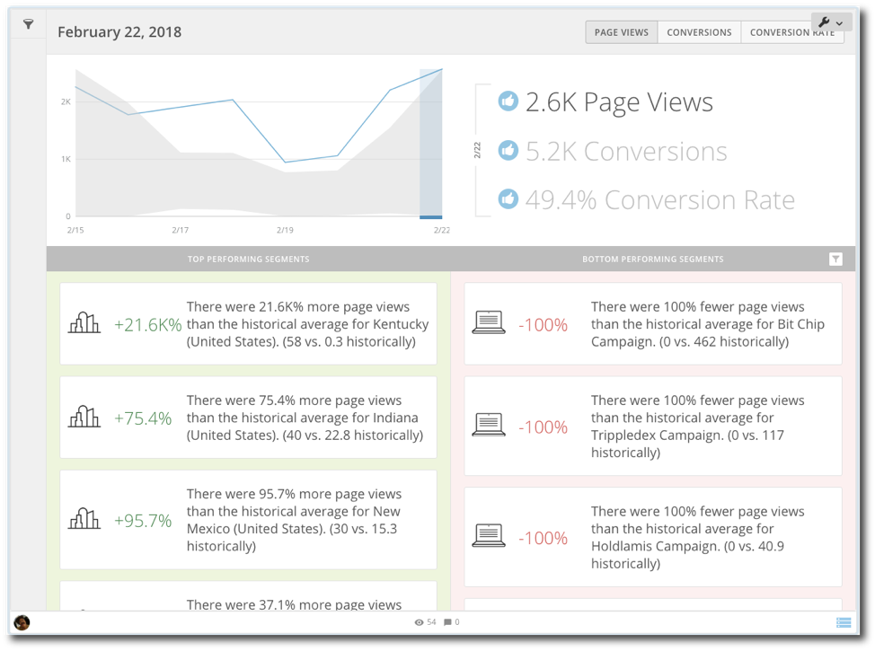
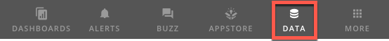
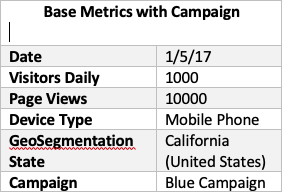
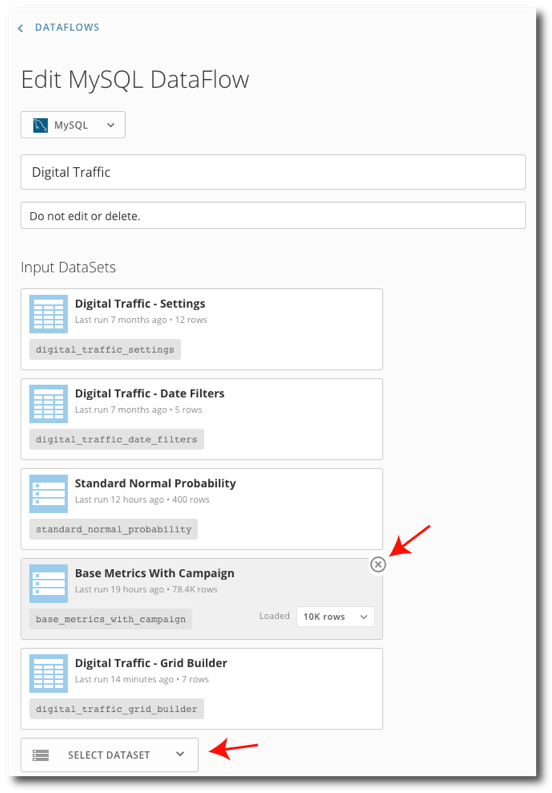
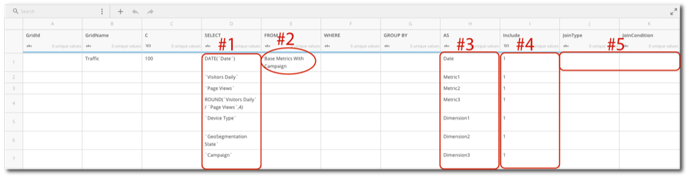
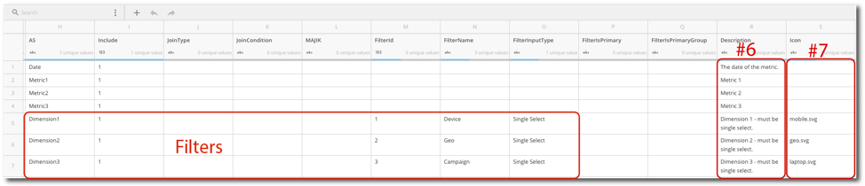

Intro
-----

Thank you for choosing to install the Digital Traffic App! This guide is intended to help you connect this app with your own data. The first steps are making sure that the app and the app's DataFlow have been properly downloaded from the Domo Appstore, and also that your data is in the correct format to be used by the app.

  
 

Prerequisites:
--------------

This app utilizes a tool called the Grid Builder that maps your data to the schema that the app requires. If you are not already familiar with Grid Builder, please read our Grid Builder walkthrough [here](https://developer.domo.com/docs/installation-guides/grid-builder-walkthrough). Though it is not required, it is also useful to have a working knowledge of how MySQL query works.

Below is a diagram that represents the order in which the your data will be fed through the DataFlow and output to the app.

  
 Once you have become familiar with how the Grid Builder works, follow these next steps to make sure that the app and the DataFlow have been properly deployed to your instance in Domo:

* If you purchased the app through the Appstore, make sure that you have selected the **Try It** button on the app's page in the Appstore, this deploys the app and its DataFlow to your instance. You will be asked to name the page where'd like the app to live in Domo as well.
* Double check that the app's DataFlow has been deployed to your instance successfully. To check this, navigate to the Data Center by clicking the **Data** button located in the top left corner of Domo (see image below for example.)  
   
 
* Once you're in the Data Center, select **DataFlows** located on the left side of the screen, then use the Data Center's search bar to search for "Digital Traffic". You should be able to locate the DataFlow named "Digital Traffic".

If you've followed all of these steps and you still aren't able to locate the app either on the page you've created or its DataFlow, contact Technical Support. For information on how to contact Support, please see: [Getting Help](/s/article/360042922874).

Step 1: Prepare Your Data
-------------------------

The Digital Traffic App displays measured digital traffic data from your website(s), social networks, geographical locations, and devices in order to monitor trends in total conversions, conversion rates, and page views. All of this information means that you'll need one table to run this app, this table will contain base metrics and campaigns. Certain columns are required in your table in order for the DataFlow to run, the table schema below shows all the required columns.  The column names will be mapped as you fill out the Grid Builder later, so you do not need to change your column names in your data to fit the schema (see example below.)

  
 

The Digital Traffic App has a Date Range filter already built-in that cannot be removed nor repositioned in the app. You can change the filter options in the Date Range filter, these date ranges are located in the "Digital Traffic- Date Filters" DataSet. If you want to change the date ranges in the filter, click on the DataSet, click on the wrench icon, and select **Edit WebForm**. You are able to edit the labels, date grains, and intervals. After you save your changes the DataFlow will run and the changes will appear after the DataFlow has finished running. You can use more than one DataSet as source data for the app, as long as they can be joined together using your date and primary groups columns. Information on how to do joins will be located in the following sections.

Step 2: Add Your Source Data to the DataFlow
--------------------------------------------

As soon as your data has been prepped, you will need to navigate to the DataFlow and add your data as inputs to the DataFlow.

###### Follow these steps for adding your source data to the app's DataFlow:

* Navigate to the Data Center by clicking the **Data** button located in the top left corner of Domo (see image below for example.)  
   
 
* Select **DataFlows** on the left side of the page, then search for "Digital Traffic" in the Data Center's search bar - you should be able to see a DataFlow with the name you searched for.
* Select the DataFlow to go the details view, then click on the pencil icon on the right side of the page to edit the DataFlow.
* Remove the sample DataSet named "Base Metrics with Campaign" by clicking the **x** on the corner of the DataSet.
* Select the **Select DataSet** button, then search for the DataSet that you created for the app and add it by selecting it. Keep in mind that you only need one DataSet if you have all the columns required by the app. If you need to do a join, add multiple DataSets.
* After you've added your DataSet, scroll to the bottom of the page and click the **Save** button.
* Navigate back to the Data Center.

**Example:**

  
 

Step 3: Edit the Grid Builder
-----------------------------

For this next step, you'll need to edit the appropriate fields in the Grid Builder in order to match your input data. This guide presents the basic steps to do so, but for a more comprehensive tutorial on how the Grid Builder works, please review the [Grid Builder Walkthrough](https://developer.domo.com/docs/installation-guides/grid-builder-walkthrough). As you make changes, it may be wise to occasionally copy your work into an Excel spreadsheet to track your changes, just in case anything happens with your web browser while you are editing the Grid Builder.

###### Follow these steps to edit the Grid Builder:

* Navigate to the Grid Builder webform that came with the Digital Traffic App. A webform is a type of DataSet, so you'll need to search for it in the DataSet tab and not the DataFlow tab. It will be named "Digital Traffic - Grid Builder". Click the DataSet, then in the details view, click the wrench icon located on the right side and select **Edit Webform**.

* In the SELECT column from C100 down, you'll need to replace the samples values with the names of the columns from the DataSets located in the FROM column, that you would like to use in the app. This is where you'll map your data to the app, you many have more columns if you are joining DataSets, so you may have to add more rows (see #1 in the example image above.)
* In the FROM column, change the value on row C100 to match the name of your first DataSet. Repeat this step for all of the tables you will be using as source data, each new DataSet should be assigned to the next hundreds value under the "C" column. For example, start with 200 for the second DataSet, 300 for the third, etc. (see #2 in the example image above.)
* The AS column from C100 down are the new names of the columns from the SELECT column, these names should match the schema in the table above. The AS column should be listed correctly, so you will not need to edit or alter this column (see #3 in the example image above.)
* In the "Include" column, place a 1 in each row that you are including from your data that isn't being used solely for a join. If you are not including a certain column, place a 0 in the "Include" column row instead of a 1 (see #4 in the example image above.)
* To do a join you'll fill out the "JoinType" and "JoinCondition" columns on row C200. "JoinType" needs to be in all CAPS and can be any type of join that is used in MySQL, additional joins usually use LEFT for the "JoinType" column. The "JoinCondition" references the row where your column is being brought in from your DataSet. The "JoinCondition" should look something like this: `Ctable#.COLUMNNAME = CTable#.COLUMNNAME`
* As soon as you have the information entered for all of your DataSets, you'll need then need to configure your filters. On each row of the Grid Builder that references a column in your data that you'd like to use as a filter, update the three filter columns as: "FilterId", "FilterName", "FilterInputType".

* On the rows that are filters, use incrementing number in the "FilterId" column (3,4,5,etc.), putting the smallest number in the top row. Define filter names under "FilterName", using "Single Select" in the "FilterInputType" column. Leave "FilterIsPrimary" and "FilterPrimaryGroup" empty, see example above.
* The description column lets you know what is currently in the rows in the sample version of Digital Traffic, thus it has no affect on the app itself (see #6 in the example image above.)
* The "Icon" column lists an icon for each filter located in the Segment section of the app.
* Lastly, select **Save & Continue** at the top of the Grid Builder page to save your edited DataSet.

As soon as you've made the necessary changes in the Grid Builder, go the Data Center and run the Digital Traffic DataFlow. If the DataFlow runs successfully, you've most likely filled out the Grid Builder correctly. If you do encounter any errors, review the [Grid Builder Walkthrough](https://developer.domo.com/docs/installation-guides/grid-builder-walkthrough) or contact Technical Support. For information on how to contact Support, please see: [Getting Help](/s/article/360042922874).

Step 5: Validation
------------------

Now that you have successfully configured the Grid Builder, you should now be ready to check your Digital Traffic App to validate your metrics.

**We suggest that you follow this process to validate:**

1. Build out KPI cards to test your metrics, build these cards based off of your source data and not the output data in the app. For example, if you are displaying sales trending by sales rep in the app, build a bar chart type card that displays sales per rep and have the date range of the KPI card match one of your selected date ranges that is displayed in the app.
2. Compare your data in the KPI card and the app itself, remember to make sure that your filtering options and date ranges match in both the app and your KPI card.
3. If you find any discrepancies, check to make sure that you don't need to change join conditions or groupings in the Grid Builder. Be sure to also double check your calculations, as well.
4. Repeat this process for any metrics that you may need to validate.

#### Congratulations!

Your Digital Traffic App is now ready to go! Enjoy getting the best return from your data. If you have any further questions or need help troubleshooting your app, contact Technical Support. For information on how to contact Support, please see: [Getting Help](/s/article/360042922874).

