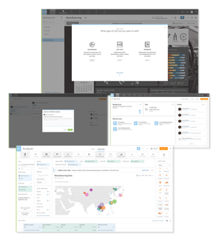
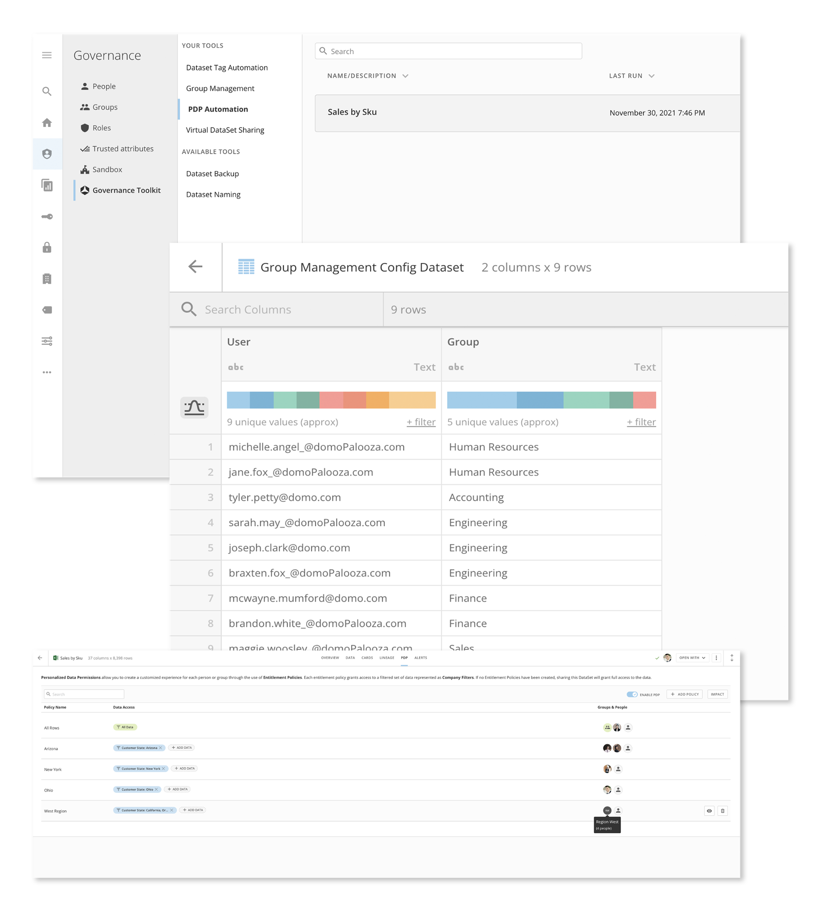
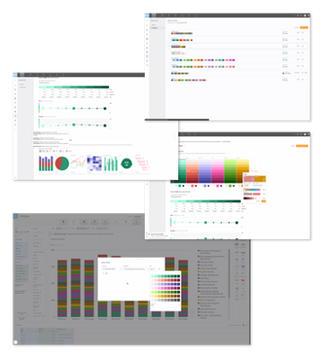

---
    title: Domo Enterprise Toolkit
    url: https://domo-support.domo.com/s/article/5299662679447
    linked_kbs:  ['[https://domo-support.domo.com/s/knowledge-base/](https://domo-support.domo.com/s/knowledge-base/)', '[https://domo-support.domo.com/s/](https://domo-support.domo.com/s/)', '[https://domo-support.domo.com/s/topic/0TO5w000000ZamlGAC](https://domo-support.domo.com/s/topic/0TO5w000000ZamlGAC)', '[https://domo-support.domo.com/s/topic/0TO5w000000ZannGAC](https://domo-support.domo.com/s/topic/0TO5w000000ZannGAC)', '[https://domo-support.domo.com/s/article/4403367344023](https://domo-support.domo.com/s/article/4403367344023)', '[https://domo-support.domo.com/s/article/4415800746391](https://domo-support.domo.com/s/article/4415800746391)', '[https://domo-support.domo.com/s/article/4415839139863](https://domo-support.domo.com/s/article/4415839139863)', '[https://domo-support.domo.com/s/article/4415826269335](https://domo-support.domo.com/s/article/4415826269335)', '[https://domo-support.domo.com/s/article/4415839663639](https://domo-support.domo.com/s/article/4415839663639)', '[https://domo-support.domo.com/s/article/4415792998935](https://domo-support.domo.com/s/article/4415792998935)', '[https://domo-support.domo.com/s/article/5428851518999](https://domo-support.domo.com/s/article/5428851518999)', '[https://domo-support.domo.com/s/article/5299662679447](https://domo-support.domo.com/s/article/5299662679447)', '[https://domo-support.domo.com/s/topic/0TO5w000000ZannGAC/governance-tools](https://domo-support.domo.com/s/topic/0TO5w000000ZannGAC/governance-tools)', '[https://domo-support.domo.com/s/article/360043429933](https://domo-support.domo.com/s/article/360043429933)', '[https://domo-support.domo.com/s/article/360043429953](https://domo-support.domo.com/s/article/360043429953)', '[https://domo-support.domo.com/s/article/360042925494](https://domo-support.domo.com/s/article/360042925494)', '[https://domo-support.domo.com/s/article/360043429913](https://domo-support.domo.com/s/article/360043429913)', '[https://domo-support.domo.com/s/article/4408174643607](https://domo-support.domo.com/s/article/4408174643607)', '[https://domo-support.domo.com/s/login/](https://domo-support.domo.com/s/login/)']
    article_id: 000003031
    views: 2,399
    created_date: 2022-10-24 21:04:00
    last updated: 2022-10-24 22:41:00
    ---

Intro
-----

Every day, data becomes a larger, more important part of how you do business. This means processing more data faster for more people. As these needs grow, you need solutions that help maintain and process all that data, without sacrificing the agility and control required to achieve your most audacious goals. Domo Enterprise Toolkit is a collection of tools and features to help you maintain control, security, and consistency within your Domo environment as the depth and breadth of your data solutions expand.

 

Toolkit Elements
----------------

There are three main elements within the Domo Enterprise Toolkit:

* Sandbox
* Governance Toolkit
* Brand Kit

**Sandbox: Encourage Innovation While Maintaining Control**

End users rely on everything running perfectly, without the hiccups or downtime that can happen when changing or testing a new visualization. Domo’s Sandbox allows analysts to build and test in a separate environment, promoting content only when it’s ready for broad use.

For more information about Sandbox, see [Domo Sandbox.](/s/article/4403367344023)

 

**Governance Toolkit: Streamline Enterprise Governance**

In an enterprise organization, data security and management demands even more attention and resources. Domo’s easy-to-use Governance Toolkit helps you manage your data efficiently and securely by simplifying dataset management and upkeep, automating data permission policies, and even helping with external data storage.

For more information on the tools and features that make up the Governance Toolkit, see the following:

* [Governance Toolkit: PDP Automation](/s/article/4415800746391)
* [Governance Toolkit: DataSet Tagging](/s/article/4415839139863)
* [Governance Toolkit: DataSet Sharing](/s/article/4415826269335)
* [Governance Toolkit: Group Management](/s/article/4415839663639)
* [Governance Toolkit: DataSet Backup](/s/article/4415792998935)
	+ Note: DataSet Backup is not included in the standard Enterprise Toolkit offering, but can be added for an additional cost.

 

**Brand Kit: Maintain Consistency and Trust**

As you scale, more and more people will need access to their data in more places and formats, both inside and outside your organization. With Brand Kit, you can build trust and adoption with a look and feel consistent with your brand, including fonts, colors, logos, and more.

 

 

For more information on Brand Kit, see [Brand Kit](/s/article/5428851518999).

