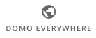
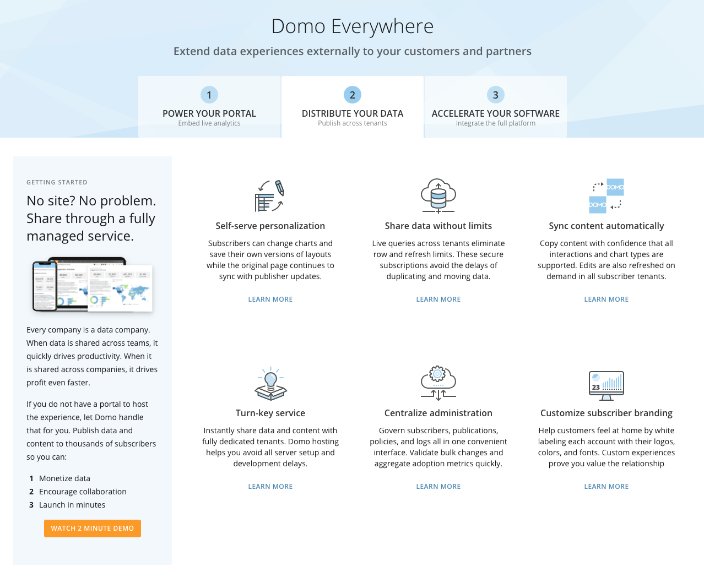
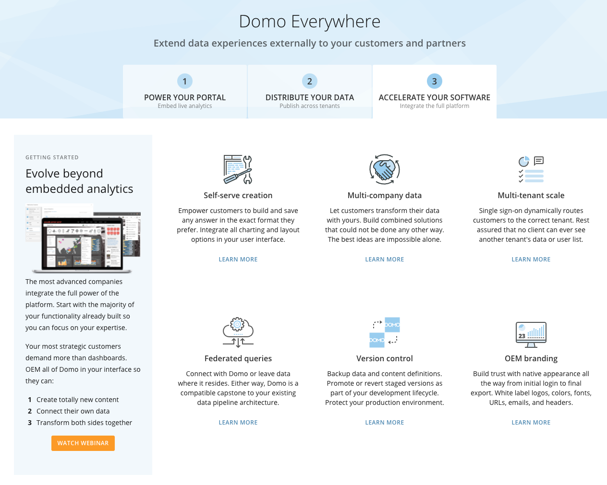

---
    title: Domo Everywhere Launch Page
    url: https://domo-support.domo.com/s/article/4403486465687
    linked_kbs:  ['[https://domo-support.domo.com/s/knowledge-base/](https://domo-support.domo.com/s/knowledge-base/)', '[https://domo-support.domo.com/s/](https://domo-support.domo.com/s/)', '[https://domo-support.domo.com/s/topic/0TO5w000000ZamqGAC](https://domo-support.domo.com/s/topic/0TO5w000000ZamqGAC)', '[https://domo-support.domo.com/s/topic/0TO5w000000ZanbGAC](https://domo-support.domo.com/s/topic/0TO5w000000ZanbGAC)', '[https://domo-support.domo.com/s/article/4403486465687](https://domo-support.domo.com/s/article/4403486465687)', '[https://domo-support.domo.com/s/topic/0TO5w000000ZanbGAC/domo-everywhere](https://domo-support.domo.com/s/topic/0TO5w000000ZanbGAC/domo-everywhere)', '[https://domo-support.domo.com/s/article/360043429933](https://domo-support.domo.com/s/article/360043429933)', '[https://domo-support.domo.com/s/article/360043429953](https://domo-support.domo.com/s/article/360043429953)', '[https://domo-support.domo.com/s/article/360042925494](https://domo-support.domo.com/s/article/360042925494)', '[https://domo-support.domo.com/s/article/360043429913](https://domo-support.domo.com/s/article/360043429913)', '[https://domo-support.domo.com/s/article/4408174643607](https://domo-support.domo.com/s/article/4408174643607)', '[https://domo-support.domo.com/s/login/](https://domo-support.domo.com/s/login/)']
    article_id: 000004242
    views: 2.342
    created_date: 2022-10-24 21:34:00
    last updated: 2022-10-24 22:39:00
    ---

Intro
-----

The Domo Everywhere Launch Page helps you to quickly learn how leading customers are using each version of Domo Everywhere. This allows you to choose the right Domo Everywhere product for your needs.

Accessing the Domo Everywhere Launch Page
-----------------------------------------

To access the Domo Everywhere Launch Page, click on the **More** menu in the top navigation pane and select the **Domo Everywhere** icon.

     **>**    

Power Your Portal tab
---------------------

The first tab of the Domo Everywhere Launch Page is Power Your Portal. This allows you to embed live analytics where people already work. Share insights outside of your company without forcing a separate login or extra training. Bring live answers right next to the workflows where people are already comfortable so you can:

* Inform decisions.
* Increase adoption.
* Improve retention.

Distribute Your Data tab
------------------------

The second tab of the Domo Everywhere Launch Page is Distribute Your Data. This allows you to publish across tenants. Every company is a data company. When data is shared across teams, it quickly drives productivity. When it is shared across companies, it drives profit even faster. If you do not have a portal to host the experience, let Domo handle that for you. Publish data and content to thousands of subscribers so you can:

* Monetize data.
* Encourage collaboration.
* Launch in minutes.

Accelerate Your Software tab
----------------------------

The second tab of the Domo Everywhere Launch Page is Accelerate Your Software. This allows you to integrate the full platform. The most advanced companies integrate the full power of the platform. Start with the majority of your functionality already built so you can focus on your expertise. Your most strategic customers demand more than dashboards. OEM all of Domo in your interface so they can:

* Create totally new content.
* Connect their own data.
* Transform both sides together.

