Intro
-----

Thank you for purchasing the Domo Finance app! This guide will help you familiarize yourself with the features and layout of the app. The Domo Finance app contains three views: P&L (Profit and Loss Statement), Cash Flows, and Balance Sheet. Each of these three statements can be exported as either a PDF or Excel spreadsheet, and are completely driven by your connected financial data. The app serves as a means to visually connect with and customize your important financial statements and data. A Global Settings feature is also included for any user defined as an Admin.  
  

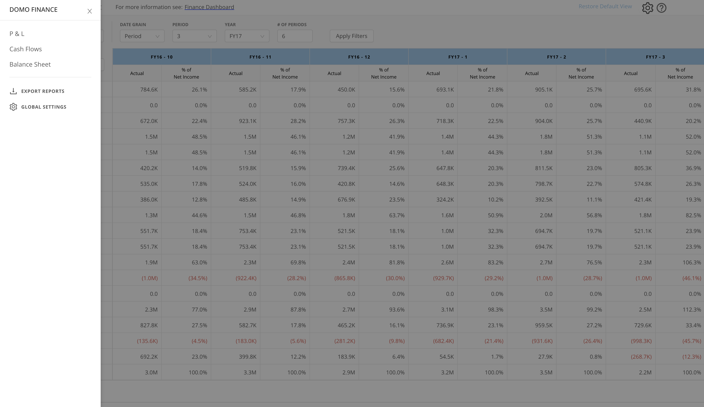

### Prerequisites

If you are not an Admin role or part of the "\_FinanceApp\_Admin\_" user group, then you will not be able to modify settings in the finance app which affect the user experience of the app, for example default view, period vs calendar month names and more.

### Global Settings

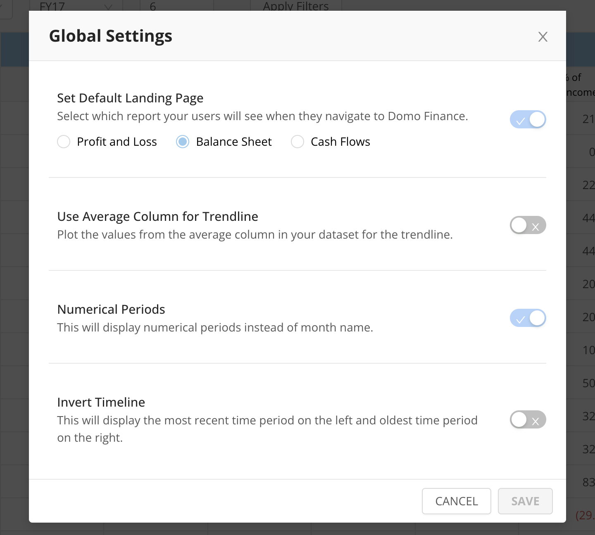

#### Show periods instead of month names

Now you are able to change how the app display the calendar. If you want to display periods instead of month names, first you need to open the burger menu that will show all the Landing pages, export button and the Global Settings button.

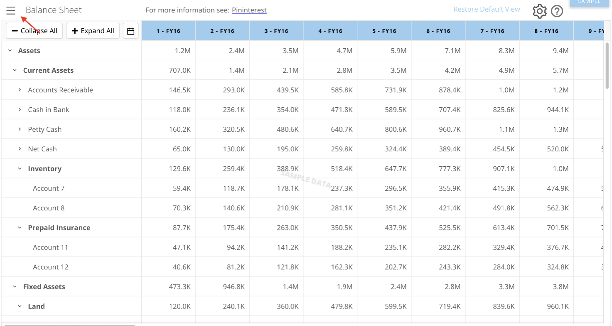

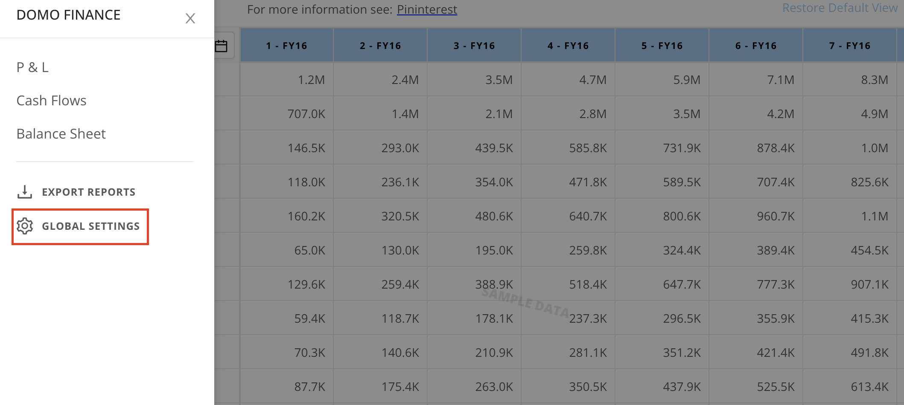

At the Global Settings menu, click on the toggle at the “Numerical Periods” row, this will enable the change of month names to periods.

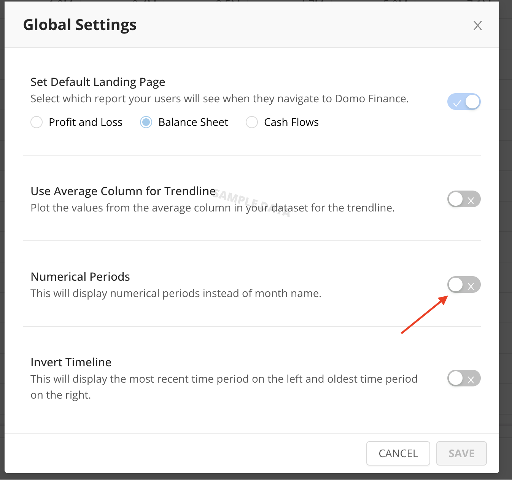

Finally, click on save and the app will now show Periods instead of months names.

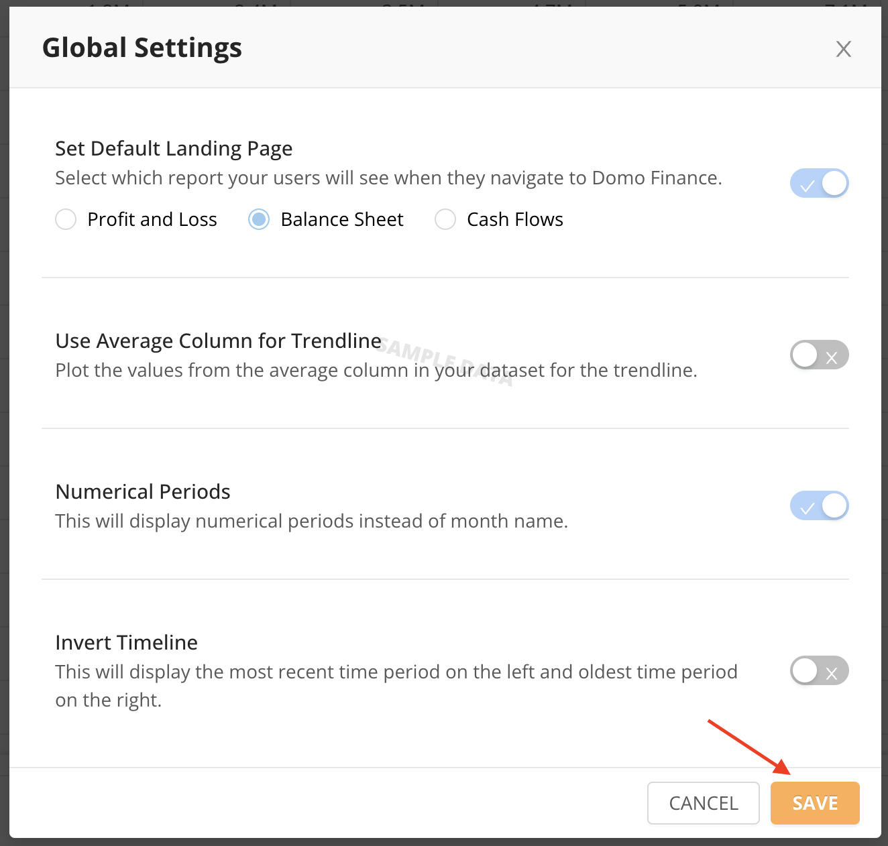

#### Trendline chart using average amount

You can configure the trendline displayed in the app to use a value from your input dataset. This allows you to display an average in the trendline which you calculate externally.

Add a column to your dataset called “Average trend” then Open the Global Settings menu.

Inside the Global Settings Menu, toggle the option “Use Average Column for Trendline”.

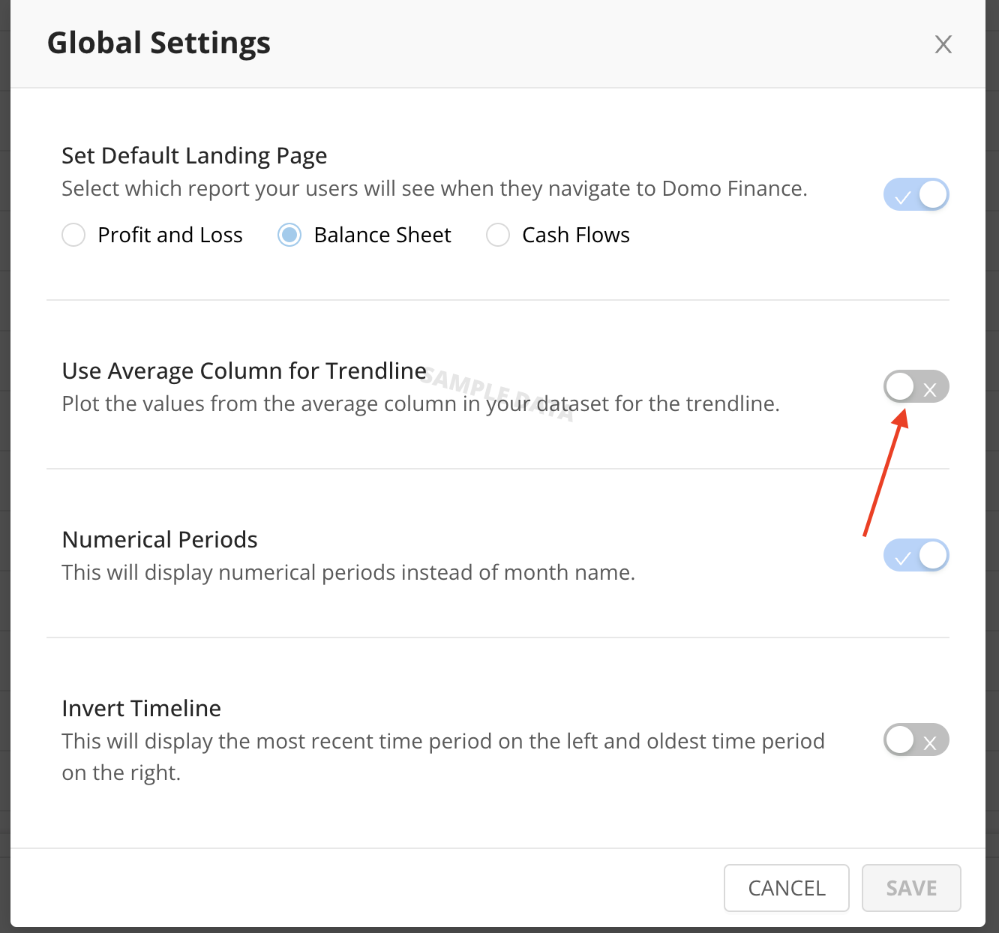

Finally, click on save and the app will display the trendline using the average column from the dataset.

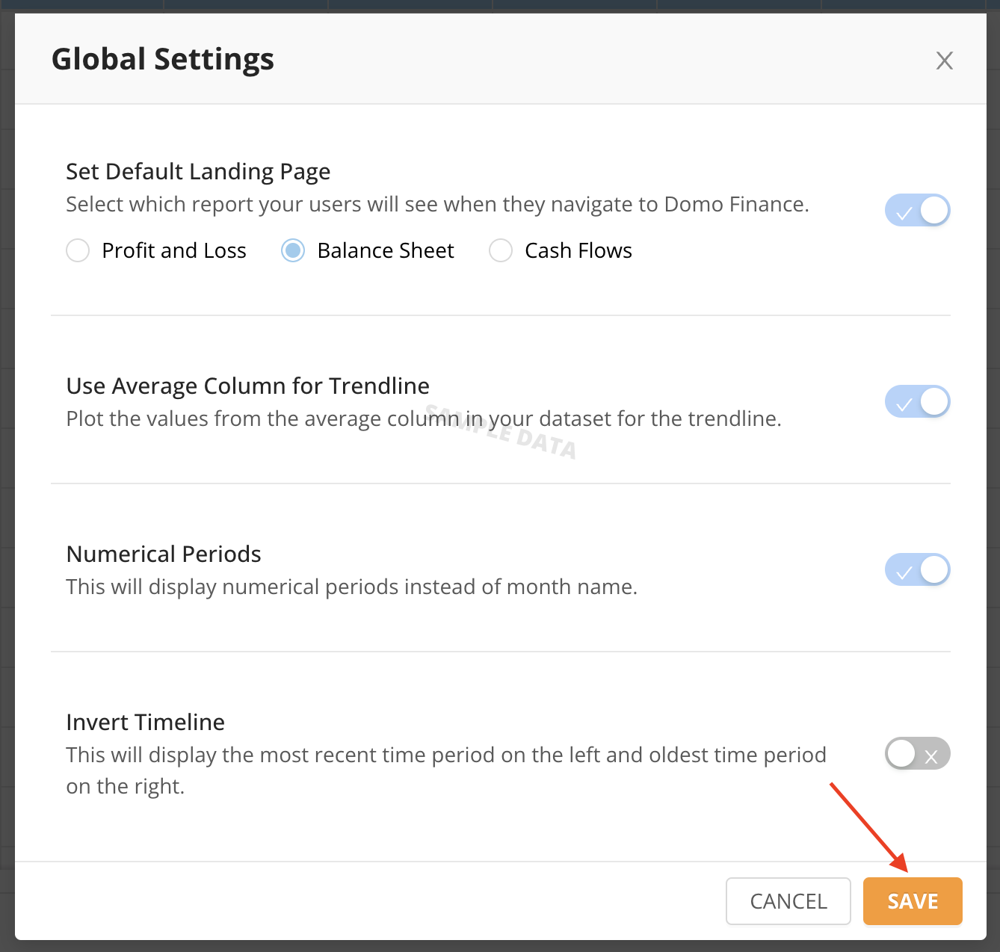

#### Setup Initial Global View

The “Save as Default View” will save all the information as is shown in the view: in app filters, rows expanded, and settings for the “App Mode”, “Date Grain”, “Period”, and “Year” dropdowns. Having Admin role or being part of the "\_FinanceApp\_Admin\_" user group is necessary to edit this.

Before saving the initial global view, you need to select all the options that you want to save as initial view. For example, we are expanding Accounts Receivable, Cash in Bank, Petty Cash, etc. Once we save the initial global view, these rows will be expanded for users by default when they view the app.

To setup the initial global view you need to access the app settings. To do so click on the Cog that is in the top right of the window of the view that you want to save as the initial global view.

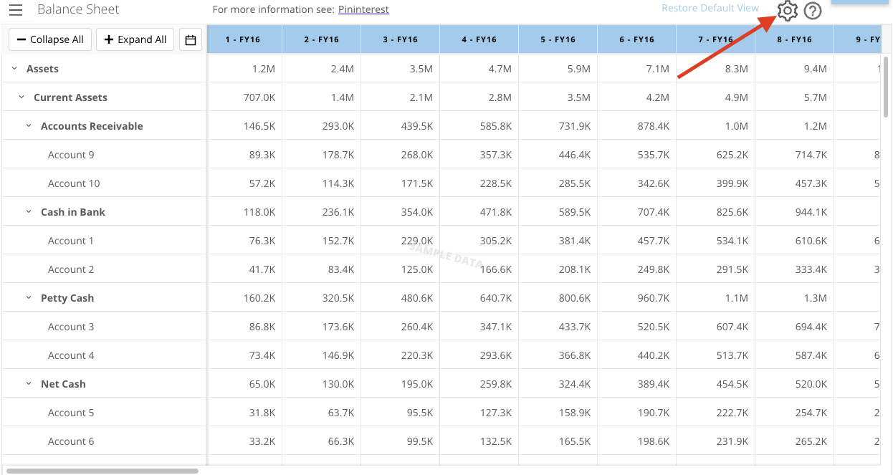

A settings window will appear.

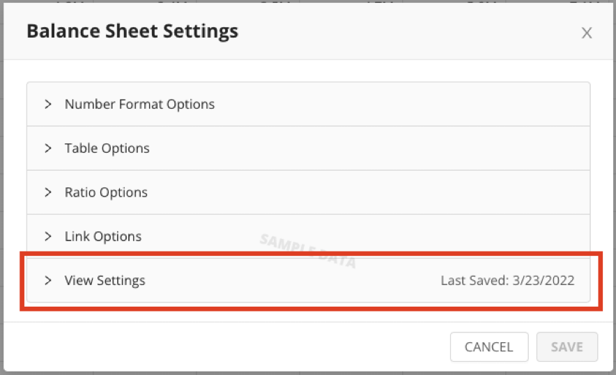

Here, select “View Settings” and click on “Save” that is to the right of “Save as Default View”. 

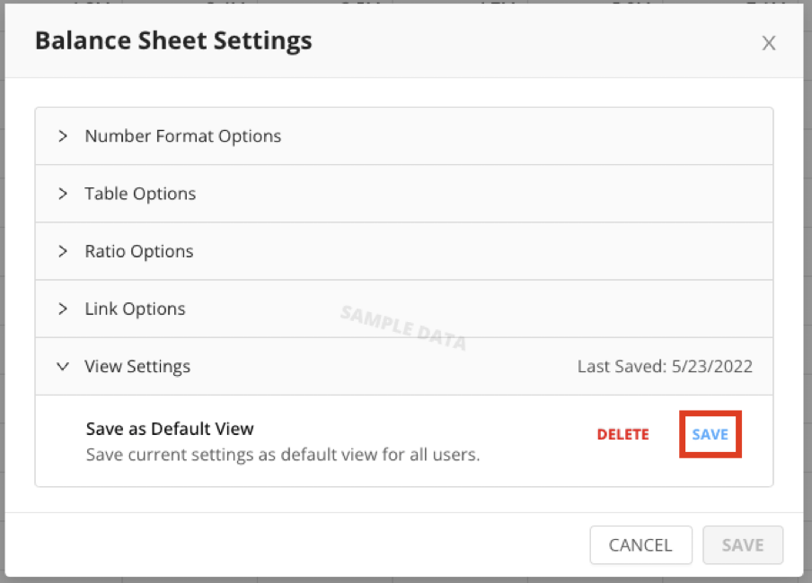

Finally, click on the “X” to close the window.

#### Set Default Landing Page

An admin has the option of enabling the default landing page as well as choosing which report users will see when they first navigate to Domo Finance.

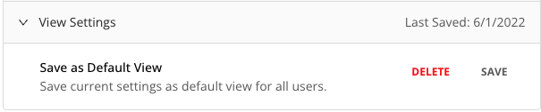

In the config settings for each view an admin has the option to save the current settings as the default view or delete the current default view.

The filters for the App Mode, Date Grain, Period, and Year Dropdowns will return to the default view.

#### Use Average Column for Trendline

An admin can plot the values from the average column in your dataset for the trendline.

#### Numerical Periods

An admin can change the months to be treated as periods in the period dropdown.

#### Invert Timeline

An admin can configure the view to display the most recent time period of the left and the oldest time period on the right.

 

 

### P&L (Profit and Loss Statement)

The first view in the app allows you to visualize and customize your profit and loss data. The P&L tab has various ways to customize your data view including selecting the 'App Mode', selecting 'Date Grain', 'Period', 'Year' filters, and through settings. You also have the ability to 'Collapse All' of the columns currently opened or 'Expand All' the columns for more detailed profit and loss information.  
  

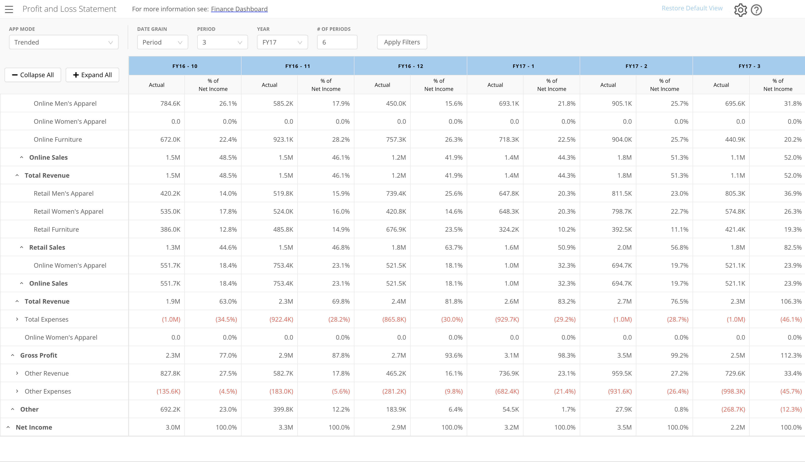

#### App Mode

The 'App Mode' option allows you to select either a 'Comparative' or 'Trended' view. The 'Trended' option includes a hover-over option which displays two trended chart ($ and %) for each column.  
  

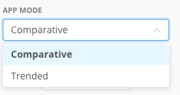

#### Date Grain

The 'Date Grain' can also be changed in the Profit and Loss Statement. The selected 'App Mode' does affect the options found in the 'Date Grain' dropdown. The Comparative app mode includes the 'Month', 'Quarter', and 'Year to Date' options, while the Trended app mode includes 'Month' and 'Quarter'.  
  

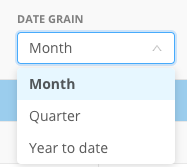

#### Period

The 'Period' dropdown options are dependent upon the selected 'Date Grain', i.e. if I select 'Month' then I will see all of the 12 months in the 'Period' dropdown.  
  

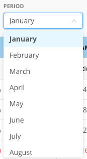

#### Year

The 'Year' dropdown will include all of the available fiscal years in your connected profit and loss data. To apply these filters, you will need to first select all your desired options from the dropdowns and then select the 'Apply Filters' button.  
  

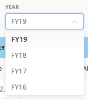

#### Profit and Loss Settings

The Profit and Loss Settings are only accessible by an admin. The Profit and Loss Settings screen allows you to select from 'Number Format Options', 'Ratio Options', 'Comparative Options', and 'Table Options'. The 'Number Format' settings allows you to set the number abbreviation, negative number display, number of decimal places, and percent decimal places. The 'Ratio' settings allows you to select the ratio comparison category from your available columns. The 'Comparative' settings allows you to show/not-show actuals, budget comparisons, and prior year comparisons. The 'Table Parent Order' allows you select which order you'd like the parent value to be shown (before or after).  
  

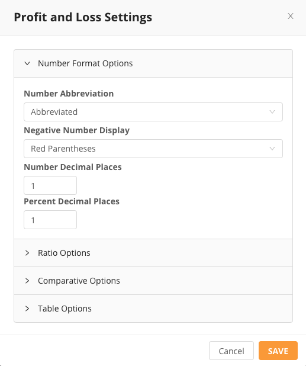

### Cash Flows

The Cash Flows view allows you to visualize and customize your connected cash flow data. The most basic columns in the Cash Flows view includes: 'Cash at Start', 'Net Income', and 'Cash at End', but during the set-up of the app you can expand upon these categories and add more collapsible columns such as 'Adjustments to Net Income'. You also have the ability to 'Collapse All' of the columns currently opened or 'Expand All' the columns for more detailed cash flow information.

 

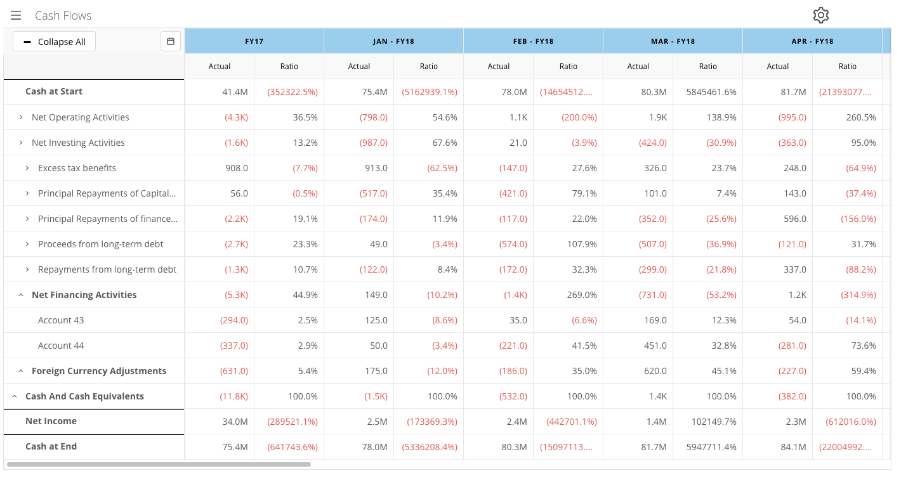

#### Select Columns

The calendar icon to the left of the app allows you to select which columns you want displayed in the Cash Flows view. You can choose to display all the months, quarters, or years or only show months, quarters, or years from certain fiscal years included in your data.

 

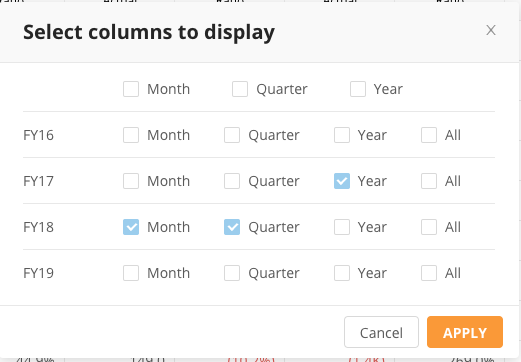

#### Cash Flow Settings

The Cash Flow Settings are only accessible by an admin. Customize how you view your Cash Flow data using the settings option. You can set the number format, table, and ratio in the settings screen. The 'Number Format Options' tab allows you to abbreviate or not abbreviate numbers, display or not display negative numbers, choose the number of visible decimal places, and choose the number of visible percent decimal places. The 'Table Options' tab allows you to select the table parent order (before or after) and select the P&L Net Income Category. The 'Ratio Comparison Category' allows you to show ratios and select which ratio you want displayed.  
  

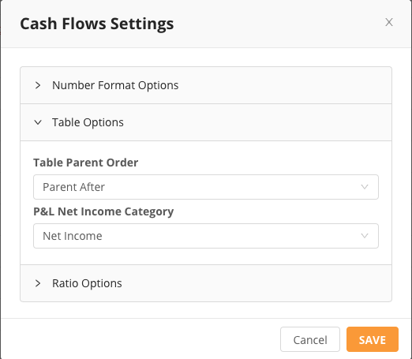

### Balance Sheet

The Balance Sheet view allows you to visualize and customize your connected Balance Sheet data. The most basic categories in the Balance Sheet view are 'Assets', 'Liabilities & Equity', 'Total Assets', 'Total Liabilities & Equity', and 'Balance', but these can be expanded upon in the set-up of the app. For example, you may wish to include columns like 'Current Assets' and 'Fixed Assets' and collapsible columns under 'Assets'. You also have the ability to 'Collapse All' of the columns currently opened or 'Expand All' the columns for more detailed balance sheet information.  
  

#### Balance_Sheet.png

#### Select Columns

The calendar icon to the left of the app allows you to select which columns you want displayed in the Balance Sheet view. You can choose to display all the months, quarters, or years or only show months, quarters, or years from certain fiscal years included in your data.  
  

#### Balance Sheet Settings

The Balance Sheet Settings are only accessible by an admin. Customize how you view your Balance Sheet data using the settings option. You can set the number format, table, and ratio in the settings screen. The 'Number Format Options' tab allows you to abbreviate or not abbreviate numbers, display or not display negative numbers, choose the number of visible decimal places, and choose the number of visible percent decimal places. The 'Table Options' tab allows you to select the table parent order (before or after), select the 'Total Assets Category' from your data, and select 'Total Liabilities/Equities Category' from your data. The 'Ratio Comparison Category' allows you to show ratios and select which ratio you want displayed.  
  

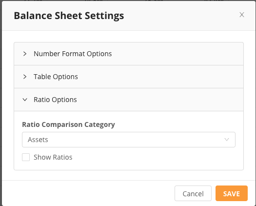

### Export Reports

You can export your finance reports in the app by selecting the 'Export Reports' option in the left side menu. You can choose which reports you want included (P&L, Cash Flows, and/or Balance Sheet), the date range of the reports including date grain, through, and year, and the format (Excel or PDF).  
  

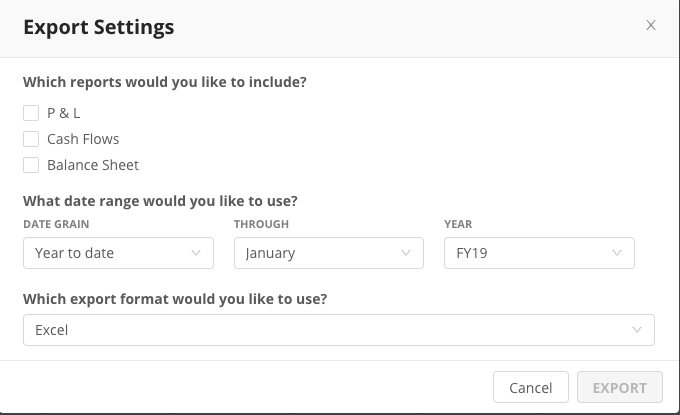

### 

### Change Log

**v1.0.4**

* Change 'Ratio' column label to say “% of Total {selected\_field\_name}”
* Added option to setup an initial global view for all users, allowing admins to save their view as the “default” for all app users.
* Add an “Expand All” button to match the “Collapse All” button.
* Button to return users to default view.
* Added option to display an externally calculated “average” for the trendline.
* Support for retail or numeric period financial calendars (eg: 4-4-5). Added setting to turn month names into period number.
* Configuration settings visibility. Move the configuration settings (gear icon) so it’s visible to Admins and finance app admin group members only.
