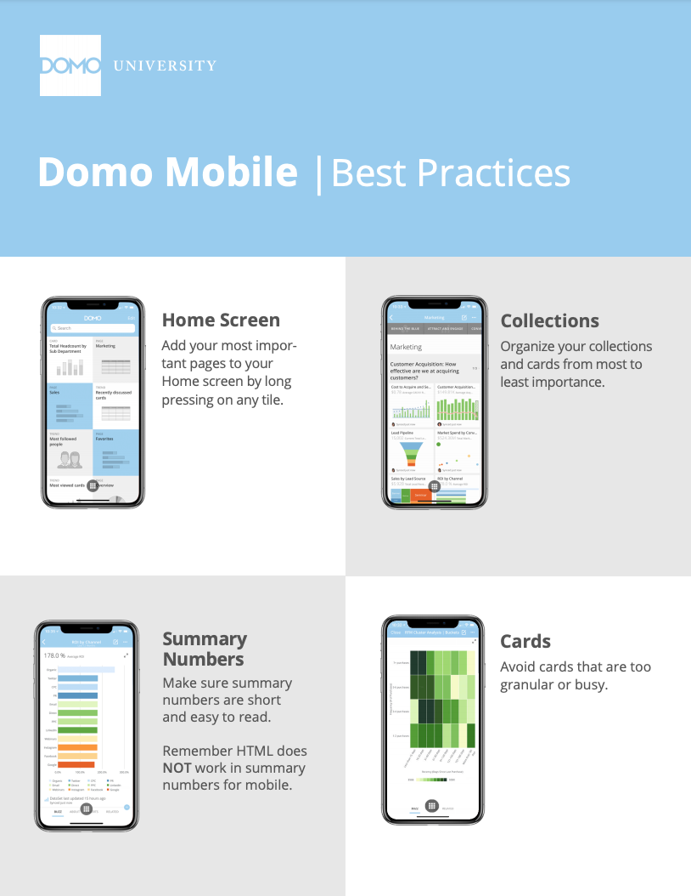
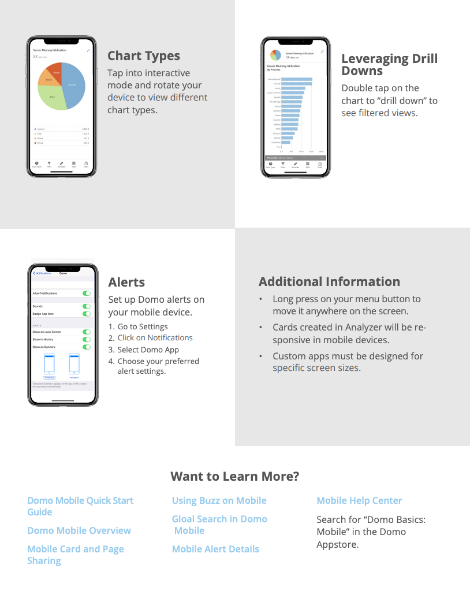

---
    title: Domo Mobile Best Practices
    url: https://domo-support.domo.com/s/article/360042923554
    linked_kbs:  ['[https://domo-support.domo.com/s/knowledge-base/](https://domo-support.domo.com/s/knowledge-base/)', '[https://domo-support.domo.com/s/](https://domo-support.domo.com/s/)', '[https://domo-support.domo.com/s/topic/0TO5w000000ZamsGAC](https://domo-support.domo.com/s/topic/0TO5w000000ZamsGAC)', '[https://domo-support.domo.com/s/topic/0TO5w000000ZancGAC](https://domo-support.domo.com/s/topic/0TO5w000000ZancGAC)', '[https://domo-support.domo.com/s/article/360042923554](https://domo-support.domo.com/s/article/360042923554)', '[https://domo-support.domo.com/s/topic/0TO5w000000ZancGAC/domo-mobile](https://domo-support.domo.com/s/topic/0TO5w000000ZancGAC/domo-mobile)', '[https://domo-support.domo.com/s/article/360043429933](https://domo-support.domo.com/s/article/360043429933)', '[https://domo-support.domo.com/s/article/360043429953](https://domo-support.domo.com/s/article/360043429953)', '[https://domo-support.domo.com/s/article/360042925494](https://domo-support.domo.com/s/article/360042925494)', '[https://domo-support.domo.com/s/article/360043429913](https://domo-support.domo.com/s/article/360043429913)', '[https://domo-support.domo.com/s/article/4408174643607](https://domo-support.domo.com/s/article/4408174643607)', '[https://domo-support.domo.com/s/login/](https://domo-support.domo.com/s/login/)']
    article_id: 000004326
    views: 2,181
    created_date: 2022-10-24 21:40:00
    last updated: 2022-10-24 22:42:00
    ---

Refer to the following PDF for information on best practices when using Domo Mobile. To download this PDF to your computer, click [here](https://domosoftware.sharepoint.com/:b:/s/CS-Edu-PublicFiles/Eek7KCnCYUFBgR05Ve7M034BcFyzJVz3gSVjjBeYScPwYg?e=ArqVHF).

 

**Note:**Occasionally chart properties are added to the Web client to enhance the user experience when building cards. These features are not always supported in the mobile app. For example, in the web version, you can select where you want the "Total" row to reside by configuring the "Total Row Position" property. On mobile, the Total row is currently only available at the bottom. As another example, you can choose “Show Group Name Once” on the Web, but in mobile, this feature is not recognized. We are reviewing these and other features currently available in the web version for future enhancement to the mobile experience. 

