---
    title: Domo ODBC Data Driver
    url: https://domo-support.domo.com/s/article/360043437693
    linked_kbs:  ['[https://domo-support.domo.com/s/knowledge-base/](https://domo-support.domo.com/s/knowledge-base/)', '[https://domo-support.domo.com/s/](https://domo-support.domo.com/s/)', '[https://domo-support.domo.com/s/topic/0TO5w000000ZammGAC](https://domo-support.domo.com/s/topic/0TO5w000000ZammGAC)', '[https://domo-support.domo.com/s/topic/0TO5w000000ZanzGAC](https://domo-support.domo.com/s/topic/0TO5w000000ZanzGAC)', '[https://domo-support.domo.com/s/article/360043437693](https://domo-support.domo.com/s/article/360043437693)', '[https://domo-support.domo.com/s/topic/0TO5w000000ZanzGAC/other-connection-methods](https://domo-support.domo.com/s/topic/0TO5w000000ZanzGAC/other-connection-methods)', '[https://domo-support.domo.com/s/article/360043429933](https://domo-support.domo.com/s/article/360043429933)', '[https://domo-support.domo.com/s/article/360043429953](https://domo-support.domo.com/s/article/360043429953)', '[https://domo-support.domo.com/s/article/360042925494](https://domo-support.domo.com/s/article/360042925494)', '[https://domo-support.domo.com/s/article/360043429913](https://domo-support.domo.com/s/article/360043429913)', '[https://domo-support.domo.com/s/article/4408174643607](https://domo-support.domo.com/s/article/4408174643607)', '[https://domo-support.domo.com/s/login/](https://domo-support.domo.com/s/login/)']
    article_id: 000003162
    views: 2,825
    created_date: 2022-10-24 21:11:00
    last updated: 2022-10-24 22:40:00
    ---

Intro
-----

Domo ODBC Data Driver is an ODBC driver that can be used to fetch data from a Domo Dataset. It is available as 32-bit and 64-bit installer packages for Microsoft Windows. Bitness is decided by the application you are using. 64-bit Windows can run 32-bit as well as 64-bit applications. If your application (the application using Domo ODBC Data Driver) is 32-bit, install a 32-bit driver. This document describes the steps involved in setting up Domo ODBC Data Driver on your machine.

Domo ODBC Data Driver fetches data from Domo over HTTPS. The query execution time depends on the size of data and the data speed of your network.

Domo ODBC Data Driver requires a Client ID and Client Secret for authentication, and it supports simple queries as described later in this document. 

To obtain Domo ODBC Data Driver, go to **Admin** > **Tool Downloads**.

To purchase the ODBC Data Driver, reach out to your Account Executive (AE).

**Note:** The ODBC Driver fetches up to 1 million rows.

Connection Strings
------------------

ODBC drivers follow this format for the connection string:

`Driver={<Driver Name>};<additional parameters like username, password>`

This is the format of additional parameters (key-value pairs separated by semicolon):

`param1=value1;param2=value2;`

The Domo ODBC Data Driver follows the same format. A Client ID and Client Secret are required for authentication and must be included in the connection string. A sample connection string for the Domo ODBC Data Driver looks like this:

`Driver={Domo ODBC Data Driver};ClientID=1234-abcd-5678-efgh;ClientSecret=abcdefgh123456;`

You can also create connection strings by specifying the DSN (Data Source Name). In the Domo ODBC Data Driver, the DSN stores the Client ID and Client Secret, and the connection string becomes simpler:

`DSN=DomoDataDSII;`

DomoDataDSII is the default DSN created during the installation of the Domo ODBC Data Driver. You need to configure the DNS (DomoDataDSII) before using it in any connection string. Configuration is done in the **ODBC Data Sources** tool of Windows. You need a valid ClientID and ClientSecret to configure the DSN.  
Syntax of the connection string might change according to the application, as some applications add Driver={ and DSN= to the provided inputs by default.

Query Syntax
------------

Domo ODBC Data Driver supports standard SQL-type statements in the format SELECT <column names, or \*> FROM <dataset id> WHERE <clause> … etc. For example:  
   
`SELECT * FROM 6f3def59-4a7b-4c25-99db-5e1b44501afd`  
   
Or  
   
`SELECT name, temperature, temperatureUnit, shortForecast FROM 3a2153e4-4b78-4319-9b47-84fb148afd22 WHERE name IN ('Today', 'Tonight', 'This Afternoon')`

Creating Client ID and Secret
-----------------------------

A ClientID and ClientSecret are required parameters for ODBC connection with Domo ODBC Data Driver.

**To obtain a Client ID and Client Secret for your account,**

1. Login to [https://developer.domo.com](https://developer.domo.com "https://developer.domo.com") and go to **My Account > Manage Clients.**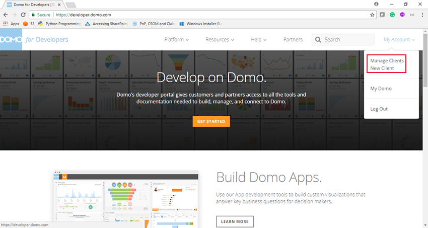
2. (Conditional) If you don’t have a client, create a new one for the ODBC driver by doing the following:

	1. Click **Create a Client**.  
	  
	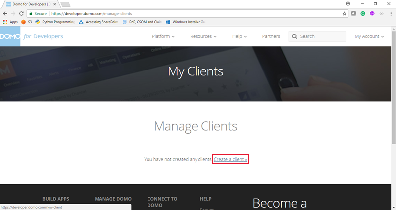
	2. Enter the name and description.
	3. Select application scopes. (**Data** is a mandatory scope.)
3. Get the Client ID and Client Secret, as these are required for ODBC connection.

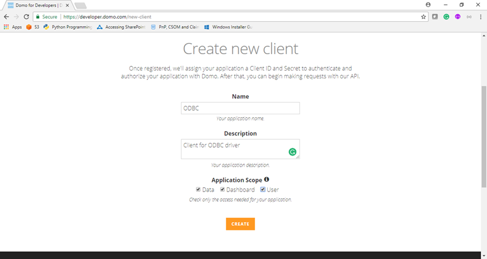

Installing Domo ODBC Data Driver
--------------------------------

Before you start, you'll need: 

* .NET Framework 4.6.2
* Visual C++ Runtime Libraries.

If these are missing, the installer will download and install them before continuing with the installation of Domo ODBC Data Driver.

Please select the correct product to install. We have 32-bit and 64-bit installation packages (for Windows only). Check the bitness of the application you want to use the Domo ODBC Data Driver with, and install the correct driver.

**To install Domo ODBC Data Driver,**

1. Open setup.exe (not setup.msi).  
  
If your system doesn’t have all the prerequisites, the installer will download and install them. You need to grant permission for the installation of the .NET framework and VC++ runtime. If you have all the prerequisites, you will see the Domo ODBC Data Driver Installation wizard.
2. Follow the onscreen instructions.

Test the Functionality
----------------------

Once the installation is done, you should check to see if the driver is working. 

**To test the functionality of the driver,**

1. Open the ODBC Data Source Administrator.  
  
For 32-bit Domo ODBC Data Driver, you must open the 32-bit version of the ODBC Data Sources, and 64-bit Domo ODBC Data Driver for the 64-bit version. These versions are only available on 64-bit machines. On 32-bit machines, there will be only one version of the Administrator.  
  
The path of ODBC Data Source Administrator is %systemdrive%\Windows\SysWoW64\odbcad32.exe for 32-bit and %systemdrive%\Windows\System32\odbcad32.exe for 64-bit.   
  
This application is used for configuring DSNs and requires administrative permissions on the system.
2. Go to the **File DSN** tab and click **Add**.
3. Select *Domo ODBC Data Driver* and click **Next**.
4. Click **Browse**.
5. Select a folder in which to save the DSN file.
6. Type in file name you want to save and click **Save**.
7. Click **Next**.
8. Click **Finish**.  
  
A dialog pops up asking for the Client ID and Client Secret.
9. Enter the Client ID and Client Secret.  
  
If the values you entered are invalid or if the connection could not be made with Domo, a warning dialog appears.  
  
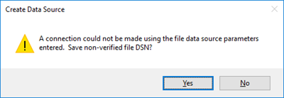  
  
In this case, you must verify the installation, credentials, network, and accessibility to Domo APIs. Otherwise, a file will get created on successful verification.  
  
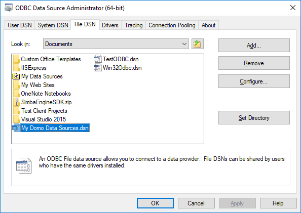  
  
Proceed only if your files get created successfully.

**Note:** If you are using the driver in "Trial Mode" (unpurchased) and the trial has expired you will also get this connection error message.

Configure the DSN
-----------------

Once you have performed a successful test of your driver, the next step is to configure your DSN.

**To configure your DSN,**

1. In the ODBC Data Source Administrator, go to the **System DSN** tab.  
You should see a file called "DomoDataDSII."  
  
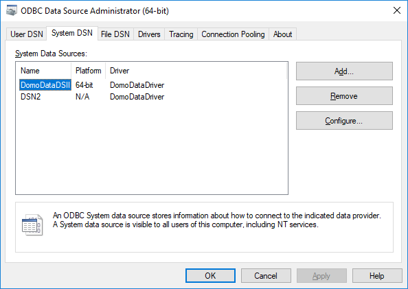
2. Click **Configure**.  
A dialog asks for your Client ID and Client Secret.
3. Enter a valid Client ID and Client Secret and click **OK**.

Now you can use DomoDataDSII for ODBC connections. If the Client ID or Client Secret are invalid or not configured, you will face issues during connection with your application. If you see any connection issues while using DSN, please check the values of **Client ID** and **Client Secret** first.

Instead of configuring the DomoDataDSII, you can also create your own DSN with the **Add** button. You can create as many DSNs as you need.

Using Domo ODBC Data Driver in Excel
------------------------------------

As described in the [Connection Strings](#h_737894a0-3bb4-4605-aed1-645c5a0a7e31 "DomoDataDriver") section, there are two alternate formats of connection strings that can be used to connect to Domo ODBC Data Driver.

### Using DSN

Prerequisite: [Configure DSN](#h_d0b95d1d-346e-4e26-93de-4368ee3e473a "DomoDataDriver").

**To connect to Domo ODBC Data Driver using DSN,**

1. In the **Data** tab in Excel, select **New Query > From Other Sources > From ODBC**.  
  
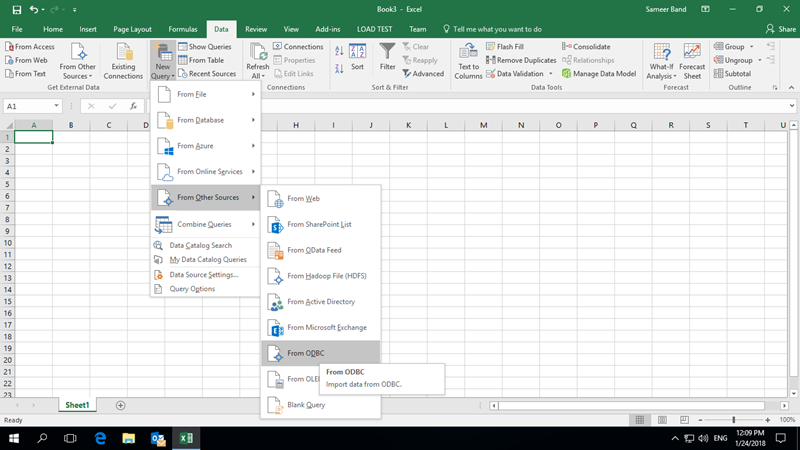
2. Select "DomoDataDSII" (or the name of your DSN) from the dropdown.
3. In **Advanced Options**, enter the "Select" query (see [Query Syntax](#h_d1ce073e-dcdf-46f3-a93c-d842b3c41b20 "DomoDataDriver")), then click **OK**.    
  
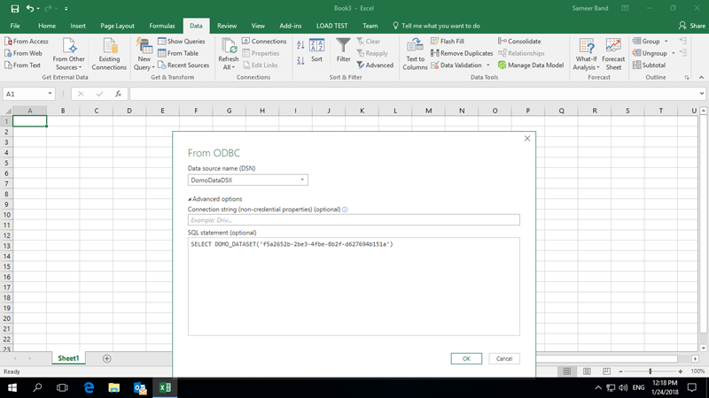  
  
A preview will load. Note that this may take a while for a large DataSet.)  
  
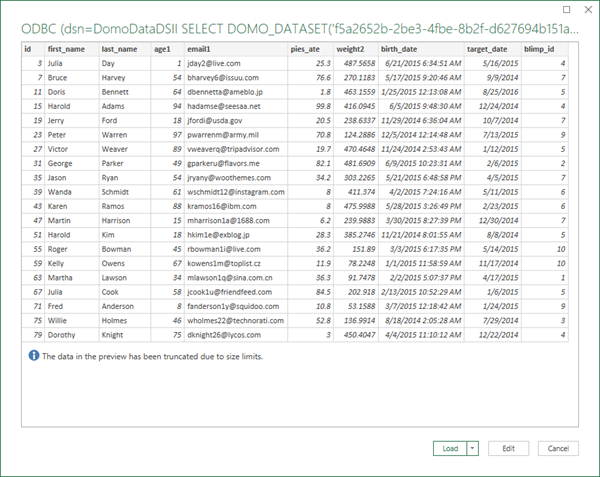
4. Click **Load** and data will be loaded after execution of the query.    
  
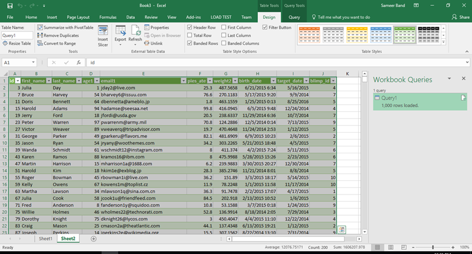

Using a Driver Connection String
--------------------------------

Follow the same steps mentioned in [Using DSN](#h_cbf25764-428d-4423-a820-d9628f1811ef "DomoDataDriver") to open ODBC settings. However, instead of selecting "DomoDataDSII" in step 2, select **None** in **Data Source Name**. Then enter the connection string as described in [Connection Strings](#h_737894a0-3bb4-4605-aed1-645c5a0a7e31 "DomoDataDriver") and the query as described in **Query**.

All other steps after this are same as described in [Using DSN](#h_cbf25764-428d-4423-a820-d9628f1811ef "DomoDataDriver").

Using Domo ODBC Data Driver With DBeaver/ (ODBC SQL Tool)
---------------------------------------------------------

 

**Notes:** 

* The Bitness of the tool and the driver should match. The 64-bit tool will work with the 64-bit driver, and the 32-bit tool will work with the 32-bit Domo ODBC Data Driver. Please make sure you are using the correct products.
* If you are using a DSN to connect, make sure you have configured the DSN correctly. For more details, see [Configure the DSN](#h_d0b95d1d-346e-4e26-93de-4368ee3e473a "DomoDataDriver").

**To use Domo ODBC Data Driver with DBeaver,**

1. Select **ODBC** and click **Next**.
2. Type "DomoDataDSII" in the **Database/Schema** box.
3. Click **Test Connection.**  
You should see the test results.
4. Click **Next**, **Next**, and then **Finish**.
5. Open the SQL Editor as shown below.  
  
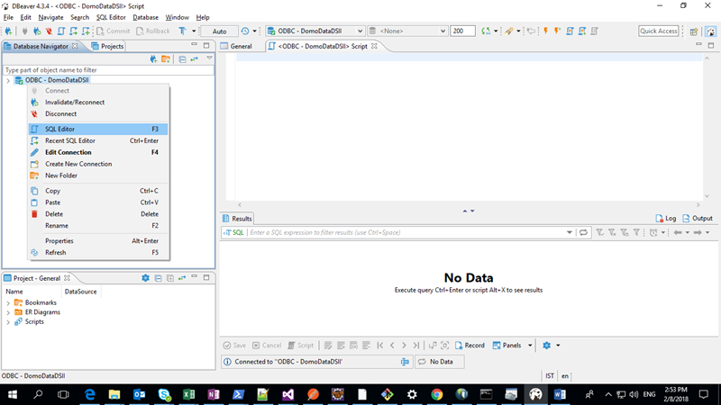
6. Type in the query and execute as shown below.  
  
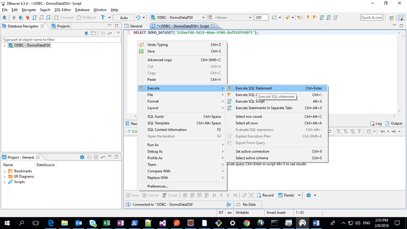  
  
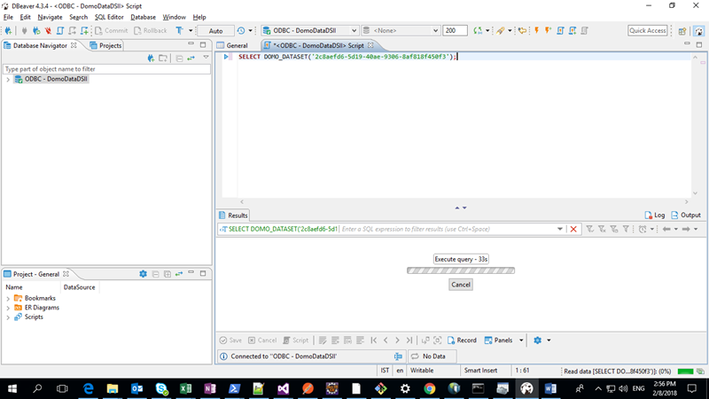  
  
Once query execution is complete, you should see the results.  
  
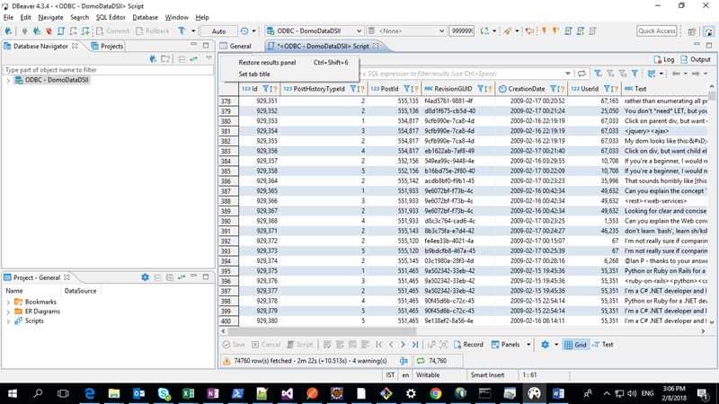

The DBeaver does not support long connection strings, so we cannot create a connection using Driver Name. If your tool supports long connection strings, you can use Driver Name instead of DSN. Please see [Connection Strings](#h_737894a0-3bb4-4605-aed1-645c5a0a7e31 "DomoDataDriver").  
 

