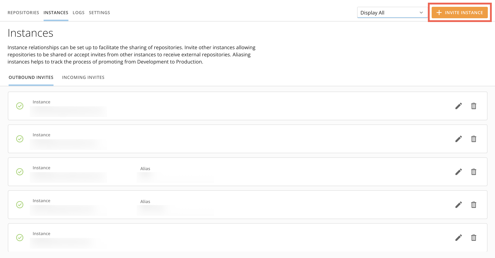
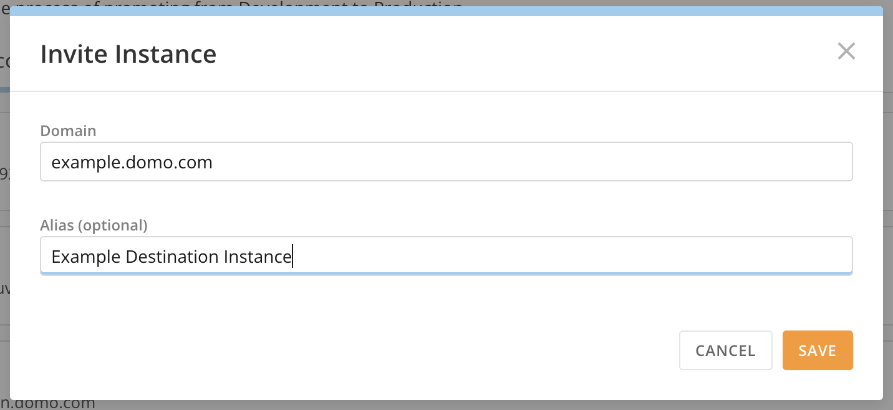
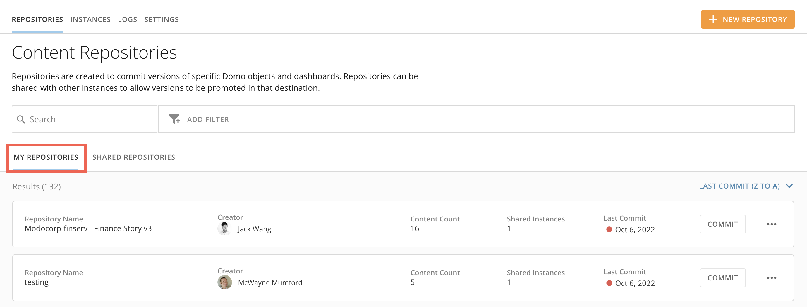
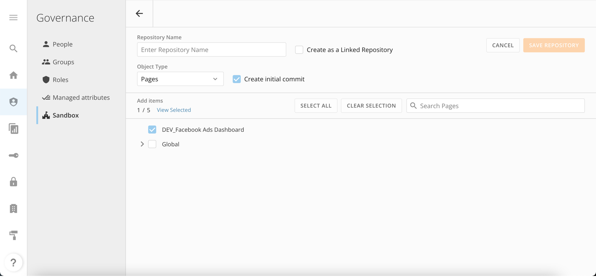
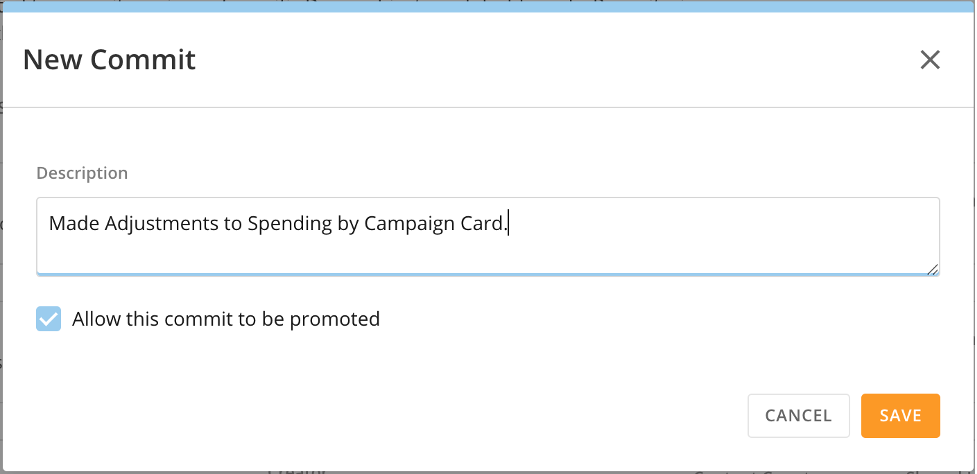
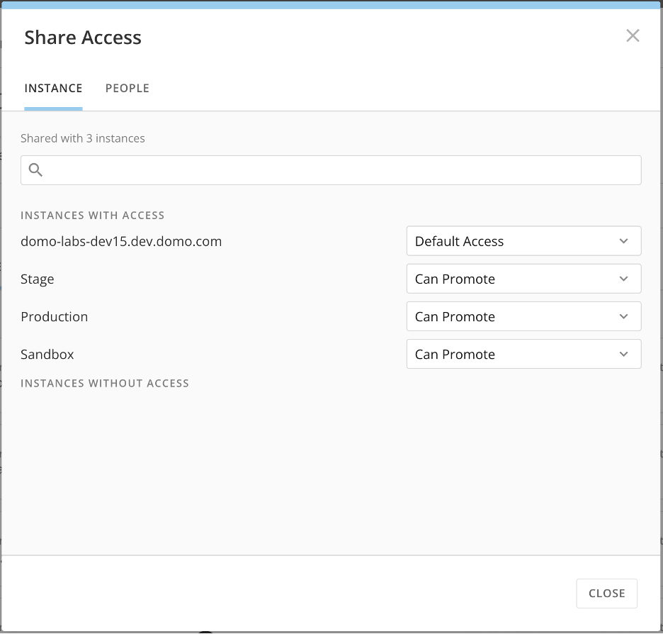
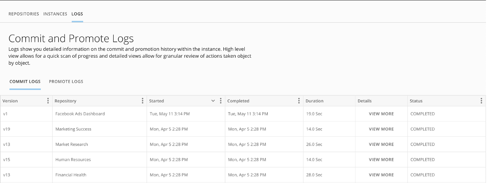
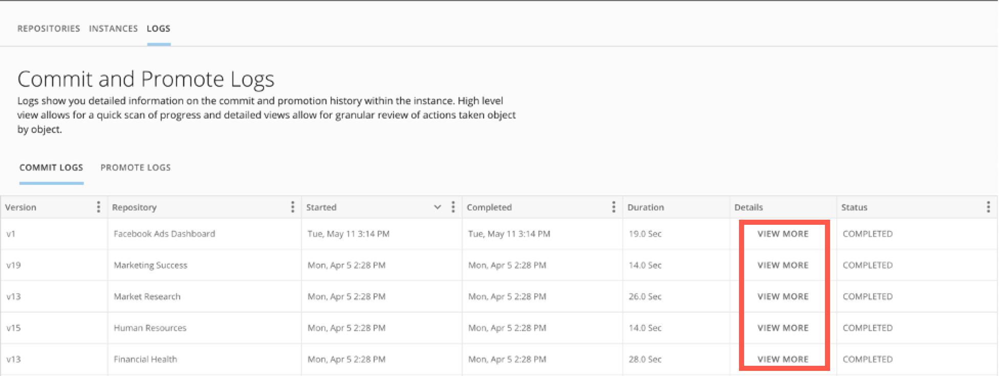

Intro
-----

Domo Sandbox is a premium feature that allows users to follow and manage a development lifecycle for Domo dashboards and other objects.

Here are some terms you should know before using Domo Sandbox:

| Term | Definition |
| **Repository** | The collection of objects that are being versioned. Over time, multiple versions of the selected objects are stored. An example of what might be included is a dashboard (including cards, Beast Modes, images, etc.) |
| **Version** | A snapshot of a repository at a given point in time. A repository can have multiple versions. |
| **Commit** | The action taken to store a new version. This results in a new snapshot of the Domo objects. |
| **Promote** | The action taken to create or update the objects in the destination Domo instance. An example is promoting a dashboard to production. This creates the dashboard the first time it is promoted or updates the dashboard on subsequent promote actions. |
| **Same Instance Promotion** | Promoting a repository in the same instance where it was created. Use this when you want to be able to manage the versioning process in the same Domo instance. |
| **Source Instance** | The location of the source objects. This is typically a development or sandbox Domo instance. |
| **Destination Instance** | The location where the objects are updated. This is typically production instance. |

 

Getting This Feature
--------------------

If you are interested in using this feature, please contact your Domo Customer Success Manager (CSM), Technical Consultant (TC), or Account Executive (AE). If you do not have their contact information, reach out to Technical Support at [support@domo.com](mailto:support@domo.com)

Depending on the feature, you may be required to complete training before you can use the feature.

 

Instance Configuration
----------------------

Sandbox supports both cross instance and same instance promotion. If cross instance promotion is desired, please contact your Customer Success Manager (CSM) to have an instance provisioned.

Instance Relationships
----------------------

1. Log into your source instance (see the table in [Intro](#h_01GFKSTP2Y7R25BFNAGSJT85TY) for more information).

2. In the navigation header, select **More** > **Admin**.   
The **Admin Settings** displays. 

3.. Under **Governance**, select **Sandbox**. 

4. Go to the **Instances** tab and select **+ Invite Instance.**  
 

The **Invite Instance** modal displays. 

  
4. Type in the destination Domo domain and an optional alias. The alias is the identifier used in other areas of Sandbox. Select **Save**.

 The invitation is sent to the destination instance. 

 

**Important:** The instance should be entered as "*example*.[domo.com](http://domo.com)" 

5. Log in to the destination instance.

6. In the **Instances** tab, choose **Incoming Invites** and select **Approve.**

You can now share repositories with the destination instance and promote them.

Creating a Repository
---------------------

1. Log into your source instance. In the navigation header, select **More** > **Admin**.   
The **Admin Settings** displays. 

2. Under **Governance**, select **Sandbox**. 

3. Go to the **My Repositories** tab and select **+ New Repository.**  
  

4. Configure the repository by:

* + Naming the repository.
	+ Selecting the object type being versioned.
	+ Choosing the items to be included in the repository.

 

**Note:** By default, **Create initial commit** is selected. When the repository is saved, the first version is committed.

  

5. Select **Save Repository**. 

The repository is stored in Sandbox in the **My Repositories** tab. 

Commit Version
--------------

1. Log into your source instance. In the navigation header, select **More** > **Admin**.   
The **Admin Settings** displays. 

2. Under **Governance**, select **Sandbox.**

3. Go to **Repositories > My Repositories.**

****

4. Locate the repository and select **Commit** (or, select  **Repository Options** and **Commit**).

5. Enter a description for the version that you are creating. By default, the version is can be promoted. Uncheck **Allow this commit to be promoted** to prevent this version from being immediately available for promotion.

6. Select **Save**.

Manage Repository Sharing
-------------------------

#### Instance Sharing

1. Log into your source instance. In the navigation header, select **More** > **Admin**.   
The **Admin Settings** displays. 

2. Under **Governance**, select **Sandbox.**

3. Go to **Repositories > My Repositories.**

4. Locate the repository you want to share. Select  **Repository Options** and choose **Manage Sharing**.

* To share the repository with a specific instance, choose **Can Promote**.
* For same instance promotion, share the repository with the source instance by choosing **Can Promote.**

****

5. Select **Close**. 

#### User Sharing

1. Log into your source instance. In the navigation header, select **More** > **Admin**.   
The **Admin Settings** displays. 

2. Under **Governance**, select **Sandbox.**

3. Go to **Repositories > My Repositories.**

4. Locate the repository you want to share. Select**Repository Options** and choose **Manage Sharing.**

5. Select **People.** Add people and groups, choose the appropriate permission level, and select **Share.**

6. Select **Close.**

The repository is updated with access settings. 

 

#### Sandbox User Permission Levels

 

 

**Note:** Users with the Administer Sandbox grant can access all repositories.

|  |  |
| --- | --- |
| Co-Owner | Can edit, delete, and share the repository |
| Can Edit | Can edit and share, but cannot delete the repository |
| Can Commit (in source instance) | Can commit the repository, but cannot edit, share, or delete. The user must also have the Manage Repositories grant to commit in the instance. |
| Can Promote (in destination instance) | Can promote the repository, but cannot edit or share. The user must have the Manage Repository Promotions grant as well to promote in the instance.  |

 

Promote Repository
------------------

 

 

**Note:** When promoting a card in a repository, the user doing the promoting is assigned ownership of any Beast Mode that is tied to a DataSet powering that card.

1. Log into your source instance. In the navigation header, select **More** > **Admin**.   
The **Admin Settings** displays. 

2. Under **Governance**, select **Sandbox.**

3. Go to **Repositories > Shared Repositories.**   
All repositories that have been shared with your instance display. 

4. Locate the appropriate repository and select **Promote.**  
The repository details display. 

5. Configure the following: 

* Choose the version to be promoted. This defaults to the most recent Committed Version.
* Map dependencies. Depending on the object type of the repository, there may be different mapping requirements. The most common mapping that is required are data sources.
* In the **Advanced** tab, apply settings as necessary. Renaming/removing strings from object names is available primarily to facilitate same instance promotion, but can be used when promoting across instances.

6. Select **Promote**.

The process to either create the objects (on first promotion) or update the objects on subsequent promotions is initiated. 

Sandbox Logs
------------

1. Log into your source instance. In the navigation header, select **More** > **Admin**.  
The **Admin Settings** displays. 

2. Under **Governance**, select **Sandbox.**

3. Select the **Logs** tab. 

 

**Note:** **Commit Logs** are available in the source instance and **Promote Logs** are available in the destination instance.

By default, high-level Commit Logs display. To view Promotion Logs, select **Promote Logs**. This view shows the commit or promote actions that have occurred.

 

To view detailed logs for a specific commit or promote action, select **View More**. This view provides the most detailed information about the commit or promotion that was executed.

  

Grants
------

|  |  |
| --- | --- |
| **Grant Type** | **Allows Users To:** |
| Administer Sandbox | * Send, accept, or deny repository sharing invitations to/from other Domo instances
* Manage global settings, such as requiring approvals for promotion of all repositories, or enabling same-instance promotion
* Assign ownership of a shared repository in the destination instance.

 

**Important:** Once ownership is assigned, it cannot be changed.
 

* Configure approval requirement and template for a repository in the destination instance
* Manage all repositories (including repositories not owned or explicitly shared with the user)

 

**Note:** This grant supersedes the “Manage Repositories” and “Manage Repository Promotions” grants; it provides all the privileges of those grants, and more.

 |
| Manage Repositories  | * Create and commit a repository
* Manage sharing of a repository with other users/groups in the Domo instance
* Share a repository with another Domo instance
* Manage sharing of repository versions with another Domo instance

 

**Note:** Only repositories owned by or shared with the user are visible to the user.

 |
| Manage Repository Promotion | * Configure a repository for promotion (i.e., dataset mappings, etc.)
* Manage sharing of a repository in the destination instance
* Promote a repository, including selecting which version of a repository is to be promoted

 

**Note:** Only repositories owned by or shared with the user are visible to the user. Ownership of repositories can only be assigned by a user with the “Administer Sandbox” grant.

 |

 

### Grant Examples

To administer Sandbox for a Domo instance, including establishing repository sharing relationships, enabling same-instance promotion, and requiring approval for promotion, a user must:

* Have the Administer Sandbox grant

To create a new repository and/or commit content changes to a repository, a user must:

* Have the “Manage Repositories” grant (and/or the “Administer Sandbox” grant”)
* Have the “Manage All Cards and Pages” grant (only required for committing page-type repositories)
* Be the owner of the repository or have had the repository shared with them.
	+ “Can Commit” can commit only
	+ “Can Edit” can edit the repository content and sharing but cannot delete
	+ “Co-Owner” can edit and delete the repository
* Be the owner of the content being committed or have had the content shared with them

 

**Note:** The content must be owned or explicitly shared, not merely accessible via Domo Admin-level grants.

To manage incoming shared repositories, including assigning ownership of the repository and establishing a promote approval process, a user must:

* Have the Administer Sandbox grant

To promote a repository, a user must:

* Have the Manage Repository Promotions grant (and/or the Administer Sandbox grant)
* Be the owner of the repository or have had the repository shared with them
	+ “Can Promote” can promote only
	+ “Can Edit” can edit the repository (i.e., dataset mappings, renaming, etc.) and promote
* Be included in at least one Personalized Date Permissions (PDP) policy for each DataSet (on which PDP is enabled) used in any cards or dashboards in the repository
* Be the owner of the content (or, for cards or dashboards, have had the content shared with the promoting user if the promoting user also has the Manage All Cards and Pages grant).

 

**Note:**  
* The content must be owned or explicitly shared; not merely accessible via Domo Admin-level grants.
* If the repository has never been promoted, the user promoting the repository will be the owner of content created during the promotion.

 

FAQs
----

**What Domo objects are supported?**

Dashboards (includes subpages, cards, Layouts, files, Apps, etc.), DataFlows, Connectors, and Views. We plan to add additional objects over time and welcome feedback to help prioritize.

**Are raw data sources supported?**

Yes. When creating a repository and selecting an object, choose **Connectors.** Sandbox supports Connectors with associated accounts in the primary instance. When mapping your Connector to another instance, you need to have an associated account in the target instance. 

**Can I revert to a previous version of a dashboard if necessary?**

Yes, simply repeat the promotion process, but choose the desired version.

**How long are versions stored and maintained?**

Committed versions are stored indefinitely, but they are only guaranteed to work for one month

**Are users in the Destination instance able to make changes to cards/dashboards promoted to them?**

Yes, however, any changes they made will be overwritten on a subsequent promotion. If users would like to make changes, they should **Save As** the card/dashboard to another location and make changes there, as these are independent of the Sandbox Repository.

**Are there unsupported items that will not be promoted?**

Yes, there is a handful to be aware of:

* Dashboards:
	+ - Poll Cards
		- Dynamic Summary Numbers in Notebook Cards
		- Annotations
		- Certifications
		- Page Ordering

* Dataflows:
	+ - Recursive DataFlows
		- Password-protected DataFlows
		- Writeback Tile DataFlows

**How large can repositories be?**

There is a limit of 1,000 cards within a repository. In general, there should be a repository for each dashboard or group of DataFlows/Views.

**What happens when a promotion is aborted?**

The promotion progress is stopped. Any changes that have been made in the process will remain in place and not reverted.

Troubleshooting
---------------

Sandbox provides logging on commit and promote activity. The best place to start troubleshooting is to review the commit/promote logs for errors. This will usually provide enough information to fix an issue with a specific object.

#### Common Areas to Check

**Objects being committed are invalid**

* Cards: Check all Drill Cards for column errors commonly caused by schema changes in the underlying DataSet.
* Beast Modes: Invalid calculations can cause issues commonly caused by schema changes in the underlying DataSet.

**Different Features between source and destination instance**

* Example: If Advanced DataFlow functionality isn’t enabled in the destination, the DataFlows will be inaccessible or won't promote successfully.

**Unsupported items**

* Most objects and functionality are supported through Sandbox, though there are a handful of items to be aware of that aren’t currently supported. See [FAQ](#h_01FF0TSFGF1SYSZ57AJX4HQ0WD) section above for supported objects.

Need Help?
----------

Email: [support@domo.com](mailto:support@domo.com)

Include the following information:

* Instance(s) where behavior is occurring
* Repository Name (if applicable)
* Description of behavior
* Screenshot and/or recording of behavior (if applicable)
* Steps to recreate behavior (if known/applicable)
